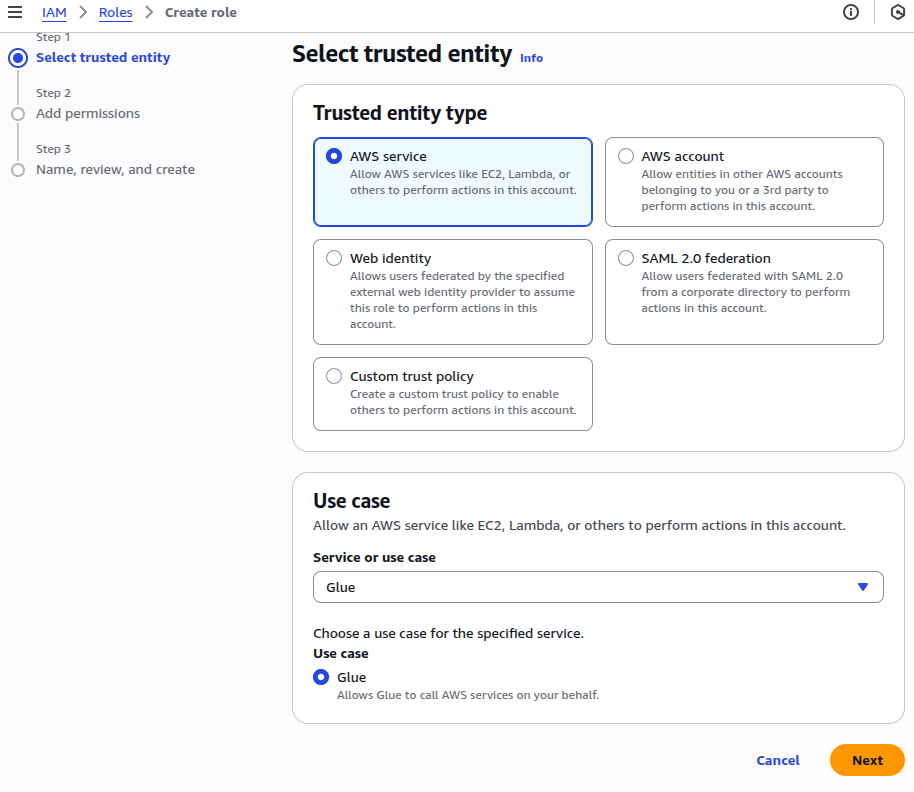
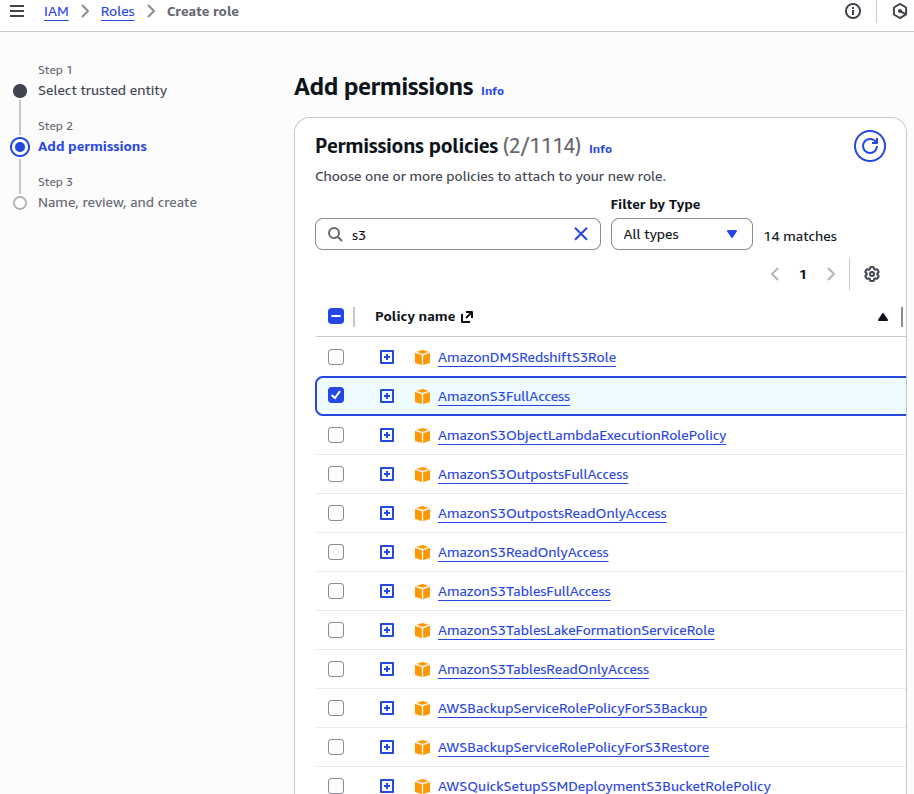
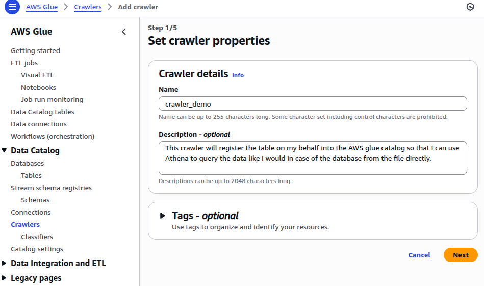
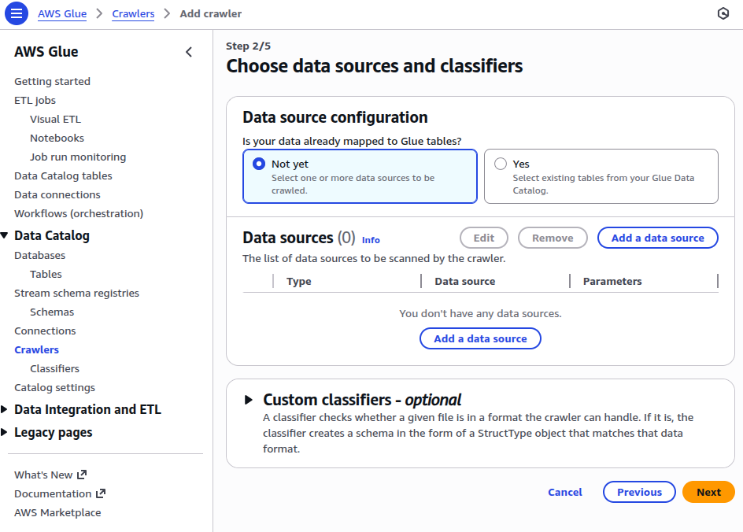
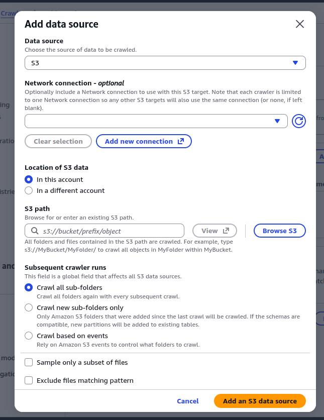
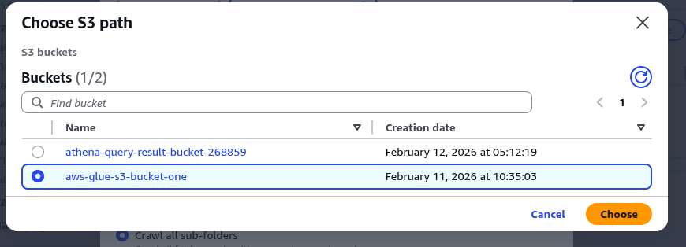
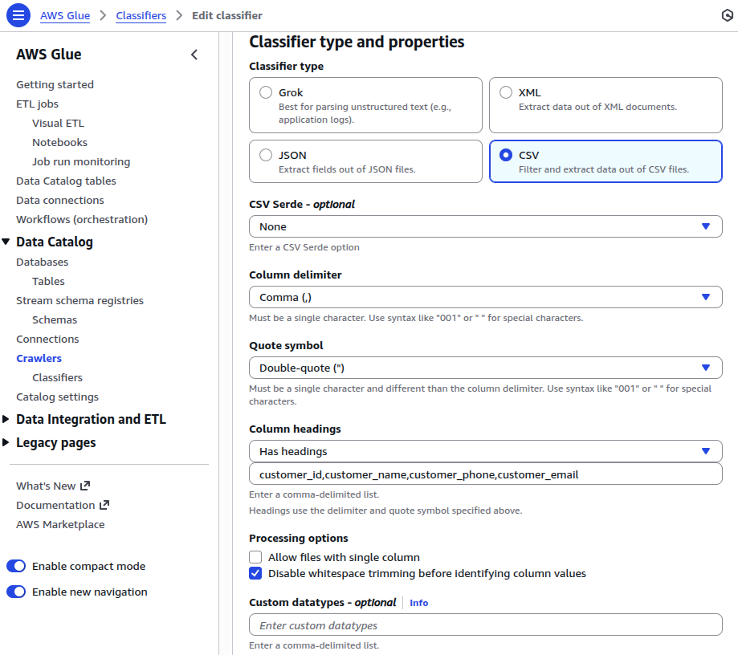

# AWS Glue NOTES
This is a notes on AWS Glue for data engineers.

# Prerequisites
## Dataset used:
https://github.com/darshilparmar/uber-etl-pipeline-data-engineering-project/blob/main/data/uber_data.csv

## AWS CLI : 
AWS CLI docs : https://docs.aws.amazon.com/cli/latest/userguide/cli-usage-commandstructure.html

## Topics to cover : 
- AWS S3
- Managed Tables
- Lamda Triggers
- Glue Catalog
- Glue Crawlers
- Cron Triggers
- IAM 
- Schema Evolution
- Spark Scripts
- CTAS
- Incremental Load
- Glue Data Brew
- External Tables
- Event Based Trigger 
- Custom Functions
- Work flow orchestration
- Custom collection methods in AWS Glue

## AWS Glue
### **What is ETL/ELT?** <br>
We want to **E**xtract the data and **L**oad that data somewhere and that loaded data should be **T**ransformed as per requirments.
- Data engineer will pull data from the sources 
- Data engineer make sure that the data is in the form which can be used by the downstream services or application
- This is the part where ETL/ELT comes in and its designed and maintained by data engineer.


| Aspect                       | ETL                                         | ELT                            |
| ---------------------------- | ------------------------------------------- | ------------------------------ |
| Order                        | **Extract → Transform → Load**              | **Extract → Load → Transform** |
| Where transformation happens | Before loading (external processing engine) | Inside the data warehouse      |
| Best for                     | Traditional data warehouses                 | Modern cloud data platforms    |
| Scalability                  | Limited by ETL server                       | Scales with warehouse compute  |

**ETL :** <br>
**Pros :** <br>
- Clean data before storage
- Strong governance
- Lower storage cost (no raw dump)

**cons :**<br>
- Less flexible
- Slower to adapt to new schema
- Doesn't scale well for massive data

**ELT :** <br>
**Pros :**
- Highly scalable
- Store raw data (future proof)
- Faster iteration
- Works well with analytics + ML

**Cons :**<br>
- Raw data storage costs
- Requires powerful warehouse

#### Points to remember : 
- ETL scaling is:
    - Vertical (bigger machine)
    - Operationally heavy
- ELT scaling is:
    - Horizontal (distributed warehouse engine)
    - Cloud-managed

#### Deep architectural comparison

| Property             | ETL                  | ELT                              |
| -------------------- | -------------------- | -------------------------------- |
| Raw data retained    | Usually no           | Yes                              |
| Schema flexibility   | Low                  | High                             |
| Reprocessing ability | Hard                 | Easy                             |
| Scaling compute      | Hard                 | Elastic                          |
| Best for             | Structured reporting | Analytics + AI + experimentation |
| Change tolerance     | Low                  | High                             |

### **Why AWS Glue?** <br>
AWS glue is a combination of many components that are stiched together. It is a serverless data integration service.

It helps you:
- Discover data
- Catalog metadata
- Transform data
- Prepare data for analytics

AWS glue docs : 
https://docs.aws.amazon.com/glue/latest/dg/what-is-glue.html

AWS glue pricing related details are here : 
https://aws.amazon.com/glue/pricing/

### **What is Serverless?**
Serverless means that you don't need to manage the underlying infrastructure, scaling etc. you just have to run the service.

## AWS Glue components 
- Direct tools: 
    - Data Catalog
    - Crawler
    - Glue Data Brew
- Indirect tools:
    - S3
    - Athena
    - IAM
    - Lambda

**NOTE :** IAM is the most important component in AWS you cannot build anything without IAM in AWS because security is the most important thing. <br>
IAM is a security through which multiple components talk to each other.

**What is IAM ?** <br>
AWS Identity and Access Management (IAM) is a web service for securely controlling access to AWS services. With IAM, you can centrally manage users, security credentials such as access keys, and permissions that control which AWS resources users and applications can access.
Docs link related to IAM in AWS docs : <br>
https://docs.aws.amazon.com/iam/

**what is AWS S3?** <br>
Amazon Simple Storage Service (Amazon S3) is an object storage service that offers industry-leading scalability, data availability, security, and performance. Customers of all sizes and industries can use Amazon S3 to store and protect any amount of data for a range of use cases, such as data lakes, websites, mobile applications, backup and restore, archive, enterprise applications, IoT devices, and big data analytics <br>
- AWS S3 bucket means our data lake
- Bucket means object storage i.e I can upload anything
https://docs.aws.amazon.com/AmazonS3/latest/userguide/Welcome.html

**Points to remember :**
- When creating AWS S3 bucket make sure that you enable bucket versioning because when this is enabled then if you are getting a file with the same name and type then the s3 will not replace the file it will simply give the file a new name which is a good thing in this case.
- Always create folders when working with S3
- We should not work on file level in data egineering we should always work on folder level.

## AWS Glue Catalog
Suppose you a data stored in csv files and that csv file is stored in the S3 bucket and you want to query this data using SQL. <br>
Normally this is not possible because csv is just a text file how can someone query data using SQL stored in csv files. Csv files are not a structured data <br>
Whenever you use SQL to query data that data needs to be a structured data i.e rows and columns <br>
You may say that if you open a csv file in excel you can view it in rows and columns, but excel is a software that is built to render the data inside the csv file in rows and columns but that doesn't mean the data iself is stored in rows and columns to be able to call it a structured data. <br>
So here we will apply an abstraction layer and this abstraction layer will be applied by **Data Catalog**. <br>
The moment you apply the abstraction applied by the **Data Catalog** the csv files stored in S3 starts behaving like objects of the database. FYI catalogs are equivalent to database. **So whenever you go inside the AWS Glue service and under the section Data Catalog you create a new database that means you are creating a new catalog.**<br>
This catalog will register the metadata and schema of the files and will create an object in the catalog. <br>
**ADVANTAGE :**
- This AWS Glue catalog gives the devs the power to use their SQL skills to query the data stored in csv, parquete etc. files (a non structured data) in the same way they would have queried the objects of databases.
- Catalog is the backbone of all the queries that you do in Athena. 
- If catalog is not there you will not be able to query the data.

There are three things in Data Catalog: 
- External table
- CTAS managed
- CTAS external

Here are some references that you can use from the official docs <br> 
https://docs.aws.amazon.com/glue/latest/dg/components-overview.html#data-catalog-intro
Getting started with the AWS Glue Data Catalog <br>
https://docs.aws.amazon.com/glue/latest/dg/start-data-catalog.html

### How to create databases in AWS Glue?
You can create a database in AWS Glue by going to the menue option named database under the Data Catalog section on the side panel provided by AWS. <br>
On top right corner you will find the Add database button press it and create your database <br>

### How to create tables in AWS Glue catalog?
There are two ways to create a table in catalog:
- Manual
- Through crawlers

#### External table
When you have the data in the datalake (S3 bucket) and you want to register the data in the data catalog. <br>
Table metadata lives in the catalog but the real data is stored in the S3 bucket which is managed by you. <br>
amazon athena docs link : <br>
https://docs.aws.amazon.com/athena/

## AWS Athena
#### How to create External table using Athena.
External table is the same as externally managed tables that I read in databricks.

**STEP 1:** <br>
Go to athena query console > settings > set query result path <br>
NOTE : The source and destination should not be the same i.e you cannot give the same s3 bucket url where you have the csv files to save your athena query results, it must be different or else you will keep getting errors saying destination to store query results is not provided when you try to create the external table.

**STEP 2:** <br>
From the left side panel > select create > and from the create table from data source section > select S3 bucket data

**STEP 3:** <br>
You will be greeted with a page where you will have to set 
- The table name, table description
- Dataset : set the location to the csv file in the s3 bucket that you are trying to use to create an external table from.
- Add bulk column button to set the column names and their data types. Since I am creating an external managed table from a csv file I can set all the columns to be of string type because csv files are not a structured data and it stores data in form of strings itself saperated by comma.

**STEP 4:** <br>
Once you did all the above steps correctly you will see a query to create external table generated for you. Your query should look like this : 

```sql
CREATE EXTERNAL TABLE IF NOT EXISTS `aws-glue-tutorial-aditya`.`uber_data_external_table` (
  `vendorid` string,
  `tpep_pickup_datetime` string,
  `tpep_dropoff_datetime` string,
  `passenger_count` string,
  `trip_distance` string,
  `pickup_longitude` string,
  `pickup_latitude` string,
  `ratecodeid` string,
  `store_and_fwd_flag` string,
  `dropoff_longitude` string,
  `dropoff_latitude` string,
  `payment_type` string,
  `fare_amount` string,
  `extra` string,
  `mta_tax` string,
  `tip_amount` string,
  `tolls_amount` string,
  `improvement_surcharge` string,
  `total_amount` string
) COMMENT "This table holds the data related to customer behaviour and ride metrics for all the taxis that work under uber fleet"
ROW FORMAT SERDE 'org.apache.hadoop.hive.ql.io.parquet.serde.ParquetHiveSerDe'
STORED AS INPUTFORMAT 'org.apache.hadoop.hive.ql.io.parquet.MapredParquetInputFormat' OUTPUTFORMAT 'org.apache.hadoop.hive.ql.io.parquet.MapredParquetOutputFormat'
LOCATION 's3://aws-glue-s3-bucket-one/raw_data/'
TBLPROPERTIES ('classification' = 'parquet');
```

#### Issues I ran into : After creating an external table
After I was able to successfully create an external table. I tried querying it using this sql query. 

```sql
SELECT * FROM "aws-glue-tutorial-aditya"."uber_data_external_table" limit 10;
```

The moment I ran this query I was slapped by this error right on my face.

```bash
HIVE_BAD_DATA: Malformed Parquet file. Expected magic number: PAR1 got: 6.8 [s3://aws-glue-s3-bucket-one/raw_data/uber_data.csv]

This query ran against the "aws-glue-tutorial-aditya" database, unless qualified by the query. Please post the error message on our forum  or contact customer support  with Query Id: 0a40a5c0-1kk6-4fuc-9kyo-21uc7c7e5521
```

**Reason why this happened?** <br>
After some research I found out that in the UI I may have accidently selected the paraquet format instead of csv. <br>
Look at the error where it says ```Expected magic number: PAR1 got: 6.8``` this means that the metadata created by athena says that it is a paraquet file but my actual data file in the s3 is a csv file and hence I am getting a file format mismatch error.

**Solution :**
Since I am trying to create an external table where the actual data is stored in csv file hence I will have to choose the file format to be of type CSV under the Data format section. <br>
Once you do that and re-create the external table you will get the generated query that looks something like this. 

```sql
CREATE EXTERNAL TABLE IF NOT EXISTS `aws-glue-tutorial-aditya`.`uber_data_external_table` (
  `vendorid` string,
  `tpep_pickup_datetime` string,
  `tpep_dropoff_datetime` string,
  `passenger_count` string,
  `trip_distance` string,
  `pickup_longitude` string,
  `pickup_latitude` string,
  `ratecodeid` string,
  `store_and_fwd_flag` string,
  `dropoff_longitude` string,
  `dropoff_latitude` string,
  `payment_type` string,
  `fare_amount` string,
  `extra` string,
  `mta_tax` string,
  `tip_amount` string,
  `tolls_amount` string,
  `improvement_surcharge` string,
  `total_amount` string
) COMMENT "This is a test table to see if I am able to create an externally managed table using a csv file"
ROW FORMAT SERDE 'org.apache.hadoop.hive.serde2.lazy.LazySimpleSerDe'
WITH SERDEPROPERTIES ('field.delim' = ',')
STORED AS INPUTFORMAT 'org.apache.hadoop.mapred.TextInputFormat' OUTPUTFORMAT 'org.apache.hadoop.hive.ql.io.HiveIgnoreKeyTextOutputFormat'
LOCATION 's3://aws-glue-s3-bucket-one/raw_data/'
TBLPROPERTIES ('classification' = 'csv');
```

If you look at the generated sql code closely you will see that instead of this ```OUTPUTFORMAT 'org.apache.hadoop.hive.ql.io.parquet.MapredParquetOutputFormat'
``` now you have this ```OUTPUTFORMAT 'org.apache.hadoop.hive.ql.io.HiveIgnoreKeyTextOutputFormat'```

Now when I query the table to get the data from my csv file using athena it works 

```sql
SELECT * FROM "aws-glue-tutorial-aditya"."uber_data_external_table" limit 10;
```

OR 

```sql
SELECT * FROM uber_data_external_table LIMIT 10;
```

output -> : <br>

| #  | vendorid | tpep_pickup_datetime | tpep_dropoff_datetime | passenger_count | trip_distance | pickup_longitude | pickup_latitude | ratecodeid | store_and_fwd_flag | dropoff_longitude | dropoff_latitude | payment_type | fare_amount | extra | mta_tax | tip_amount | tolls_amount | improvement_surcharge | total_amount |
| --- | --- | --- | --- | --- | --- | --- | --- | --- | --- | --- | --- | --- | --- | --- | --- | --- | --- | --- | --- |
| 2 | 1 | 2016-03-01 00:00:00 | 2016-03-01 00:07:55 | 1 | 2.5 | -73.97674560546875 | 40.765151977539055 | 1 | N | -74.00426483154298 | 40.74612808227539 | 1 | 9.0 | 0.5 | 0.5 | 2.05 | 0.0 | 0.3 | 12.35 |
| 3 | 1 | 2016-03-01 00:00:00 | 2016-03-01 00:11:06 | 1 | 2.9 | -73.98348236083984 | 40.767925262451165 | 1 | N | -74.00594329833984 | 40.7331657409668 | 1 | 11.0 | 0.5 | 0.5 | 3.05 | 0.0 | 0.3 | 15.35 |

#### Conclusion
- You can query your data stored in a string format separated by comma in a csv file using SQL just like you would query any other database object and this alone gives you a lot of power.
- You can gain this un godly power just by registering external table on top of those csv files. You suddenly find your self capable performing joins transform data using SQL the way you want based on your business requirements. 
- One another super power that you get if decide to use AWS athena.
    - You can query your logs provided the developer had the foresight to generate logs that is seperated by either comma like csv for pipe like psv or tabs like tsv then you can use athena to query your application logs using sql all you have to do is register an external table for that log file in athena. 
    - Why you would want to query your logs using Athena? 
        - You can make debugging in PROD a hell of a lot easier if you decide to design your logs Athena friendly in moments where your project is working fine in local, dev and QA environment but some error is happening in the PROD and you need to know why is this happening and from where? 
        - So make sure you always generate athena friendly logs in your projects if you are going to write it from scratch.

#### CTAS
There are two types of CTAS
- CTAS external
- CTAS managed

CTAS means **C**reate **T**able **A**s **S**elect. If I want to create a new table instead of using the csv file (source file) I want to use the already existing external or managed table then in that case CTAS will help me achieve my goal.

#### CTAS External
Below are the steps to create a external CTAS table where the altered csv files will be stored in the s3 bucket and its metadata will be registered in Athena. 
#### Issues I faced when creating a CTAS External in athena
I first ran this SQL query where I filtered the records based on total_amount where the total_amount must have value in it more than 100 

```sql
SELECT *
FROM uber_data_external_table
WHERE TRY_CAST(total_amount AS DOUBLE) > 100
LIMIT 10;
```
Once the sql query ran successfully and I was satisfied with the result I got I ended up creating a CTAS of this query.

```sql
CREATE TABLE uber_data_total_amount_filtered
WITH (
    format = "PARQUET",
    external_location = "s3://athena-query-result-bucket-268859/uber_table_query_result/filtered_data"
    write_compression = 'SNAPPY'
) AS
SELECT *
FROM uber_data_external_table
WHERE TRY_CAST(total_amount AS DOUBLE) > 100;
```

Then when I ran this sql query athena again slapped me with this error 

```bash
line 5:5: mismatched input 'write_compression'. Expecting: '%', ')', '*', '+', ',', '-', '.', '/', 'AND', 'AS', 'AT', 'OR', '[', '||', <EOF>, <predicate>
```

**Why this error happened?** <br>
If you look closely at this portion of the above code you will see that I have made several mistakes in the above query.

**Mistake 1:**<br>

```sql
WITH (
    format = "PARQUET",
    external_location = "s3://athena-query-result-bucket-268859/uber_table_query_result/filtered_data"
    write_compression = 'SNAPPY'
)
```

As you can see I forgot to put comma after defining external_location and white_compression.

**Mistake 2:** <br>
Another mistake that I did I wrapped the PARQUET and the external_location in double quotes which is wrong. I din't realise that athena query editor would treat it as a literal string instead of the provided value.

Here is the corrected code block 

```sql
WITH (
    format = 'PARQUET',
    external_location = 's3://athena-query-result-bucket-268859/uber_table_query_result/filtered_data',
    write_compression = 'SNAPPY'
)
```

Here is the complete sql query to create this CTAS 

```sql
CREATE TABLE uber_data_total_amount_filtered
WITH (
    format = 'PARQUET',
    external_location = 's3://athena-query-result-bucket-268859/uber_table_query_result/filtered_data',
    write_compression = 'SNAPPY'
) AS
SELECT *
FROM uber_data_external_table
WHERE TRY_CAST(total_amount AS DOUBLE) > 100;
```

Now when I use this sql query 

```sql
SELECT * fROM uber_data_total_amount_filtered;
```

I get this output where total_amount is greater than 100

| # | vendorid | tpep_pickup_datetime | tpep_dropoff_datetime | passenger_count | trip_distance | pickup_longitude | pickup_latitude | ratecodeid | store_and_fwd_flag | dropoff_longitude | dropoff_latitude | payment_type | fare_amount | extra | mta_tax | tip_amount | tolls_amount | improvement_surcharge | total_amount |
|---|----------|----------------------|------------------------|-----------------|--------------|------------------|------------------|------------|--------------------|-------------------|------------------|--------------|------------|-------|---------|------------|-------------|----------------------|--------------|
| 1 | 2 | 2016-03-01 00:00:00 | 2016-03-01 00:00:00 | 5 | 30.43 | -73.97174072265625 | 40.79218292236328 | 3 | N | -74.17716979980467 | 40.69505310058594 | 1 | 98.0 | 0.0 | 0.0 | 0.0 | 15.5 | 0.3 | 113.8 |
| 2 | 2 | 2016-03-10 07:09:59 | 2016-03-10 07:36:24 | 1 | 11.43 | -73.87612915039062 | 40.77179336547852 | 5 | N | -73.9721450805664 | 40.847412109375 | 1 | 90.0 | 0.0 | 0.5 | 8.0 | 18.04 | 0.3 | 116.84 |
| 3 | 2 | 2016-03-10 07:20:15 | 2016-03-10 07:50:14 | 6 | 17.34 | -74.00823974609375 | 40.70524978637695 | 3 | N | -74.17768096923827 | 40.6953010559082 | 1 | 65.5 | 0.0 | 0.0 | 24.99 | 17.5 | 0.3 | 108.29 |
| 4 | 2 | 2016-03-10 07:20:50 | 2016-03-10 07:52:07 | 5 | 18.41 | -74.00350189208984 | 40.742141723632805 | 3 | N | -74.17713928222656 | 40.695011138916016 | 1 | 66.5 | 0.0 | 0.0 | 16.86 | 17.5 | 0.3 | 101.16 |
| 5 | 2 | 2016-03-10 07:25:36 | 2016-03-10 08:13:46 | 2 | 25.82 | -73.99234008789062 | 40.731342315673835 | 3 | N | -74.36077880859375 | 40.742630004882805 | 1 | 87.5 | 0.0 | 0.0 | 25.08 | 12.5 | 0.3 | 125.38 |
| 6 | 2 | 2016-03-10 07:26:30 | 2016-03-10 07:45:42 | 2 | 10.78 | -73.84951782226561 | 40.748043060302734 | 5 | N | -73.70035552978516 | 40.758079528808594 | 1 | 84.95 | 0.0 | 0.0 | 17.05 | 0.0 | 0.3 | 102.3 |
| 7 | 2 | 2016-03-10 07:26:57 | 2016-03-10 08:15:27 | 1 | 21.83 | -73.92046356201173 | 40.74689102172852 | 3 | N | -74.1777801513672 | 40.69536972045898 | 1 | 79.0 | 0.0 | 0.0 | 28.89 | 17.0 | 0.3 | 125.19 |
| 8 | 2 | 2016-03-10 07:34:42 | 2016-03-10 08:04:53 | 1 | 19.88 | -73.78182983398438 | 40.64485549926758 | 4 | N | -73.58753204345702 | 40.72392272949219 | 1 | 83.0 | 0.0 | 0.5 | 16.76 | 0.0 | 0.3 | 100.56 |
| 9 | 2 | 2016-03-10 07:36:42 | 2016-03-10 08:29:31 | 1 | 29.3 | -73.86388397216798 | 40.76948165893555 | 4 | N | -73.42192840576173 | 40.77008819580078 | 1 | 125.5 | 0.0 | 0.5 | 25.26 | 0.0 | 0.3 | 151.56 |
| 10 | 2 | 2016-03-10 07:40:55 | 2016-03-10 08:39:06 | 1 | 44.49 | -74.01718139648438 | 40.70839691162109 | 5 | N | -74.64081573486328 | 40.574981689453125 | 1 | 225.0 | 0.0 | 0.0 | 47.56 | 12.5 | 0.3 | 285.36 |
| 11 | 2 | 2016-03-10 07:49:11 | 2016-03-10 07:49:24 | 1 | 0.0 | -73.94847869873048 | 40.7972526550293 | 5 | N | -73.94839477539062 | 40.797229766845696 | 2 | 200.0 | 0.0 | 0.0 | 0.0 | 0.0 | 0.3 | 200.3 |
| 12 | 2 | 2016-03-10 07:51:38 | 2016-03-10 08:33:43 | 1 | 18.69 | -73.98118591308595 | 40.741558074951165 | 3 | N | -74.17737579345702 | 40.69525909423828 | 1 | 70.5 | 0.0 | 0.0 | 15.0 | 15.0 | 0.3 | 100.8 |
| 13 | 2 | 2016-03-10 07:53:24 | 2016-03-10 08:59:22 | 1 | 43.65 | -74.00305938720702 | 40.72332382202149 | 5 | N | -74.45540618896483 | 40.84825134277344 | 1 | 143.33 | 0.0 | 0.5 | 39.16 | 12.5 | 0.3 | 195.79 |
| 14 | 2 | 2016-03-10 07:57:54 | 2016-03-10 09:24:29 | 4 | 45.68 | -73.87310028076173 | 40.7741584777832 | 4 | N | -73.19992828369139 | 40.708599090576165 | 2 | 212.5 | 0.0 | 0.5 | 0.0 | 0.0 | 0.3 | 213.3 |
| 15 | 2 | 2016-03-10 08:00:55 | 2016-03-10 08:03:20 | 1 | 1.51 | -74.18675994873048 | 40.69744873046875 | 5 | N | -74.17733764648438 | 40.69512176513672 | 1 | 100.0 | 0.0 | 0.0 | 0.01 | 0.0 | 0.3 | 100.31 |
| 16 | 2 | 2016-03-10 08:01:08 | 2016-03-10 08:02:46 | 1 | 0.0 | -73.81371307373048 | 40.89707946777344 | 5 | N | -73.81371307373048 | 40.897090911865234 | 1 | 106.0 | 0.0 | 0.0 | 15.0 | 0.0 | 0.3 | 121.3 |
| 17 | 2 | 2016-03-10 08:05:32 | 2016-03-10 08:58:31 | 1 | 19.24 | -73.9886703491211 | 40.77503967285156 | 3 | N | -74.17704010009764 | 40.69496154785156 | 1 | 77.0 | 0.0 | 0.0 | 17.96 | 12.5 | 0.3 | 107.76 |
| 18 | 2 | 2016-03-10 08:06:43 | 2016-03-10 09:05:58 | 1 | 40.27 | -74.0052719116211 | 40.744930267333984 | 5 | N | -74.48404693603516 | 40.52020263671875 | 1 | 171.0 | 0.0 | 0.5 | 20.0 | 17.0 | 0.3 | 208.8 |
| 19 | 2 | 2016-03-10 08:08:23 | 2016-03-10 08:57:15 | 5 | 13.87 | -73.87235260009764 | 40.77408218383789 | 5 | N | -73.97357177734375 | 40.86507034301758 | 1 | 100.0 | 0.0 | 0.0 | 20.06 | 0.0 | 0.3 | 120.36 |
| 20 | 2 | 2016-03-10 08:10:49 | 2016-03-10 08:57:12 | 1 | 25.62 | -73.96985626220702 | 40.75365829467773 | 1 | N | -73.80845642089844 | 41.0317497253418 | 1 | 69.0 | 0.0 | 0.5 | 34.0 | 5.54 | 0.3 | 109.34 |

#### CTAS Managed
- Everything is the same except the data is now owned by athena because the data will be stored in the S3 bucket managed by Athena. Hence the data will not be owned by you but AWS.
- Unlike External CTAS here in managed CTAS you don't have to provide the location of where you want to store the data.
- What is a managed location? 
    - There is a special folder that AWS glue will create whenever you want to create a managed data or managed table in AWS
- Unlike External CTAS if you delete the managed CTAS then the actual data will also be deleted along with the metadata. Hence we can say that the data is not owned by you but AWS Glue.
- How to create a managed CTAS
```sql
CREATE TABLE uber_data_most_tipped_filtered_managed_table 
AS 
SELECT * FROM uber_data_external_table WHERE TRY_CAST(tip_amount AS DOUBLE) > 5; 
```

#### Conclusion
**Advantages of External CTAS :**<br>
- Full control over data location 
    - This is mandatory in:
        - Medallion architecture
        - Enterprise data lakes
        - Glue + Athena + EMR setups
    - Managed CTAS:
        - Dumps data in Athena’s results bucket
        - Breaks lake organization
        - Mixes temp + permanent data
- Data is not tied to athena
    - External CTAS output can be used by:
        - AWS Glue
        - Amazon Redshift Spectrum
        - EMR / Spark
        - AWS Lake Formation
        - Other Athena workgroups
    - Managed CTAS data:
        - Is logically Athena-owned
        - Lives in query-result bucket
        - Not intended as a shared dataset
- Predictable permissions and security
    - With external CTAS:
        - You control bucket policies
        - You control IAM roles
        - You control cross-account access
    - Managed CTAS:
        - Uses Athena’s execution role
        - Harder to govern
        - Risk of accidental exposure
- Lifecycle and cost control
    - External CTAS lets you:
        - Apply S3 lifecycle rules
        - Transition to Glacier
        - Auto-delete old partitions
    - Managed CTAS:
        - Lives in Athena results bucket
        - Often accumulates junk
        - Higher long-term cost
- Required for production pipelines
    - External CTAS is required for:
        - Silver / Gold layers
        - Repeatable pipelines
        - Versioned datasets
        - CI/CD-controlled analytics tables
    - Managed CTAS are not pipeline safe.

#### **External CTAS VS Managed CTAS** <br>

| Aspect              | Managed CTAS   | External CTAS |
| ------------------- | -------------- | ------------- |
| Data lake friendly  | No             | yes           |
| Governance          | No             | yes           |
| Reusable by Glue    | questionable   | yes           |
| Safe for production | No             | yes           |
| Easy cleanup        | No             | manual        |
| Best for            | Experiments    | Pipelines     |

**NOTE :** <br>
- Usually when we create a Managed table or CTAS in traditional platform like Databricks and if you drop that table when data is also deleted along with table's metadata.
    - Databricks chooses storage location inside DBFS / Unity catalog
    - Owns both metadata and data
    - Treats it as fully lifecycle-managed
    - So when I drop a managed table in databricks then it not only is able to delete the metadata of the table but also its actual data.
        - How you drop a managed CTAS
        ```sql
        DROP TABLE uber_data_most_tipped_filtered_managed_table;
        ```
- But in AWS the behaviour is different. Even if you delete the Managed table in AWS athena your managed table data in S3 will not be deleted because:
    - Athena is a query engine only
    - Athena is serverless
    - Athena is stateless
    - Athena does not own storage
    - All data lives in
        - All data lives in AWS S3
        - Glue Data Catalog is only used to store table's metadata
    - **What managed table actually means in Athena?**
        - Athena chooses an S3 path automatically
        - Usually inside the Athena results bucket
        - But the data is still in my S3 bucket
    - So when I delete a managed table from AWS using Athena
        - Athena deletes the managed table's metadata
        - Athena does not deletes the S3 objects.
        - S3 is an independednt service of Athena i.e Athena does not assumes it owns the S3 bucket.
- **So we can say that the difference between the managed and external table in case of Athena is that:**
    - When creating external table you have to tell Athena where to store your query result
    - When creating managed table you don't have to tell Athena where to store the query result it will automatically store the query result in the S3 bucket that you set in the Athena's settings**

Athena related docs : https://docs.aws.amazon.com/athena/latest/ug/what-is.html

## AWS Glue Crawlers 
- Normally when you have data in files lets say a bunch of csv files in S3 and you want to query those csv files using Athena.
- The only way you do that is by registering those files as a table in AWS Glue catalog using Athena
    - One of the way to register the tables is to define the schema like I did using the AWS UI where I used bulk add columns option provided under column details section.
    - This method is only good for when you only have 8 to 10 columns beyond that this method doesn't make any sense.
    - Suppose when we do not want to prune the columns and we simple want to do the lift and shift and during the lift and shift we find out the number of columns are really really huge lets say 100 columns are there in the table.
    - Writing 100s of columns manually is not possible in this case.
- This is where the concept of crawler comes into the picture.
    - Now when we use crawler we can just use it to crawl through all of the csv files where our actual data is present (It has the capability to crawl through multiple hirerachial folders : In form of partitions we have to crawl through the hirerachial folders)
    - This crawler will crawl through all of the files and this will infer the schema (It will guess which column should be of which type) and it will automatically register this table in AWS glue catalog.
    - Creawler is also used for schema evolution
        - Suppose we have recieved a file in day 1 where the file has 100 columns and in day 2 we recieve a file where the file has 101 columns instead of 100, this is called schema evolution.
        - We just have to say it to our crawler that if you see any other column just add it to the table.
        - It can literally infer the schema whenever you want.

#### NOTE:
- When I was registering a managed or external table in AWS glue catalog from data files stored in S3 I was able to do that because I was the root user and as a root user I had the permissions to access the S3 bucket and Glue catalogs etc. 
- But when I try to register the crawler to register the managed or external tables using the data files stored in S3 bucket then I will have to give appropriate permissions to crawler to register the table on my behalf.
- By default crawler won't be able to see anything in S3 by itself because S3 is fully secured and crawler also doesn't have any permissions to execute anything in AWS glue.
- This means crawler cannot do anything without IAM (permissions)
- IAM is a component of AWS which allows us to provide access to users and services within the AWS ecosystem.
- So a crawler must carry the access (IAM aka Role) under the hood and this access is actually carry the permissions for AWS glue and S3 bucket.

#### What are IAM roles?
- An IAM Role is a set of permissions that can be assumed temporarily by:
    - AWS services
    - Users
    - Applications
    - Other AWS accounts
- Unlike IAM users, roles do not have permanent credentials (no fixed passwords or access key)
- They provide temporary security credentials when assumed.

| Feature                      | IAM User | IAM Role     |
| ---------------------------- | -------- | ------------ |
| Has permanent credentials    | Yes      |   No         |
| Used by humans               | Yes      |   Usually no |
| Used by AWS services         | No       |   Yes        |
| Temporary access             | No       |   Yes        |
| Best practice for production | No       |   Yes        |

### Before you create a crawler you need to create a role that the crawler will use to access S3 and AWS glue catalog for it to be able to register tables from the data present in the S3 bucket
**STEP 1:**<br>
- Search for IAM in AWS and once you hit enter you will be greeted with IAM main page.
- Once you are there you need to go to the side panel on the left and select Role option there.

**STEP 2:**<br>
- Create a new role for Glue service and then hit next
- After hitting next you will be greeted with a new page where you will have to configure the permissions policies for your role that you are creating.



**STEP 3:**<br>
- In the permission policies page search for glue related permissions
- There you need to check AWSGlueServiceRole IAM policy 
- AWSGlueServiceRole is an AWS managed IAM policy designed for: Allowing AWS Glue to run jobs, crawlers, and workflows. It gives Glue the basic permissions it needs to function properly.
    - This allows:
        - Creating tables
        - Updating metadata
        - Managing crawlers
        - Reading the data catalog


**STEP 4:** <br>
- Now in permissions policies page I need to search for s3
- There from the list select AmazonS3FullAccess
- AmazonS3FullAccess is an AWS managed IAM policy that grants full administrative access to all Amazon S3 resources in your account.
    - Whoever has this policy can do anything in S3.
    - For learning purposes and to keep things simple I am going to use this policy.
    - It is not at all recommended to use this AmazonS3FullAccess policy in the production environment since it can compromise the data sitting in the S3 in the event if the security key gets leaked.
    - You should always use your custom policy and exactly define what permissions you want to give to crawler when performing operations in S3.



**STEP 5:**<br>
- Once you give appropriate permissions just hit next and in the next page you just have to give a name to the role and hit create and your new role will be created.

### How to register a table in AWS glue using AWS crawler?
**STEP 1:**<br>
Go to AWS glue and on the side panel you will find the option named crawlers press this opiton button. After pressing this button you will be greeted with the crawler page.

**STEP 2:**<br>
In this crawler page you will see create crawler button by pressing this button you will greeted with another screen create crawler page.

**STEP 3:**<br>
- In set crawler properties page give your crawler a name and hit next button



**STEP 4:**<br>
- Here in this page I have to set the data sources : Just click on ```add data sources``` button



- A new ```add data sources``` pop up will open



- Here in this add data sources pop up I am going to set S3 location and hit next after saving the S3 bucket location in that pop up.
- After hitting next you will be greeted with Configure security settings



**STEP 5:**<br>
- In Configure security settings page you will have to attach the IAM role that you created earlier to this crawler.
- If you have not created the IAM role then this page will provide you with an option to create a new IAM role right then and there but in this case that role will only have the AWSGlueServiceRole permission and not AmazonS3FullAccess which if not carefull can cause problem down the line.

**STEP 6:**<br>
- Attach the database and tell the crawler what should be your table name even though it is optional and hit create.
- Your new crawler will be created and after creation hit run 
- After the successful run of the crawler the table will be created in AWS glue catalog.

#### **Error I faced when ingesting data from csv files using crawler** <br>
- In my case the table that it generated was not right for some reason It added the column names as col_1, col_2 etc.. and the actual column names were inserted as the first row in the table.
- 
#### Solution : Error I faced when ingesting data from csv files using crawler
- The reason why the crawler when ingesting data from the csv file stored in S3 created a table where the actual column names were added in the first row instead of the header is because when creating crawler I forgot to create classifier for it.
- **How to create classifier for crawler?**
    - 
    - You need to configure your crawler's classifier depending on the type of file you want to ingest
    - Here in this case I am trying to register the table for my csv file using crawler hence I chose the options as shown in the picture above.
- One thing to note even after adding this crawler I was not able to get the proper results when I attempted to re-ingest a csv file after deleting its data from the s3 bucket manually where athena stores its query results. 
- The reason for it to happen is because if you crawled a file without any classifer attached to it and you attached the classifier after you crawled that file.
- The classifier will not be used even if you re-ingest that file after deleting all its data from the s3 bucket where athena stores its query result. 
- The only way is to delete the csv file from the source , delete the data where the query results are stored and then re-run the classifier.


