# AWS Glue NOTES
This is a notes on AWS Glue for data engineers.

# Prerequisites
## Dataset used:
https://github.com/darshilparmar/uber-etl-pipeline-data-engineering-project/blob/main/data/uber_data.csv

## AWS CLI :
AWS CLI setup documentation : <br>
AWS CLI docs : https://docs.aws.amazon.com/cli/latest/userguide/cli-usage-commandstructure.html

## Topics to cover : 
- AWS S3 bucket
- Managed Tables
- Lamda Triggers
- Glue Catalog
- Glue Crawlers
- Cron Triggers
- IAM 
- Schema Evolution
- Spark Scripts
- CTAS
- Incremental Load
- Glue Data Brew
- External Tables
- Event Based Trigger 
- Custom Functions
- Work flow orchestration
- Custom collection methods in AWS Glue
- AWS IAM and policies
- AWS event bridge 
- AWS cloudwatch
- AWS Step functions 
- AWS Lambda functions
- AWS SQS
- AWS Athena
- AWS DynamoDB

## Underline theory of cloud computing 
### Virtualization and Hypervisor
#### Why a data engineer needs to understand this at all?
When you run a Glue job, a Lambda function, or a Databricks cluster, you are not getting a dedicated physical machine. You are getting a slice of a physical machine that AWS or Databricks manages. Virtualisation is the technology that makes that slicing possible. Understanding it helps you reason about why Glue has a cold start, why Databricks clusters take time to spin up, why two Glue jobs running simultaneously do not interfere with each other, and why serverless feels instant compared to cluster-based compute.

#### What virtualisation is?
A physical server is a box with CPUs, RAM, storage, and network cards. In the early days of computing, one application ran on one physical server. If the application only used 10% of the CPU, the other 90% sat idle. This was enormously wasteful — expensive hardware doing nothing most of the time.

Virtualisation solves this by creating an abstraction layer that makes one physical machine appear to be multiple independent machines. Each virtual machine believes it has its own dedicated CPU, its own RAM, its own storage, and its own operating system. In reality all of them are sharing the same physical hardware underneath. The software layer that creates and manages this illusion is called a hypervisor.

#### What a hypervisor is?
A hypervisor is the software that sits between the physical hardware and the virtual machines running on top of it. It has two core jobs. The first is to divide the physical hardware resources CPU cores, RAM, storage, network bandwidth into isolated allocations and assign them to each virtual machine. The second is to intercept every instruction that a virtual machine tries to execute against hardware and translate it into safe operations on the actual physical hardware, preventing any virtual machine from accidentally or maliciously affecting another.

Think of it like an apartment building manager. The building has one set of physical infrastructure walls, pipes, electricity. The manager divides it into apartments, ensures each tenant only accesses their own space, handles disputes, and makes sure one tenant flooding their bathroom does not destroy everyone else's apartment. The hypervisor is that manager, the building is the physical server, and the apartments are the virtual machines.

#### types of hypervisors
**Type 1 hypervisors** run directly on the physical hardware with no operating system underneath. They are sometimes called bare-metal hypervisors. The hypervisor itself is the first thing that runs when the machine boots, and it then starts the virtual machines on top of itself. AWS uses a Type 1 hypervisor called the Nitro Hypervisor, which is a custom-built system derived from KVM. Because there is no general-purpose operating system between the hardware and the hypervisor, Type 1 hypervisors are extremely fast and efficient. Microsoft Hyper-V, VMware ESXi, and Xen are other examples.

**Type 2 hypervisors** run as an application on top of an existing operating system. The operating system boots first, then the hypervisor runs as a program on that OS, and then virtual machines run on top of the hypervisor. VirtualBox on your laptop is a Type 2 hypervisor. You run Windows or macOS, then you install VirtualBox, then you create Ubuntu virtual machines inside it. Type 2 hypervisors are convenient for development and testing but slower than Type 1 because every hardware instruction passes through two layers the hypervisor and then the host operating system — before reaching actual hardware.

#### How AWS uses virtualisation the Nitro system?
AWS built its own hypervisor called Nitro specifically because the existing open-source hypervisors were not fast enough for what AWS needed. The Nitro system has three parts that work together.

The Nitro Hypervisor is an extremely thin layer it handles only CPU and memory virtualisation. It is so minimal that it adds almost no overhead. AWS measured that Nitro gives EC2 instances access to nearly 100% of the underlying hardware performance, compared to older hypervisors that consumed 30% of hardware resources just running the virtualisation layer itself.

Nitro Cards are dedicated hardware chips that offload the work of virtualising storage and networking away from the CPU entirely. Instead of the hypervisor software handling every network packet and storage operation on the main CPU, dedicated silicon chips handle it. This means your Glue job's 10 workers are not competing with hypervisor overhead for CPU time the Nitro Cards handle all the network and storage virtualisation in hardware, essentially for free.

The Nitro Security Chip handles the security and integrity of the instance. It cryptographically verifies the firmware at boot, provides hardware root of trust, and enables features like Nitro Enclaves which create isolated execution environments even the AWS operators cannot access.

When I start a Glue job and AWS provisions G.1X workers, each worker is an EC2 instance running inside the Nitro hypervisor. My PySpark code runs in a JVM inside that virtual machine, which runs on a physical server in a Mumbai data centre that is also running dozens of other customers' virtual machines at the same time, completely isolated from mine.

#### Containers versus virtual machines what Databricks and Lambda actually use
This is where it gets specifically relevant for your work. Not everything in AWS uses full virtual machines. Some services use containers instead, and understanding the difference explains the startup time differences you experience.

A virtual machine virtualises hardware it pretends to be a complete computer with its own CPU, RAM, and operating system kernel. Creating a new virtual machine means booting an entire operating system, which takes 30 to 90 seconds.

A container virtualises the operating system it shares the host OS kernel but gets its own isolated filesystem, network namespace, and process space. Creating a new container means starting a process and setting up the isolation, which takes milliseconds to a few seconds.

AWS Lambda uses a system called Firecracker, which is a microVM hypervisor also built by AWS. Firecracker creates extremely lightweight virtual machines that boot in under 125 milliseconds. This is why Lambda cold starts feel nearly instant you are still getting a real virtual machine with hardware isolation, but it is so stripped down that it boots faster than most containers. Each Lambda invocation runs in its own Firecracker microVM. When you uploaded a CSV file and Lambda triggered, a Firecracker microVM was created, your Lambda function ran, and the microVM was either recycled for a future warm invocation or destroyed.

Databricks clusters use EC2 instances full virtual machines under the Nitro hypervisor. When you start a Databricks job cluster, AWS spins up new EC2 instances, each booting a full Linux operating system, installing the Databricks runtime, starting Java, starting Spark, and registering with the driver. This takes 3 to 8 minutes. Databricks pools reduce this by keeping terminated instances in a warm state so they can be reused, which is why interactive clusters on Databricks feel much faster than job clusters for iterative notebook work.

Your Glue jobs also use EC2 instances under Nitro. The 2-minute cold start you observed is the time to provision the EC2 instances, boot the OS, start the Glue runtime, initialise the SparkContext, and connect the workers to the driver. There is no way to avoid this cold start with Glue because it is inherent to spinning up a cluster of virtual machines.

### How isolation works? why your Glue job cannot see another customer's data?
This is a question that matters deeply in cloud computing from a security perspective. How can AWS guarantee that your Glue job running on a shared physical server cannot access another company's data running on the same server?

The answer is hardware-enforced memory isolation. Modern CPUs have a feature called virtual memory where each process is given a virtual address space that maps to different physical memory locations through a translation table managed by the OS. The hypervisor extends this each virtual machine gets its own set of translation tables, managed by the hypervisor. A virtual machine can only access memory addresses in its own translation table. Even if malicious code inside a virtual machine tried to read memory belonging to another virtual machine, the CPU hardware would reject the access and raise a fault before any data was exposed.

The Nitro hypervisor further strengthens this by running in a separate hardware domain entirely. The hypervisor code itself runs in a privileged CPU ring that even the virtual machines' operating systems cannot access. AWS engineers operating the infrastructure also cannot access your virtual machine's memory at runtime this is enforced at the hardware level by the Nitro Security Chip.

This is why you can trust that your sales CSV data inside a Glue job is not visible to another company's Glue job running on the same physical server at the same time. The isolation is not just a software policy it is enforced by the CPU hardware itself.

#### What this means practically for your data engineering work?
**Glue cold starts** exist because spinning up EC2 virtual machines takes time. The hypervisor needs to allocate memory pages, set up translation tables, boot the OS, and start the runtime. You cannot eliminate this. You can mitigate it by batching small files together into fewer larger Glue runs rather than 1000 individual runs, but the fundamental cause is VM startup time.

**Lambda's near-instant response** is because Firecracker microVMs are designed for this use case minimal boot time, maximum isolation. Your Lambda idempotency function runs in a microVM that boots in under 125ms. The warm invocation path reuses an existing microVM, making it even faster.

**Databricks cluster startup** is the same EC2 VM startup problem as Glue, plus the additional time to install the Databricks runtime and start Spark. Databricks pools work by keeping VMs running but in a paused state, so reuse is fast. This is why in production Databricks deployments, operations teams keep a pool of warm instances pre-provisioned rather than starting fresh clusters for every job.

**Why serverless feels different from cluster-based** Lambda and Glue Serverless use microVMs that start fast and die after each invocation. Databricks and traditional Glue jobs use full EC2 VMs that take minutes to start but then stay warm for the duration of your work session. For a data engineer, this means serverless is better for event-driven, short, frequent tasks like your Lambda idempotency check while cluster-based is better for long-running, compute-heavy transformations where the startup cost amortises over a long execution time.

## AWS Region and availibility zone 
### AWS Regions
An AWS Region is a physical geographic location in the world where Amazon has built a cluster of data centres. Each Region is completely independent of every other Region — it has its own power supply, networking, and physical infrastructure.

AWS built this model for three reasons. First, latency if your users are in India, running your application in ap-south-1 (Mumbai) is faster than running it in us-east-1 (Virginia) because the data travels a shorter physical distance. Second, data residency — many countries and industries have laws requiring that data stays within specific geographic boundaries. 

### AWS Zones
Availability Zones are the individual data centre clusters that exist inside a Region. Every AWS Region contains multiple Availability Zones typically three to six and each one is physically separate from the others.

A single Availability Zone is one or more physical data centre buildings located in the same metropolitan area as the other zones in that Region. Each zone has its own independent power supply from a different grid, its own cooling systems, its own physical security, and its own network connections to the internet. The independence is the entire point if one zone loses power or catches fire, the others keep running.

Within a Region, all the Availability Zones are connected to each other through dedicated private fibre cables that AWS owns and operates. The latency between zones is under 1 millisecond, which is fast enough that your application can treat them as if they are in the same location while still getting the fault isolation benefit.

## AWS IAM and policies 
### AWS IAM 
IAM stands for Identity and Access Management. It is the security system that controls who can do what inside your AWS account. Nothing in AWS can talk to anything else without IAM being involved every API call, every service interaction, every CLI command goes through IAM before it is allowed to proceed.

#### The core problem IAM solves
When you have multiple services, users, and applications inside one AWS account, you need a way to say precisely which entity is allowed to perform which actions on which resources. Without IAM, either everything would have access to everything which is a massive security risk or you would have no way to automate anything because services could not communicate with each other.

#### The four main IAM concepts
**Users** are human identities. An IAM user represents a person a developer, a data engineer, an administrator. Users have permanent credentials in the form of a password for the AWS console and access keys for the CLI or SDK. In modern AWS practice, creating individual IAM users for humans is being replaced by identity federation where your company's existing login system handles authentication, but the concept still exists.

**Groups** are collections of users. Instead of attaching permissions directly to each individual user, you create a group called data-engineers, attach the relevant permissions to that group, and then add users to it. Any user in the group inherits the group's permissions. This makes managing permissions for teams much simpler.

**Roles** are the most important IAM concept for building AWS systems. A role is a set of permissions that is assumed temporarily by a service, application, or user. Unlike users, roles do not have permanent credentials they issue temporary credentials that expire after a short period, typically one hour. When an AWS service like Lambda needs to access DynamoDB, it assumes an IAM role and gets temporary credentials valid for that session only.

**Policies** are the actual permission definitions. A policy is a JSON document that says what actions are allowed or denied on what resources. Policies are attached to users, groups, or roles to grant or restrict permissions.

#### How policies work?
A policy is made of statements. Each statement has four key parts. The Effect is either Allow or Deny. The Action is what operation is being controlled, written as ```service:operation``` for example ```dynamodb:GetItem```, ```s3:PutObject```, or ```glue:StartJobRun```. The Resource is which specific AWS resource the action applies to, written as an ARN. The Condition is an optional filter that makes the permission apply only under certain circumstances.
Full Example : 
```json
{
  "Version": "2012-10-17",
  "Statement": [
    {
      "Effect": "Allow",
      "Action": "dynamodb:GetItem",
      "Resource": "arn:aws:dynamodb:ap-south-1:406868976171:table/file_processing_registry"
    }
  ]
}
```

## AWS Elastic Block Storage (EBS) : 
### What is BLOCK storage ?
There are three main types of storage block storage, file storage, and object storage. Understanding the difference explains why block storage exists.

**Block storage** exposes raw blocks with addresses. The consumer typically an operating system or database directly controls how data is organised on those blocks. It is the lowest level, closest to bare hardware. It is fast because there is minimal overhead between your application and the actual data.

**File storage** exposes a filesystem with files and folders over a network. NFS and SMB are protocols for this. Multiple machines can mount the same filesystem simultaneously and see the same files. The storage system manages the filesystem structure for you. It is convenient but slower than block storage because of the filesystem overhead and network protocol.

**Object storage** which is what S3 is exposes a flat namespace of objects identified by keys. There are no folders, no blocks, no filesystem. You PUT an object, you GET an object by its key. Object storage is designed for massive scale and high durability, not for low-latency random access. You cannot mount S3 as a drive and run a database on it the way you can with block storage.

### What AWS EBS is?
Amazon Elastic Block Store is AWS's block storage service for EC2 instances. When you launch an EC2 instance which as we discussed is a virtual machine running under the Nitro hypervisor that instance needs a disk. EBS provides that disk as a network-attached block device.

The word elastic means the volume can be resized, the performance can be adjusted, and it exists independently of the instance. The word block refers to the fact that it presents raw block storage to the operating system running inside the EC2 instance, not a filesystem or an object store.

When your EC2 instance boots, it sees an EBS volume as if it were a physical disk directly attached to the machine. The Linux kernel inside your instance talks to it using standard block device protocols. The instance formats it with a filesystem like ext4, mounts it, and uses it exactly like a local hard drive. The fact that the actual storage hardware is somewhere else in the AWS data centre connected over a high-speed network is completely transparent to the operating system.

### How EBS works under the hood?
EBS volumes are not stored on the same physical server as your EC2 instance. They live on separate, dedicated storage servers connected to the compute servers through AWS's internal network fabric a high-bandwidth, low-latency network that AWS built specifically for this purpose using the Nitro Cards discussed earlier.

When your EC2 instance writes data to its EBS volume, the Nitro Card on the compute server intercepts the block write operation and sends it over the internal network to the storage server where the actual EBS volume lives. This happens so fast sub-millisecond latency on io2 volumes that the operating system inside the EC2 instance cannot distinguish it from a local disk.

This separation of compute and storage is architecturally important. It means your EC2 instance can be terminated and a new one started, and the EBS volume with all your data is completely unaffected. The data persists independently of the compute instance lifecycle. You can detach an EBS volume from one instance and attach it to a different instance, and the new instance sees all the data exactly as the previous one left it.

### EBS volume types
AWS offers several EBS volume types optimised for different use cases, and the differences matter for data engineering workloads.

**gp3** is the general purpose SSD and the default for most workloads. It provides a baseline of 3000 IOPS and 125 MB/s throughput regardless of volume size. You can independently provision additional IOPS and throughput up to 16,000 IOPS and 1000 MB/s without increasing storage size. IOPS means input/output operations per second — the number of individual read or write operations the volume can handle per second. For most Glue jobs and general EC2 workloads this is the right choice.

**io2 Block Express** is the high-performance SSD for latency-sensitive workloads. It provides up to 256,000 IOPS and sub-millisecond latency. This is what you would use for a high-throughput database like a production PostgreSQL or Oracle instance where every millisecond of storage latency matters. It is significantly more expensive than gp3.

**st1** is a throughput-optimised hard drive designed for large sequential reads and writes rather than random access. It has low IOPS but high throughput — up to 500 MB/s. This is appropriate for workloads that read large files sequentially, like a Hadoop data node or a log processing system. It is much cheaper than SSD volumes.

**sc1** is a cold hard drive for infrequently accessed data. The cheapest EBS option. Used for archival data that is rarely read.

### EBS versus S3 a comparison that matters directly for your pipeline
This distinction is critical for a data engineer and it directly explains architectural decisions in your pipeline.

**EBS** is a disk attached to one EC2 instance. Only that instance can read and write to it. It is fast sub-millisecond latency for random reads and writes. It is limited in size by what you provision. It exists in one Availability Zone. If the AZ goes down, the volume is inaccessible until AWS restores the AZ. It is designed for structured access patterns a database writing rows, an OS reading executables, a virtual machine swapping memory pages.

**S3** is an object store accessible by any AWS service from anywhere. It is slower than EBS for small random reads — typically 10 to 100 milliseconds per request. But it is infinitely scalable, replicated across multiple Availability Zones automatically, and accessible by Glue, Lambda, Athena, Step Functions, and any other AWS service simultaneously. It costs roughly 10 times less per GB than EBS.

This is precisely why your data engineering pipeline uses S3 for data storage and not EBS. Your CSV files land in S3. Your Silver parquet files are written to S3. Your Glue job reads from S3 and writes to S3. This works because Glue workers which are EC2 instances with EBS root volumes read from S3 over the network, transform the data in memory, and write back to S3. The EBS volume on each Glue worker is only used for the operating system, the Glue runtime, and temporary Spark shuffle data during the job. It is not used for your actual pipeline data.

**Real cost impact :** <br>
If your pipeline stored data on EBS instead of S3, only one EC2 instance could access it at a time, it would cost 10 times more, it would not survive instance termination, and Athena could not query it. S3 is the correct storage layer for a data lake specifically because it is not block storage.

### What EBS means in your specific data engineering context
Your Glue workers are EC2 instances. Each one has an EBS root volume this is where the Linux OS boots from, where the Glue runtime is installed, and where Spark writes shuffle files when data overflows memory during operations like ```groupBy```, ```join```, and ```dropDuplicates```. When your Glue job runs ```dropDuplicates(["review_id"])``` on a large dataset, Spark may need to spill intermediate data to disk. That disk is the EBS volume on the worker.

If your Glue job fails with a disk space error or shuffle spill errors on very large datasets, the fix is to increase the EBS volume size on your Glue workers or increase the number of workers so each one handles less data. This is a real operational concern at scale even though at your current dataset size of 489 rows per file it will never happen.

Databricks clusters have the same structure each EC2 node has an EBS volume for the OS and Spark shuffle, and your actual data lives in S3. The EBS volume is infrastructure plumbing that you rarely think about directly, but it is always there underneath every compute workload you run on AWS.

### Why shuffle spill happens first the root cause?
When Spark executes an operation that requires comparing or grouping rows across the entire dataset like ```dropDuplicates(["review_id"])```, ```groupBy```, or ```join``` it cannot do this locally on each worker in isolation. It needs all rows with the same key to land on the same worker so they can be compared. This process of redistributing data across workers based on key is called a shuffle.

During a shuffle every worker sends some of its rows to other workers and receives rows from other workers. All of this intermediate data — rows in transit, rows waiting to be processed needs to live somewhere. Spark first tries to hold it in RAM. If the data is larger than the available RAM on that worker, Spark writes the overflow to local disk. This is called spill data spilling from memory onto disk.

The disk it spills to is the EBS volume attached to that Glue worker EC2 instance. If the spill data is larger than the available EBS space, the job fails with a disk space error.

Your current dataset of 489 rows per file is a few hundred kilobytes. This fits in RAM thousands of times over. But if the same pipeline processed a 10GB CSV file with 50 million rows, the shuffle for dropDuplicates would generate gigabytes of spill data and could exhaust disk space on the workers.

### How to increase EBS volume size on Glue workers?
Glue does not expose EBS volume configuration directly in the console the way EC2 does. Instead you control it through a job parameter called --job-disk-size. This parameter sets the EBS volume size in GB for each worker.

**In the AWS Glue console:**

Go to AWS Glue → Jobs → click your ingest_sales_data job → click Edit → scroll down to Advanced properties → find the Job parameters section → add a new parameter:
```bash
Key:   --job-disk-size
Value: 96
```
The default disk size per Glue worker depends on the worker type. For G.1X the default is 64GB. For G.2X it is 128GB. Setting ```--job-disk-size``` to 96 would give each worker 96GB of EBS storage for shuffle spill and temporary data.

In your Glue job script you can also set it programmatically when starting the job via boto3, which is relevant because your Step Function starts the Glue job with glue:startJobRun. You would add it to the Arguments:
```json
"Arguments": {
    "--source_bucket.$": "$.bucket",
    "--source_key.$": "$.key",
    "--job-disk-size": "96"
}
```
Increasing from 10 to 20 doubles the parallelism and halves the data each worker handles. It also doubles the cost : 20 workers × $0.44/DPU-hour instead of 10.

Via boto3 in your Step Function your orchestrate_data_ingestion Step Function starts the Glue job like this:
```json
"Parameters": {
    "JobName": "ingest_sales_data",
    "Arguments": {
        "--source_bucket.$": "$.bucket",
        "--source_key.$": "$.key"
    }
}
```
You can override the worker count per execution by adding NumberOfWorkers and WorkerType to the Parameters:
```json
"Parameters": {
    "JobName": "ingest_sales_data",
    "NumberOfWorkers": 20,
    "WorkerType": "G.1X",
    "Arguments": {
        "--source_bucket.$": "$.bucket",
        "--source_key.$": "$.key"
    }
}
```
This lets you dynamically control workers per execution, which is useful if some files are much larger than others.

### Worker types and what they mean?

Glue offers several worker types and the choice affects both memory and EBS disk size:

| Worker type | vCPUs | RAM | Default EBS | DPU count | Price/hour |
|---|---|---|---|---|---|
| G.1X | 4 | 16GB | 64GB | 1 | $0.44 |
| G.2X | 8 | 32GB | 128GB | 2 | $0.88 |
| G.4X | 16 | 64GB | 256GB | 4 | $1.76 |
| G.8X | 32 | 128GB | 512GB | 8 | $3.52 |

Switching from G.1X to G.2X doubles the RAM per worker, which directly reduces spill because more data fits in memory before Spark needs to write to disk. If your job is failing due to memory pressure rather than disk pressure, upgrading the worker type is often more effective than adding more workers.

The trade-off between adding workers and upgrading worker type:

Adding more workers is better when your data can be parallelised effectively — more partitions, more workers processing them simultaneously. The job runs faster and each worker handles less data.

Upgrading worker type is better when the bottleneck is within a single partition — a single worker receiving a large amount of data for one key during a shuffle. No amount of additional workers helps if one key has 50% of all the rows, because all those rows must land on one worker during a `groupBy` or `dropDuplicates`. Giving that worker more RAM via G.2X or G.4X is the only solution.

### How to diagnose which problem you actually have

When your Glue job fails at scale you need to know whether the issue is disk space, memory, or something else. Glue writes its logs to CloudWatch under `/aws-glue/jobs/output` and `/aws-glue/jobs/error`.

A disk space error looks like this in the logs:
```
java.io.IOException: No space left on device
```

A memory error looks like this:
```
java.lang.OutOfMemoryError: Java heap space
Container killed by YARN for exceeding memory limits
```

A shuffle spill warning — not a failure but a performance concern — looks like this:

ExternalSorter: Spilling data to disk (25 times so far)

If you see disk space errors, increase --job-disk-size. If you see memory errors or excessive spill warnings, upgrade the worker type from G.1X to G.2X. If the job is slow but not failing, add more workers to increase parallelism.

For your current pipeline these errors will not appear. But when you move to larger datasets in future projects, reading these CloudWatch logs and knowing which parameter to adjust is a core data engineering operational skill.

## AWS S3 Bucket
S3 is not a filesystem. It is not a database. It is not block storage like EBS. It is a flat key-value store where the key is a string — the object key — and the value is the bytes of your file plus some metadata. That is the entire model. Every object in S3 is identified by three things: the bucket name, the object key, and optionally a version ID.

When you upload sales_data_1.csv to the path ```raw_data/sales_data/sales_data_1.csv``` in your bucket ```aws-glue-s3-bucket-one```, S3 stores it as a single object. The key is literally the string ```raw_data/sales_data/sales_data_1.csv```. The forward slashes are not real folder separators they are just characters in the key string. S3 has no concept of folders or directories. The AWS console shows you a folder-like interface because it groups objects that share a common prefix, but underneath there are no folders. There is just a flat collection of objects identified by their key strings.

## AWS Glue
### **What is ETL/ELT?** <br>
We want to **E**xtract the data and **L**oad that data somewhere and that loaded data should be **T**ransformed as per requirments.
- Data engineer will pull data from the sources 
- Data engineer make sure that the data is in the form which can be used by the downstream services or application
- This is the part where ETL/ELT comes in and its designed and maintained by data engineer.


| Aspect                       | ETL                                         | ELT                            |
| ---------------------------- | ------------------------------------------- | ------------------------------ |
| Order                        | **Extract → Transform → Load**              | **Extract → Load → Transform** |
| Where transformation happens | Before loading (external processing engine) | Inside the data warehouse      |
| Best for                     | Traditional data warehouses                 | Modern cloud data platforms    |
| Scalability                  | Limited by ETL server                       | Scales with warehouse compute  |

**ETL :** <br>
**Pros :** <br>
- Clean data before storage
- Strong governance
- Lower storage cost (no raw dump)

**cons :**<br>
- Less flexible
- Slower to adapt to new schema
- Doesn't scale well for massive data

**ELT :** <br>
**Pros :**
- Highly scalable
- Store raw data (future proof)
- Faster iteration
- Works well with analytics + ML

**Cons :**<br>
- Raw data storage costs
- Requires powerful warehouse

#### Points to remember : 
- ETL scaling is:
    - Vertical (bigger machine)
    - Operationally heavy
- ELT scaling is:
    - Horizontal (distributed warehouse engine)
    - Cloud-managed

#### Deep architectural comparison

| Property             | ETL                  | ELT                              |
| -------------------- | -------------------- | -------------------------------- |
| Raw data retained    | Usually no           | Yes                              |
| Schema flexibility   | Low                  | High                             |
| Reprocessing ability | Hard                 | Easy                             |
| Scaling compute      | Hard                 | Elastic                          |
| Best for             | Structured reporting | Analytics + AI + experimentation |
| Change tolerance     | Low                  | High                             |

### **Why AWS Glue?** <br>
AWS glue is a combination of many components that are stiched together. It is a serverless data integration service.

It helps you:
- Discover data
- Catalog metadata
- Transform data
- Prepare data for analytics

AWS glue docs : 
https://docs.aws.amazon.com/glue/latest/dg/what-is-glue.html

AWS glue pricing related details are here : 
https://aws.amazon.com/glue/pricing/

### **What is Serverless?**
Serverless means that you don't need to manage the underlying infrastructure, scaling etc. you just have to run the service.

## AWS Glue components 
- Direct tools: 
    - Data Catalog
    - Crawler
    - Glue Data Brew
- Indirect tools:
    - S3
    - Athena
    - IAM
    - Lambda

**NOTE :** IAM is the most important component in AWS you cannot build anything without IAM in AWS because security is the most important thing. <br>
IAM is a security through which multiple components talk to each other.

**What is IAM ?** <br>
AWS Identity and Access Management (IAM) is a web service for securely controlling access to AWS services. With IAM, you can centrally manage users, security credentials such as access keys, and permissions that control which AWS resources users and applications can access.
Docs link related to IAM in AWS docs : <br>
https://docs.aws.amazon.com/iam/

**What is AWS S3?** <br>
Amazon Simple Storage Service (Amazon S3) is an object storage service that offers industry-leading scalability, data availability, security, and performance. Customers of all sizes and industries can use Amazon S3 to store and protect any amount of data for a range of use cases, such as data lakes, websites, mobile applications, backup and restore, archive, enterprise applications, IoT devices, and big data analytics <br>
- AWS S3 bucket means our data lake
- Bucket means object storage i.e I can upload anything
https://docs.aws.amazon.com/AmazonS3/latest/userguide/Welcome.html

**Points to remember :**
- When creating AWS S3 bucket make sure that you enable bucket versioning because when this is enabled then if you are getting a file with the same name and type then the s3 will not replace the file it will simply give the file a new name which is a good thing in this case.
- Always create folders when working with S3
- We should not work on file level in data egineering we should always work on folder level.

## AWS Glue Catalog
Suppose you a data stored in csv files and that csv file is stored in the S3 bucket and you want to query this data using SQL. <br>
Normally this is not possible because csv is just a text file how can someone query data using SQL stored in csv files. Csv files are not a structured data <br>
Whenever you use SQL to query data that data needs to be a structured data i.e rows and columns <br>
You may say that if you open a csv file in excel you can view it in rows and columns, but excel is a software that is built to render the data inside the csv file in rows and columns but that doesn't mean the data iself is stored in rows and columns to be able to call it a structured data. <br>
So here we will apply an abstraction layer and this abstraction layer will be applied by **Data Catalog**. <br>
The moment you apply the abstraction applied by the **Data Catalog** the csv files stored in S3 starts behaving like objects of the database. FYI catalogs are equivalent to database. **So whenever you go inside the AWS Glue service and under the section Data Catalog you create a new database that means you are creating a new catalog.**<br>
This catalog will register the metadata and schema of the files and will create an object in the catalog. <br>
**ADVANTAGE :**
- This AWS Glue catalog gives the devs the power to use their SQL skills to query the data stored in csv, parquete etc. files (a non structured data) in the same way they would have queried the objects of databases.
- Catalog is the backbone of all the queries that you do in Athena. 
- If catalog is not there you will not be able to query the data.

There are three things in Data Catalog: 
- External table
- CTAS managed
- CTAS external

Here are some references that you can use from the official docs <br> 
https://docs.aws.amazon.com/glue/latest/dg/components-overview.html#data-catalog-intro
Getting started with the AWS Glue Data Catalog <br>
https://docs.aws.amazon.com/glue/latest/dg/start-data-catalog.html

### How to create databases in AWS Glue?
You can create a database in AWS Glue by going to the menue option named database under the Data Catalog section on the side panel provided by AWS. <br>
On top right corner you will find the Add database button press it and create your database <br>

### How to create tables in AWS Glue catalog?
There are two ways to create a table in catalog:
- Manual
- Through crawlers

#### External table
When you have the data in the datalake (S3 bucket) and you want to register the data in the data catalog. <br>
Table metadata lives in the catalog but the real data is stored in the S3 bucket which is managed by you. <br>
amazon athena docs link : <br>
https://docs.aws.amazon.com/athena/

## AWS Athena
#### How to create External table using Athena.
External table is the same as externally managed tables that I read in databricks.

**STEP 1:** <br>
Go to athena query console > settings > set query result path <br>
NOTE : The source and destination should not be the same i.e you cannot give the same s3 bucket url where you have the csv files to save your athena query results, it must be different or else you will keep getting errors saying destination to store query results is not provided when you try to create the external table.

**STEP 2:** <br>
From the left side panel > select create > and from the create table from data source section > select S3 bucket data

**STEP 3:** <br>
You will be greeted with a page where you will have to set 
- The table name, table description
- Dataset : set the location to the csv file in the s3 bucket that you are trying to use to create an external table from.
- Add bulk column button to set the column names and their data types. Since I am creating an external managed table from a csv file I can set all the columns to be of string type because csv files are not a structured data and it stores data in form of strings itself saperated by comma.

**STEP 4:** <br>
Once you did all the above steps correctly you will see a query to create external table generated for you. Your query should look like this : 

```sql
CREATE EXTERNAL TABLE IF NOT EXISTS `aws-glue-tutorial-aditya`.`uber_data_external_table` (
  `vendorid` string,
  `tpep_pickup_datetime` string,
  `tpep_dropoff_datetime` string,
  `passenger_count` string,
  `trip_distance` string,
  `pickup_longitude` string,
  `pickup_latitude` string,
  `ratecodeid` string,
  `store_and_fwd_flag` string,
  `dropoff_longitude` string,
  `dropoff_latitude` string,
  `payment_type` string,
  `fare_amount` string,
  `extra` string,
  `mta_tax` string,
  `tip_amount` string,
  `tolls_amount` string,
  `improvement_surcharge` string,
  `total_amount` string
) COMMENT "This table holds the data related to customer behaviour and ride metrics for all the taxis that work under uber fleet"
ROW FORMAT SERDE 'org.apache.hadoop.hive.ql.io.parquet.serde.ParquetHiveSerDe'
STORED AS INPUTFORMAT 'org.apache.hadoop.hive.ql.io.parquet.MapredParquetInputFormat' OUTPUTFORMAT 'org.apache.hadoop.hive.ql.io.parquet.MapredParquetOutputFormat'
LOCATION 's3://aws-glue-s3-bucket-one/raw_data/'
TBLPROPERTIES ('classification' = 'parquet');
```

#### Issues I ran into : After creating an external table
After I was able to successfully create an external table. I tried querying it using this sql query. 

```sql
SELECT * FROM "aws-glue-tutorial-aditya"."uber_data_external_table" limit 10;
```

The moment I ran this query I was slapped by this error right on my face.

```bash
HIVE_BAD_DATA: Malformed Parquet file. Expected magic number: PAR1 got: 6.8 [s3://aws-glue-s3-bucket-one/raw_data/uber_data.csv]

This query ran against the "aws-glue-tutorial-aditya" database, unless qualified by the query. Please post the error message on our forum  or contact customer support  with Query Id: 0a40a5c0-1kk6-4fuc-9kyo-21uc7c7e5521
```

**Reason why this happened?** <br>
After some research I found out that in the UI I may have accidently selected the paraquet format instead of csv. <br>
Look at the error where it says ```Expected magic number: PAR1 got: 6.8``` this means that the metadata created by athena says that it is a paraquet file but my actual data file in the s3 is a csv file and hence I am getting a file format mismatch error.

**Solution :**
Since I am trying to create an external table where the actual data is stored in csv file hence I will have to choose the file format to be of type CSV under the Data format section. <br>
Once you do that and re-create the external table you will get the generated query that looks something like this. 

```sql
CREATE EXTERNAL TABLE IF NOT EXISTS `aws-glue-tutorial-aditya`.`uber_data_external_table` (
  `vendorid` string,
  `tpep_pickup_datetime` string,
  `tpep_dropoff_datetime` string,
  `passenger_count` string,
  `trip_distance` string,
  `pickup_longitude` string,
  `pickup_latitude` string,
  `ratecodeid` string,
  `store_and_fwd_flag` string,
  `dropoff_longitude` string,
  `dropoff_latitude` string,
  `payment_type` string,
  `fare_amount` string,
  `extra` string,
  `mta_tax` string,
  `tip_amount` string,
  `tolls_amount` string,
  `improvement_surcharge` string,
  `total_amount` string
) COMMENT "This is a test table to see if I am able to create an externally managed table using a csv file"
ROW FORMAT SERDE 'org.apache.hadoop.hive.serde2.lazy.LazySimpleSerDe'
WITH SERDEPROPERTIES ('field.delim' = ',')
STORED AS INPUTFORMAT 'org.apache.hadoop.mapred.TextInputFormat' OUTPUTFORMAT 'org.apache.hadoop.hive.ql.io.HiveIgnoreKeyTextOutputFormat'
LOCATION 's3://aws-glue-s3-bucket-one/raw_data/'
TBLPROPERTIES ('classification' = 'csv');
```

If you look at the generated SQL code closely, you will see that instead of:

`OUTPUTFORMAT 'org.apache.hadoop.hive.ql.io.parquet.MapredParquetOutputFormat'`

you now have:

`OUTPUTFORMAT 'org.apache.hadoop.hive.ql.io.HiveIgnoreKeyTextOutputFormat'`

Now when I query the table to get the data from my csv file using athena it works 

```sql
SELECT * FROM "aws-glue-tutorial-aditya"."uber_data_external_table" limit 10;
```

OR 

```sql
SELECT * FROM uber_data_external_table LIMIT 10;
```

**Output:**  

| #  | vendorid | tpep_pickup_datetime | tpep_dropoff_datetime | passenger_count | trip_distance | pickup_longitude | pickup_latitude | ratecodeid | store_and_fwd_flag | dropoff_longitude | dropoff_latitude | payment_type | fare_amount | extra | mta_tax | tip_amount | tolls_amount | improvement_surcharge | total_amount |
| --- | --- | --- | --- | --- | --- | --- | --- | --- | --- | --- | --- | --- | --- | --- | --- | --- | --- | --- | --- |
| 2 | 1 | 2016-03-01 00:00:00 | 2016-03-01 00:07:55 | 1 | 2.5 | -73.97674560546875 | 40.765151977539055 | 1 | N | -74.00426483154298 | 40.74612808227539 | 1 | 9.0 | 0.5 | 0.5 | 2.05 | 0.0 | 0.3 | 12.35 |
| 3 | 1 | 2016-03-01 00:00:00 | 2016-03-01 00:11:06 | 1 | 2.9 | -73.98348236083984 | 40.767925262451165 | 1 | N | -74.00594329833984 | 40.7331657409668 | 1 | 11.0 | 0.5 | 0.5 | 3.05 | 0.0 | 0.3 | 15.35 |

#### Conclusion
- You can query your data stored in a string format separated by comma in a csv file using SQL just like you would query any other database object and this alone gives you a lot of power.
- You can gain this un godly power just by registering external table on top of those csv files. You suddenly find your self capable performing joins transform data using SQL the way you want based on your business requirements. 
- One another super power that you get if decide to use AWS athena.
    - You can query your logs provided the developer had the foresight to generate logs that is seperated by either comma like csv for pipe like psv or tabs like tsv then you can use athena to query your application logs using sql all you have to do is register an external table for that log file in athena. 
    - Why you would want to query your logs using Athena? 
        - You can make debugging in PROD a hell of a lot easier if you decide to design your logs Athena friendly in moments where your project is working fine in local, dev and QA environment but some error is happening in the PROD and you need to know why is this happening and from where? 
        - So make sure you always generate athena friendly logs in your projects if you are going to write it from scratch.

#### CTAS
There are two types of CTAS
- CTAS external
- CTAS managed

CTAS means **C**reate **T**able **A**s **S**elect. If I want to create a new table instead of using the csv file (source file) I want to use the already existing external or managed table then in that case CTAS will help me achieve my goal.

#### CTAS External
Below are the steps to create a external CTAS table where the altered csv files will be stored in the s3 bucket and its metadata will be registered in Athena. 
#### Issues I faced when creating a CTAS External in athena
I first ran this SQL query where I filtered the records based on total_amount where the total_amount must have value in it more than 100 

```sql
SELECT *
FROM uber_data_external_table
WHERE TRY_CAST(total_amount AS DOUBLE) > 100
LIMIT 10;
```
Once the sql query ran successfully and I was satisfied with the result I got I ended up creating a CTAS of this query.

```sql
CREATE TABLE uber_data_total_amount_filtered
WITH (
    format = "PARQUET",
    external_location = "s3://athena-query-result-bucket-268859/uber_table_query_result/filtered_data"
    write_compression = 'SNAPPY'
) AS
SELECT *
FROM uber_data_external_table
WHERE TRY_CAST(total_amount AS DOUBLE) > 100;
```

Then when I ran this sql query athena again slapped me with this error 

```bash
line 5:5: mismatched input 'write_compression'. Expecting: '%', ')', '*', '+', ',', '-', '.', '/', 'AND', 'AS', 'AT', 'OR', '[', '||', <EOF>, <predicate>
```

**Why this error happened?** <br>
If you look closely at this portion of the above code you will see that I have made several mistakes in the above query.

**Mistake 1:**<br>

```sql
WITH (
    format = "PARQUET",
    external_location = "s3://athena-query-result-bucket-268859/uber_table_query_result/filtered_data"
    write_compression = 'SNAPPY'
)
```

As you can see I forgot to put comma after defining external_location and white_compression.

**Mistake 2:** <br>
Another mistake that I did I wrapped the PARQUET and the external_location in double quotes which is wrong. I din't realise that athena query editor would treat it as a literal string instead of the provided value.

Here is the corrected code block 

```sql
WITH (
    format = 'PARQUET',
    external_location = 's3://athena-query-result-bucket-268859/uber_table_query_result/filtered_data',
    write_compression = 'SNAPPY'
)
```

Here is the complete sql query to create this CTAS 

```sql
CREATE TABLE uber_data_total_amount_filtered
WITH (
    format = 'PARQUET',
    external_location = 's3://athena-query-result-bucket-268859/uber_table_query_result/filtered_data',
    write_compression = 'SNAPPY'
) AS
SELECT *
FROM uber_data_external_table
WHERE TRY_CAST(total_amount AS DOUBLE) > 100;
```

Now when I use this sql query 

```sql
SELECT * fROM uber_data_total_amount_filtered;
```

I get this output where total_amount is greater than 100

| # | vendorid | tpep_pickup_datetime | tpep_dropoff_datetime | passenger_count | trip_distance | pickup_longitude | pickup_latitude | ratecodeid | store_and_fwd_flag | dropoff_longitude | dropoff_latitude | payment_type | fare_amount | extra | mta_tax | tip_amount | tolls_amount | improvement_surcharge | total_amount |
|---|----------|----------------------|------------------------|-----------------|--------------|------------------|------------------|------------|--------------------|-------------------|------------------|--------------|------------|-------|---------|------------|-------------|----------------------|--------------|
| 1 | 2 | 2016-03-01 00:00:00 | 2016-03-01 00:00:00 | 5 | 30.43 | -73.97174072265625 | 40.79218292236328 | 3 | N | -74.17716979980467 | 40.69505310058594 | 1 | 98.0 | 0.0 | 0.0 | 0.0 | 15.5 | 0.3 | 113.8 |
| 2 | 2 | 2016-03-10 07:09:59 | 2016-03-10 07:36:24 | 1 | 11.43 | -73.87612915039062 | 40.77179336547852 | 5 | N | -73.9721450805664 | 40.847412109375 | 1 | 90.0 | 0.0 | 0.5 | 8.0 | 18.04 | 0.3 | 116.84 |
| 3 | 2 | 2016-03-10 07:20:15 | 2016-03-10 07:50:14 | 6 | 17.34 | -74.00823974609375 | 40.70524978637695 | 3 | N | -74.17768096923827 | 40.6953010559082 | 1 | 65.5 | 0.0 | 0.0 | 24.99 | 17.5 | 0.3 | 108.29 |
| 4 | 2 | 2016-03-10 07:20:50 | 2016-03-10 07:52:07 | 5 | 18.41 | -74.00350189208984 | 40.742141723632805 | 3 | N | -74.17713928222656 | 40.695011138916016 | 1 | 66.5 | 0.0 | 0.0 | 16.86 | 17.5 | 0.3 | 101.16 |
| 5 | 2 | 2016-03-10 07:25:36 | 2016-03-10 08:13:46 | 2 | 25.82 | -73.99234008789062 | 40.731342315673835 | 3 | N | -74.36077880859375 | 40.742630004882805 | 1 | 87.5 | 0.0 | 0.0 | 25.08 | 12.5 | 0.3 | 125.38 |
| 6 | 2 | 2016-03-10 07:26:30 | 2016-03-10 07:45:42 | 2 | 10.78 | -73.84951782226561 | 40.748043060302734 | 5 | N | -73.70035552978516 | 40.758079528808594 | 1 | 84.95 | 0.0 | 0.0 | 17.05 | 0.0 | 0.3 | 102.3 |
| 7 | 2 | 2016-03-10 07:26:57 | 2016-03-10 08:15:27 | 1 | 21.83 | -73.92046356201173 | 40.74689102172852 | 3 | N | -74.1777801513672 | 40.69536972045898 | 1 | 79.0 | 0.0 | 0.0 | 28.89 | 17.0 | 0.3 | 125.19 |
| 8 | 2 | 2016-03-10 07:34:42 | 2016-03-10 08:04:53 | 1 | 19.88 | -73.78182983398438 | 40.64485549926758 | 4 | N | -73.58753204345702 | 40.72392272949219 | 1 | 83.0 | 0.0 | 0.5 | 16.76 | 0.0 | 0.3 | 100.56 |
| 9 | 2 | 2016-03-10 07:36:42 | 2016-03-10 08:29:31 | 1 | 29.3 | -73.86388397216798 | 40.76948165893555 | 4 | N | -73.42192840576173 | 40.77008819580078 | 1 | 125.5 | 0.0 | 0.5 | 25.26 | 0.0 | 0.3 | 151.56 |
| 10 | 2 | 2016-03-10 07:40:55 | 2016-03-10 08:39:06 | 1 | 44.49 | -74.01718139648438 | 40.70839691162109 | 5 | N | -74.64081573486328 | 40.574981689453125 | 1 | 225.0 | 0.0 | 0.0 | 47.56 | 12.5 | 0.3 | 285.36 |
| 11 | 2 | 2016-03-10 07:49:11 | 2016-03-10 07:49:24 | 1 | 0.0 | -73.94847869873048 | 40.7972526550293 | 5 | N | -73.94839477539062 | 40.797229766845696 | 2 | 200.0 | 0.0 | 0.0 | 0.0 | 0.0 | 0.3 | 200.3 |
| 12 | 2 | 2016-03-10 07:51:38 | 2016-03-10 08:33:43 | 1 | 18.69 | -73.98118591308595 | 40.741558074951165 | 3 | N | -74.17737579345702 | 40.69525909423828 | 1 | 70.5 | 0.0 | 0.0 | 15.0 | 15.0 | 0.3 | 100.8 |
| 13 | 2 | 2016-03-10 07:53:24 | 2016-03-10 08:59:22 | 1 | 43.65 | -74.00305938720702 | 40.72332382202149 | 5 | N | -74.45540618896483 | 40.84825134277344 | 1 | 143.33 | 0.0 | 0.5 | 39.16 | 12.5 | 0.3 | 195.79 |
| 14 | 2 | 2016-03-10 07:57:54 | 2016-03-10 09:24:29 | 4 | 45.68 | -73.87310028076173 | 40.7741584777832 | 4 | N | -73.19992828369139 | 40.708599090576165 | 2 | 212.5 | 0.0 | 0.5 | 0.0 | 0.0 | 0.3 | 213.3 |
| 15 | 2 | 2016-03-10 08:00:55 | 2016-03-10 08:03:20 | 1 | 1.51 | -74.18675994873048 | 40.69744873046875 | 5 | N | -74.17733764648438 | 40.69512176513672 | 1 | 100.0 | 0.0 | 0.0 | 0.01 | 0.0 | 0.3 | 100.31 |
| 16 | 2 | 2016-03-10 08:01:08 | 2016-03-10 08:02:46 | 1 | 0.0 | -73.81371307373048 | 40.89707946777344 | 5 | N | -73.81371307373048 | 40.897090911865234 | 1 | 106.0 | 0.0 | 0.0 | 15.0 | 0.0 | 0.3 | 121.3 |
| 17 | 2 | 2016-03-10 08:05:32 | 2016-03-10 08:58:31 | 1 | 19.24 | -73.9886703491211 | 40.77503967285156 | 3 | N | -74.17704010009764 | 40.69496154785156 | 1 | 77.0 | 0.0 | 0.0 | 17.96 | 12.5 | 0.3 | 107.76 |
| 18 | 2 | 2016-03-10 08:06:43 | 2016-03-10 09:05:58 | 1 | 40.27 | -74.0052719116211 | 40.744930267333984 | 5 | N | -74.48404693603516 | 40.52020263671875 | 1 | 171.0 | 0.0 | 0.5 | 20.0 | 17.0 | 0.3 | 208.8 |
| 19 | 2 | 2016-03-10 08:08:23 | 2016-03-10 08:57:15 | 5 | 13.87 | -73.87235260009764 | 40.77408218383789 | 5 | N | -73.97357177734375 | 40.86507034301758 | 1 | 100.0 | 0.0 | 0.0 | 20.06 | 0.0 | 0.3 | 120.36 |
| 20 | 2 | 2016-03-10 08:10:49 | 2016-03-10 08:57:12 | 1 | 25.62 | -73.96985626220702 | 40.75365829467773 | 1 | N | -73.80845642089844 | 41.0317497253418 | 1 | 69.0 | 0.0 | 0.5 | 34.0 | 5.54 | 0.3 | 109.34 |

#### CTAS Managed
- Everything is the same except the data is now owned by athena because the data will be stored in the S3 bucket managed by Athena. Hence the data will not be owned by you but AWS.
- Unlike External CTAS here in managed CTAS you don't have to provide the location of where you want to store the data.
- What is a managed location? 
    - There is a special folder that AWS glue will create whenever you want to create a managed data or managed table in AWS
- Unlike External CTAS if you delete the managed CTAS then the actual data will also be deleted along with the metadata. Hence we can say that the data is not owned by you but AWS Glue.
- How to create a managed CTAS
```sql
CREATE TABLE uber_data_most_tipped_filtered_managed_table 
AS 
SELECT * FROM uber_data_external_table WHERE TRY_CAST(tip_amount AS DOUBLE) > 5; 
```

#### Conclusion
**Advantages of External CTAS :**<br>
- Full control over data location 
    - This is mandatory in:
        - Medallion architecture
        - Enterprise data lakes
        - Glue + Athena + EMR setups
    - Managed CTAS:
        - Dumps data in Athena’s results bucket
        - Breaks lake organization
        - Mixes temp + permanent data
- Data is not tied to athena
    - External CTAS output can be used by:
        - AWS Glue
        - Amazon Redshift Spectrum
        - EMR / Spark
        - AWS Lake Formation
        - Other Athena workgroups
    - Managed CTAS data:
        - Is logically Athena-owned
        - Lives in query-result bucket
        - Not intended as a shared dataset
- Predictable permissions and security
    - With external CTAS:
        - You control bucket policies
        - You control IAM roles
        - You control cross-account access
    - Managed CTAS:
        - Uses Athena’s execution role
        - Harder to govern
        - Risk of accidental exposure
- Lifecycle and cost control
    - External CTAS lets you:
        - Apply S3 lifecycle rules
        - Transition to Glacier
        - Auto-delete old partitions
    - Managed CTAS:
        - Lives in Athena results bucket
        - Often accumulates junk
        - Higher long-term cost
- Required for production pipelines
    - External CTAS is required for:
        - Silver / Gold layers
        - Repeatable pipelines
        - Versioned datasets
        - CI/CD-controlled analytics tables
    - Managed CTAS are not pipeline safe.

#### **External CTAS VS Managed CTAS** <br>

| Aspect              | Managed CTAS   | External CTAS |
| ------------------- | -------------- | ------------- |
| Data lake friendly  | No             | yes           |
| Governance          | No             | yes           |
| Reusable by Glue    | questionable   | yes           |
| Safe for production | No             | yes           |
| Easy cleanup        | No             | manual        |
| Best for            | Experiments    | Pipelines     |

**NOTE :** <br>
- Usually when we create a Managed table or CTAS in traditional platform like Databricks and if you drop that table when data is also deleted along with table's metadata.
    - Databricks chooses storage location inside DBFS / Unity catalog
    - Owns both metadata and data
    - Treats it as fully lifecycle-managed
    - So when I drop a managed table in databricks then it not only is able to delete the metadata of the table but also its actual data.
        - How you drop a managed CTAS
        ```sql
        DROP TABLE uber_data_most_tipped_filtered_managed_table;
        ```
- But in AWS the behaviour is different. Even if you delete the Managed table in AWS athena your managed table data in S3 will not be deleted because:
    - Athena is a query engine only
    - Athena is serverless
    - Athena is stateless
    - Athena does not own storage
    - All data lives in
        - All data lives in AWS S3
        - Glue Data Catalog is only used to store table's metadata
    - **What managed table actually means in Athena?**
        - Athena chooses an S3 path automatically
        - Usually inside the Athena results bucket
        - But the data is still in my S3 bucket
    - So when I delete a managed table from AWS using Athena
        - Athena deletes the managed table's metadata
        - Athena does not deletes the S3 objects.
        - S3 is an independednt service of Athena i.e Athena does not assumes it owns the S3 bucket.
- **So we can say that the difference between the managed and external table in case of Athena is that:**
    - When creating external table you have to tell Athena where to store your query result
    - When creating managed table you don't have to tell Athena where to store the query result it will automatically store the query result in the S3 bucket that you set in the Athena's settings

Athena related docs : https://docs.aws.amazon.com/athena/latest/ug/what-is.html

## AWS Glue Crawlers 
- Normally when you have data in files lets say a bunch of csv files in S3 and you want to query those csv files using Athena.
- The only way you do that is by registering those files as a table in AWS Glue catalog using Athena
    - One of the way to register the tables is to define the schema like I did using the AWS UI where I used bulk add columns option provided under column details section.
    - This method is only good for when you only have 8 to 10 columns beyond that this method doesn't make any sense.
    - Suppose when we do not want to prune the columns and we simple want to do the lift and shift and during the lift and shift we find out the number of columns are really really huge lets say 100 columns are there in the table.
    - Writing 100s of columns manually is not possible in this case.
- This is where the concept of crawler comes into the picture.
    - Now when we use crawler we can just use it to crawl through all of the csv files where our actual data is present (It has the capability to crawl through multiple hirerachial folders : In form of partitions we have to crawl through the hirerachial folders)
    - This crawler will crawl through all of the files and this will infer the schema (It will guess which column should be of which type) and it will automatically register this table in AWS glue catalog.
    - Creawler is also used for schema evolution
        - Suppose we have recieved a file in day 1 where the file has 100 columns and in day 2 we recieve a file where the file has 101 columns instead of 100, this is called schema evolution.
        - We just have to say it to our crawler that if you see any other column just add it to the table.
        - It can literally infer the schema whenever you want.

#### NOTE:
- When I was registering a managed or external table in AWS glue catalog from data files stored in S3 I was able to do that because I was the root user and as a root user I had the permissions to access the S3 bucket and Glue catalogs etc. 
- But when I try to register the crawler to register the managed or external tables using the data files stored in S3 bucket then I will have to give appropriate permissions to crawler to register the table on my behalf.
- By default crawler won't be able to see anything in S3 by itself because S3 is fully secured and crawler also doesn't have any permissions to execute anything in AWS glue.
- This means crawler cannot do anything without IAM (permissions)
- IAM is a component of AWS which allows us to provide access to users and services within the AWS ecosystem.
- So a crawler must carry the access (IAM aka Role) under the hood and this access is actually carry the permissions for AWS glue and S3 bucket.

#### What are IAM roles?
- An IAM Role is a set of permissions that can be assumed temporarily by:
    - AWS services
    - Users
    - Applications
    - Other AWS accounts
- Unlike IAM users, roles do not have permanent credentials (no fixed passwords or access key)
- They provide temporary security credentials when assumed.

| Feature                      | IAM User | IAM Role     |
| ---------------------------- | -------- | ------------ |
| Has permanent credentials    | Yes      |   No         |
| Used by humans               | Yes      |   Usually no |
| Used by AWS services         | No       |   Yes        |
| Temporary access             | No       |   Yes        |
| Best practice for production | No       |   Yes        |

### Before you create a crawler you need to create a role that the crawler will use to access S3 and AWS glue catalog for it to be able to register tables from the data present in the S3 bucket
**STEP 1:**<br>
- Search for IAM in AWS and once you hit enter you will be greeted with IAM main page.
- Once you are there you need to go to the side panel on the left and select Role option there.

**STEP 2:**<br>
- Create a new role for Glue service and then hit next
- After hitting next you will be greeted with a new page where you will have to configure the permissions policies for your role that you are creating.

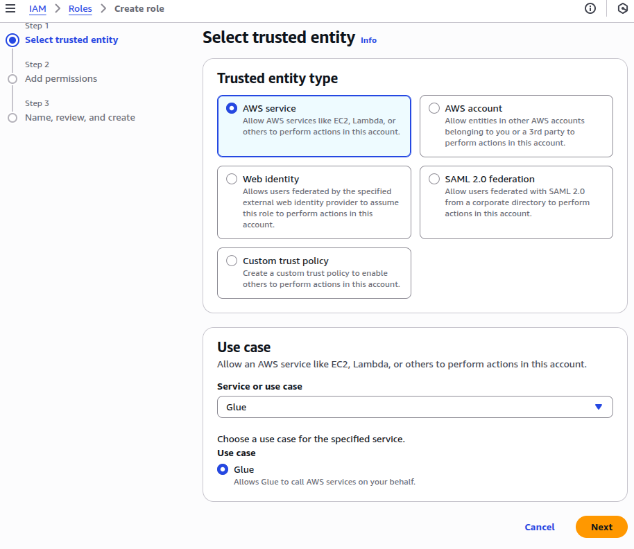

**STEP 3:**<br>
- In the permission policies page search for glue related permissions
- There you need to check AWSGlueServiceRole IAM policy 
- AWSGlueServiceRole is an AWS managed IAM policy designed for: Allowing AWS Glue to run jobs, crawlers, and workflows. It gives Glue the basic permissions it needs to function properly.
    - This allows:
        - Creating tables
        - Updating metadata
        - Managing crawlers
        - Reading the data catalog

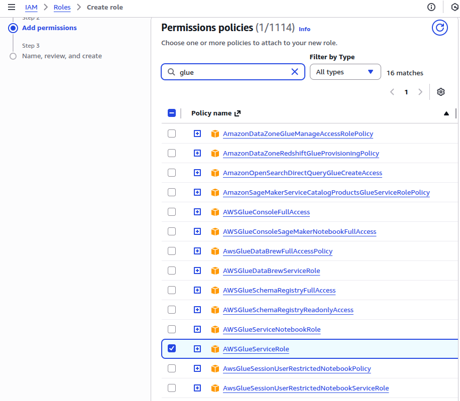

**STEP 4:** <br>
- Now in permissions policies page I need to search for s3
- There from the list select AmazonS3FullAccess
- AmazonS3FullAccess is an AWS managed IAM policy that grants full administrative access to all Amazon S3 resources in your account.
    - Whoever has this policy can do anything in S3.
    - For learning purposes and to keep things simple I am going to use this policy.
    - It is not at all recommended to use this AmazonS3FullAccess policy in the production environment since it can compromise the data sitting in the S3 in the event if the security key gets leaked.
    - You should always use your custom policy and exactly define what permissions you want to give to crawler when performing operations in S3.

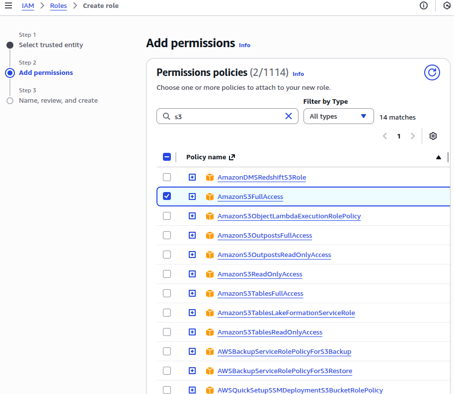

**STEP 5:**<br>
- Once you give appropriate permissions just hit next and in the next page you just have to give a name to the role and hit create and your new role will be created.

### How to register a table in AWS glue using AWS crawler?
**STEP 1:**<br>
Go to AWS glue and on the side panel you will find the option named crawlers press this opiton button. After pressing this button you will be greeted with the crawler page.

**STEP 2:**<br>
In this crawler page you will see create crawler button by pressing this button you will greeted with another screen create crawler page.

**STEP 3:**<br>
- In set crawler properties page give your crawler a name and hit next button

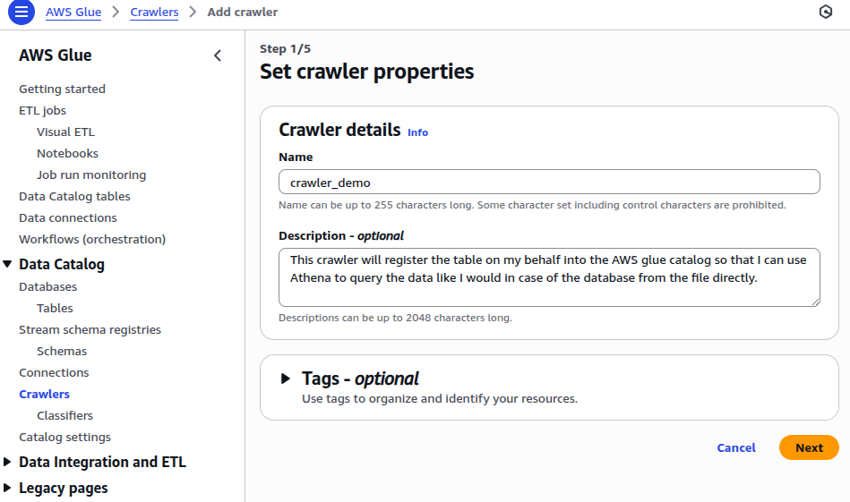

**STEP 4:**<br>
- Here in this page I have to set the data sources : Just click on ```add data sources``` button

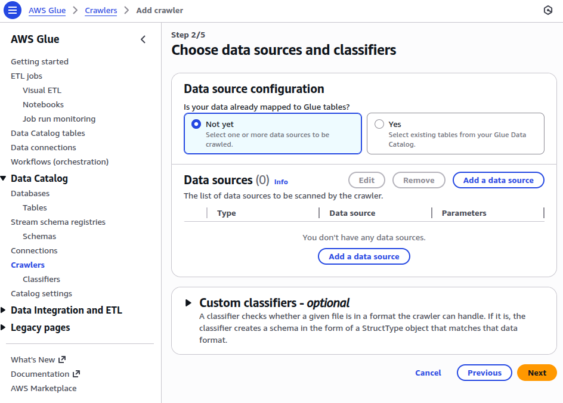

- A new ```add data sources``` pop up will open

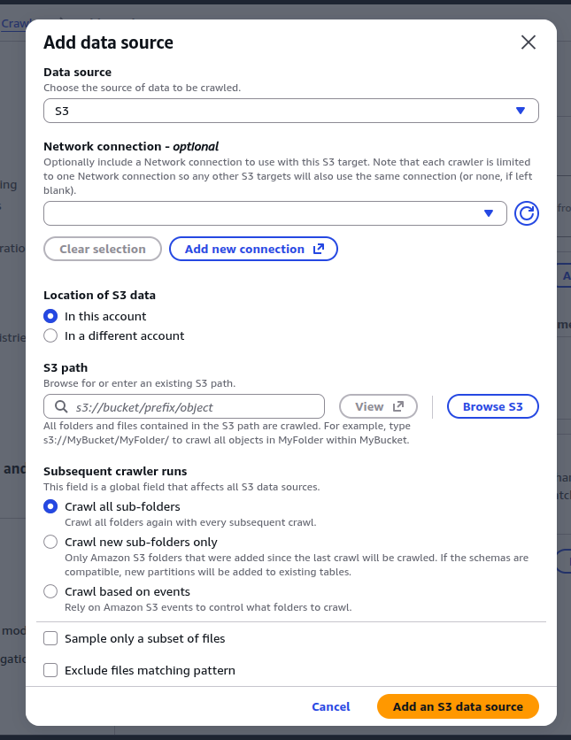

- Here in this add data sources pop up I am going to set S3 location and hit next after saving the S3 bucket location in that pop up.
- After hitting next you will be greeted with Configure security settings

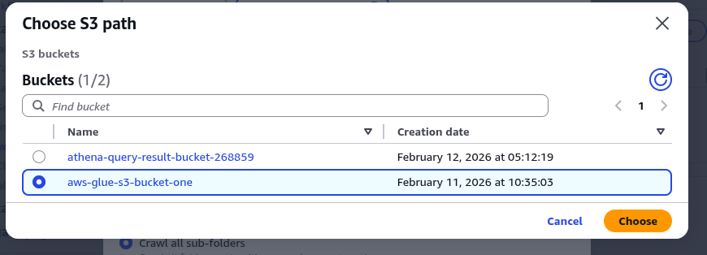

**STEP 5:**<br>
- In Configure security settings page you will have to attach the IAM role that you created earlier to this crawler.
- If you have not created the IAM role then this page will provide you with an option to create a new IAM role right then and there but in this case that role will only have the AWSGlueServiceRole permission and not AmazonS3FullAccess which if not carefull can cause problem down the line.

**STEP 6:**<br>
- Attach the database and tell the crawler what should be your table name even though it is optional and hit create.
- Your new crawler will be created and after creation hit run 
- After the successful run of the crawler the table will be created in AWS glue catalog.

#### **Error I faced when ingesting data from csv files using crawler** <br>
- In my case the table that it generated was not right for some reason It added the column names as col_1, col_2 etc.. and the actual column names were inserted as the first row in the table.
- 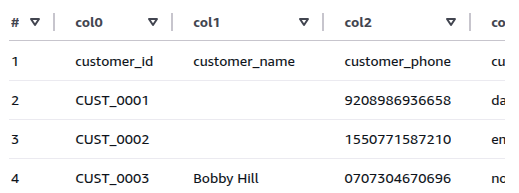
#### Solution : Error I faced when ingesting data from csv files using crawler
- The reason why the crawler when ingesting data from the csv file stored in S3 created a table where the actual column names were added in the first row instead of the header is because when creating crawler I forgot to create classifier for it.
- **How to create classifier for crawler?**
    - 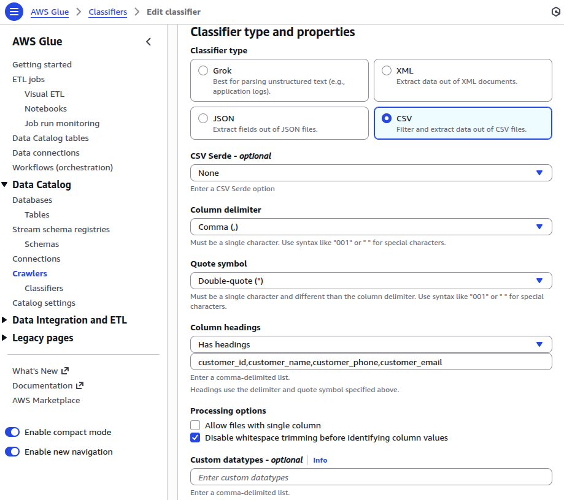
    - You need to configure your crawler's classifier depending on the type of file you want to ingest
    - Here in this case I am trying to register the table for my csv file using crawler hence I chose the options as shown in the picture above.
- One thing to note even after adding this crawler I was not able to get the proper results when I attempted to re-ingest a csv file after deleting its data from the s3 bucket manually where athena stores its query results. 
- The reason for it to happen is because if you crawled a file without any classifer attached to it and you attached the classifier after you crawled that file.
- The classifier will not be used even if you re-ingest that file after deleting all its data from the s3 bucket where athena stores its query result. 
- The only way is to delete the csv file from the source , delete the data where the query results are stored and then re-run the classifier.


## AWS Visual ETL
AWS Visual ETL is a blend of data factory and data flows. <br>
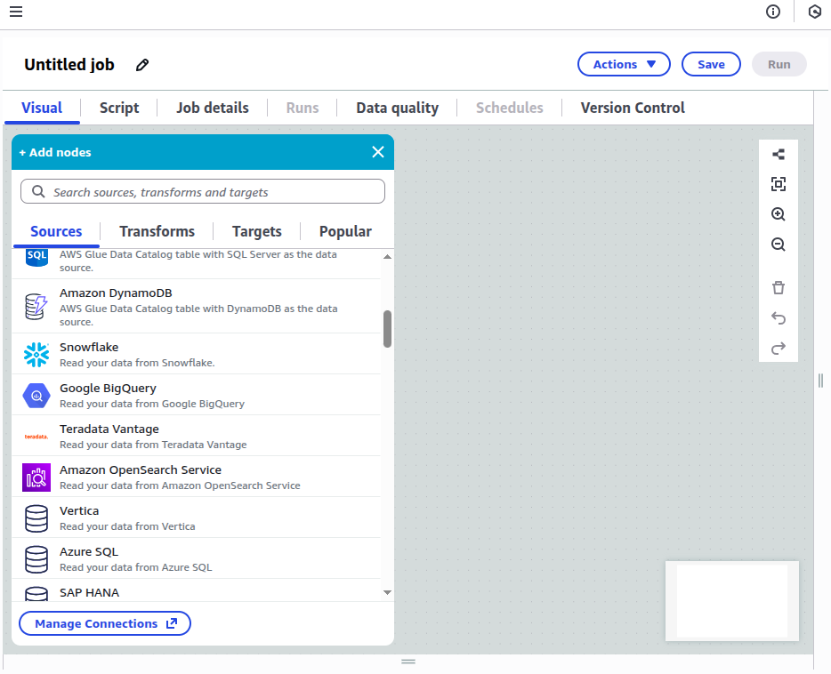

- This is the visual editor where you define your ETL jobs. This is visual ETL builder with No code philosophy. 
- Keep in mind eveything you do in this visual canvas there is a script behind it. The script is being generated behind the scene dynamically based on the componenets you choose and set in your ETL pipeline when desinging the ETL pipeline using this AWS visual ETL tool.
- In here we work with apache spark under the hood when using this tool using the low or no code philosophy.

### Nodes : 
Nodes are tasks that you add in your AWS visual ETL job job.

AWS has created different connectors that allows us to pull data from different sources.

The first transformation in any data engineering pipeline is that you will have to apply drop duplicate transformation before anything else because one must not have duplicate values in the table. 

### Setting up version control for ETL pipeline
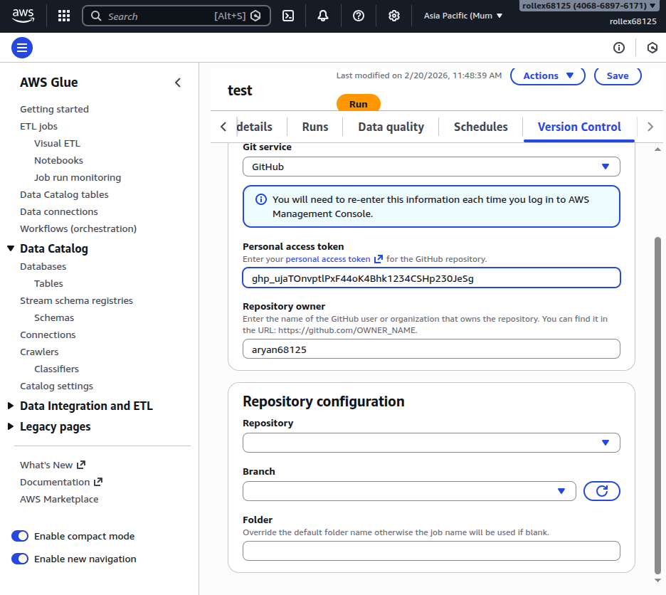
One thing to note is that when setting up your version control you must have a main branch and if you newly created a repository on github then your branch doesn't exists so you may get an error when trying to save the job.

To solve this issue you will have to create a file and push it into the repo the moment you do it the your AWS visual ETL version control tool automatically picks up the main branch hence you are now able to set a branch to which the code will be pushed to.


You will generally not have to set the version control related stuff in your pipeline you will simply create a new branch and set that branch to it but you should know it.


## How to trigger crawlers on file arrival?
### Architecture
```bash
S3 (new file)
   ↓  (Event notification)
Lambda
   ↓
Glue Crawler (StartCrawler API)
   ↓
Glue Data Catalog updated
   ↓
Athena ready
```

### Create an IAM role for Lambda function
For this I will be needing an IAM role with a custom policy. 
Policy that I require is this : 
```json
{
  "Version": "2012-10-17",
  "Statement": [
    {
      "Effect": "Allow",
      "Action": [
        "glue:StartCrawler",
        "glue:GetCrawler",
        "glue:StopCrawler"
      ],
      "Resource": "arn:aws:glue:ap-south-1:YOUR_ACCOUNT_ID:crawler/crawler_demo"
    }
  ]
}
```
along with this custom policy I will also be needing AmazonS3FullAccess policy provided my AWS

**STEP 1 :** 
- Create a custom policy which gives permissions to other AWS services (in this my Lambda function) to execute and run my AWS glue crawler. <br>
- Go to the side panel > policies > create policy
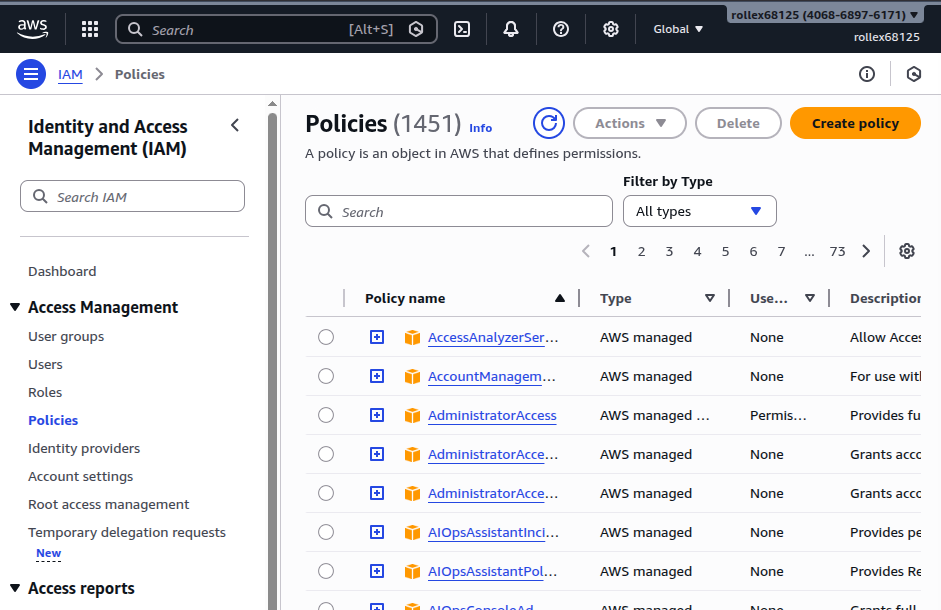

**STEP 2:** 
- Here in the create policy page you will see specify permissions section.
- Toggle from visual to JSON here you will have to paste this JSON code that will define your custom policy
```json
{
  "Version": "2012-10-17",
  "Statement": [
    {
      "Effect": "Allow",
      "Action": [
        "glue:StartCrawler",
        "glue:GetCrawler",
        "glue:StopCrawler"
      ],
      "Resource": "arn:aws:glue:ap-south-1:YOUR_ACCOUNT_ID:crawler/crawler_demo"
    }
  ]
}
```
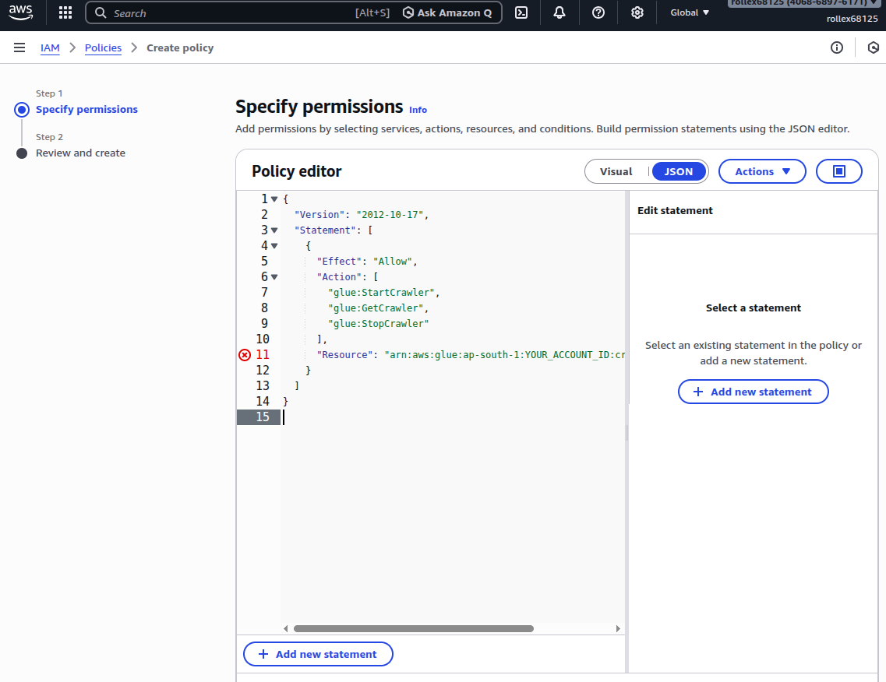

**STEP 3 :**
- In review and create page you will have to provide the policy name and description what your custom policy does 
- After that hit create policy button
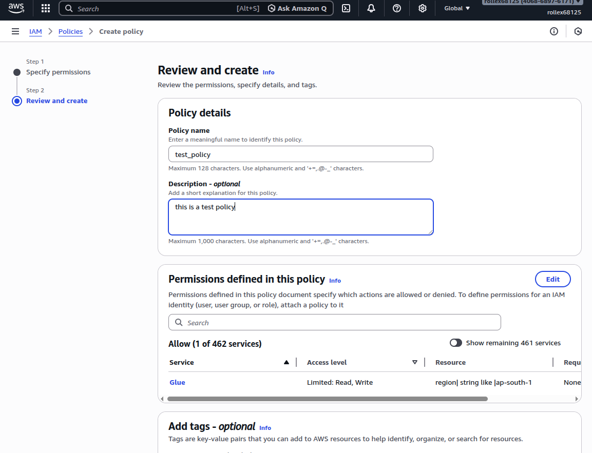

**STEP 4 :**
- After you have created your custom policy you will be able to search it using the name that you gave to your policy
- For demo purpose I have created a custom policy with a name called ```test_policy```
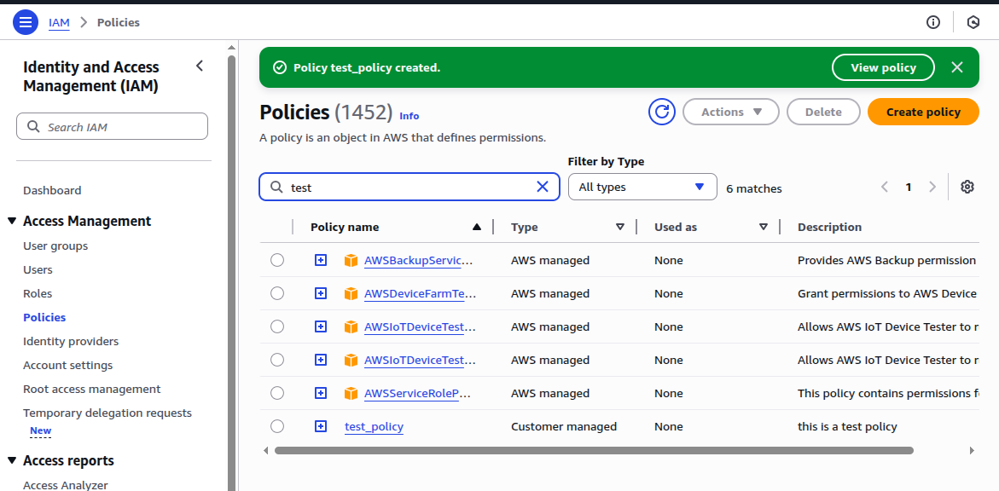

**NOTICE :** I have created a custom policy named ```AWSGlueCrawlerPermissionPolicy``` this is one of the policy that will be requiring by the IAM role that I will be attaching to my lambda function for it work properly and trigger my crawler when new files arrive in my S3 bucket.

**STEP 5:** 
- Now I am going to create a new IAM role.
- Go to the side panel > Roles > create role
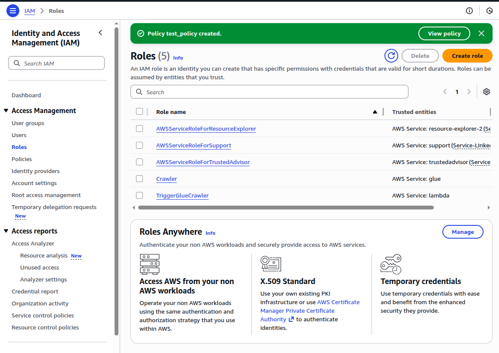

**STEP 6:**
- In Trusted entity type section here I will select AWS service 
- Under use case section I will select Lambda option and then hit next
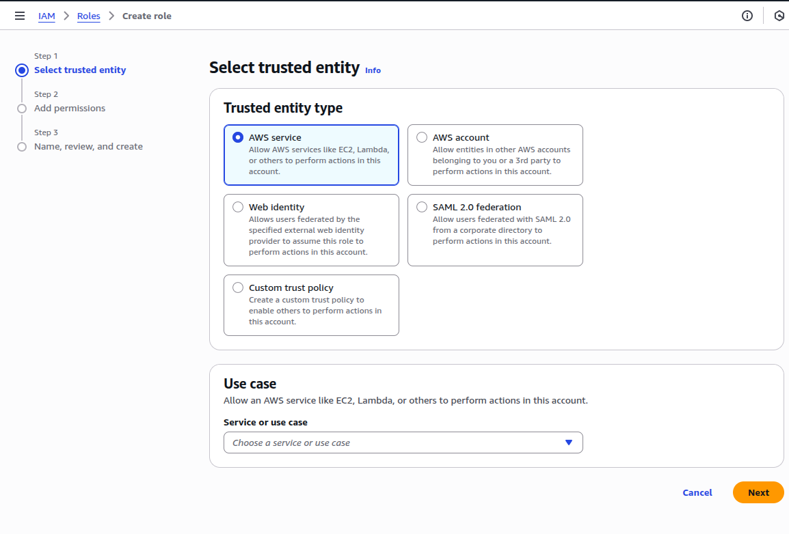

**STEP 7:** 
- In Add permissions page under permission policies section search for you custom policy that you created earlier in my case my custom policy name is ```AWSGlueCrawlerPermissionPolicy``` and then select that policy to be included in the IAM role that you are creating.
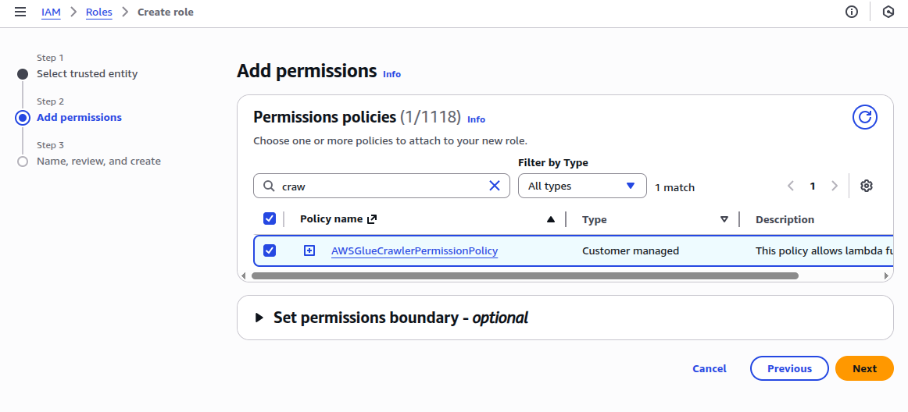
- Now you will have to search for ```s3``` You will have to add this ```AmazonS3FullAccess``` policy to your role
- After adding these two policies to your IAM role you can hit next
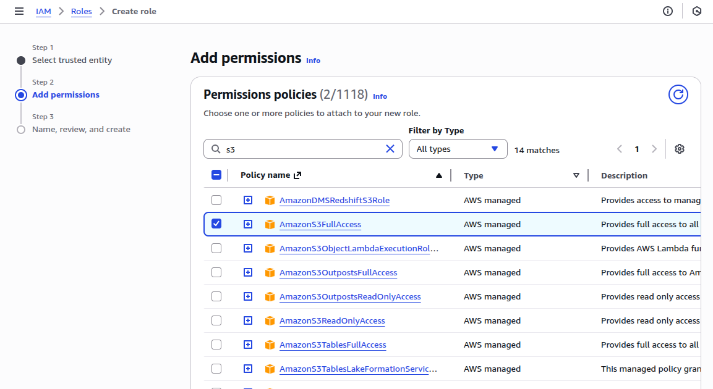

**STEP 8:**
- After hitting next you will be greeted to a page where you will have to provide the name and description of what this role does.
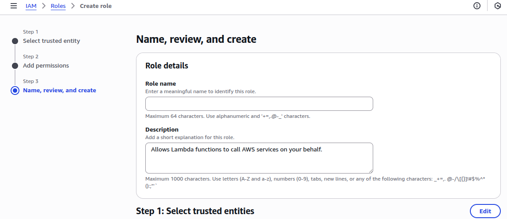

**NOTICE :** In my case I have already created a role with a name ```TriggerGlueCrawler``` for my lambda function where I have attached my custom policy and AmazonS3FullAccess policy and made sure that my lambda function has approprioate permissions to function as intended.

### Create a Lambda function
- After the IAM role for this Lambda function is created successfully I will now create the lambda function itself.
- This lambda function will be responsible for triggering my AWS glue crawler programatically using a python script when a new file arrives in the S3 bucket.

**STEP 1:**
- Go to Lambda function page my searching it in the search box
- Go to the side panel > Functions > Create functions page.
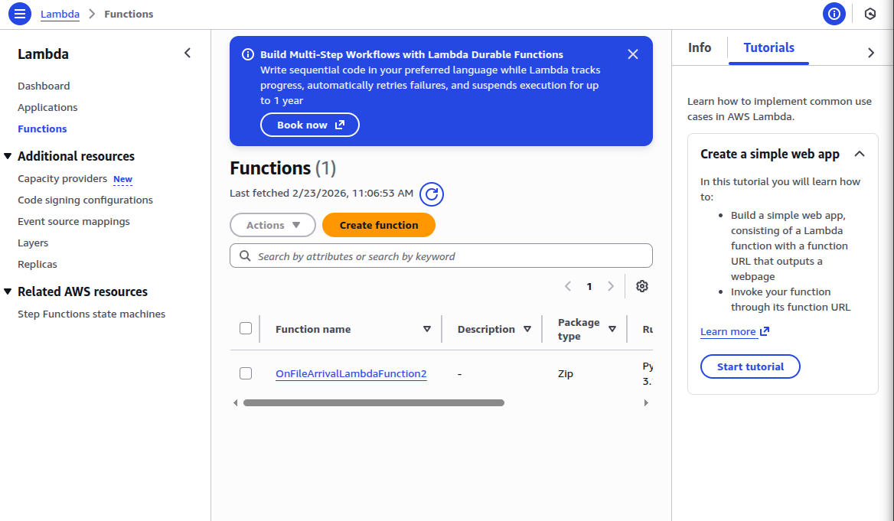

**STEP 2:**
- In this page provide function name 
- Select I will be selecting python as a runtime
- Make sure you don't select durable execution option otherwise your lambda function won't work without setting the destination.
- Under the change default execution role select the option ```Use existing role```
    - From the drop down menu select the role that you created earlier in my case the role that I created was ```TriggerGlueCrawler``` hence I will be selecting that.
- After this click on create function 
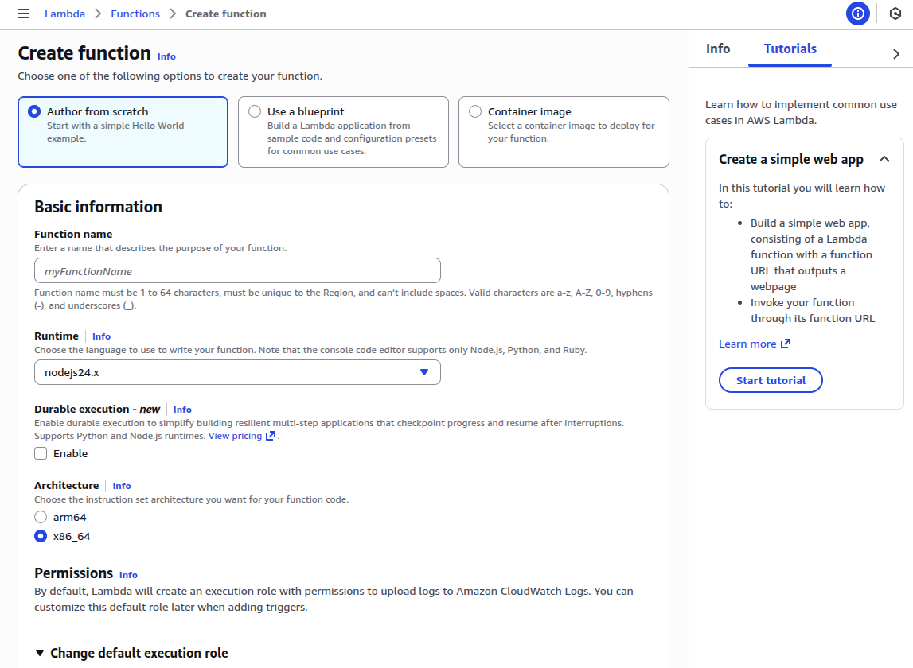

**STEP 3:**
- Write Lambda function in this page and click on deploy button after you have written your code to trigger the crawler service 
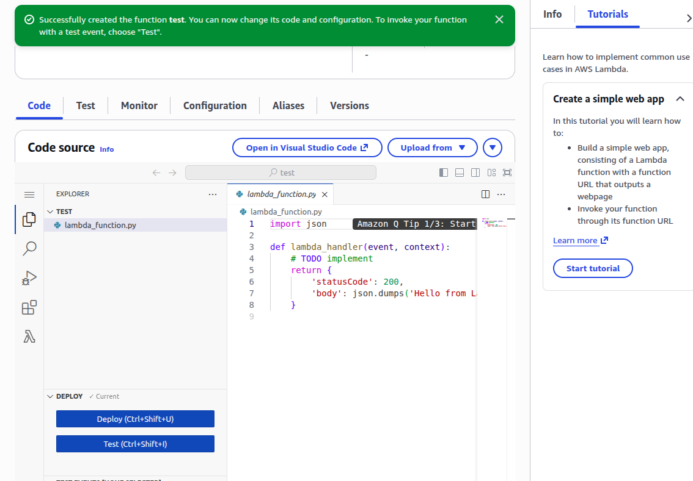
- This code below will start AWS glue crawler when this executes in Lambda function.
- After this click on create function button and your lambda function will be created
```python

import boto3

def lambda_handler(event, context):
    
    crawler_name = "customers_data_silver_table"
    glue = boto3.client('glue')
    
    crawler = glue.get_crawler(Name=crawler_name)
    
    state = crawler['Crawler']['State']
    
    if state == 'READY':
        glue.start_crawler(Name=crawler_name)
        return {
            'statusCode': 200,
            'body': f"Crawler {crawler_name} started."
        }
    else:
        return {
            'statusCode': 200,
            'body': f"Crawler already running."
        }
```

**STEP 4:** **Create an event Listner for S3 bucket**
- Now you will have to set the trigger for your lambda function 
- For this there are two options either you set the trigger by using the menu and options provided inside the lambda function itself or you can do it from S3 bucket
- I chose to attach the lambda function to an event (trigger) after creating it in the S3 bucket properties 
- Go to Amazon S3 > Buckets > properties
- Under the Event notifications menu you will see create event notification button click it to create a new event notification.
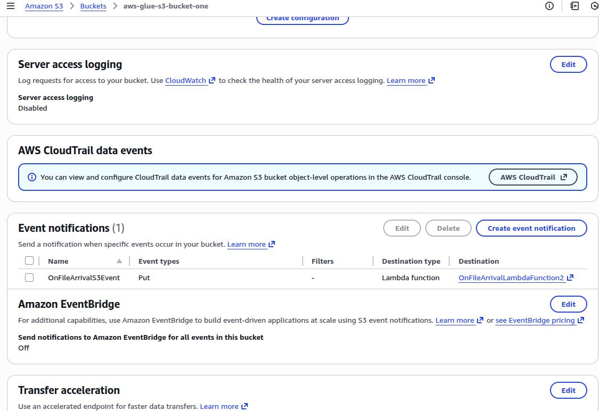

**STEP 5:** **Attach the previously created Lambda function to that S3 bucket event**
- After clicking the create event notification button you will be greeted with this page.
- In this page you need to provide your event name , set and configure the event types, and last but not least you will have to set the lambda function that you created just now to this s3 bucket event essentially tie this as a trigger to the lambda function
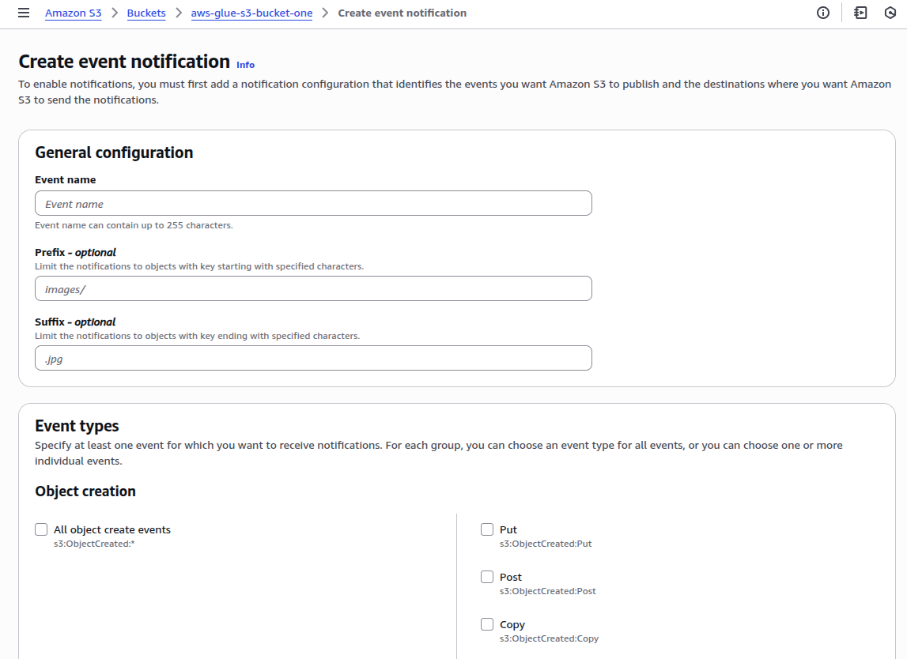
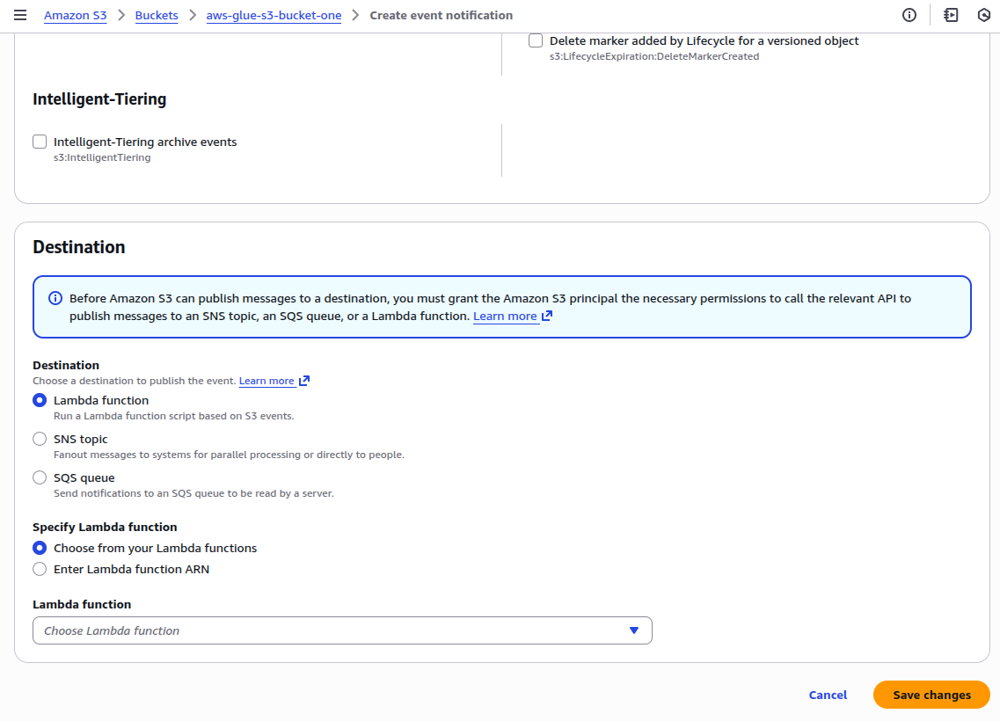

 **So how this works ?** <br>
- The moment my ETL pipeline reads the csv file from the ingestion s3 directory it processes the data and then creates parquet files in this S3 bucket. 
- The moment new parquet files arrive after a successfull ETL execution the S3 put event triggers the lambda function which has the python script to trigger the AWS glue crawler. 
- Which in turns creates metadata in AWS glue catalog using those parquet files and now the data in those files can be queried using AWS Athena using sql.

### Create an AWS glue crawler
**STEP 1:**
- Create a new crawler
- This crawler must crawl through a bunch of parquet files in AWS S3 bucket and register their metadata and create a table in AWS glue catalog. 
- This will give us the ability to use AWS Athena to query the data from the parquet file present in S3 bucket.
- Go to AWS glue > side bar > crawlers > create crawler
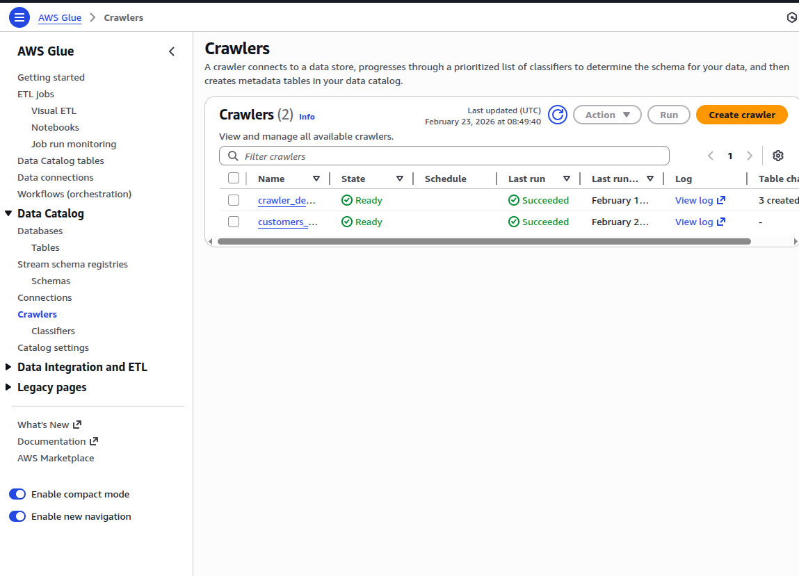

**STEP 2:**
- After you click create crawler button you will be greeted with this page.
- Here you will set the name and description for your crawler
- After that hit next
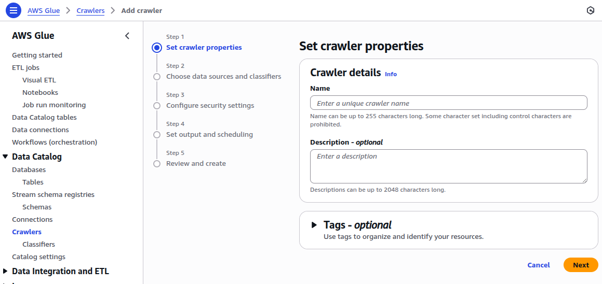

**STEP 3:**
- After you hit next you will be greeted with this page.
- Here in this page you will add the source where you will have to provide the details regarding your Source s3 bucket location and the folders inside it where the files exists.
- If you are registering the metadata of a table where the data is in csv file then you will have to compulsory create a classifier if you haven't already created one
- But here in this case since the files are in parquet format we don't have to set any classifier.
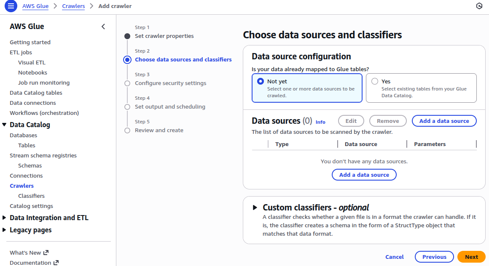

**STEP 4:**
- Here in this page you will have to attach an IAM role that will have appropriate policies attached to it and will allow the crawler to access S3 bucket and AWS glue catalog for it to be able to read the parquet file and register the metadata related to those files in AWS glue catalog so that Athena can use it to query data from those files using SQL.
- It is a best practice that you create your IAM role before hand 
- This IAM role must have ```AWSGlueServiceRole``` and ```AmazonS3FullAccess``` policies attached to it. 
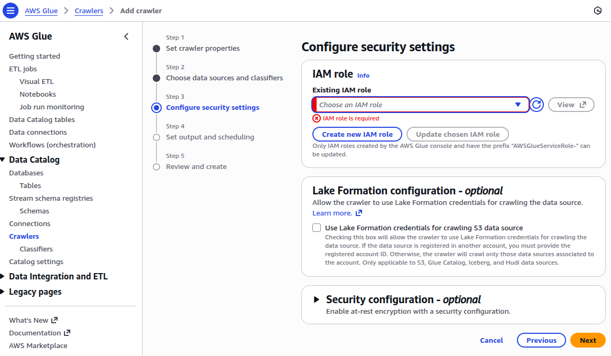

**STEP 5:**
- Here you will have to set the output and scheduling 
- Select the database that you created in your AWS glue catalog
- Inside the advanced options set how AWS must handle the table updates if the changes in schema occurs (schema evolution handling)
- Last but not least set the crawler shcedule I have set it to on demand.

## NOTE :
Here are some of the custom policies I experimented with and it worked like a charm hence I am including it here just in case if you need it

- **Create a policy that gives permission to a service to start and get glue crawler**
```json
{
    "Version": "2012-10-17",
    "Statement": [
        {
            "Effect": "Allow",
            "Action": [
                "glue:StartCrawler",
                "glue:GetCrawler"
            ],
            "Resource": "arn:aws:glue:ap-south-1:406868976171:crawler/RegisterParquetFiles"
        }
    ]
}
```
- **Create a policy to allow services to access glue visual ETL**
```json
{
    "Version": "2012-10-17",
    "Statement": [
        {
            "Effect": "Allow",
            "Action": "glue:StartJobRun",
            "Resource": "arn:aws:glue:ap-south-1:406868976171:job/Process_Sales_data"
        }
    ]
}
```
- **Create SQS policy to allow services to access SQS messages (This is not needed but I am mentioning it here just in case you want to go this route)**
```json
{
    "Version": "2012-10-17",
    "Statement": [
        {
            "Sid": "Statement1",
            "Effect": "Allow",
            "Action": [
                "sqs:ReceiveMessage",
                "sqs:DeleteMessage",
                "sqs:GetQueueAttributes",
                "sqs:ChangeMessageVisibility"
            ],
            "Resource": "arn:aws:sqs:ap-south-1:406868976171:S3FileArrivalQueue"
        }
    ]
}
```

## Incremental Load
- Suppose I have csv file named ```day1.csv``` file and on day 1 my glue pipeline ingested data from it.
- Then came day2 now there is another file ```day2.csv``` file and on day 2 my glue pipeline ran to ingest data from it but now along with the data in ```day2.csv``` file ```day1.csv``` file is also ingested.
- This is the default behaviour of AWS glue.
- This is not a desirable behaviour because this will cause unecessary data redundancy issue and will cause data management issues down in the long run as our data grows in size.
- In order to mitigate this issue we can use the option called Idempotency.
- Idempotancy means exactly once behaviour. We can achieve it using bookmarks.
- What a bookmark does is it keeps track of the data that has already been ingested by AWS glue visual ETL pipeline and makes sures that the ingestion process only runs for new files only.

### Implementing Incremental Load (Version 1)
- Things that I want to implement here:
    - Implement automatic visual ETL pipeline trigger when a new file arrives in S3 bucket automatically using Lambda function.
    - Then after ingestion again use Lambda funtion to register the data in AWS glue catalog so that we can use Athena to use SQL to query the data in parquet files prsent in the S3 bucket.
### Architectural diagram
```bash
                ┌─────────────────────────┐
                │     Upstream System     │
                └────────────┬────────────┘
                             │
                             ▼
                ┌─────────────────────────┐
                │   S3 Source Bucket      │
                │   (CSV Files)           │
                └────────────┬────────────┘
                             │  (PUT Event)
                             ▼
                ┌─────────────────────────┐
                │      Lambda Function    │
                │  (Start Glue Job)       │
                └────────────┬────────────┘
                             │
                             ▼
                ┌─────────────────────────┐
                │     Glue Visual ETL     │
                │  - Bookmark Enabled     │
                │  - Clean + Transform    │
                │  - Convert Types        │
                │  - Write Parquet        │
                └────────────┬────────────┘
                             │
                             ▼
                ┌─────────────────────────┐
                │   S3 Data Sink Bucket   │
                │     (Parquet Files)     │
                └────────────┬────────────┘
                             │
                             ▼
                ┌─────────────────────────┐
                │   Glue Data Catalog     │
                └────────────┬────────────┘
                             │
                             ▼
                ┌─────────────────────────┐
                │        Athena           │
                │      (SQL Queries)      │
                └─────────────────────────┘
```
### Preparing IAM roles for the services
**STEP 1:** Create an IAM role for Lambda function that starts AWS glue visual ETL pipeline to make sure that it has proper permissions to trigger AWS visual ETL pipeline when put event is triggered in source AWS S3 bucket.
- Create a custom policy for this IAM role. You are free to use the code below to attach it to the Role that you will be creating for this Lambda function.
- It gives appropriate permissions to allow the lambda function to trigger AWS glue visual ETL pipeline.
```json
{
  "Version": "2012-10-17",
  "Statement": [
    {
      "Effect": "Allow",
      "Action": "glue:StartJobRun",
      "Resource": "arn:aws:glue:REGION:ACCOUNT_ID:job/YOUR_GLUE_JOB_NAME"
    }
  ]
}
```
- Now attach this policy to the IAM role which will then be used by the lambda function that is going to trigger this AWS glue visual ETL when new files arrives in the source S3 bucket.

**STEP 2:** Create an IAM role for AWS glue 
- This role allows AWS glue to access S3 bucket and It also allows AWS Glue to run jobs, crawlers, and workflows.
- Here in this case we don't need to create a custom policy we can simply use AWS managed policies ```AWSGlueServiceRole``` 
    - For AWS access policy use this json instead to create a custom policy to allow glue to access source S3 securely
    ```json
        {
          "Version": "2012-10-17",
          "Statement": [
            {
              "Effect": "Allow",
              "Action": [
                "s3:GetObject",
                "s3:PutObject",
                "s3:ListBucket"
              ],
              "Resource": [
                "arn:aws:s3:::aws-glue-s3-bucket-one",
                "arn:aws:s3:::aws-glue-s3-bucket-one/*",
                "arn:aws:s3:::data-sink-one",
                "arn:aws:s3:::data-sink-one/*"
              ]
            }
          ]
        }
    ```
- Once this role is created we have to attach it to our AWS glue visual ETL job that we have created so that it has appropriate permissions to carry out its job properly.
### Create AWS glue visual ETL job
- This AWS glue visual ETL job is responsible for : 
    - Ingesting data from csv file
    - Cleaning data and converting columns that have numbers into double or integers from string data types accordingly, removing un-necessary symbols.
    - Saving the file in the parquet file in an output S3 bucket.
    - Last but not least this ETL must only read new files that arrive in S3 bucket and not the old ones that have already been processed.
- When saving the job 
    - It will ask you to attach the IAM role that you created without this it will not allow you to save your AWS glue visual ETL job so this is mandatory.
    - 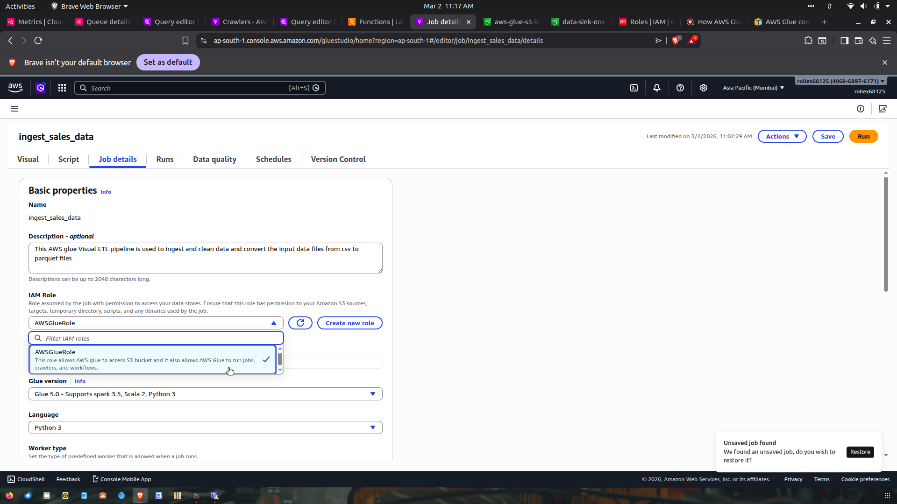
    - You must also set job bookmarks to enable so that ETL only reads new files and ignores older files in S3 that have already been processed when it gets triggered.
    - 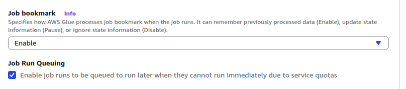
    - We are doing this to save us from un-necessary costing that happens when the files are re-processed even when it is not required. Its a waste of precious compute resources.
- Your AWS glue visual ETL pipeline should look something like this.
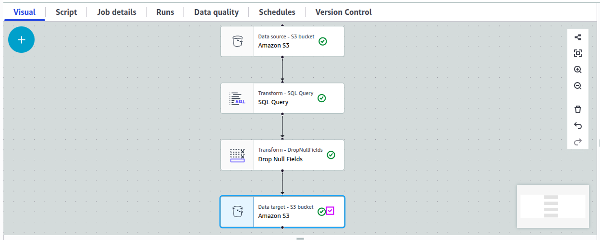
- Set data source S3 bucket (Setting up data ingestion node)
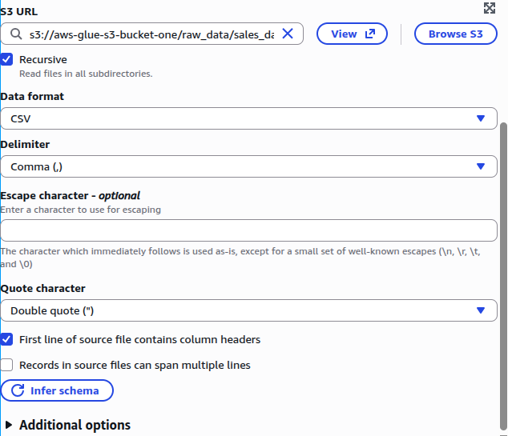
- Here I have used SQL node to clean data (Setting up data cleaning node)
```sql
    SELECT
        product_id,
        product_name,
        category,
        about_product,
        user_id,
        user_name,
        review_id,
        review_title,
        review_content,
        img_link,
        product_link,

        -- discounted_price: ₹149 → 149.0
        CAST(
            REGEXP_REPLACE(discounted_price, '[^0-9.]', '')
            AS DOUBLE
        ) AS discounted_price,

        -- actual_price: ₹1,000 → 1000.0
        CAST(
            REGEXP_REPLACE(actual_price, '[^0-9.]', '')
            AS DOUBLE
        ) AS actual_price,

        -- discount_percentage: 85% → 85.0
        CAST(
            REGEXP_REPLACE(discount_percentage, '[^0-9.]', '')
            AS DOUBLE
        ) AS discount_percentage,

        -- rating: 3.9 → 3.9
        CAST(
            REGEXP_REPLACE(rating, '[^0-9.]', '')
            AS DOUBLE
        ) AS rating,

        -- rating_count: 24,871 → 24871
        CAST(
            REGEXP_REPLACE(rating_count, '[^0-9]', '')
            AS INT
        ) AS rating_count

    FROM myDataSource;
```
- Use Drop Null Fields node to drop the rows that have all the columns as null (This is a pre-build node provided by AWS)
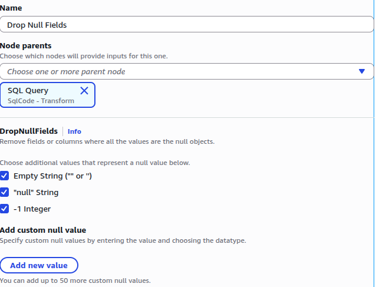
- Set the target to be an S3 bucket using data target S3 bucket node 
    - Here you will have to set the file format in which you want to get output into. The best option to go with is parquet format since it has the actual data along with the table's metadata inside of it. 
    - In the data catalog options if you want your visual ETL pipeline to automatically register the table in AWS glue catalog so that you can use athena to query the table then you will have to go with this option ```Create a table in the Data Catalog and on subsequent runs, keep existing schema and add new partitions```
        - We want to prevent schema changing on its own. We would rather want our pipeline to fail than to cause issues as listed below:
            - Senario 1 the data type of a column changes then 
                - Athena queries may fail
                - Downstream dashboards break
                - BI tools complain
                - Historical partitions may mismatch types
            - Senario 2 Column is removed 
                - Older partitions still have that column but the new one's won't hence again breaking the downstream services that depeneds on that particular column
                - Athena behaves inconsistently
            - Senario 3 A new column is added
                - This one is usually safe — but even then, you should manage schema intentionally.
    - 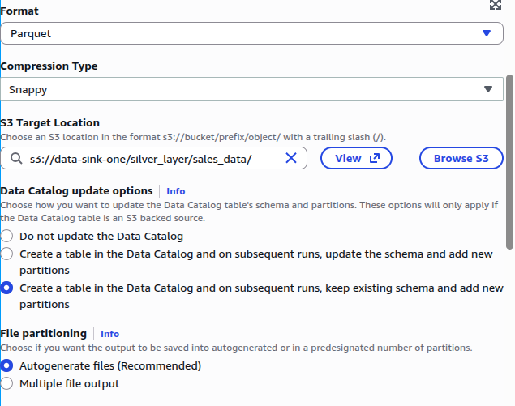
    - Next you will have to set the database that you must have created in AWS glue data catalog
    - Then you will have to set the table name 
    - Add partition key if you think its needed
    - 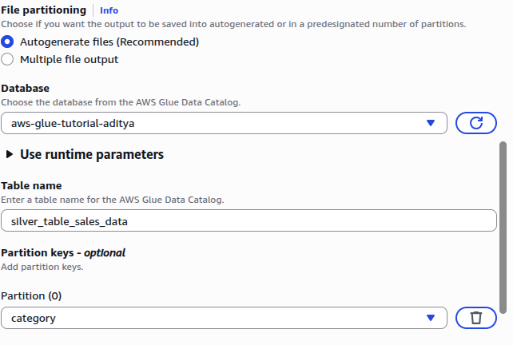
- This is the generated script from the visual ETL pipeline 
```python
    import sys
    from awsglue.transforms import *
    from awsglue.utils import getResolvedOptions
    from pyspark.context import SparkContext
    from awsglue.context import GlueContext
    from awsglue.job import Job
    from awsglue.gluetypes import *
    from awsgluedq.transforms import EvaluateDataQuality
    from awsglue import DynamicFrame

    def sparkSqlQuery(glueContext, query, mapping, transformation_ctx) -> DynamicFrame:
        for alias, frame in mapping.items():
            frame.toDF().createOrReplaceTempView(alias)
        result = spark.sql(query)
        return DynamicFrame.fromDF(result, glueContext, transformation_ctx)
    def _find_null_fields(ctx, schema, path, output, nullStringSet, nullIntegerSet, frame):
        if isinstance(schema, StructType):
            for field in schema:
                new_path = path + "." if path != "" else path
                output = _find_null_fields(ctx, field.dataType, new_path + field.name, output, nullStringSet, nullIntegerSet, frame)
        elif isinstance(schema, ArrayType):
            if isinstance(schema.elementType, StructType):
                output = _find_null_fields(ctx, schema.elementType, path, output, nullStringSet, nullIntegerSet, frame)
        elif isinstance(schema, NullType):
            output.append(path)
        else:
            x, distinct_set = frame.toDF(), set()
            for i in x.select(path).distinct().collect():
                distinct_ = i[path.split('.')[-1]]
                if isinstance(distinct_, list):
                    distinct_set |= set([item.strip() if isinstance(item, str) else item for item in distinct_])
                elif isinstance(distinct_, str) :
                    distinct_set.add(distinct_.strip())
                else:
                    distinct_set.add(distinct_)
            if isinstance(schema, StringType):
                if distinct_set.issubset(nullStringSet):
                    output.append(path)
            elif isinstance(schema, IntegerType) or isinstance(schema, LongType) or isinstance(schema, DoubleType):
                if distinct_set.issubset(nullIntegerSet):
                    output.append(path)
        return output

    def drop_nulls(glueContext, frame, nullStringSet, nullIntegerSet, transformation_ctx) -> DynamicFrame:
        nullColumns = _find_null_fields(frame.glue_ctx, frame.schema(), "", [], nullStringSet, nullIntegerSet, frame)
        return DropFields.apply(frame=frame, paths=nullColumns, transformation_ctx=transformation_ctx)

    args = getResolvedOptions(sys.argv, [
        'JOB_NAME'])

    sc = SparkContext()
    glueContext = GlueContext(sc)
    spark = glueContext.spark_session
    job = Job(glueContext)
    job.init(args['JOB_NAME'], args)

    # Default ruleset used by all target nodes with data quality enabled
    DEFAULT_DATA_QUALITY_RULESET = """
        Rules = [
            ColumnCount > 0
        ]
    """

    # Script generated for node Raw data source S3
    RawdatasourceS3_node1772431168408 = glueContext.create_dynamic_frame.from_options(format_options={"quoteChar": "\"", "withHeader": True, "separator": ",", "optimizePerformance": False}, connection_type="s3", format="csv", 
        connection_options={"paths": ["s3://aws-glue-s3-bucket-one/raw_data/sales_data/"], "recurse": True}, 
        transformation_ctx="RawdatasourceS3_node1772431168408")

    # Script generated for node SQL Query
    SqlQuery61 = '''
    SELECT
        product_id,
        product_name,
        category,
        about_product,
        user_id,
        user_name,
        review_id,
        review_title,
        review_content,
        img_link,
        product_link,

        -- discounted_price: ₹149 → 149.0
        CAST(
            REGEXP_REPLACE(discounted_price, '[^0-9.]', '')
            AS DOUBLE
        ) AS discounted_price,

        -- actual_price: ₹1,000 → 1000.0
        CAST(
            REGEXP_REPLACE(actual_price, '[^0-9.]', '')
            AS DOUBLE
        ) AS actual_price,

        -- discount_percentage: 85% → 85.0
        CAST(
            REGEXP_REPLACE(discount_percentage, '[^0-9.]', '')
            AS DOUBLE
        ) AS discount_percentage,

        -- rating: 3.9 → 3.9
        CAST(
            REGEXP_REPLACE(rating, '[^0-9.]', '')
            AS DOUBLE
        ) AS rating,

        -- rating_count: 24,871 → 24871
        CAST(
            REGEXP_REPLACE(rating_count, '[^0-9]', '')
            AS INT
        ) AS rating_count

    FROM myDataSource;
    '''
    SQLQuery_node1772431252856 = sparkSqlQuery(glueContext, query = SqlQuery61, mapping = {"myDataSource":RawdatasourceS3_node1772431168408}, transformation_ctx = "SQLQuery_node1772431252856")

    # Script generated for node Drop Null Fields
    DropNullFields_node1772431857999 = drop_nulls(glueContext, frame=SQLQuery_node1772431252856, nullStringSet={"", "null"}, nullIntegerSet={-1}, transformation_ctx="DropNullFields_node1772431857999")

    # Script generated for node Silver layer data sink S3
    EvaluateDataQuality().process_rows(frame=DropNullFields_node1772431857999, ruleset=DEFAULT_DATA_QUALITY_RULESET, publishing_options={"dataQualityEvaluationContext": "EvaluateDataQuality_node1772428328053", "enableDataQualityResultsPublishing": True}, additional_options={"dataQualityResultsPublishing.strategy": "BEST_EFFORT", "observations.scope": "ALL"})
    SilverlayerdatasinkS3_node1772432020219 = glueContext.getSink(path="s3://data-sink-one/silver_layer/sales_data/", connection_type="s3", updateBehavior="LOG", partitionKeys=["category"], enableUpdateCatalog=True, transformation_ctx="SilverlayerdatasinkS3_node1772432020219")
    SilverlayerdatasinkS3_node1772432020219.setCatalogInfo(catalogDatabase="aws-glue-tutorial-aditya",catalogTableName="silver_table_sales_data")
    SilverlayerdatasinkS3_node1772432020219.setFormat("glueparquet", compression="snappy")
    SilverlayerdatasinkS3_node1772432020219.writeFrame(DropNullFields_node1772431857999)
    job.commit()
```

### NOTE:
- During testing you may want to ingest the same file again and again but since you have set the bookmark checkbox to be true in your AWS glue visual ETL pipeline it will not read the same file twice 
- In order to solve this problem you have the capability to reset bookmark for your visual ETL pipeline 
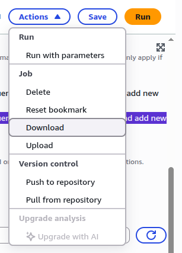

### Start AWS glue visual ETL automatically
- Right now I have to manually run AWS glue visual ETL pipeline 
- I want to automate this process 
    - I want the pipeline to only run when a new csv file arrives in the source S3 bucket.
- One of the ways we can do this is utilizing a Lambda function that triggers this pipeline when a new file arrives in the source S3 bucket

**STEP 1:**
- First we have to create a role for our lambda function with appropirate policies attached to it
- 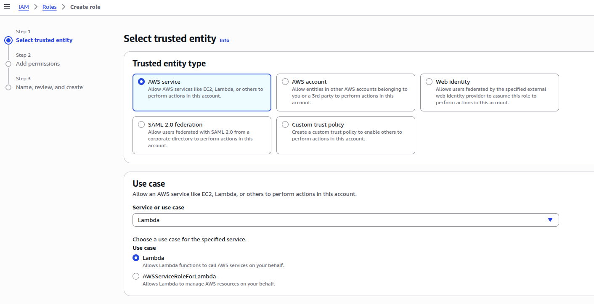
- Create a policy with this rule
```json
{
    "Version": "2012-10-17",
    "Statement": [
        {
            "Effect": "Allow",
            "Action": "glue:StartJobRun",
            "Resource": "arn:aws:glue:ap-south-1:406868976171:job/ingest_sales_data"
        }
    ]
}
```
- Attach that policy to this IAM role 
- You will also need to attach this ```AWSLambdaBasicExecutionRole``` policy so that lambda function could actually write logs to cloudwatch service.

**STEP 2:** 
- Create a lambda function to trigger AWS glue visual ETL pipeline 
- First we have to set the name for our Lambda function
- Choose the runtime (your preferred programming language) 
- Select the architecture you want to use on which your lambda function will run on
- 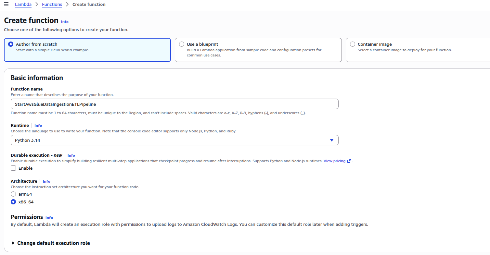
- Attach IAM role to this Lambda function in order to make sure that it has permission to actually start AWS glue visual ETL pipeline 
- 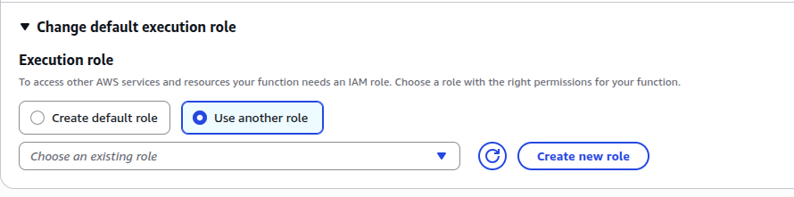
- Write the code to trigger ETL pipeline in glue for your lambda function here in this page
- 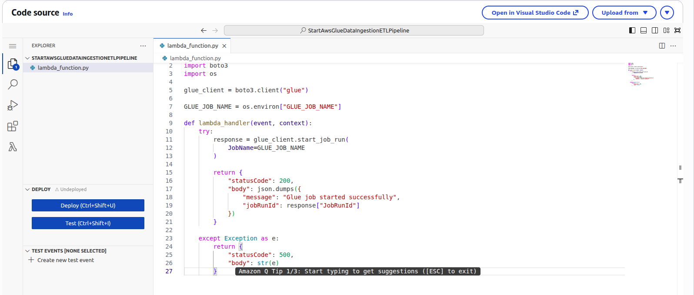
- Set Lambda Environment Variable
- 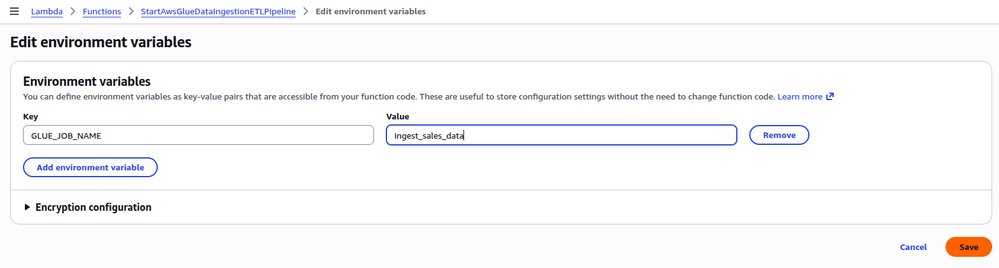
- here is the lambda function code 
```python
    import json
    import boto3
    import os

    glue_client = boto3.client("glue")

    GLUE_JOB_NAME = os.environ["GLUE_JOB_NAME"]

    def lambda_handler(event, context):
        try:
            response = glue_client.start_job_run(
                JobName=GLUE_JOB_NAME
            )

            return {
                "statusCode": 200,
                "body": json.dumps({
                    "message": "Glue job started successfully",
                    "jobRunId": response["JobRunId"]
                })
            }

        except Exception as e:
            return {
                "statusCode": 500,
                "body": str(e)
            }
```


**STEP 3:** 
- Create an event notification in the source S3 bucket where the files are dumped by the upstream applications/services and attached the lambda function that you created earlier to this event
- 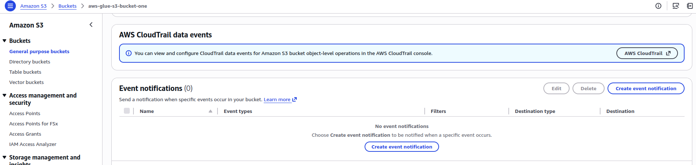
- Set the event name and event type 
    - Here I have set the event type to be of PUT type
    - The PUT type event detects if a new object is created in S3 bucket if yes then it will trigger the lambda function which has the code to start the AWS glue visual ETL pipeline 
- 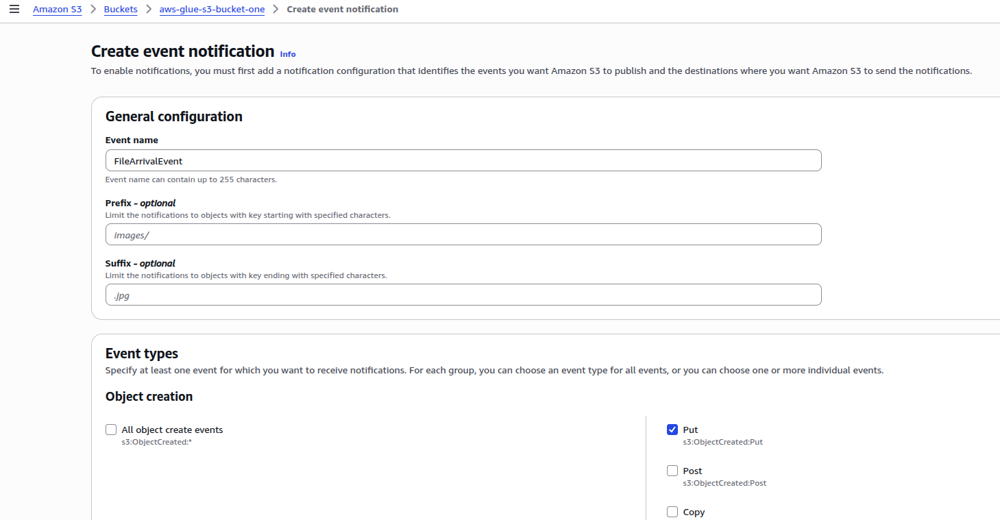
- In the same page if you scroll down you will find the options to attach a lambda function that you created earlier to this event 
- 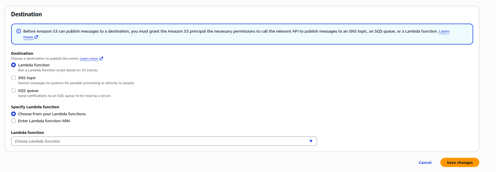

### Implementing Incremental Load (make this implementation production ready)
In order to make incremental load pipeline production ready there few things I need to implement

#### Proposed architecture for this implementation
```bash
                              ┌──────────────────────────┐
                              │     Upstream System      │
                              │  (Apps / APIs / Batch)   │
                              └──────────────┬───────────┘
                                             │
                                             ▼
                              ┌──────────────────────────┐
                              │   S3 RAW Landing Zone    │
                              │  (Versioning Enabled)    │
                              └──────────────┬───────────┘
                                             │
                                (S3 PUT Event Notification)
                                             │
                                             ▼
                              ┌──────────────────────────┐
                              │     EventBridge Rule     │
                              └──────────────┬───────────┘
                                             │
                                             ▼
                              ┌──────────────────────────┐
                              │        Lambda Trigger    │
                              │ - Extract bucket/key     │
                              │ - Validate event         │
                              │ - Idempotency check      │
                              │ - Write metadata record  │
                              └──────────────┬───────────┘
                                             │
                           ┌─────────────────┴──────────────────┐
                           ▼                                    ▼
              ┌──────────────────────┐              ┌──────────────────────┐
              │ DynamoDB Metadata    │              │    SQS (DLQ)         │
              │ - File processed?    │              │ - Failed events      │
              │ - Status tracking    │              │ - Replay capability  │
              └──────────────────────┘              └──────────────────────┘
                                             │
                                             ▼
                              ┌──────────────────────────┐
                              │   Glue Visual ETL Job    │
                              │ - Bookmark Enabled       │
                              │ - File-level ingestion   │
                              │ - Schema enforcement     │
                              │ - Data quality rules     │
                              └──────────────┬───────────┘
                                             │
                                             ▼
                              ┌──────────────────────────┐
                              │   S3 SILVER Layer        │
                              │  (Partitioned Parquet)   │
                              └──────────────┬───────────┘
                                             │
                                             ▼
                              ┌──────────────────────────┐
                              │   Glue Data Catalog      │
                              │  (Schema Controlled)     │
                              └──────────────┬───────────┘
                                             │
                                             ▼
                              ┌──────────────────────────┐
                              │        Athena            │
                              │   (Analytics / BI)       │
                              └──────────────────────────┘
```

- **Right now I have attached the lambda function that starts visual ETL pipeline is directly attached to the event notification of the source S3 bucket**
    - This is not a reliable way to trigger Lambda functions 
    - S3 events notifications are:
        - At least once delivery
        - Can produce duplicate events
        - Can occasionally miss events (rare, but possible)
        - No ordering guarantees
    - So if 
        - 10 files at once or the same file is retired 
    - You might
        - Trigger glue twice for the same file
        - Process duplicate data
        - Overwrite partitions incorrectly
    - For small hobby pipelines --> Fine 
    - For production ingestion --> Risky
    - If 500 files arrive in 1 minute then S3 will invoke lambda function 500 times and Lambda function will try to start 500 glue jobs , Now you hit:
        - Glue concurrency limit
        - API throttling
        - Random failures
        - Partial ingestion
    - No replay capability:
        - You cannot easily replay missed events 
        - S3 does not perists event history for you 
    - Tight coupling
        - Right now bucket is tightly coupled to 
            - One Lambda function
            - One Glue job
        - If tomorrow 
            - I want to send the same event to another system
            - Or introduce validation
            - Or introduce duplication
            - I must rewrite everything and that's a brittle architecture
- What production Data platform do instead 
    - You can either use EventBridge
    - ```bash
        S3 → EventBridge → SQS → Lambda → Glue
        ```
    - Or your can use SQS directly removing EventBridge
    - ```bash
        S3
        ↓
        SQS (queue)
        ↓
        Lambda (polls queue)
        ↓
        Glue
        ```
    - I went with the EventBridge method 
    - Pros of using this architecture
        - Each layer is independent.
        - If tomorrow you want 
            - Another Lambda 
            - A step function
            - A montioring pipeline 
            - A metadata tracker 
        - You just add another EventBridge rule.
        - You don't need to touch S3 
    - Using SQS as the buffer
        - Amazon SQS gives you:
            - Persistent message storage.
            - Visibility timeout
            - Controlled retries 
            - Dead-Letter queue
        - If lambda fails:
            - Message becomes visible again
            - Gets retried 
            - After N retries --> Moves to DLQ
    - Replay capability
        - If something breaks 
            - Bad glue transformation
            - Schema issue 
            - Partition error
        - You can:
            - Reprocess DLQ messages 
            - Re-drive message from SQS
            - Manually replay failed ingestion
        - This is critical in production data systems . Without a queue replay is painful.
    - Backpressure & Concurrency Control
        - If 500 files arrive:
            - With SQS
                - Message wait safely
                - Lambda scales gradually
                - You can control:
                    - Batch size 
                    - max concurrency
                    - parallelism
                - You just introduced flow control into your ingestion
    - Event Filtering at the Platform Layer
        - Because I used:
            - I can filter events before they even hit SQS:
                - Only .csv files
                - Only raw/sales/ prefix
                - Ignore temp files
                - Ignore test uploads
            - That reduces noise and cost.
    - Clean Failure Isolation
        - If:
            - Glue API throttles 
            - Lambda fails 
            - Network hiccup happens
        - The event is safe inside SQS
    - Horizontal scalability
        - Add muliple Lambda consumers
        - Scale out ingestion
        - Process different datasets in parallel
    - This architecture scales horizontally
    - Observability & Monitoring
        - Now you can monitor 
            - SQS queue depth 
            - DLQ message count 
            - Lambda error rate
            - Glue job failures
        - If queue depth spikes:
            - Ingestion bottleneck
        - If DLQ grows 
            - Transformation bug

### Implementation steps (Version 2)
#### Create a DLQ
- A Dead Letter Queue is a special queue where messages are sent after they fail processing multiple times. It’s a safety net for failed events.
- Storing events in case of failure is necessary so that we can replay the ingestion pipeline after fixing the errors. Hence making sure that data is not lost silently

**STEP 1:** 
- Give your SQS a name and enable encryption
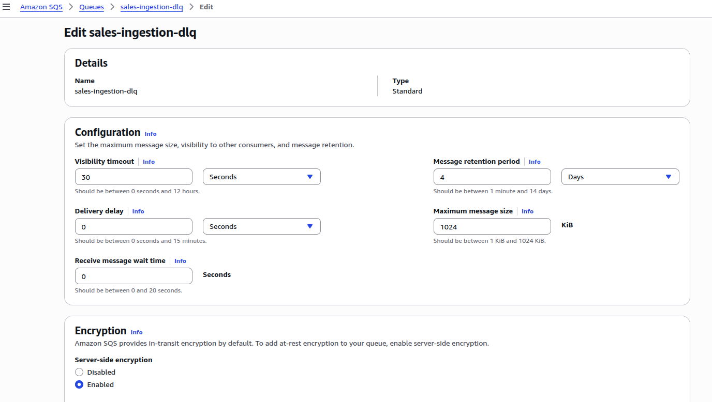
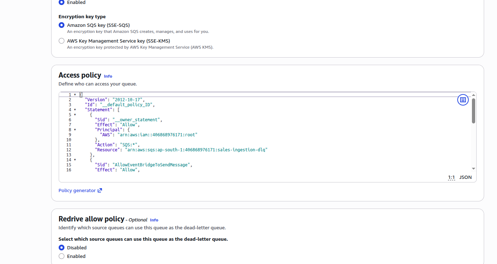
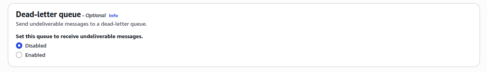
- This is the access policy I used:
```json
{
  "Version": "2012-10-17",
  "Id": "__default_policy_ID",
  "Statement": [
    {
      "Sid": "__owner_statement",
      "Effect": "Allow",
      "Principal": {
        "AWS": "arn:aws:iam::aws_account_id:root"
      },
      "Action": "SQS:*",
      "Resource": "arn:aws:sqs:ap-south-1:aws_account_id:sales-ingestion-dlq"
    },
    {
      "Sid": "AllowEventBridgeToSendMessage",
      "Effect": "Allow",
      "Principal": {
        "Service": "events.amazonaws.com"
      },
      "Action": "sqs:SendMessage",
      "Resource": "arn:aws:sqs:ap-south-1:aws_account_id:sales-ingestion-dlq",
      "Condition": {
        "ArnEquals": {
          "aws:SourceArn": "arn:aws:events:ap-south-1:aws_account_id:rule/ActivateLambdaFuncEventBridgeRules"
        }
      }
    },
    {
      "Sid": "AWSEvents_ActivateLambdaFuncEventBridgeRules_dlq_41c9320f-edd2-4fde-ad71-2985e68b1d7c",
      "Effect": "Allow",
      "Principal": {
        "Service": "events.amazonaws.com"
      },
      "Action": "sqs:SendMessage",
      "Resource": "arn:aws:sqs:ap-south-1:aws_account_id:sales-ingestion-dlq",
      "Condition": {
        "ArnEquals": {
          "aws:SourceArn": "arn:aws:events:ap-south-1:aws_account_id:rule/ActivateLambdaFuncEventBridgeRules"
        }
      }
    }
  ]
}
```
- Now in the event of failure the event messages won't be lost instead it will saved here in this SQS named ```sales-ingestion-dlq``` 
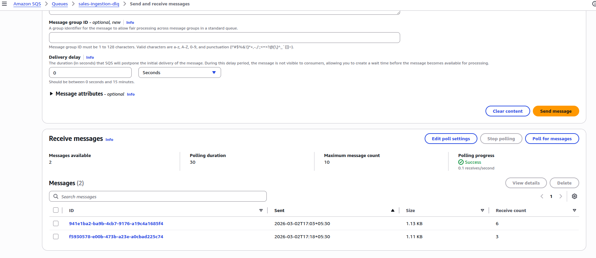

#### Configuring S3 bucket for EventBridge
- Here If you have any pre-configured Event notification in your S3 bucket then delete it We don't need it anymore. 
- Instead turn on the Amazon event bridge option, this is present just below the event notification option in the properties tab of the S3 bucket.
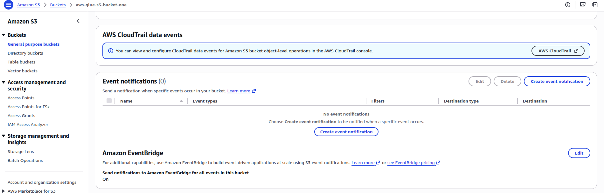

#### Create an ETL pipeline

**STEP 1:**
- Create a role that has policies with appropriate permissions for AWS glue catalog so that it can perform its actions properly without any security risk
- Create a custom policy named ```LimitedS3PermissionPolicy```
```json
    {
        "Version": "2012-10-17",
        "Statement": [
            {
                "Effect": "Allow",
                "Action": [
                    "s3:GetObject",
                    "s3:PutObject",
                    "s3:ListBucket"
                ],
                "Resource": [
                    "arn:aws:s3:::aws-glue-s3-bucket-one",
                    "arn:aws:s3:::aws-glue-s3-bucket-one/*",
                    "arn:aws:s3:::data-sink-one",
                    "arn:aws:s3:::data-sink-one/*"
                ]
            }
        ]
    }
```
- Create a Role named ```AWSGlueRole```
- Attach policies to this role 
    - attach ```LimitedS3PermissionPolicy``` custom policy
    - attach aws managed policy named ```AWSGlueServiceRole```

**STEP 2:**
- In this you will have to attach a role to your Glue visual ETL pipeline 
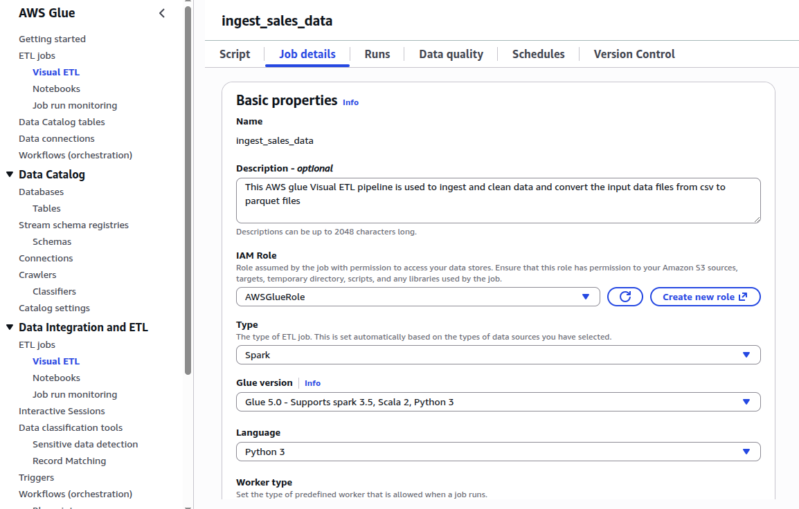
- Now you will have to set here 
    - Enable bookmarks to make sure only new files are processed and old files are ignored
    - Enable job queue
    - Enable job insights
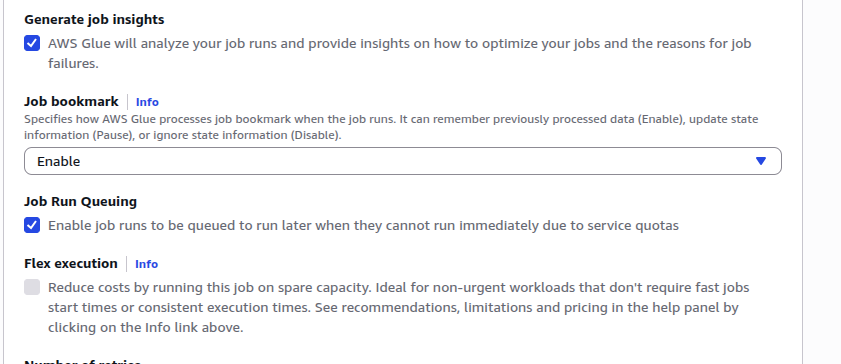


**STEP 3:**
- This is the code for the ETL pipeline 
- This ETL pipeline ingest data in form of csv file from a source S3 bucket
- It removes the rows that has all the values in its columns set as null
- It then transforms the data in a column into its appropriate datatype. The reason I had to do this is because in csv file all the columns wheather it has data in numbers are of string datatype.
- It then register the metadata in the AWS glue catalog after the actual data is stored in parquet files in the target S3. It is to make sure that the data can be queried from those output parquet files using Athena.
- ```python
    args = getResolvedOptions(sys.argv, [
        'JOB_NAME',
        'source_bucket',
        'source_key'
    ])

    source_bucket = args['source_bucket']
    source_key = args['source_key']
    ```
    - This code accepts the arguments related to bucket and the recently PUT object key that is passed on to AWS glue ETL pipeline by Lambda function that has invoked it when the PUT event happened
- ```python
    connection_options={"paths": [f"s3://{source_bucket}/{source_key}"],"recurse": False},
    ```
    - This line is very important when it comes to optimization 
    - In the earlier version my ETL pipeline was scanning the whole folder everytime it was invoked by lambda function but now it only scans the file that has arrived in the S3 hence saving precious compute. As a result we are able to save cost.
    - If three files are uploaded to S3 then for each file three events will be generated then those three events will actiavte three lambda functions which will be invoking three separate glue visual ETL pipelines. These pipelines will then execute one by one 
- Below is the complete ETL pipeline python code 
- ```python
    import sys
    from awsglue.transforms import *
    from awsglue.utils import getResolvedOptions
    from pyspark.context import SparkContext
    from awsglue.context import GlueContext
    from awsglue.job import Job
    from awsglue.gluetypes import *
    from awsgluedq.transforms import EvaluateDataQuality
    from awsglue import DynamicFrame

    def sparkSqlQuery(glueContext, query, mapping, transformation_ctx) -> DynamicFrame:
        for alias, frame in mapping.items():
            frame.toDF().createOrReplaceTempView(alias)
        result = spark.sql(query)
        return DynamicFrame.fromDF(result, glueContext, transformation_ctx)
    def _find_null_fields(ctx, schema, path, output, nullStringSet, nullIntegerSet, frame):
        if isinstance(schema, StructType):
            for field in schema:
                new_path = path + "." if path != "" else path
                output = _find_null_fields(ctx, field.dataType, new_path + field.name, output, nullStringSet, nullIntegerSet, frame)
        elif isinstance(schema, ArrayType):
            if isinstance(schema.elementType, StructType):
                output = _find_null_fields(ctx, schema.elementType, path, output, nullStringSet, nullIntegerSet, frame)
        elif isinstance(schema, NullType):
            output.append(path)
        else:
            x, distinct_set = frame.toDF(), set()
            for i in x.select(path).distinct().collect():
                distinct_ = i[path.split('.')[-1]]
                if isinstance(distinct_, list):
                    distinct_set |= set([item.strip() if isinstance(item, str) else item for item in distinct_])
                elif isinstance(distinct_, str) :
                    distinct_set.add(distinct_.strip())
                else:
                    distinct_set.add(distinct_)
            if isinstance(schema, StringType):
                if distinct_set.issubset(nullStringSet):
                    output.append(path)
            elif isinstance(schema, IntegerType) or isinstance(schema, LongType) or isinstance(schema, DoubleType):
                if distinct_set.issubset(nullIntegerSet):
                    output.append(path)
        return output

    def drop_nulls(glueContext, frame, nullStringSet, nullIntegerSet, transformation_ctx) -> DynamicFrame:
        nullColumns = _find_null_fields(frame.glue_ctx, frame.schema(), "", [], nullStringSet, nullIntegerSet, frame)
        return DropFields.apply(frame=frame, paths=nullColumns, transformation_ctx=transformation_ctx)

    args = getResolvedOptions(sys.argv, [
        'JOB_NAME',
        'source_bucket',
        'source_key'
    ])

    source_bucket = args['source_bucket']
    source_key = args['source_key']

    sc = SparkContext()
    glueContext = GlueContext(sc)
    spark = glueContext.spark_session
    job = Job(glueContext)
    job.init(args['JOB_NAME'], args)

    # Default ruleset used by all target nodes with data quality enabled
    DEFAULT_DATA_QUALITY_RULESET = """
        Rules = [
            ColumnCount > 0
        ]
    """

    # Script generated for node Raw data source S3
    RawdatasourceS3_node1772431168408 = glueContext.create_dynamic_frame.from_options(format_options={"quoteChar": "\"", "withHeader": True, "separator": ",", "optimizePerformance": False}, connection_type="s3", format="csv", 
        # connection_options={"paths": ["s3://aws-glue-s3-bucket-one/raw_data/sales_data/"], "recurse": True}, 
        connection_options={"paths": [f"s3://{source_bucket}/{source_key}"],"recurse": False},
        transformation_ctx="RawdatasourceS3_node1772431168408")
    # for debugging only
    print(f"Glue Visual ETL | Processing file: s3://{source_bucket}/{source_key}")

    # Script generated for node SQL Query
    SqlQuery61 = '''
    SELECT
        product_id,
        product_name,
        category,
        about_product,
        user_id,
        user_name,
        review_id,
        review_title,
        review_content,
        img_link,
        product_link,

        -- discounted_price: ₹149 → 149.0
        CAST(
            REGEXP_REPLACE(discounted_price, '[^0-9.]', '')
            AS DOUBLE
        ) AS discounted_price,

        -- actual_price: ₹1,000 → 1000.0
        CAST(
            REGEXP_REPLACE(actual_price, '[^0-9.]', '')
            AS DOUBLE
        ) AS actual_price,

        -- discount_percentage: 85% → 85.0
        CAST(
            REGEXP_REPLACE(discount_percentage, '[^0-9.]', '')
            AS DOUBLE
        ) AS discount_percentage,

        -- rating: 3.9 → 3.9
        CAST(
            REGEXP_REPLACE(rating, '[^0-9.]', '')
            AS DOUBLE
        ) AS rating,

        -- rating_count: 24,871 → 24871
        CAST(
            REGEXP_REPLACE(rating_count, '[^0-9]', '')
            AS INT
        ) AS rating_count

    FROM myDataSource;
    '''
    SQLQuery_node1772431252856 = sparkSqlQuery(glueContext, query = SqlQuery61, mapping = {"myDataSource":RawdatasourceS3_node1772431168408}, transformation_ctx = "SQLQuery_node1772431252856")

    # Script generated for node Drop Null Fields
    DropNullFields_node1772431857999 = drop_nulls(glueContext, frame=SQLQuery_node1772431252856, nullStringSet={"", "null"}, nullIntegerSet={-1}, transformation_ctx="DropNullFields_node1772431857999")

    # Script generated for node Silver layer data sink S3
    EvaluateDataQuality().process_rows(frame=DropNullFields_node1772431857999, ruleset=DEFAULT_DATA_QUALITY_RULESET, publishing_options={"dataQualityEvaluationContext": "EvaluateDataQuality_node1772428328053", "enableDataQualityResultsPublishing": True}, additional_options={"dataQualityResultsPublishing.strategy": "BEST_EFFORT", "observations.scope": "ALL"})
    SilverlayerdatasinkS3_node1772432020219 = glueContext.getSink(path="s3://data-sink-one/silver_layer/sales_data/", connection_type="s3", updateBehavior="LOG", partitionKeys=["category"], enableUpdateCatalog=True, transformation_ctx="SilverlayerdatasinkS3_node1772432020219")
    SilverlayerdatasinkS3_node1772432020219.setCatalogInfo(catalogDatabase="aws-glue-tutorial-aditya",catalogTableName="silver_table_sales_data")
    SilverlayerdatasinkS3_node1772432020219.setFormat("glueparquet", compression="snappy")
    SilverlayerdatasinkS3_node1772432020219.writeFrame(DropNullFields_node1772431857999)
    job.commit()
    ```

#### Create a Lambda function 
- This Lambda function will trigger the Visual ETL pipeline

**STEP 1:**
- Create a role that gives appropirate access rights of the services to make sure that the lambda function works as intended.
- Create a custom policy named ```AWSGlueStartJobAccessPolicy```
    - Use this policy json 
    - ```json
            {
                "Version": "2012-10-17",
                "Statement": [
                    {
                        "Effect": "Allow",
                        "Action": "glue:StartJobRun",
                        "Resource": "arn:aws:glue:ap-south-1:406868976171:job/ingest_sales_data"
                    }
                ]
            }
        ```

- Create a role named ```TriggerAWSGlueVisualETLPipeline```
    - Attach this aws managed policy to it ```AWSLambdaBasicExecutionRole```
    - Attach this ```AWSGlueStartJobAccessPolicy``` custom policy that you made earlier to it 

**STEP 2:**
- Write the code 
- ```python
    # VERSION 2 : Works with Event Bridge and is Production READY
    import json
    import boto3
    import os

    glue_client = boto3.client("glue")

    GLUE_JOB_NAME = os.environ["GLUE_JOB_NAME"]

    def lambda_handler(event, context):
        try:
            # event recieved from event bridge
            print(f"Lambda function | Event recieved from event bridge | {event}") 
            # Extract bucket and key from EventBridge event
            bucket = event["detail"]["bucket"]["name"]
            key = event["detail"]["object"]["key"]

            print(f"Lambda function | Received new object: | s3://{bucket}/{key}")

            response = glue_client.start_job_run(
                JobName=GLUE_JOB_NAME,
                Arguments={
                    "--source_bucket": bucket,
                    "--source_key": key
                }
            )

            print(f"Lambda function | Started Glue job | {response['JobRunId']}")

            return {
                "statusCode": 200,
                "body": json.dumps({
                    "message": "Glue job started successfully",
                    "jobRunId": response["JobRunId"]
                })
            }

        except Exception as e:
            print(f"Error: {str(e)}")
            raise e    except Exception as e:
            print(f"Error: {str(e)}")
            raise e
    ```

- Why this is a better code than the previous version?
    - Previous code 
        - ```python
            response = glue_client.start_job_run(
                JobName=GLUE_JOB_NAME
            )
            ```
        - It was only taking GLUE_JOB_NAME as an input argument 
        - Hence the lambda function have no idea which file triggered it.
        - In the previous version Glue used to scan for folders (Glue was setup to be a folder-based job)
        - Cannot isolate failures
        - Not idempotent
        - Hard to debug
        - Wastes compute
        - What the previous code was doing "Something happened in S3 run glue visual ETL blindly"
        - That was not event based ingestion that was reactive batch processing.
    - New version
        - ```python
                bucket = event["detail"]["bucket"]["name"]
                key = event["detail"]["object"]["key"]

                print(f"Received new object: s3://{bucket}/{key}")

                response = glue_client.start_job_run(
                    JobName=GLUE_JOB_NAME,
                    Arguments={
                        "--source_bucket": bucket,
                        "--source_key": key
                    }
                )
            ```

        - The event argument is the one recieving the event related data from the event bridge 
            - This data contains the source_bucket and object_key.
            - The lambda function then passes this data to AWS glue visual ETL pipeline so that it can use this information to only scan for the file that has arrived in the S3 bucket instead of scanning the whole folder, hence saving DBU compute and ultimately saving cost.  
        - This code allows me to implement File level ingestion logic when developing glue visual ETL pipeline.
        - It Becomes Truly Event-Driven
        - Instead of 
            - ```bash
                    File arrives → Run Glue
                ```
        - This version of code does this
            - ```bash
                    File arrives → Extract exact object key → Pass to Glue
                ```
        - Glue will now be able to process 
            - ```bash
                    s3://bucket/specific_file.csv
                ```
        - This eleminates:
            - Full folder scans 
            - Reprocessing old files
            - Hidden duplicates
        - Perfect Failure Isolation
            - ```bash
                    file_1.csv → corrupt
                    file_2.csv → good
                ```
            - With Version 1:
                - Entire folder ingestion may fail.
            - With version 2:
                - Only ```file_1.csv``` fails.
                - ```file_2.csv``` processes normally.
        - Enables DLQ + Replay
            - Since I am extracting 
                - ```bash
                        bucket
                        key
                    ```
            - That information is preserved in Amazon SQS (DLQ)
                - If Glue fails:
                    - The exact file path remains inside the message.
                    - You can replay exactly that file.
                - Version 1 cannot replay specific files because it doesn't know which file caused failure.
        - Cost Efficiency
            - Version 1 causes:
                - Folder scans
                - Reading multiple files
                - Unnecessary spark overhead
            - Version 2:
                - Reads exactly one file
                - Lower DPU usage
                - Faster execution
                - Better cost control
        - Debuggability:
            - Version 2 prints:
                - ```python
                        print(f"Received new object: s3://{bucket}/{key}")
                    ```
                - Now your cloud watch logs show:
                - ```bash
                        Received new object: s3://raw/sales/file123.csv
                    ```
            - This allows us to immediately know
                - Which file triggered
                - Which file failed
                - Which file succeeded
        - Enables Idempotency
            - Before starting Glue:
                - Check DynamoDB
                - Check metadata store
                - Check processed files table
        - Horizontal Scalability
            - Version 2:
                - 100 Lambda invocations
                - 100 independent glue runs
                - Fully parallel
                - Isolated failures
            - Version 1:
                - Possibly 1 glue run scanning entire folder
                - Bottleneck risk
                - Partial processing
        - Architecturally Clean
            - Version 1 = "Batch job trigger"
            - Version 2 = "Event payload processor"

**STEP 3:**
- Attach the role that you created for this lambda function here in this page.
- Attaching role with appropriate permission is necessary for security purposes.
- We want this lambda function to access services in AWS securely and give minimum possible permission for it to be able to function properly.
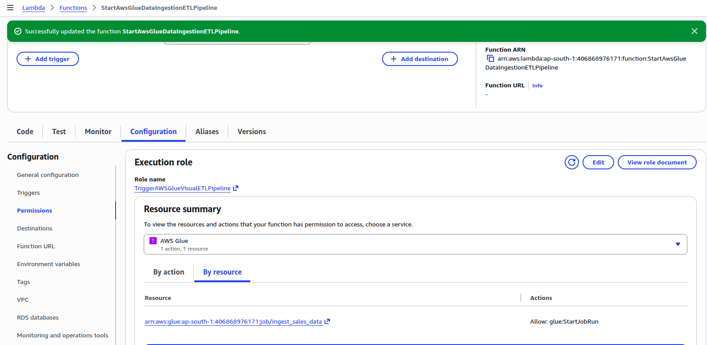
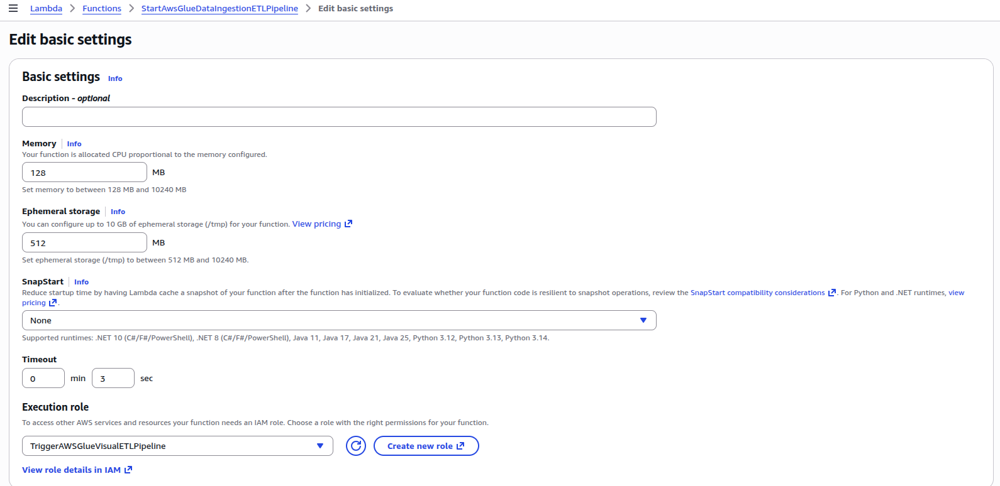

**STEP 4:**
- Add environment variables that is required by this lambda function here 
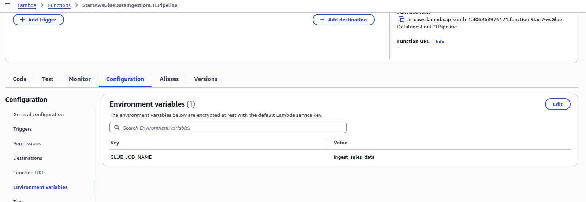

**NOTE :**
- If you have set everything correctly then you will see the logs in AWS cloudwatch for your lambda function
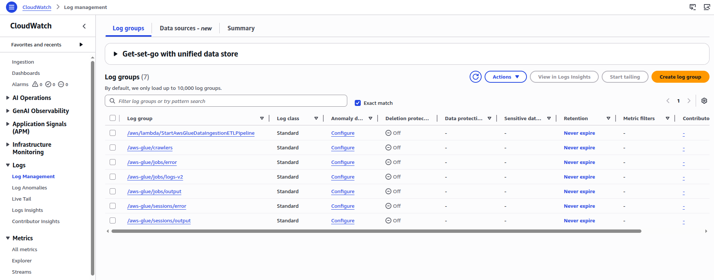
- Here all your lambda function logs will be dumped
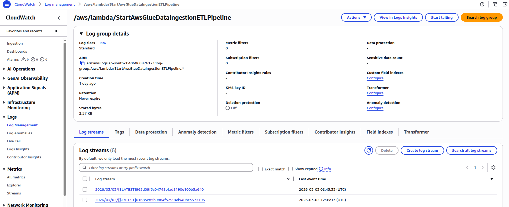


#### Create an EventBridge
**STEP 1:**
- Setup trigger events
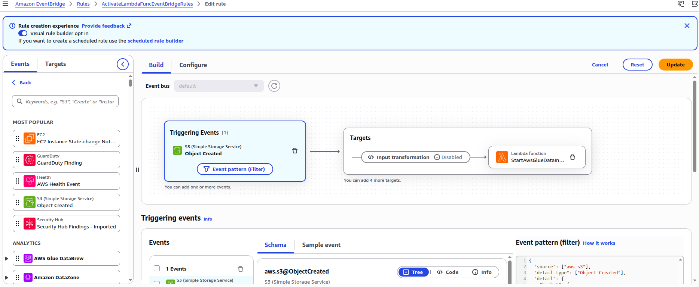
- Select the S3 simple storage service for trigger event 
- Once thats done now use this event pattern filter 
    - ```json
            {
            "source": ["aws.s3"],
            "detail-type": ["Object Created"],
            "detail": {
                "bucket": {
                "name": ["aws-glue-s3-bucket-one"]
                },
                "object": {
                "key": [{
                    "prefix": "raw_data/sales_data/"
                }]
                }
            }
            }
        ```
    - Here ```"raw_data/sales_data/"``` is the directory inside this S3 where your files are arriving.
- 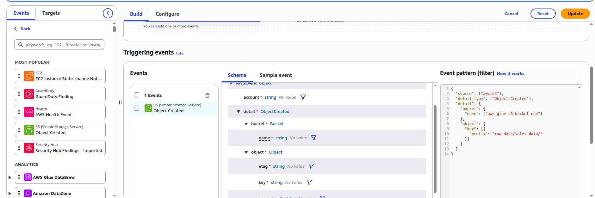

**STEP 2:**
- When configuring the targets for the EventBridge make sure that you have disabled the input transformation configuration
- What this does ? --> Use Target input transformer to customize the text from an event before EventBridge passes the information to the target. When target input transformer is not defined, the original event will be sent to a target.
- We don't need it here
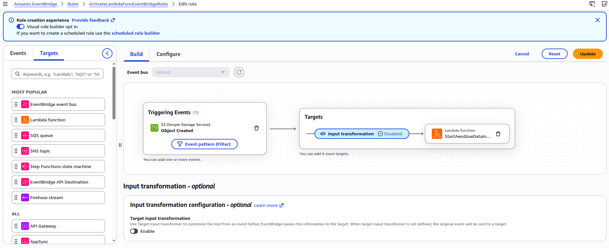

**STEP 3:**
- Select target this account since our Lambda function is present in this account only
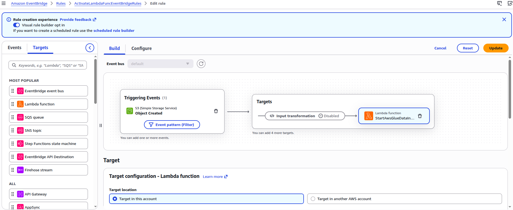
- Here make sure that refrain from using your own custom role for your EventBridge instead let AWS create a new Role for your EventBridge on your behalf
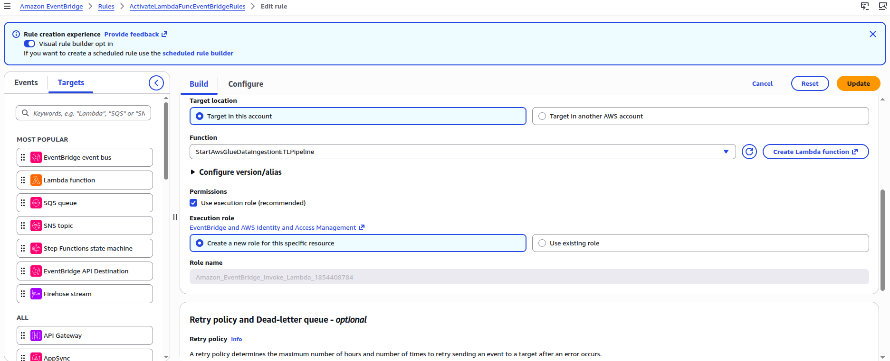
- Setup retry policy for your lambda function that triggers visual ETL when this file arrival PUT event happens in S3 bucket
- Setup the age of events in hours 
    - This will set the number of hours an unprocessed event can be kept
- Here attach your SQS which will serve as DLQ to store messages in case of a failure after the fix is completed the stored messages will be re-processed.
    - This prevent data loss in case of a failure.

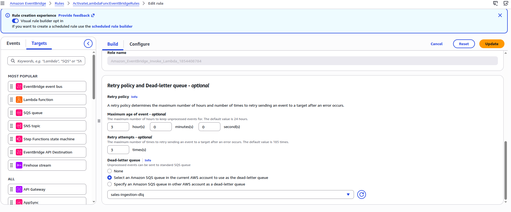

#### Room for further improvements in this 
Current setup works because:
- I enabled Glue Job Bookmarks
- I trigger Glue per file
- I are not doing complex orchestration
- I are not handling replay or partial failure logic

Right now my incremental guarantee depends entirely on:
- Glue bookmarks

That works for:
- Simple pipelines
- Single-account setups
- No replay requirements
- No external state management
- No manual backfills

But bookmarks are:
- Internal to Glue
- Opaque
- Not easily inspectable
- Hard to coordinate across multiple services

Current implementation have the infrastructure for replayability, but I have NOT fully implemented replayability yet.
- GAP 1 — Current system Don’t Track Processing State (BIGGEST ISSUE)
    - REQUIRED FIX → Add Idempotency Store (DynamoDB)
    - This is mandatory for replayability.
- GAP 2 — Current System Doesn't Detect Glue Failures Properly
    - Step Functions (BEST PRACTICE)
        - waits for completion
        - retries
        - catches failure
        - triggers DLQ
- GAP 3 — Current system Don’t Have Replay Workflow Yet
    - Right now DLQ exists but:
    - user replay manually (not production-grade).

## Improvement implementation on current system (Version 3)
- In this version I am going to implement Step function and replace the lambda function that I was using earlier to trigger the ETL pipeline.
- Reasons : 
    - Since (Version 2) implementation of this ETL pipeline where I was using lambda function instead of a step function I was not able to reliably detect if the ETL pipeline failed and hence was not able to send the event messages sent by S3 to DLQ reliably in case of a failure.
### Implementation 
#### Step 1 : Source S3 bucket setup
- Enable events to be sent to EventBridge in your S3 bucket 
- 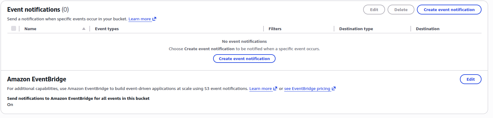

#### Step 2 : EventBridge setup 
- The name of the event bridge is ```ActivateLambdaFuncEventBridgeRules```
- Setup Trigger events for your EventBridge
- 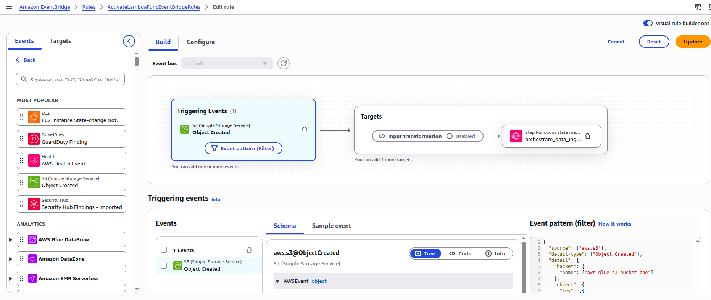

- Event pattern (filter) that I set when setting up the Event Bridge
```json
{
  "source": ["aws.s3"],
  "detail-type": ["Object Created"],
  "detail": {
    "bucket": {
      "name": ["aws-glue-s3-bucket-one"]
    },
    "object": {
      "key": [{
        "prefix": "raw_data/sales_data/"
      }]
    }
  }
}
```

- Setting up the targets that must be invoked if file is put inside the source S3 bucket
- 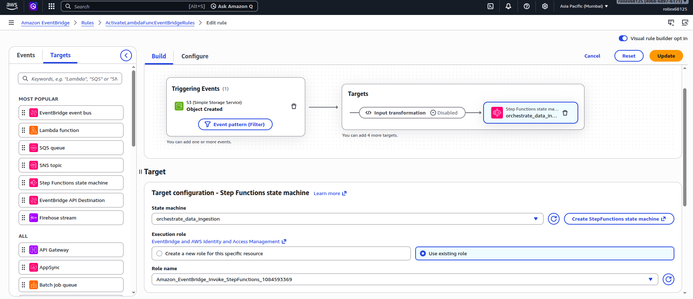
- One thing to note is that event if the image shows that I have used an existing role you must always select ```create a new role for this specific resource``` 
- The reason the image shows the other option is because I have taken a screenshot of already existing EventBridge that's why.
- You don't need to create role for this service manually AWS automatically creates a role with appropriate permissions for event bridge to use.
- 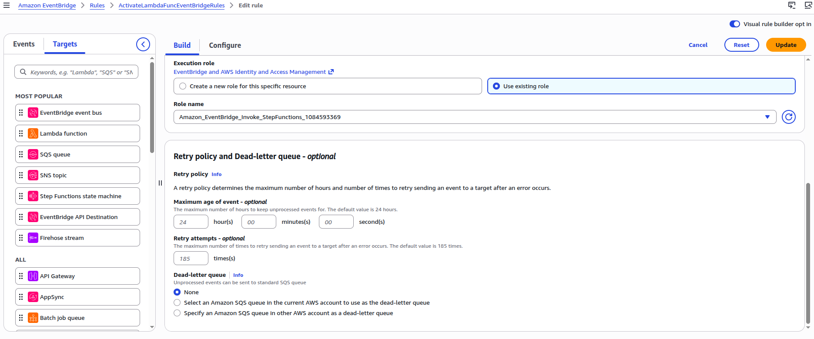

#### Step 3 : Setup a DLQ (Dead-Letter-Queue)
- The name of this DLQ is ```sales-ingestion-dlq```
- 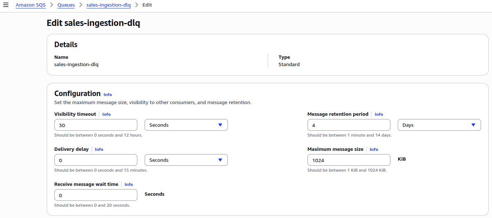
- 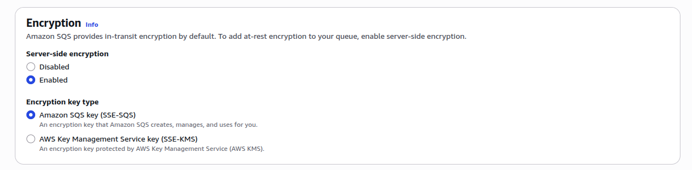
- Access policy of DLQ
```json
{
  "Version": "2012-10-17",
  "Id": "__default_policy_ID",
  "Statement": [
    {
      "Sid": "__owner_statement",
      "Effect": "Allow",
      "Principal": {
        "AWS": "arn:aws:iam::406868912345:root"
      },
      "Action": "SQS:*",
      "Resource": "arn:aws:sqs:ap-south-1:406868912345:sales-ingestion-dlq"
    },
    {
      "Sid": "AllowEventBridgeToSendMessage",
      "Effect": "Allow",
      "Principal": {
        "Service": "events.amazonaws.com"
      },
      "Action": "sqs:SendMessage",
      "Resource": "arn:aws:sqs:ap-south-1:406868971234:sales-ingestion-dlq",
      "Condition": {
        "ArnEquals": {
          "aws:SourceArn": "arn:aws:events:ap-south-1:406868971234:rule/ActivateLambdaFuncEventBridgeRules"
        }
      }
    },
    {
      "Sid": "AWSEvents_ActivateLambdaFuncEventBridgeRules_dlq_41c9320f-edd2-4fde-ad71-2985e68b1d7c",
      "Effect": "Allow",
      "Principal": {
        "Service": "events.amazonaws.com"
      },
      "Action": "sqs:SendMessage",
      "Resource": "arn:aws:sqs:ap-south-1:406868971234:sales-ingestion-dlq",
      "Condition": {
        "ArnEquals": {
          "aws:SourceArn": "arn:aws:events:ap-south-1:406868912345:rule/ActivateLambdaFuncEventBridgeRules"
        }
      }
    }
  ]
}
```
- 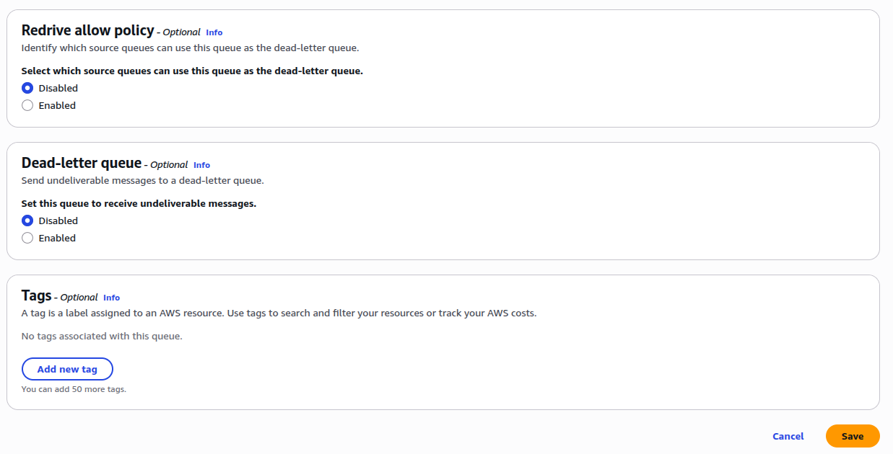

#### Step 4 : Create a step function
- This step function will be used to not only start a Glue function but it will also be used to monitor if the glue job was a sucess or a failure 
```bash
RunGlueJob → Success
          ↘ SendToDLQ → FailState
```
- How this state function works ?
    - When a file lands in S3
    - EventBridge triggers this Step function
    - Step function runs glue job
    - If the glue job fails then the event is send to DLQ

```json
{
  "Comment": "Glue ETL Orchestration with DLQ",
  "StartAt": "RunGlueJob",
  "States": {
    "RunGlueJob": {
      "Type": "Task",
      "Resource": "arn:aws:states:::glue:startJobRun.sync",
      "Parameters": {
        "JobName": "ingest_sales_data",
        "Arguments": {
          "--source_bucket.$": "$.detail.bucket.name",
          "--source_key.$": "$.detail.object.key"
        }
      },
      "Retry": [
        {
          "ErrorEquals": [
            "States.ALL"
          ],
          "IntervalSeconds": 30,
          "MaxAttempts": 2,
          "BackoffRate": 2
        }
      ],
      "Catch": [
        {
          "ErrorEquals": [
            "States.ALL"
          ],
          "Next": "SendToDLQ"
        }
      ],
      "Next": "Success"
    },
    "SendToDLQ": {
      "Type": "Task",
      "Resource": "arn:aws:states:::sqs:sendMessage",
      "Parameters": {
        "QueueUrl": "https://sqs.ap-south-1.amazonaws.com/406868971234/sales-ingestion-dlq",
        "MessageBody.$": "$"
      },
      "Next": "FailState"
    },
    "FailState": {
      "Type": "Fail"
    },
    "Success": {
      "Type": "Succeed"
    }
  }
}
```

- ```"arn:aws:states:::glue:startJobRun.sync"```
    - Start Glue job
    - WAIT until it finishes
- If ```.sync``` wasn’t used: Step Function would move immediately.

```json
"Arguments": {
          "--source_bucket.$": "$.detail.bucket.name",
          "--source_key.$": "$.detail.object.key"
        }
```
- Here the step function is extracting the bucket name and object key from the event bridge and then passing it on to AWS glue ETL pipeline where we will be able to access it using ```source_bucket``` and ```source_key``` params.
- In Glue ETL ```getResolvedOptions(sys.argv, ...)``` this code will catch all the params passed on by this step function

```json
"Retry": [{
  "ErrorEquals": ["States.TaskFailed"],
  "IntervalSeconds": 30,
  "MaxAttempts": 2,
  "BackoffRate": 2
}]
```
- Here I have decided to put the retry logic in the step function instead of eventBridge because it does makes more sense since step function is not only the one startiing the glue job but it is also the one waiting if the job was a success or a failure.
- Why this is done ?
    - transient cluster issues
    - network blips 
    - service throttling

```json
"Catch": [{
  "ErrorEquals": ["States.ALL"],
  "Next": "SendToDLQ"
}]
```
Meaning:
- If STILL fails after retries
- Send to DLQ

- You will have to add an AWS managed policy ```AmazonSQSFullAccess``` to the generated IAM role when creating a Step function.

**NOTICE :**

**There was an issue related to where when ETL fails the step function was not sending the message to DLQ**
- This happened only when the ETL recieved a corrupt csv file.
- This happened because of the code below
```json
"Retry": [{
  "ErrorEquals": ["States.TaskFailed"],
  "IntervalSeconds": 30,
  "MaxAttempts": 2,
  "BackoffRate": 2
}]
```
- ```"ErrorEquals": ["States.TaskFailed"],``` Glue ETL can return not only TaskFailed but other types of failure states as well
- solution is to use ```"States.ALL"``` instead of ```"States.TaskFailed"``` take a look at the code below and replace the above one with this
```json
"Retry": [
        {
          "ErrorEquals": [
            "States.ALL"
          ],
          "IntervalSeconds": 30,
          "MaxAttempts": 2,
          "BackoffRate": 2
        }
      ],
```

#### Step 5 : Create another step function to handle manual replays in case of a failure
- The name of this step function is ```replay_failed_ingestion```
- This is the second step function : ```DLQ → StepFn → Glue (retry) → Success```
- It replays job safely
    - This step function reads the message from DLQ ```sales-ingestion-dlq```
    - Extracts original payload
    - Re-runs Glue
    - Deletes message if success
- ```"MaxNumberOfMessages": 1```
    - Pulls only one message per execution this prevents overload + ensures a controlled replay.
- ```"Next": "FailState"```
    - If replay still fails then stop here
    - In this case DLQ message will not be deleted
- ```"Resource": "arn:aws:states:::aws-sdk:sqs:deleteMessage"```
    - Deletes message only if: 
        - Replay is successfull
- Here is the full code for this step function
```json
{
  "Comment": "Replay ETL from DLQ with batching, tracking, and safeguards",
  "StartAt": "ReceiveFromDLQ",
  "States": {
    "ReceiveFromDLQ": {
      "Type": "Task",
      "Resource": "arn:aws:states:::aws-sdk:sqs:receiveMessage",
      "Parameters": {
        "QueueUrl": "https://sqs.ap-south-1.amazonaws.com/406868976171/sales-ingestion-dlq",
        "MaxNumberOfMessages": 10
      },
      "ResultPath": "$.dlq",
      "Next": "CheckIfEmpty"
    },
    "CheckIfEmpty": {
      "Type": "Choice",
      "Choices": [
        {
          "Variable": "$.dlq.Messages",
          "IsPresent": false,
          "Next": "Success"
        }
      ],
      "Default": "ReplayBatch"
    },
    "ReplayBatch": {
      "Type": "Map",
      "ItemsPath": "$.dlq.Messages",
      "MaxConcurrency": 2,
      "Iterator": {
        "StartAt": "ExtractPayload",
        "States": {
          "ExtractPayload": {
            "Type": "Pass",
            "Parameters": {
              "receiptHandle.$": "$.ReceiptHandle",
              "body.$": "States.StringToJson($.Body)"
            },
            "ResultPath": "$.parsed",
            "Next": "ParseCause"
          },
          "ParseCause": {
            "Type": "Pass",
            "Parameters": {
              "receiptHandle.$": "$.parsed.receiptHandle",
              "cause.$": "States.StringToJson($.parsed.body.Cause)"
            },
            "ResultPath": "$.final",
            "Next": "CheckReplayCount"
          },
          "CheckReplayCount": {
            "Type": "Task",
            "Resource": "arn:aws:states:::aws-sdk:dynamodb:getItem",
            "Parameters": {
              "TableName": "dlq_replay_tracking",
              "Key": {
                "object_key": {
                  "S.$": "$.final.cause.Arguments['--source_key']"
                }
              }
            },
            "ResultPath": "$.ddb",
            "Next": "ReplayLimitCheck"
          },
          "ReplayLimitCheck": {
            "Type": "Choice",
            "Choices": [
              {
                "Variable": "$.ddb.Item.retry_count.N",
                "NumericGreaterThanEquals": 3,
                "Next": "SkipPoisonMessage"
              }
            ],
            "Default": "RunGlueJob"
          },
          "RunGlueJob": {
            "Type": "Task",
            "Resource": "arn:aws:states:::glue:startJobRun.sync",
            "Parameters": {
              "JobName": "ingest_sales_data",
              "Arguments": {
                "--source_bucket.$": "$.final.cause.Arguments['--source_bucket']",
                "--source_key.$": "$.final.cause.Arguments['--source_key']"
              }
            },
            "Retry": [
              {
                "ErrorEquals": [
                  "States.ALL"
                ],
                "IntervalSeconds": 30,
                "MaxAttempts": 2,
                "BackoffRate": 2
              }
            ],
            "Catch": [
              {
                "ErrorEquals": [
                  "States.ALL"
                ],
                "Next": "UpdateRetryCount"
              }
            ],
            "Next": "DeleteMessage"
          },
          "UpdateRetryCount": {
            "Type": "Task",
            "Resource": "arn:aws:states:::aws-sdk:dynamodb:updateItem",
            "Parameters": {
              "TableName": "dlq_replay_tracking",
              "Key": {
                "object_key": {
                  "S.$": "$.final.cause.Arguments['--source_key']"
                }
              },
              "UpdateExpression": "ADD retry_count :inc",
              "ExpressionAttributeValues": {
                ":inc": {
                  "N": "1"
                }
              }
            },
            "Next": "FailState"
          },
          "DeleteMessage": {
            "Type": "Task",
            "Resource": "arn:aws:states:::aws-sdk:sqs:deleteMessage",
            "Parameters": {
              "QueueUrl": "https://sqs.ap-south-1.amazonaws.com/406868976171/sales-ingestion-dlq",
              "ReceiptHandle.$": "$.final.receiptHandle"
            },
            "Next": "SuccessState"
          },
          "SkipPoisonMessage": {
            "Type": "Pass",
            "Next": "SuccessState"
          },
          "FailState": {
            "Type": "Fail"
          },
          "SuccessState": {
            "Type": "Succeed"
          }
        }
      },
      "Next": "Success"
    },
    "Success": {
      "Type": "Succeed"
    }
  }
}
```

#### Step 6 : Create a glue ETL job
- Before you create this ELT you will have to create an IAM role that give appropriate permission to this ETL for it to be able to utilize the S3 and Glue catalog so that it can register the data in the table so that the users can use Athena to query the data using sql.
- The IAM role that is used by this ETL job is named ```AWSGlueRole```
    - In this role you will have to attach an AWS managed policy called ```AWSGlueServiceRole```
    - Then one more custom policy you will have to attach is a custom policy named ```LimitedS3PermissionPolicy```
    ```json
    {
        "Version": "2012-10-17",
        "Statement": [
            {
                "Effect": "Allow",
                "Action": [
                    "s3:GetObject",
                    "s3:PutObject",
                    "s3:ListBucket"
                ],
                "Resource": [
                    "arn:aws:s3:::aws-glue-s3-bucket-one",
                    "arn:aws:s3:::aws-glue-s3-bucket-one/*",
                    "arn:aws:s3:::data-sink-one",
                    "arn:aws:s3:::data-sink-one/*"
                ]
            }
        ]
    }
    ```
- Here is the complete code
```python
import sys
from awsglue.transforms import *
from awsglue.utils import getResolvedOptions
from pyspark.context import SparkContext
from awsglue.context import GlueContext
from awsglue.job import Job
from awsglue.gluetypes import *
from awsgluedq.transforms import EvaluateDataQuality
from awsglue import DynamicFrame

from functools import reduce
from pyspark.sql import functions as F

def sparkSqlQuery(glueContext, query, mapping, transformation_ctx) -> DynamicFrame:
    for alias, frame in mapping.items():
        frame.toDF().createOrReplaceTempView(alias)
    result = spark.sql(query)
    return DynamicFrame.fromDF(result, glueContext, transformation_ctx)
def _find_null_fields(ctx, schema, path, output, nullStringSet, nullIntegerSet, frame):
    if isinstance(schema, StructType):
        for field in schema:
            new_path = path + "." if path != "" else path
            output = _find_null_fields(ctx, field.dataType, new_path + field.name, output, nullStringSet, nullIntegerSet, frame)
    elif isinstance(schema, ArrayType):
        if isinstance(schema.elementType, StructType):
            output = _find_null_fields(ctx, schema.elementType, path, output, nullStringSet, nullIntegerSet, frame)
    elif isinstance(schema, NullType):
        output.append(path)
    else:
        x, distinct_set = frame.toDF(), set()
        for i in x.select(path).distinct().collect():
            distinct_ = i[path.split('.')[-1]]
            if isinstance(distinct_, list):
                distinct_set |= set([item.strip() if isinstance(item, str) else item for item in distinct_])
            elif isinstance(distinct_, str) :
                distinct_set.add(distinct_.strip())
            else:
                distinct_set.add(distinct_)
        if isinstance(schema, StringType):
            if distinct_set.issubset(nullStringSet):
                output.append(path)
        elif isinstance(schema, IntegerType) or isinstance(schema, LongType) or isinstance(schema, DoubleType):
            if distinct_set.issubset(nullIntegerSet):
                output.append(path)
    return output

def drop_nulls(glueContext, frame, nullStringSet, nullIntegerSet, transformation_ctx) -> DynamicFrame:
    nullColumns = _find_null_fields(frame.glue_ctx, frame.schema(), "", [], nullStringSet, nullIntegerSet, frame)
    return DropFields.apply(frame=frame, paths=nullColumns, transformation_ctx=transformation_ctx)

args = getResolvedOptions(sys.argv, [
    'JOB_NAME',
    'source_bucket',
    'source_key'
])

source_bucket = args['source_bucket']
source_key = args['source_key']

sc = SparkContext()
glueContext = GlueContext(sc)
spark = glueContext.spark_session
job = Job(glueContext)
job.init(args['JOB_NAME'], args)

# Default ruleset used by all target nodes with data quality enabled
DEFAULT_DATA_QUALITY_RULESET = """Rules = [
    ColumnCount > 0,

    IsComplete "rating",
    IsComplete "rating_count",
    IsComplete "discounted_price",
    IsComplete "actual_price",

    ColumnValues "rating" >= 0,
    ColumnValues "rating_count" >= 0,
    ColumnValues "discounted_price" >= 0,
    ColumnValues "actual_price" >= 0,
    ColumnValues "discount_percentage" >= 0,
    
    IsUnique "product_id"
]"""

# -------- DELIMITER CORRUPTION CHECK -------- #
import csv
import io

raw_lines = spark.read.text(f"s3://{source_bucket}/{source_key}").collect()

if len(raw_lines) < 2:
    raise Exception("Glue Visual ETL | Corrupted CSV detected (file has no data rows)")

def count_csv_columns(line: str) -> int:
    """Count columns correctly, respecting quoted fields containing commas."""
    try:
        return len(next(csv.reader(io.StringIO(line))))
    except StopIteration:
        return 0

header_line = raw_lines[0][0]
expected_col_count = count_csv_columns(header_line)

bad_row_indices = []
for i, row in enumerate(raw_lines[1:], start=2):
    line = row[0]
    actual_col_count = count_csv_columns(line)
    if actual_col_count != expected_col_count:
        bad_row_indices.append((i, actual_col_count, line[:80]))

if bad_row_indices:
    details = "\n".join(
        [f"  Line {idx}: expected {expected_col_count} cols, got {actual} → {preview}..."
         for idx, actual, preview in bad_row_indices]
    )
    raise Exception(
        f"Glue Visual ETL | Corrupted CSV detected — {len(bad_row_indices)} row(s) have wrong column count "
        f"(likely semicolons used as delimiters instead of commas):\n{details}"
    )

print(f"Glue Visual ETL | Column count validation passed: all rows have {expected_col_count} columns")
# -------- DELIMITER CORRUPTION CHECK -------- #

# Script generated for node Raw data source S3
RawdatasourceS3_node1772431168408 = glueContext.create_dynamic_frame.from_options(format_options={"quoteChar": "\"", "withHeader": True, "separator": ",", "mode": "PERMISSIVE", "optimizePerformance": False}, connection_type="s3", format="csv", 
    # connection_options={"paths": ["s3://aws-glue-s3-bucket-one/raw_data/sales_data/"], "recurse": True}, 
    connection_options={"paths": [f"s3://{source_bucket}/{source_key}"],"recurse": False},
    transformation_ctx="RawdatasourceS3_node1772431168408")
# for debugging only
print(f"Glue Visual ETL | Processing file: s3://{source_bucket}/{source_key}")

df = RawdatasourceS3_node1772431168408.toDF()

print("Glue Visual ETL | DEBUG bucket:", source_bucket)
print("Glue Visual ETL | DEBUG key:", source_key)
print("Glue Visual ETL | DEBUG columns:", df.columns)
print("Glue Visual ETL | DEBUG row count:", df.count())
print("Glue Visual ETL | DEBUG schema:", df.schema)
print("Glue Visual ETL | DEBUG sample rows:", df.limit(2).toPandas())

# -------- CORRUPTION CHECK (SAFE VERSION) -------- #

# If Spark inferred no columns → corrupted file
if len(df.columns) == 0:
    raise Exception("Glue Visual ETL | Corrupted CSV detected (no columns inferred)")

expected_cols = len(df.columns)

# If dataframe empty → corrupted file
if df.limit(1).count() == 0:
    raise Exception("Glue Visual ETL | Corrupted CSV detected (empty dataframe)")

# Row-level corruption detection
null_exprs = [F.col(c).isNull().cast("int") for c in df.columns]

bad_rows = df.filter(
    reduce(lambda a, b: a + b, null_exprs) > expected_cols * 0.7
)

if bad_rows.limit(1).count() > 0:
    raise Exception("Glue Visual ETL | Corrupted CSV detected (null-heavy rows)")
# -------- CORRUPTION CHECK (SAFE VERSION) -------- #

# Script generated for node SQL Query
SqlQuery61 = '''
SELECT
    product_id,
    product_name,
    category,
    about_product,
    user_id,
    user_name,
    review_id,
    review_title,
    review_content,
    img_link,
    product_link,

    -- discounted_price: ₹149 → 149.0
    CAST(
        REGEXP_REPLACE(discounted_price, '[^0-9.]', '')
        AS DOUBLE
    ) AS discounted_price,

    -- actual_price: ₹1,000 → 1000.0
    CAST(
        REGEXP_REPLACE(actual_price, '[^0-9.]', '')
        AS DOUBLE
    ) AS actual_price,

    -- discount_percentage: 85% → 85.0
    CAST(
        REGEXP_REPLACE(discount_percentage, '[^0-9.]', '')
        AS DOUBLE
    ) AS discount_percentage,

    -- rating: 3.9 → 3.9
    CAST(
        REGEXP_REPLACE(rating, '[^0-9.]', '')
        AS DOUBLE
    ) AS rating,

    -- rating_count: 24,871 → 24871
    CAST(
        REGEXP_REPLACE(rating_count, '[^0-9]', '')
        AS INT
    ) AS rating_count

FROM myDataSource;
'''
SQLQuery_node1772431252856 = sparkSqlQuery(glueContext, query = SqlQuery61, mapping = {"myDataSource":RawdatasourceS3_node1772431168408}, transformation_ctx = "SQLQuery_node1772431252856")

# Script generated for node Drop Null Fields
DropNullFields_node1772431857999 = drop_nulls(glueContext, frame=SQLQuery_node1772431252856, nullStringSet={"", "null"}, nullIntegerSet={-1}, transformation_ctx="DropNullFields_node1772431857999")

# Script generated for node Silver layer data sink S3
EvaluateDataQuality().process_rows(frame=DropNullFields_node1772431857999, ruleset=DEFAULT_DATA_QUALITY_RULESET, publishing_options={"dataQualityEvaluationContext": "EvaluateDataQuality_node1772428328053", "enableDataQualityResultsPublishing": True}, additional_options={"dataQualityResultsPublishing.strategy": "BEST_EFFORT", "observations.scope": "ALL"})
SilverlayerdatasinkS3_node1772432020219 = glueContext.getSink(path="s3://data-sink-one/silver_layer/sales_data/", connection_type="s3", updateBehavior="LOG", partitionKeys=["category"], enableUpdateCatalog=True, transformation_ctx="SilverlayerdatasinkS3_node1772432020219")
SilverlayerdatasinkS3_node1772432020219.setCatalogInfo(catalogDatabase="aws-glue-tutorial-aditya",catalogTableName="silver_table_sales_data")
SilverlayerdatasinkS3_node1772432020219.setFormat("glueparquet", compression="snappy")
SilverlayerdatasinkS3_node1772432020219.writeFrame(DropNullFields_node1772431857999)
job.commit()
```

### CSV CORRUPTION CHECK (DEEP EXPLANATION)
- ```spark.read.text(...).collect()```
    - Reads raw file line-by-line
    - Returns list to driver
- Why check < 2 rows?
    - ```if len(raw_lines) < 2:```
    - Means:
        - 1 row → only header
        - 0 row → empty file
    - Hence invalid dataset
- ```count_csv_columns()```
    - ```csv.reader(io.StringIO(line))```
    - Why?
        - Handles quoted commas correctly
    - Example : ```"a,b",c```
    - correctly counted as 2 columns.
- Row validation logic
    - ```for i, row in enumerate(raw_lines[1:], start=2):```
    - Starts from row 2 because: row1= header
    - Then : ```actual_col_count != expected_col_count```
    - If mismatch then corrupted row
- Error reporting
    - ```line[:80]```
    - Show preview only (Safe logging)
- Final check
    - ```if bad_row_indices:```
    - If any corrupted now --> fail job

### HOW EVENTBRIDGE + STEP FUNCTION WORKS
#### Step 1 : File arrives
- EventBridge is enabled on bucket
- S3 sends events to EventBridge automatically.

#### Step 2 : EventBridge rule triggers
Event pattern (Filter)

```json
{
  "source": ["aws.s3"],
  "detail-type": ["Object Created"],
  "detail": {
    "bucket": {
      "name": ["aws-glue-s3-bucket-one"]
    },
    "object": {
      "key": [{
        "prefix": "raw_data/sales_data/"
      }]
    }
  }
}
```

Matches:
- PutObject
- Multipart upload complete

The code below is the rules defined in pyspark script in AWS glue catalog 
```python
# Default ruleset used by all target nodes with data quality enabled
DEFAULT_DATA_QUALITY_RULESET = """Rules = [
    ColumnCount > 0,

    IsComplete "rating",
    IsComplete "rating_count",
    IsComplete "discounted_price",
    IsComplete "actual_price",

    ColumnValues "rating" >= 0,
    ColumnValues "rating_count" >= 0,
    ColumnValues "discounted_price" >= 0,
    ColumnValues "actual_price" >= 0,
    ColumnValues "discount_percentage" >= 0,
    
    IsUnique "product_id"
]"""
```
- This is an AWS Glue data quality ruleset.
- This tells glue 
    - Check if my dataset is structurally valid before writing.
- What it does ? 
    - runs all rules
    - measures pass/fail
    - logs results
    - publishes metrics
    - (optionally) fails job
- ```ColumnCount = 16,```
    - In my case the csv files had 16 columns so I have made sure that the csv that is about to be processed must have 16 columns exactly.
    - This prevents data from silent schema drift in case the upstream service/application removes a column in the csv files.
    - Cannot allow schema drift at all cost because it will break all the down stream applications.
- ```python
        ColumnValues "rating" >= 0,
        ColumnValues "rating_count" >= 0,
        ColumnValues "discounted_price" >= 0,
        ColumnValues "actual_price" >= 0,
        ColumnValues "discount_percentage" >= 0,
    ```
    - It makes sure that ```rating, rating_count, discounted_price, actual_price, discount_percentage``` columns does not have any negative data values in them.
- ```IsUnique "product_id"```
    - This makes sure that the product_id is unique and prevents data duplication
- I have set AWS glue ETL pipeline to have maximum concurrency of 10 
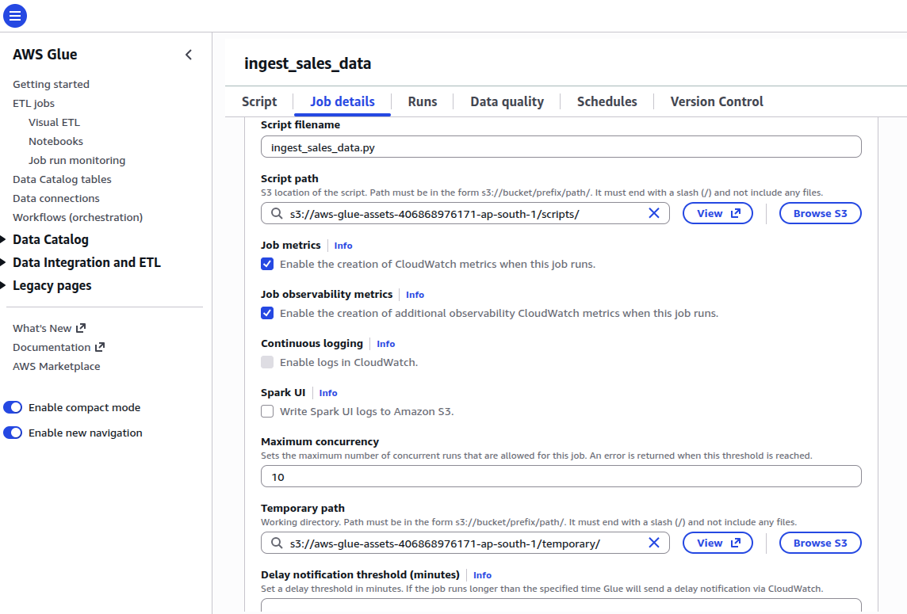

- **Issue I faced :**
    - Data quality related validation issue
        - I accidently used this rule ```ColumnCount == 16,``` instead of this ```ColumnCount = 16,``` 
        - Because of this my AWS glue ETL pipeline was failing which is to be expected 
        - **The bigger concern for me was this that it was not sending message to DLQ as it should.**
        - Reason for this happening:
            - The step function checks for the final job state and not the logs that is the reason the flow in the step function never reaches to the point where it sends the message to DLQ hence no message is found in the DLQ even when the ETL job fails.
        - Solution 
            - All you have to do is wrap the code where you are evaluating the data quality rules in try except. This should send message to DLQ in case the ETL pipeline fails.
            - In order to test it I am deliberately keeping the wrong rule in the section where I have defined all of my data quality rules ```ColumnCount == 16,```. The correct code looke like this ```ColumnCount == 16,```.

#### Step 3 : Filter applied
The filter set in the Event pattern 
```bash
"prefix": "raw_data/sales_data/"
```

Only those files trigger the Step function.

#### Step 4 : Step Function starts
EventBridge sends full event payload:
```bash
detail.bucket.name
detail.object.key
```

#### Step 5 : Step Function → Glue
Passes params via:
```bash
--source_bucket
--source_key
```

#### Architecture 
Current : ```S3 → EventBridge → StepFunction → Glue → Silver S3```

### Problems with this architecture 
#### max concurrency error thrown by the ETL pipeline the moment I try to ingest more than 1 file 
- This problem happens when you go with this architecture : ```S3 → EventBridge → StepFunction → Glue → Silver S3```
- If you set the max concurrency to 10 of an AWS glue ETL then you may face the issue related to **ETL bookmark conflict**.
    - Explaination
        - 2 files arrive
        - 2 StepFn executions start
        - 2 Glue jobs run simultaneously
        - Bookmark system = SHARED STATE
        - Long story short you CANNOT run parallel Glue jobs with bookmarks enabled.
    - Solution I have to disable the bookmark for glue ETL pipeline. 
        - Reason : 
            - My event passes the which bucket recieved what file to state function which then passes that information to Glue ETL pipeline so my pipeline knows which file to ingest and from where hence bookmark is not needed here 
            - It was required when instead of implementing file level scanning I would have implemented folder level scanning then it would have been necessary 
- AWS glue ETL hitting its max concurrency limit and throwing errors
    - I have set the max concurrency of this ETL pipeline to be 10. This means the moment the number of files recieved in S3 exceeds 10 AWS glue ETL will throw errors in case of the current architecture ```S3 → EventBridge → StepFunction → Glue → Silver S3```
    - Reason:
        - 40 files arrives in S3 bucket
        - All trigger the step function and the step function trigger AWS glue ETL parallely but since I have set max parallel process to be 10 it will not allow more than that hence the error.
        - Hence we can say that this is a throttling control problem.
    - Solution : 
        - We have to improve our architecture and use some kind of queue to store all the events coming in hot right from the source S3 bucket
        - The missing piece in my current architecture was Buffering + Controlled Dispatch
        - Correction:
            - During my reseach I found that Step function can only be triggered only by
                - EventBridge
                - API
                - SDK
                - Lambda
            - Which means I cannot use SQS directly to trigger my step function which is a bummer but I can use Lamdba function to trigger my step function and I know that SQS can trigger Lambda function directly. 
            - So I have to make changes in the architecture accordingly I have to put a lambda function between SQS and Step function ```S3 → EventBridge → SQS BUFFER → Lambda (trigger) → StepFn → Glue → Silver S3```

#### **Implementation : (Version 4)**
- As discussed above I am going to implement this architecture ---> ```S3 → EventBridge → SQS BUFFER → Lambda (trigger) → StepFn → Glue → Silver S3```
- **First configure you source S3 bucket to use event bridge:**
    - 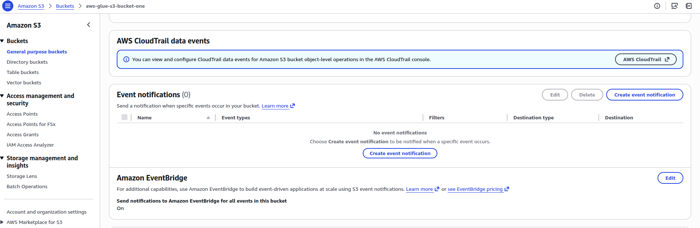
    - Set the source s3 in a way that it sends the file arrival event message straight to eventBridge.
- **Setup the EventBridge:**
    - 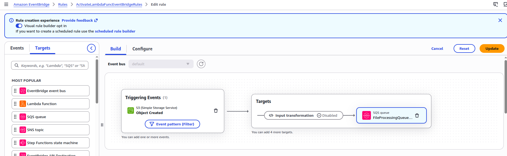
    - 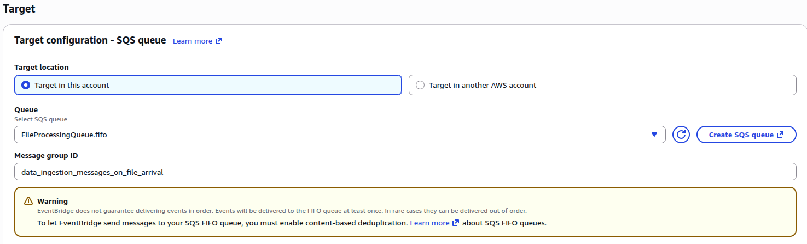
    - 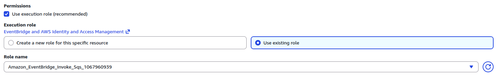
    - 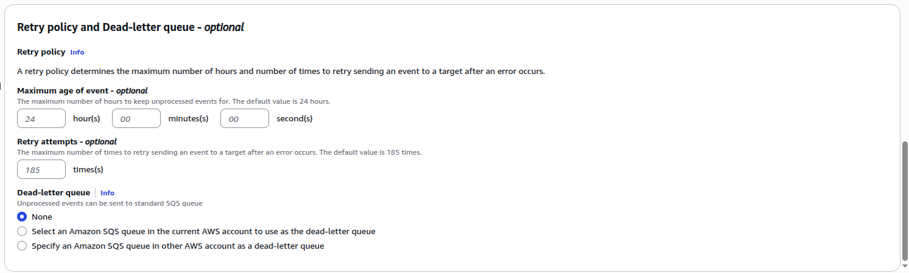
    - Here is the event pattern filter.
        - ```json
            {
            "source": ["aws.s3"],
            "detail-type": ["Object Created"],
            "detail": {
                "bucket": {
                "name": ["aws-glue-s3-bucket-one"]
                },
                "object": {
                "key": [{
                    "prefix": "raw_data/sales_data/"
                }]
                }
            }
            }
            ```
    - Set the event bridge in a way that it recieves the event message of file arrival directly from S3 bucket and then send that event message to SQS queue named ```FileProcessingQueue.fifo```
- **SQS for handling file arrival event message from S3 setup:**
    - **STEP 1:**
        - 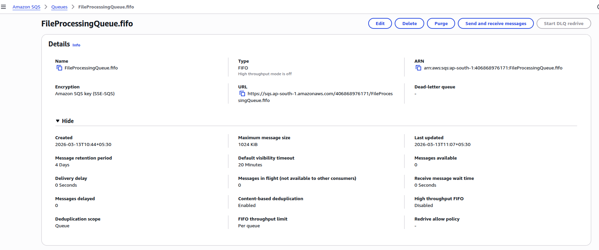
        - Set the default visibility time of messages in this ```FileProcessingQueue.fifo``` queue to be 20 minutes. 
        - Don't forget to setup FIFO in this queue if you want your messages to execute in an orderly fashon
        - This is the access policy that I used for this queue 
        ```json
        {
            "Version": "2012-10-17",
            "Statement": [
                {
                "Sid": "AllowEventBridgeToSend",
                "Effect": "Allow",
                "Principal": {
                    "Service": "events.amazonaws.com"
                },
                "Action": "sqs:SendMessage",
                "Resource": "arn:aws:sqs:ap-south-1:406868976171:FileProcessingQueue",
                "Condition": {
                    "ArnEquals": {
                    "aws:SourceArn": "arn:aws:events:ap-south-1:406868976171:rule/ActivateLambdaFuncEventBridgeRules"
                    }
                }
                }
            ]
        }
        ```
- **Setup a Lambda function**
    - This lambda function will be triggered via SQS named ```FileProcessingQueue.fifo``` and then this lambda function in return will trigger a state function called ```orchestrate_data_ingestion```
    - Why this is needed because SQS cannot directly trigger Step function it can only trigger a lambda function 
    - Here is the lambda function code that I am using 
    ```python
    import json
    import boto3
    import uuid
    from datetime import datetime, timezone, timedelta

    sf = boto3.client("stepfunctions")

    STATE_MACHINE_ARN = "arn:aws:states:ap-south-1:406868976171:stateMachine:orchestrate_data_ingestion"

    def lambda_handler(event, context):

        execution_id = str(uuid.uuid4())[:8]

        IST = timezone(timedelta(hours=5, minutes=30))
        timestamp = datetime.now(IST).strftime("%Y-%m-%d %H:%M:%S %Z")

        print(f"\n===== Lambda Invocation START =====")
        print(f"ExecutionID: {execution_id}")
        print(f"Timestamp: {timestamp}")
        print("Full Event From SQS:", json.dumps(event))
        print("===================================\n")

        files = []

        for record in event["Records"]:
            body = json.loads(record["body"])

            files.append({
                "bucket": body["detail"]["bucket"]["name"],
                "key": body["detail"]["object"]["key"]
            })

        print("Files collected:", files)

        sf.start_execution(
            stateMachineArn=STATE_MACHINE_ARN,
            input=json.dumps({"files": files})
        )

        return {"status": "ok"}
    ```
    - Here is the lambda function trigger configuration
    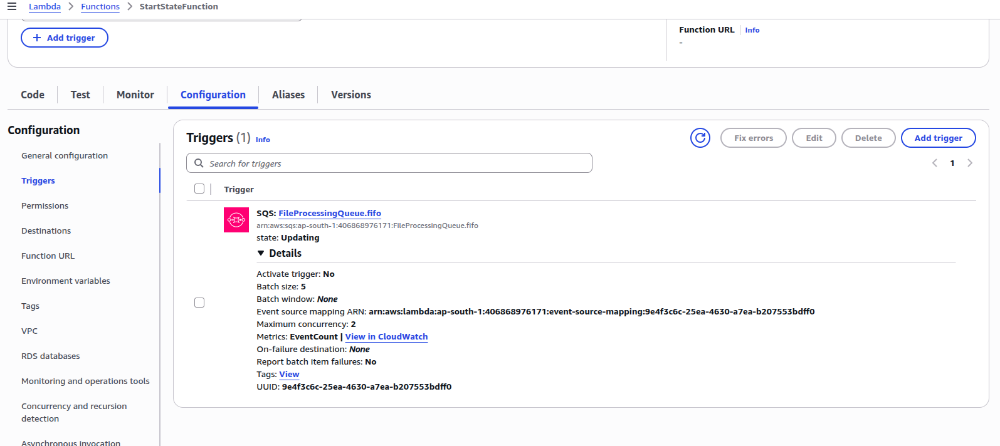
    - When configuring batch size to 5 and set up max concurrency for lambda function to 2 
    - In order for your lambda function to work properly you need to create a new role that has permission like this 
    ```json
        {
            "Version": "2012-10-17",
            "Statement": [
                {
                    "Effect": "Allow",
                    "Action": [
                        "states:StartExecution"
                    ],
                    "Resource": "arn:aws:states:ap-south-1:406868976171:stateMachine:orchestrate_data_ingestion"
                },
                {
                    "Effect": "Allow",
                    "Action": [
                        "sqs:ReceiveMessage",
                        "sqs:DeleteMessage",
                        "sqs:GetQueueAttributes"
                    ],
                    "Resource": "arn:aws:sqs:ap-south-1:406868976171:FileProcessingQueue.fifo"
                },
                {
                    "Effect": "Allow",
                    "Action": [
                        "logs:CreateLogGroup",
                        "logs:CreateLogStream",
                        "logs:PutLogEvents"
                    ],
                    "Resource": "*"
                }
            ]
        }
    ```
- **Setup AWS Step function (Orchestrate AWS ETL pipeline)**
    - ```orchestrate_data_ingestion``` step function will trigger the AWS glue ETL pipeline
    - ```json
        {
        "Comment": "Glue ETL Orchestration with Controlled Concurrency",
        "StartAt": "ProcessFiles",
        "States": {
            "ProcessFiles": {
            "Type": "Map",
            "ItemsPath": "$.files",
            "MaxConcurrency": 1,
            "Iterator": {
                "StartAt": "RunGlueJob",
                "States": {
                "RunGlueJob": {
                    "Type": "Task",
                    "Resource": "arn:aws:states:::glue:startJobRun.sync",
                    "Parameters": {
                    "JobName": "ingest_sales_data",
                    "Arguments": {
                        "--source_bucket.$": "$.bucket",
                        "--source_key.$": "$.key"
                    }
                    },
                    "Retry": [
                    {
                        "ErrorEquals": [
                        "Glue.ConcurrentRunsExceededException"
                        ],
                        "IntervalSeconds": 60,
                        "MaxAttempts": 10,
                        "BackoffRate": 1.5
                    },
                    {
                        "ErrorEquals": [
                        "States.ALL"
                        ],
                        "IntervalSeconds": 30,
                        "MaxAttempts": 2,
                        "BackoffRate": 2
                    }
                    ],
                    "Catch": [
                    {
                        "ErrorEquals": [
                        "States.ALL"
                        ],
                        "Next": "SendToDLQ"
                    }
                    ],
                    "End": true
                },
                "SendToDLQ": {
                    "Type": "Task",
                    "Resource": "arn:aws:states:::sqs:sendMessage",
                    "Parameters": {
                    "QueueUrl": "https://sqs.ap-south-1.amazonaws.com/406868976171/sales-ingestion-dlq",
                    "MessageBody.$": "$"
                    },
                    "End": true
                }
                }
            },
            "End": true
            }
        }
        }
      ```
- **Setup DLQ**
    - This DLQ will be used by the step function that is responsible for replaying ETL pipeline.
    - This DLQ saves the event message sent from source s3 in the event when the ETL fails to ingest a particular file.
    - 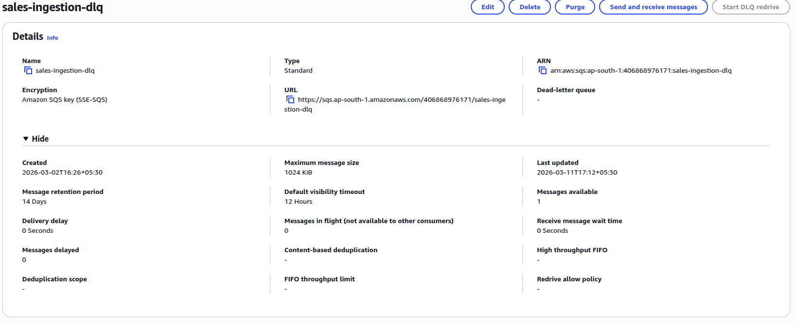
    - This is the sqs policy I used 
    ```json
    {
        "Version": "2012-10-17",
        "Id": "__default_policy_ID",
        "Statement": [
            {
            "Sid": "__owner_statement",
            "Effect": "Allow",
            "Principal": {
                "AWS": "arn:aws:iam::406868976171:root"
            },
            "Action": "SQS:*",
            "Resource": "arn:aws:sqs:ap-south-1:406868976171:sales-ingestion-dlq"
            },
            {
            "Sid": "AllowEventBridgeToSendMessage",
            "Effect": "Allow",
            "Principal": {
                "Service": "events.amazonaws.com"
            },
            "Action": "sqs:SendMessage",
            "Resource": "arn:aws:sqs:ap-south-1:406868976171:sales-ingestion-dlq",
            "Condition": {
                "ArnEquals": {
                "aws:SourceArn": "arn:aws:events:ap-south-1:406868976171:rule/ActivateLambdaFuncEventBridgeRules"
                }
            }
            },
            {
            "Sid": "AWSEvents_ActivateLambdaFuncEventBridgeRules_dlq_41c9320f-edd2-4fde-ad71-2985e68b1d7c",
            "Effect": "Allow",
            "Principal": {
                "Service": "events.amazonaws.com"
            },
            "Action": "sqs:SendMessage",
            "Resource": "arn:aws:sqs:ap-south-1:406868976171:sales-ingestion-dlq",
            "Condition": {
                "ArnEquals": {
                "aws:SourceArn": "arn:aws:events:ap-south-1:406868976171:rule/ActivateLambdaFuncEventBridgeRules"
                }
            }
            }
        ]
    }
    ```
- **Setup AWS Step function (Replay AWS ETL pipeline)**
    - ```replay_failed_ingestion``` This step function will allow us to re-invoke the ETL pipeline manually in the event where our pipeline failed and even retry failed.
    - SOP is that :
        - suppose you recieve a corrupted csv file 
        - you pipeline retries 3 times and then fails 
        - you get a mail telling you that the ETL failed to ingest this file along with the file name 
        - The event message from S3 gets stored in the DLQ
        - after fixing the issue I can simple use this state function to manualy run the ETL pipeline 
        - since this state function reads the event message from the DLQ the ETL knows which file to reprocess.
        - This is why this replay step function is essential.
    - ```json
        {
        "Comment": "Replay ETL from DLQ (Fixed Version)",
        "StartAt": "ReceiveFromDLQ",
        "States": {
            "ReceiveFromDLQ": {
            "Type": "Task",
            "Resource": "arn:aws:states:::aws-sdk:sqs:receiveMessage",
            "Parameters": {
                "QueueUrl": "https://sqs.ap-south-1.amazonaws.com/406868976171/sales-ingestion-dlq",
                "MaxNumberOfMessages": 10
            },
            "ResultPath": "$.dlq",
            "Next": "CheckIfEmpty"
            },
            "CheckIfEmpty": {
            "Type": "Choice",
            "Choices": [
                {
                "Variable": "$.dlq.Messages",
                "IsPresent": false,
                "Next": "Success"
                }
            ],
            "Default": "ReplayBatch"
            },
            "ReplayBatch": {
            "Type": "Map",
            "ItemsPath": "$.dlq.Messages",
            "MaxConcurrency": 1,
            "Iterator": {
                "StartAt": "ExtractPayload",
                "States": {
                "ExtractPayload": {
                    "Type": "Pass",
                    "Parameters": {
                    "receiptHandle.$": "$.ReceiptHandle",
                    "body.$": "States.StringToJson($.Body)"
                    },
                    "ResultPath": "$.parsed",
                    "Next": "ParseCause"
                },
                "ParseCause": {
                    "Type": "Pass",
                    "Parameters": {
                    "receiptHandle.$": "$.parsed.receiptHandle",
                    "cause.$": "States.StringToJson($.parsed.body.Cause)"
                    },
                    "ResultPath": "$.payload",
                    "Next": "RunGlueJob"
                },
                "RunGlueJob": {
                    "Type": "Task",
                    "Resource": "arn:aws:states:::glue:startJobRun.sync",
                    "ResultPath": "$.glueResult",
                    "Parameters": {
                    "JobName": "ingest_sales_data",
                    "Arguments": {
                        "--source_bucket.$": "$.payload.cause.Arguments['--source_bucket']",
                        "--source_key.$": "$.payload.cause.Arguments['--source_key']"
                    }
                    },
                    "Catch": [
                    {
                        "ErrorEquals": [
                        "States.ALL"
                        ],
                        "Next": "FailState"
                    }
                    ],
                    "Next": "DeleteMessage"
                },
                "DeleteMessage": {
                    "Type": "Task",
                    "Resource": "arn:aws:states:::aws-sdk:sqs:deleteMessage",
                    "Parameters": {
                    "QueueUrl": "https://sqs.ap-south-1.amazonaws.com/406868976171/sales-ingestion-dlq",
                    "ReceiptHandle.$": "$.payload.receiptHandle"
                    },
                    "Next": "SuccessState"
                },
                "FailState": {
                    "Type": "Fail"
                },
                "SuccessState": {
                    "Type": "Succeed"
                }
                }
            },
            "Next": "Success"
            },
            "Success": {
            "Type": "Succeed"
            }
        }
        }
      ```
      
- **Setup AWS glue ETL pipeline:**
    - Here is the python code for the ETL pipeline 
    ```python
    import sys
    from awsglue.transforms import *
    from awsglue.utils import getResolvedOptions
    from pyspark.context import SparkContext
    from awsglue.context import GlueContext
    from awsglue.job import Job
    from awsglue.gluetypes import *
    from awsgluedq.transforms import EvaluateDataQuality
    from awsglue import DynamicFrame

    from functools import reduce
    from pyspark.sql import functions as F

    def sparkSqlQuery(glueContext, query, mapping, transformation_ctx) -> DynamicFrame:
        for alias, frame in mapping.items():
            frame.toDF().createOrReplaceTempView(alias)
        result = spark.sql(query)
        return DynamicFrame.fromDF(result, glueContext, transformation_ctx)
    def _find_null_fields(ctx, schema, path, output, nullStringSet, nullIntegerSet, frame):
        if isinstance(schema, StructType):
            for field in schema:
                new_path = path + "." if path != "" else path
                output = _find_null_fields(ctx, field.dataType, new_path + field.name, output, nullStringSet, nullIntegerSet, frame)
        elif isinstance(schema, ArrayType):
            if isinstance(schema.elementType, StructType):
                output = _find_null_fields(ctx, schema.elementType, path, output, nullStringSet, nullIntegerSet, frame)
        elif isinstance(schema, NullType):
            output.append(path)
        else:
            x, distinct_set = frame.toDF(), set()
            for i in x.select(path).distinct().collect():
                distinct_ = i[path.split('.')[-1]]
                if isinstance(distinct_, list):
                    distinct_set |= set([item.strip() if isinstance(item, str) else item for item in distinct_])
                elif isinstance(distinct_, str) :
                    distinct_set.add(distinct_.strip())
                else:
                    distinct_set.add(distinct_)
            if isinstance(schema, StringType):
                if distinct_set.issubset(nullStringSet):
                    output.append(path)
            elif isinstance(schema, IntegerType) or isinstance(schema, LongType) or isinstance(schema, DoubleType):
                if distinct_set.issubset(nullIntegerSet):
                    output.append(path)
        return output

    def drop_nulls(glueContext, frame, nullStringSet, nullIntegerSet, transformation_ctx) -> DynamicFrame:
        nullColumns = _find_null_fields(frame.glue_ctx, frame.schema(), "", [], nullStringSet, nullIntegerSet, frame)
        return DropFields.apply(frame=frame, paths=nullColumns, transformation_ctx=transformation_ctx)

    args = getResolvedOptions(sys.argv, [
        'JOB_NAME',
        'source_bucket',
        'source_key'
    ])

    source_bucket = args['source_bucket']
    source_key = args['source_key']

    sc = SparkContext()
    glueContext = GlueContext(sc)
    spark = glueContext.spark_session
    job = Job(glueContext)
    job.init(args['JOB_NAME'], args)

    # Default ruleset used by all target nodes with data quality enabled
    DEFAULT_DATA_QUALITY_RULESET = """Rules = [
        ColumnCount = 16,

        IsComplete "rating",
        IsComplete "rating_count",
        IsComplete "discounted_price",
        IsComplete "actual_price",

        ColumnValues "rating" >= 0,
        ColumnValues "rating_count" >= 0,
        ColumnValues "discounted_price" >= 0,
        ColumnValues "actual_price" >= 0,
        ColumnValues "discount_percentage" >= 0,
        
        IsUnique "product_id"
    ]"""

    # -------- DELIMITER CORRUPTION CHECK -------- #
    # It checks for delimiter / structural corruption STARTS
    import csv
    import io

    raw_lines = spark.read.text(f"s3://{source_bucket}/{source_key}").collect()

    if len(raw_lines) < 2:
        raise Exception("Glue Visual ETL | Corrupted CSV detected (file has no data rows)")

    def count_csv_columns(line: str) -> int:
        """Count columns correctly, respecting quoted fields containing commas."""
        try:
            return len(next(csv.reader(io.StringIO(line))))
        except StopIteration:
            return 0

    header_line = raw_lines[0][0]
    expected_col_count = count_csv_columns(header_line)

    bad_row_indices = []
    for i, row in enumerate(raw_lines[1:], start=2):
        line = row[0]
        actual_col_count = count_csv_columns(line)
        if actual_col_count != expected_col_count:
            bad_row_indices.append((i, actual_col_count, line[:80]))

    if bad_row_indices:
        details = "\n".join(
            [f"  Line {idx}: expected {expected_col_count} cols, got {actual} → {preview}..."
            for idx, actual, preview in bad_row_indices]
        )
        raise Exception(
            f"Glue Visual ETL | Corrupted CSV detected — {len(bad_row_indices)} row(s) have wrong column count "
            f"(likely semicolons used as delimiters instead of commas):\n{details}"
        )

    print(f"Glue Visual ETL | Column count validation passed: all rows have {expected_col_count} columns")
    # It checks for delimiter / structural corruption ENDS
    # -------- DELIMITER CORRUPTION CHECK -------- #

    # Script generated for node Raw data source S3
    RawdatasourceS3_node1772431168408 = glueContext.create_dynamic_frame.from_options(format_options={"quoteChar": "\"", "withHeader": True, "separator": ",", "mode": "PERMISSIVE", "optimizePerformance": False}, connection_type="s3", format="csv", 
        # connection_options={"paths": ["s3://aws-glue-s3-bucket-one/raw_data/sales_data/"], "recurse": True}, 
        connection_options={"paths": [f"s3://{source_bucket}/{source_key}"],"recurse": False},
        transformation_ctx="RawdatasourceS3_node1772431168408")
    # for debugging only
    print(f"Glue Visual ETL | Processing file: s3://{source_bucket}/{source_key}")

    df = RawdatasourceS3_node1772431168408.toDF()

    print("Glue Visual ETL | DEBUG bucket:", source_bucket)
    print("Glue Visual ETL | DEBUG key:", source_key)
    print("Glue Visual ETL | DEBUG columns:", df.columns)
    print("Glue Visual ETL | DEBUG row count:", df.count())
    print("Glue Visual ETL | DEBUG schema:", df.schema)
    print("Glue Visual ETL | DEBUG sample rows:", df.limit(2).toPandas())

    # -------- CORRUPTION CHECK -------- #
    # checks Spark-level corruption after parsing STARTS

    # If Spark inferred no columns → corrupted file
    if len(df.columns) == 0:
        raise Exception("Glue Visual ETL | Corrupted CSV detected (no columns inferred)")

    expected_cols = len(df.columns)

    # If dataframe empty → corrupted file
    if df.limit(1).count() == 0:
        raise Exception("Glue Visual ETL | Corrupted CSV detected (empty dataframe)")

    # Row-level corruption detection
    null_exprs = [F.col(c).isNull().cast("int") for c in df.columns]

    bad_rows = df.filter(
        reduce(lambda a, b: a + b, null_exprs) > expected_cols * 0.7
    )

    if bad_rows.limit(1).count() > 0:
        raise Exception("Glue Visual ETL | Corrupted CSV detected (null-heavy rows)")

    # checks Spark-level corruption after parsing ENDS
    # -------- CORRUPTION CHECK -------- #

    #--------- CONVERT THE COLUMNS IN THE CSV FILE TO CORRECT DATA TYPES --------#
    # Script generated for node SQL Query
    SqlQuery61 = '''
    SELECT
        product_id,
        product_name,
        category,
        about_product,
        user_id,
        user_name,
        review_id,
        review_title,
        review_content,
        img_link,
        product_link,

        -- discounted_price: ₹149 → 149.0
        CAST(
            REGEXP_REPLACE(discounted_price, '[^0-9.]', '')
            AS DOUBLE
        ) AS discounted_price,

        -- actual_price: ₹1,000 → 1000.0
        CAST(
            REGEXP_REPLACE(actual_price, '[^0-9.]', '')
            AS DOUBLE
        ) AS actual_price,

        -- discount_percentage: 85% → 85.0
        CAST(
            REGEXP_REPLACE(discount_percentage, '[^0-9.]', '')
            AS DOUBLE
        ) AS discount_percentage,

        -- rating: 3.9 → 3.9
        CAST(
            REGEXP_REPLACE(rating, '[^0-9.]', '')
            AS DOUBLE
        ) AS rating,

        -- rating_count: 24,871 → 24871
        CAST(
            REGEXP_REPLACE(rating_count, '[^0-9]', '')
            AS INT
        ) AS rating_count

    FROM myDataSource;
    '''

    try:
        SQLQuery_node1772431252856 = sparkSqlQuery(glueContext, query = SqlQuery61, mapping = {"myDataSource":RawdatasourceS3_node1772431168408}, transformation_ctx = "SQLQuery_node1772431252856")
    except Exception as e:
        print(f"Glue Visual ETL | SQL query execution failed | {e}")
        raise RuntimeError("Failing Glue job explicitly | Failed to execute sql query")
    #--------- CONVERT THE COLUMNS IN THE CSV FILE TO CORRECT DATA TYPES --------#

    # Script generated for node Drop Null Fields
    DropNullFields_node1772431857999 = drop_nulls(glueContext, frame=SQLQuery_node1772431252856, nullStringSet={"", "null"}, nullIntegerSet={-1}, transformation_ctx="DropNullFields_node1772431857999")

    # -------- DEDUPLICATION STEP -------- #
    # This will check if there exists a row with a duplicate review_id if yes then it will drop one of the row and make sure that the row is unique
    # Doing this prevents any data duplication 
    df_clean = DropNullFields_node1772431857999.toDF()

    deduped_df = df_clean.dropDuplicates()

    print("Glue Visual ETL | Before dedup:", df_clean.count())
    print("Glue Visual ETL | After dedup:", deduped_df.count())

    deduped_dynamic_frame = DynamicFrame.fromDF(
        deduped_df, glueContext, "deduped_dynamic_frame"
    )
    # -------- DEDUPLICATION STEP -------- #

    # Script generated for node Silver layer data sink S3
    try:
        EvaluateDataQuality().process_rows(frame=deduped_dynamic_frame, ruleset=DEFAULT_DATA_QUALITY_RULESET, publishing_options={"dataQualityEvaluationContext": "EvaluateDataQuality_node1772428328053", "enableDataQualityResultsPublishing": True}, additional_options={"dataQualityResultsPublishing.strategy": "BEST_EFFORT", "observations.scope": "ALL"})
    except Exception as e:
        print("Glue Visual ETL | DQ failed:", e)
        raise RuntimeError("Failing Glue job explicitly | Failed to run data quality rules")

    SilverlayerdatasinkS3_node1772432020219 = glueContext.getSink(path="s3://data-sink-one/silver_layer/sales_data/", connection_type="s3", updateBehavior="LOG", partitionKeys=["category"], enableUpdateCatalog=True, transformation_ctx="SilverlayerdatasinkS3_node1772432020219")
    SilverlayerdatasinkS3_node1772432020219.setCatalogInfo(catalogDatabase="aws-glue-tutorial-aditya",catalogTableName="silver_table_sales_data")
    SilverlayerdatasinkS3_node1772432020219.setFormat("glueparquet", compression="snappy")
    SilverlayerdatasinkS3_node1772432020219.writeFrame(deduped_dynamic_frame)
    job.commit()
    ```
    - Here is the configuration related to AWS glue ETL pipeline 
    - 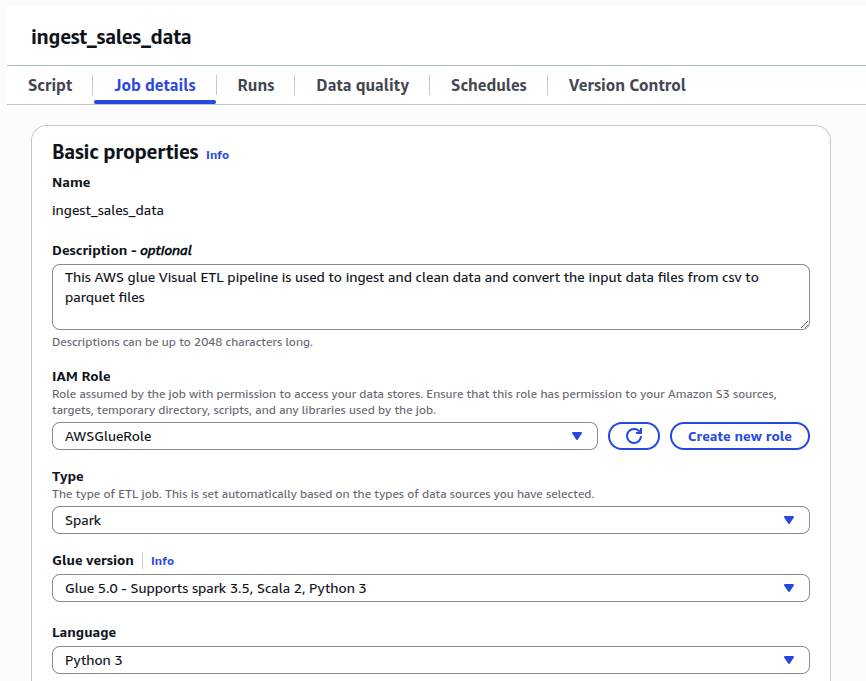
    - 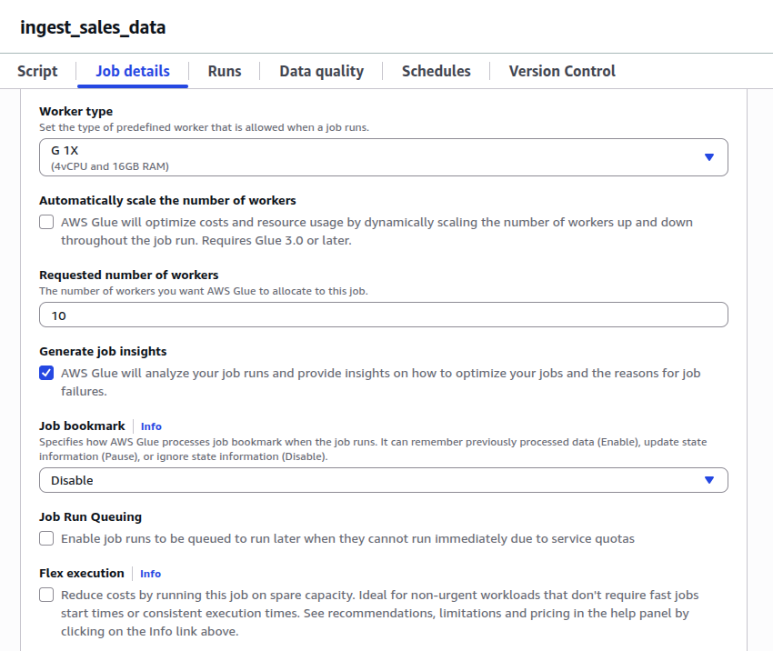
    - 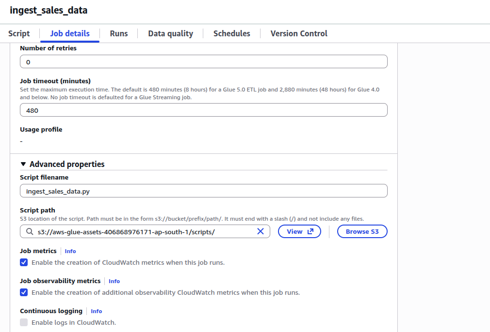
    - 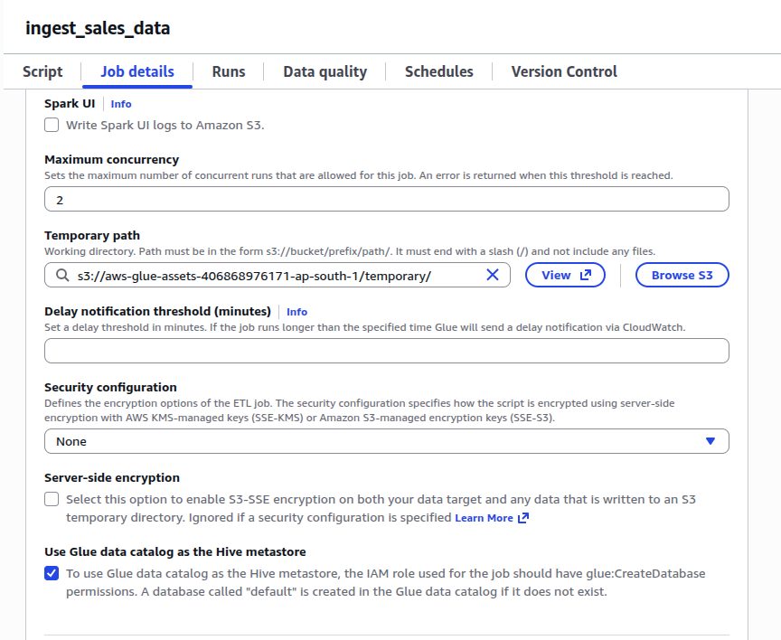
    - This ETL pipeline will recieve the params from lambda function using which it will know what files to process from the S3 bucket.
    - One thing to note make sure that you set max concurrency to 2 for glue ETL pipeline 
    - This is done to save cost 
    - This ETL pipeline will also prevent duplicated data in the table from ingestion.
        - ```python
            # -------- DEDUPLICATION STEP -------- #
            # This will check if there exists a row with a duplicate review_id if yes then it will drop one of the row and make sure that the row is unique
            # Doing this prevents any data duplication 
            df_clean = DropNullFields_node1772431857999.toDF()

            deduped_df = df_clean.dropDuplicates(["review_id"])

            print("Glue Visual ETL | Before dedup:", df_clean.count())
            print("Glue Visual ETL | After dedup:", deduped_df.count())

            deduped_dynamic_frame = DynamicFrame.fromDF(
                deduped_df, glueContext, "deduped_dynamic_frame"
            )
            # -------- DEDUPLICATION STEP -------- #
            ```
            - This code checks for duplicate ```review_id``` in the rows and will only allow one of them to pass so that it can be ingested.
### There are still gaps in this Implementation : (Version 4)
#### No true idempotency 
- In current implementation I will get duplicates
- Meaning the same file can be processed multiple times
- Real problem is :
    - If glue has to run twice to process the same file that has already been ingested then its not only a waste of compute but also waste of money in AWS
    - Step function runs twice again its a waste of compute and money specially when the file has already been ingested.
    - DLQ noise increases
    - Observability becomes messy
#### Solution : 
- Create a file processing repository (DynamoDB)
- Keys:
    - ```bash 
        PK: file_key (S3 object key)
    ```
- Attributes:
    - ```bash
        status: IN_PROGRESS | SUCCESS | FAILED
        row_count
        error_message
        event_payload
        updated_at
      ```

### NOTE : Common Data Quality rules in AWS Visual ETL pipeline
Common DQ rules
You can use:
- IsComplete
- IsUnique
- RowCount
- ColumnCount
- ColumnValues BETWEEN
- ColumnLength
- MatchesRegex
- ReferentialIntegrity

## Implementation : (Version 5)
- In this phase of implementation I am going to implement dynamo db to keep track of files that have been ingested successfully or failed or in progress

### Theory : Implementation (Version 5)
#### DynamoDB vs RDS
-  **DynamoDB (NoSQL, key-value)**
    - Schema: flexible (no rigid schema)
    - Access pattern: key-based lookups (O(1))
    - Scaling: automatic, virtually unlimited
    - Concurrency: built-in atomic conditional writes
    - Latency: single-digit milliseconds
    - Operations: simple (get/put/update)
    - Cost model: per request
    - atomic conditional writes at scale
- **RDS (Relational DB)**
    - Schema: strict (tables, joins, constraints)
    - Access pattern: complex queries, joins
    - Scaling: vertical (or complex horizontal)
    - Concurrency: transactional (ACID), but heavier
    - Latency: higher than DynamoDB
    - Operations: SQL, joins, aggregations
    - Cost model: instance-based (always on)
### Proposed architecture 
```bash
                ┌─────────────────────────┐
                │   S3 Source Bucket      │
                │   (CSV Files)           │
                └────────────┬────────────┘
                             │
                             ▼
                ┌─────────────────────────┐
                │      EventBridge        │
                └────────────┬────────────┘
                             │
                             ▼
                ┌─────────────────────────┐
                │   SQS BUFFER (FIFO)     │
                │ FileProcessingQueue     │
                └────────────┬────────────┘
                             │
                             ▼
                ┌─────────────────────────┐
                │        Lambda           │
                │ (Trigger StepFn)        │
                └────────────┬────────────┘
                             │
                ┌────────────▼────────────┐
                │     DynamoDB (NEW)      │
                │  File Processing Table  │
                │-------------------------│
                │ PK: file_key            │
                │ status                  │
                │ row_count               │
                │ error_message           │
                │ event_payload           │
                │ retry_count             │
                └────────────┬────────────┘
                             │
                             ▼
                ┌─────────────────────────┐
                │      Step Function      │
                │ orchestrate_ingestion   │
                └────────────┬────────────┘
                             │
                             ▼
                ┌─────────────────────────┐
                │        Glue ETL         │
                └────────────┬────────────┘
                             │
                             ▼
                ┌─────────────────────────┐
                │     Silver S3 Layer     │
                └─────────────────────────┘
```

## Implementation phase for version 5
#### S3 bucket related settings 
- Set the setting related to sending the events to the event bridge in this source S3 bucket like as shown below 
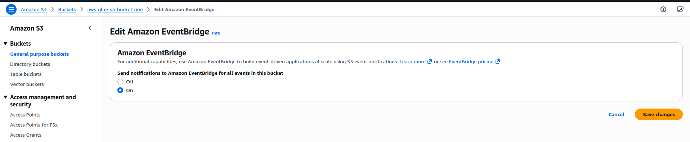
    
#### SQS (sales-ingestion-dlq)
- Access policy for this sqs ```sales-ingestion-dlq```
    - ```json
        {
        "Version": "2012-10-17",
        "Id": "__default_policy_ID",
        "Statement": [
            {
            "Sid": "__owner_statement",
            "Effect": "Allow",
            "Principal": {
                "AWS": "arn:aws:iam::406868976171:root"
            },
            "Action": "SQS:*",
            "Resource": "arn:aws:sqs:ap-south-1:406868976171:sales-ingestion-dlq"
            },
            {
            "Sid": "AllowEventBridgeToSendMessage",
            "Effect": "Allow",
            "Principal": {
                "Service": "events.amazonaws.com"
            },
            "Action": "sqs:SendMessage",
            "Resource": "arn:aws:sqs:ap-south-1:406868976171:sales-ingestion-dlq",
            "Condition": {
                "ArnEquals": {
                "aws:SourceArn": "arn:aws:events:ap-south-1:406868976171:rule/ActivateLambdaFuncEventBridgeRules"
                }
            }
            },
            {
            "Sid": "AWSEvents_ActivateLambdaFuncEventBridgeRules_dlq_41c9320f-edd2-4fde-ad71-2985e68b1d7c",
            "Effect": "Allow",
            "Principal": {
                "Service": "events.amazonaws.com"
            },
            "Action": "sqs:SendMessage",
            "Resource": "arn:aws:sqs:ap-south-1:406868976171:sales-ingestion-dlq",
            "Condition": {
                "ArnEquals": {
                "aws:SourceArn": "arn:aws:events:ap-south-1:406868976171:rule/ActivateLambdaFuncEventBridgeRules"
                }
            }
            }
        ]
        }
      ```
- 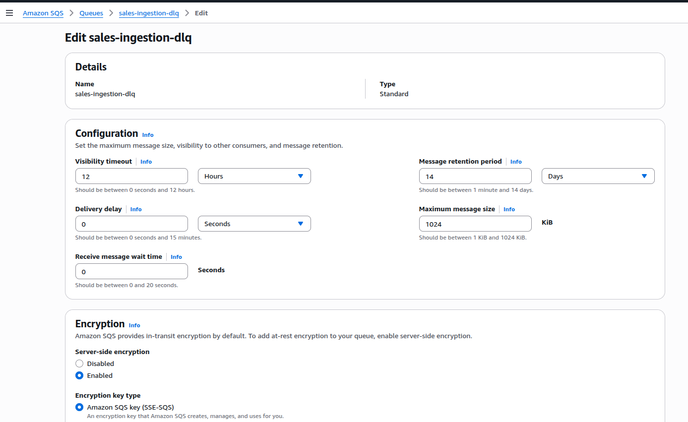
- 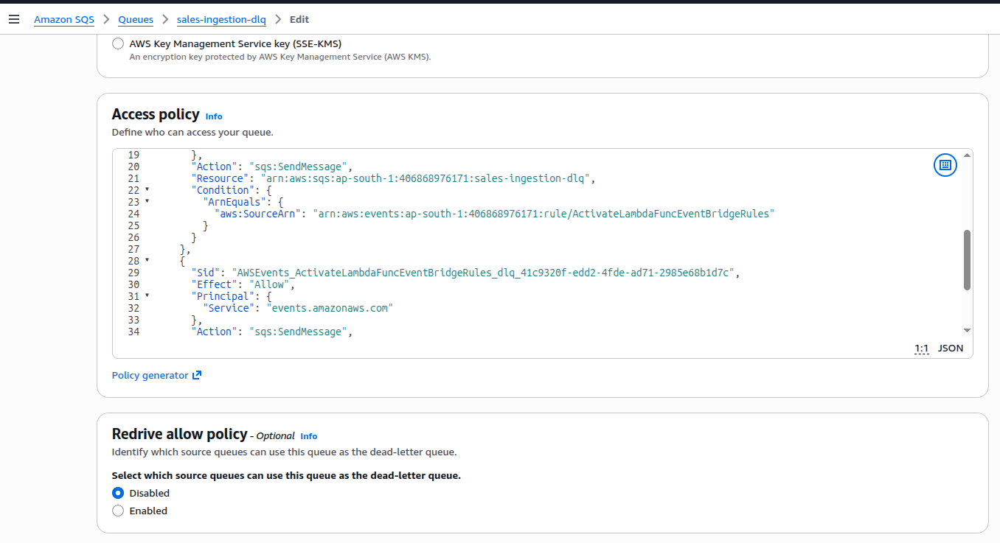
- 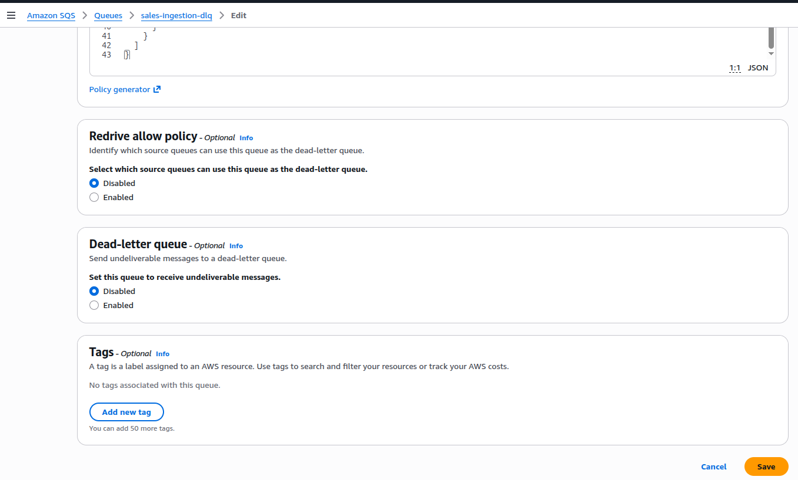
- This sqs queue stores the event messages in a queue in the event of ETL pipeline failure so that we can use ```replay_failed_ingestion``` step function to manually replay all the events and ingest the data from the files that have failed to be ingested due to errors after resolving the cause for error.

#### Step function (replay_failed_ingestion)
- Attach this permissions to IAM role 
    - 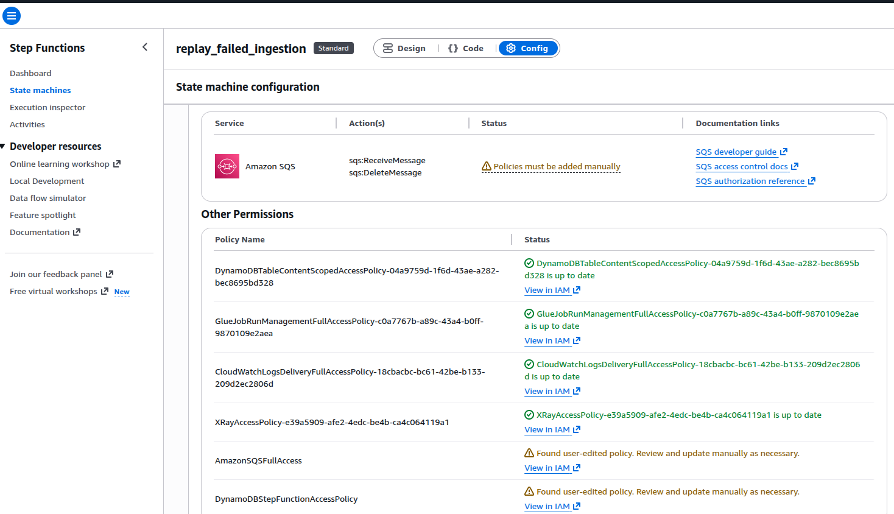
    - Let AWS create IAM role for your step functions and then add more permissions to this IAM role as needed by your use case.
    - Attach one AWS managed policy called ```AmazonSQSFullAccess```
    - Attach one custom policy for dynamoDB related permissions named ```DynamoDBStepFunctionAccessPolicy```
        - ```json
            {
                "Version": "2012-10-17",
                "Statement": [
                    {
                        "Sid": "DynamoDBStepFunctionAccessPolicy",
                        "Effect": "Allow",
                        "Action": [
                            "dynamodb:UpdateItem",
                            "dynamodb:GetItem"
                        ],
                        "Resource": "arn:aws:dynamodb:ap-south-1:406868976171:table/file_processing_registry"
                    }
                ]
            }
          ```
```json
{
  "Comment": "Replay ETL from DLQ (Fixed - State Preservation + Safe Errors)",
  "StartAt": "ReceiveFromDLQ",
  "States": {
    "ReceiveFromDLQ": {
      "Type": "Task",
      "Resource": "arn:aws:states:::aws-sdk:sqs:receiveMessage",
      "Parameters": {
        "QueueUrl": "https://sqs.ap-south-1.amazonaws.com/406868976171/sales-ingestion-dlq",
        "MaxNumberOfMessages": 10
      },
      "ResultPath": "$.dlq",
      "Next": "CheckIfEmpty"
    },
    "CheckIfEmpty": {
      "Type": "Choice",
      "Choices": [
        {
          "Variable": "$.dlq.Messages",
          "IsPresent": false,
          "Next": "Success"
        }
      ],
      "Default": "ReplayBatch"
    },
    "ReplayBatch": {
      "Type": "Map",
      "ItemsPath": "$.dlq.Messages",
      "MaxConcurrency": 2,
      "Iterator": {
        "StartAt": "ExtractPayload",
        "States": {
          "ExtractPayload": {
            "Type": "Pass",
            "Parameters": {
              "receiptHandle.$": "$.ReceiptHandle",
              "body.$": "States.StringToJson($.Body)"
            },
            "ResultPath": "$.parsed",
            "Next": "CheckRetry"
          },
          "CheckRetry": {
            "Type": "Task",
            "Resource": "arn:aws:states:::dynamodb:getItem",
            "Parameters": {
              "TableName": "file_processing_registry",
              "Key": {
                "file_key": {
                  "S.$": "$.parsed.body.file_key"
                }
              }
            },
            "ResultPath": "$.ddb",
            "Next": "EvaluateRetry"
          },
          "EvaluateRetry": {
            "Type": "Choice",
            "Choices": [
              {
                "Variable": "$.ddb.Item.retry_count.N",
                "NumericLessThan": 3,
                "Next": "IncrementRetry"
              }
            ],
            "Default": "SkipReplay"
          },
          "IncrementRetry": {
            "Type": "Task",
            "Resource": "arn:aws:states:::dynamodb:updateItem",
            "Parameters": {
              "TableName": "file_processing_registry",
              "Key": {
                "file_key": {
                  "S.$": "$.parsed.body.file_key"
                }
              },
              "UpdateExpression": "ADD retry_count :inc",
              "ExpressionAttributeValues": {
                ":inc": {
                  "N": "1"
                }
              }
            },
            "Next": "RunGlueJob"
          },
          "RunGlueJob": {
            "Type": "Task",
            "Resource": "arn:aws:states:::glue:startJobRun.sync",
            "ResultPath": "$.glueResult",
            "Parameters": {
              "JobName": "ingest_sales_data",
              "Arguments": {
                "--source_bucket.$": "$.parsed.body.bucket",
                "--source_key.$": "$.parsed.body.key"
              }
            },
            "Catch": [
              {
                "ErrorEquals": [
                  "States.ALL"
                ],
                "ResultPath": "$.error",
                "Next": "UpdateFailure"
              }
            ],
            "Next": "UpdateSuccess"
          },
          "UpdateSuccess": {
            "Type": "Task",
            "Resource": "arn:aws:states:::dynamodb:updateItem",
            "Parameters": {
              "TableName": "file_processing_registry",
              "Key": {
                "file_key": {
                  "S.$": "$.parsed.body.file_key"
                }
              },
              "UpdateExpression": "SET #s = :s, updated_at = :t",
              "ExpressionAttributeNames": {
                "#s": "status"
              },
              "ExpressionAttributeValues": {
                ":s": {
                  "S": "SUCCESS"
                },
                ":t": {
                  "S.$": "$$.State.EnteredTime"
                }
              }
            },
            "Next": "DeleteMessage"
          },
          "UpdateFailure": {
            "Type": "Task",
            "Resource": "arn:aws:states:::dynamodb:updateItem",
            "Parameters": {
              "TableName": "file_processing_registry",
              "Key": {
                "file_key": {
                  "S.$": "$.parsed.body.file_key"
                }
              },
              "UpdateExpression": "SET #s = :s, error_message = :e, updated_at = :t",
              "ExpressionAttributeNames": {
                "#s": "status"
              },
              "ExpressionAttributeValues": {
                ":s": {
                  "S": "FAILED"
                },
                ":e": {
                  "S.$": "States.JsonToString($.error)"
                },
                ":t": {
                  "S.$": "$$.State.EnteredTime"
                }
              }
            },
            "Next": "DeleteMessage"
          },
          "SkipReplay": {
            "Type": "Pass",
            "Next": "DeleteMessage"
          },
          "DeleteMessage": {
            "Type": "Task",
            "Resource": "arn:aws:states:::aws-sdk:sqs:deleteMessage",
            "Parameters": {
              "QueueUrl": "https://sqs.ap-south-1.amazonaws.com/406868976171/sales-ingestion-dlq",
              "ReceiptHandle.$": "$.parsed.receiptHandle"
            },
            "End": true
          }
        }
      },
      "Next": "Success"
    },
    "Success": {
      "Type": "Succeed"
    }
  }
}
```
- 
- **ReceiveFromDLQ** — The Step Function opens the sales-ingestion-dlq and pulls up to 10 messages at once. These are messages that were written there by orchestrate_data_ingestion when Glue previously failed.
- **CheckIfEmpty** — Checks if the Messages key is present in the SQS response. If the queue was empty, SQS returns no Messages key at all (not an empty array — it literally omits the key). The Choice state uses IsPresent: false to detect this and short-circuits straight to Success — nothing to do.
- **Map (ReplayBatch)** — For each message in the batch, it spawns a parallel iterator with MaxConcurrency: 2, meaning it processes at most 2 failed files at the same time.
- **ExtractPayload** — A Pass state that uses States.StringToJson to parse the raw SQS message body (which is a string) into a usable JSON object. It also pulls out the ReceiptHandle, which is the SQS token you need later to delete the message.
- **CheckRetry** — Looks up the file's record in file_processing_registry DynamoDB using file_key as the key. It retrieves the current retry_count.
- **EvaluateRetry** — Checks if retry_count < 3. This is your poison message guard. If a file has already been retried 3 or more times and keeps failing, it's considered a poison message — likely corrupt data or a permanent schema issue. You don't want to keep hammering Glue with it. So retry_count >= 3 routes to SkipReplay.
- **IncrementRetry** — Before attempting Glue, it immediately increments retry_count by 1 in DynamoDB. This is important — it increments before running Glue, not after. That way if Glue hangs, crashes mid-run, or the Step Function itself dies, the counter is already updated. You won't accidentally lose track of how many times you've tried.
- **RunGlueJob** — Starts the actual Glue ETL job with .sync, meaning it waits for Glue to fully finish before moving on. It passes source_bucket and source_key extracted from the DLQ message body.
- **UpdateSuccess / UpdateFailure** — Depending on whether Glue succeeded or failed, it writes the result back to DynamoDB. On success it sets status = SUCCESS. On failure it sets status = FAILED and stores the error string from $.error via States.JsonToString.
- **SkipReplay** — Just a Pass state that does nothing. The poison message flows straight through to DeleteMessage.
- **DeleteMessage** — This always runs, regardless of success, failure, or skip. It deletes the message from the DLQ using the ReceiptHandle. This is correct behaviour — even if Glue failed again, you still remove it from the DLQ because you've already recorded the failure in DynamoDB. If you left it in the DLQ, the next replay run would just pick it up again infinitely.

#### SQS (FileProcessingQueue.fifo)
- ```json
    {
    "Version": "2012-10-17",
    "Statement": [
        {
        "Sid": "AllowEventBridgeToSend",
        "Effect": "Allow",
        "Principal": {
            "Service": "events.amazonaws.com"
        },
        "Action": "sqs:SendMessage",
        "Resource": "arn:aws:sqs:ap-south-1:406868976171:FileProcessingQueue",
        "Condition": {
            "ArnEquals": {
            "aws:SourceArn": "arn:aws:events:ap-south-1:406868976171:rule/ActivateLambdaFuncEventBridgeRules"
            }
        }
        }
    ]
    }
  ```
- 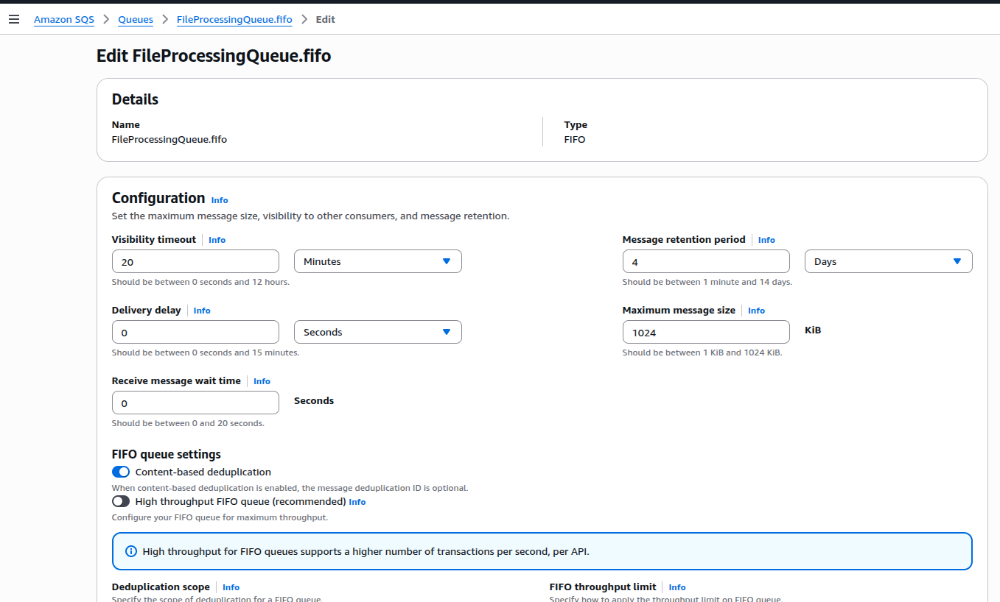
- 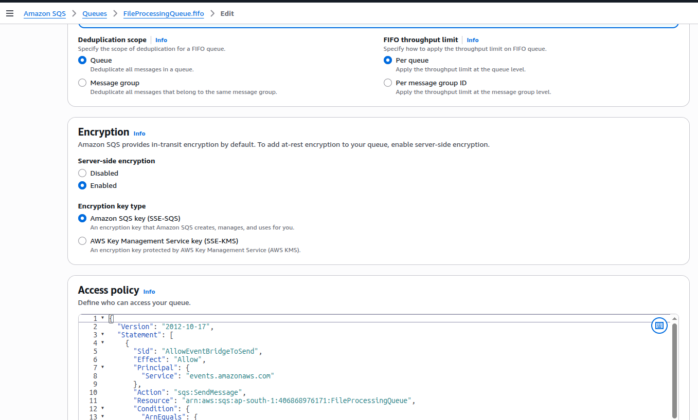
- 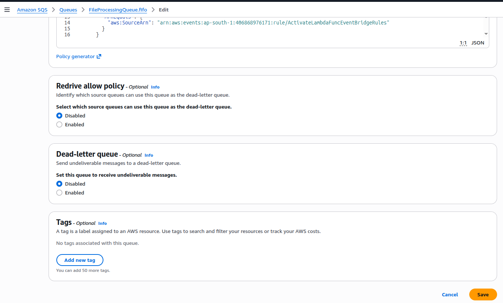
- This is another SQS queue that is used in this architecture so as to tackle the backpressure 
- Backpressure is what happens when a downstream system cannot consume data as fast as an upstream system is producing it, and that slowness propagates back upstream to slow down or pause the producer.
- The word comes from fluid dynamics — imagine water flowing through pipes of different diameters. If a wide pipe feeds into a narrow pipe, water pressure builds up at the junction. The narrow pipe is creating backpressure against the flow. The same concept applies to data systems.
- A concrete example from my own pipeline makes this clearest. Imagine your S3 bucket starts receiving 500 CSV files per minute from an upstream application. Your Glue ETL job can only process 2 files concurrently due to your MaxConcurrency: 2 setting. Without any buffering, those 500 events would all hit your Step Function simultaneously, Glue would reject most of them with ConcurrentRunsExceededException, and you'd have a cascade of failures.
- This is exactly why I added SQS between EventBridge and Lambda. SQS is acting as your backpressure mechanism. The 500 events land safely in the queue, and Lambda only pulls from it at a controlled rate using your batch size of 5 and max concurrency of 2. The queue absorbs the burst — it holds the excess load and releases it at the pace the downstream system can handle. The upstream system (S3/EventBridge) never needs to know that Glue is slow.
- Without backpressure handling, systems fail in two common ways. The first is the fast producer overwhelming the slow consumer — the consumer crashes under load or starts dropping data silently. The second is unbounded memory growth — if the consumer is slow and the producer keeps pushing, the buffer between them grows until the system runs out of memory.
- In data engineering specifically you see backpressure handled in a few different ways. Queues like SQS, Kafka, and RabbitMQ are the most common approach — they decouple the producer and consumer so each can run at its own pace. Rate limiting at the producer side is another approach, where the producer is told to slow down explicitly. Streaming frameworks like Apache Flink and Spark Structured Streaming have backpressure built in natively — if a downstream operator is slow, Flink automatically reduces the rate at which the source reads new records.
#### Create an IAM role for lambda function (TriggerStepFunctionRoleForLambdaFunc)
- Create an IAM role named ```TriggerStepFunctionRoleForLambdaFunc``` for lambda function with appropriate permissions (Policies)
- Permissions added to this role is 
    - ```AllowLambdaToAccessSQSAndStepFunction```
        - ```json
            {
                "Version": "2012-10-17",
                "Statement": [
                    {
                        "Effect": "Allow",
                        "Action": [
                            "states:StartExecution"
                        ],
                        "Resource": "arn:aws:states:ap-south-1:406868976171:stateMachine:orchestrate_data_ingestion"
                    },
                    {
                        "Effect": "Allow",
                        "Action": [
                            "sqs:ReceiveMessage",
                            "sqs:DeleteMessage",
                            "sqs:GetQueueAttributes"
                        ],
                        "Resource": "arn:aws:sqs:ap-south-1:406868976171:FileProcessingQueue.fifo"
                    },
                    {
                        "Effect": "Allow",
                        "Action": [
                            "logs:CreateLogGroup",
                            "logs:CreateLogStream",
                            "logs:PutLogEvents"
                        ],
                        "Resource": "*"
                    }
                ]
            }
          ```
    - ```DynamoDbAccessPolicyForLambdaFunction```
        - ```json
            {
                "Version": "2012-10-17",
                "Statement": [
                    {
                        "Sid": "DynamoDbAccessPolicyForLambdaFunction",
                        "Effect": "Allow",
                        "Action": [
                            "dynamodb:PutItem",
                            "dynamodb:GetItem",
                            "dynamodb:UpdateItem"
                        ],
                        "Resource": "arn:aws:dynamodb:ap-south-1:406868976171:table/file_processing_registry"
                    }
                ]
            }
          ```

#### Lambda function (StartStateFunction)
- ```python
    import json
    import boto3
    import uuid
    from datetime import datetime, timezone, timedelta

    sf = boto3.client("stepfunctions")
    dynamodb = boto3.client("dynamodb")

    STATE_MACHINE_ARN = "arn:aws:states:ap-south-1:406868976171:stateMachine:orchestrate_data_ingestion"
    TABLE_NAME = "file_processing_registry"

    def lambda_handler(event, context):

        execution_id = str(uuid.uuid4())[:8]

        IST = timezone(timedelta(hours=5, minutes=30))
        timestamp = datetime.now(IST).strftime("%Y-%m-%d %H:%M:%S %Z")

        print(f"\n===== Lambda Invocation START =====")
        print(f"ExecutionID: {execution_id}")
        print(f"Timestamp: {timestamp}")
        print("Full Event From SQS:", json.dumps(event))
        print("===================================\n")

        files = []

        for record in event["Records"]:
            body = json.loads(record["body"])

            bucket = body["detail"]["bucket"]["name"]
            key = body["detail"]["object"]["key"]

            file_key = f"s3://{bucket}/{key}"

            try:
                # Idempotency check (CRITICAL)
                dynamodb.put_item(
                    TableName=TABLE_NAME,
                    Item={
                        "file_key": {"S": file_key},
                        "status": {"S": "IN_PROGRESS"},
                        "retry_count": {"N": "0"},
                        "created_at": {"S": timestamp}
                    },
                    ConditionExpression="attribute_not_exists(file_key)"
                )

                # Only add if it's NOT duplicate
                files.append({
                    "bucket": bucket,
                    "key": key,
                    "file_key": file_key
                })

                print(f"Accepted file: {file_key}")

            except dynamodb.exceptions.ConditionalCheckFailedException:
                print(f"Duplicate skipped: {file_key}")

        print("Files to process:", files)

        # Only trigger StepFn if there are valid files
        if files:
            sf.start_execution(
                stateMachineArn=STATE_MACHINE_ARN,
                input=json.dumps({"files": files})
            )
            print("Step Function triggered")
        else:
            print("No new files to process")

        return {"status": "ok"}
    ```
- 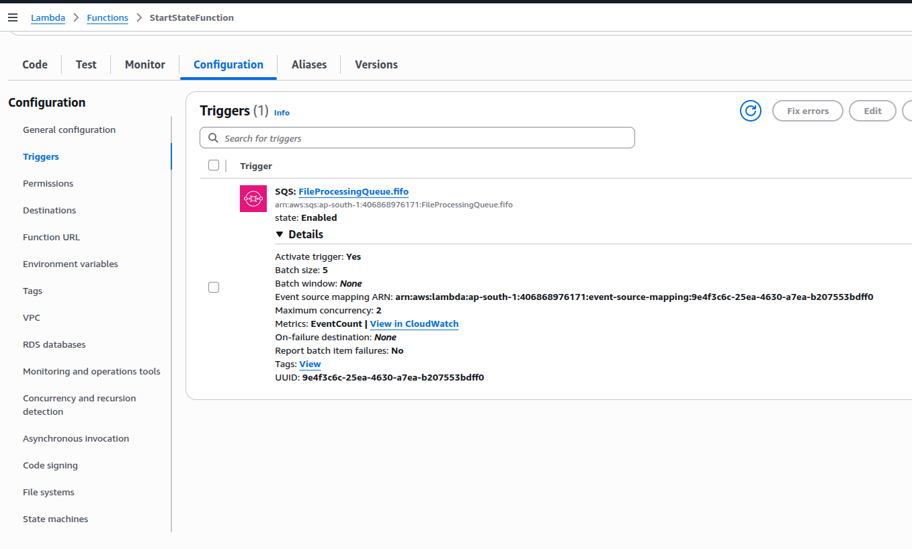
- 
- What triggers it?
    - SQS triggers this Lambda automatically whenever messages arrive in FileProcessingQueue.fifo. Each invocation receives a batch of up to 5 messages (your configured batch size), delivered as ```event["Records"]```.
- Section 1 : Setup and logging
    - ```python
        execution_id = str(uuid.uuid4())[:8]
        timestamp = datetime.now(IST).strftime(...)
      ```
    - At the start, it generates a short random ```execution_id``` (first 8 chars of a UUID) and captures the current IST timestamp. These are purely for logging — they let you correlate CloudWatch log lines back to a specific Lambda invocation when debugging. Nothing is done with ```execution_id``` beyond printing it.
- Section 2 : Parse each SQS record
    - ```python
        for record in event["Records"]:
            body = json.loads(record["body"])
            bucket = body["detail"]["bucket"]["name"]
            key = body["detail"]["object"]["key"]
            file_key = f"s3://{bucket}/{key}"
      ```
    - Each SQS message body is a JSON string containing the original EventBridge event from S3. The Lambda parses it and extracts three things: the bucket name, the object key (file path inside the bucket), and then constructs ```file_key``` by combining them into a full S3 URI like ```s3://aws-glue-s3-bucket-one/raw_data/sales_data/sales_data_1.csv```. This file_key is what gets used as the primary key in DynamoDB.
- Section 3 : The idempotency check (the most important part)
    - ```python
      dynamodb.put_item(
            TableName=TABLE_NAME,
            Item={ "file_key": ..., "status": "IN_PROGRESS", "retry_count": "0", ... },
            ConditionExpression="attribute_not_exists(file_key)"
        )
      ```
    - This is an atomic conditional write. It says: write this record to DynamoDB, but only if an item with this ```file_key``` does not already exist. DynamoDB evaluates the condition and the write in a single operation — there is no gap between checking and writing that another process could slip through.
    - If the file is new, the write succeeds, the record is created with ```status = IN_PROGRESS``` and ```retry_count = 0```, and the file gets added to the files list.
    - If the file was already processed (or is currently being processed), DynamoDB raises ```ConditionalCheckFailedException```. The ```except``` block catches it silently, logs ```"Duplicate skipped"```, and moves on. The file is never added to ```files```.
- Section 4 : Trigger the Step Function
    - ```python
        if files:
        sf.start_execution(
            stateMachineArn=STATE_MACHINE_ARN,
            input=json.dumps({"files": files})
        )
      ```
    - After processing all records in the batch, if there is at least one genuinely new file, it fires ```orchestrate_data_ingestion``` with the list of new files as input. Each file object in the list contains ```bucket```, ```key```, and ```file_key``` all three are needed downstream: ```bucket``` and ```key``` go to Glue, ```file_key``` goes to DynamoDB updates in the Step Function.
    - If ```files``` is empty (every record in the batch was a duplicate), the Step Function is never triggered at all. No compute wasted.
- The Lambda is intentionally doing only two things: duplicate filtering and Step Function invocation. It is not running Glue, not doing transformation, not writing success/failure status. It just decides whether a file deserves to enter the pipeline at all, creates the initial DynamoDB record as a lock, and hands off. Everything else happens inside the Step Function.
- For more information about how the lamdba function works refer to this video : https://youtu.be/XFGSuj83wdc

#### Step function (orchestrate_data_ingestion)
- Attach this permissions to IAM role 
    - 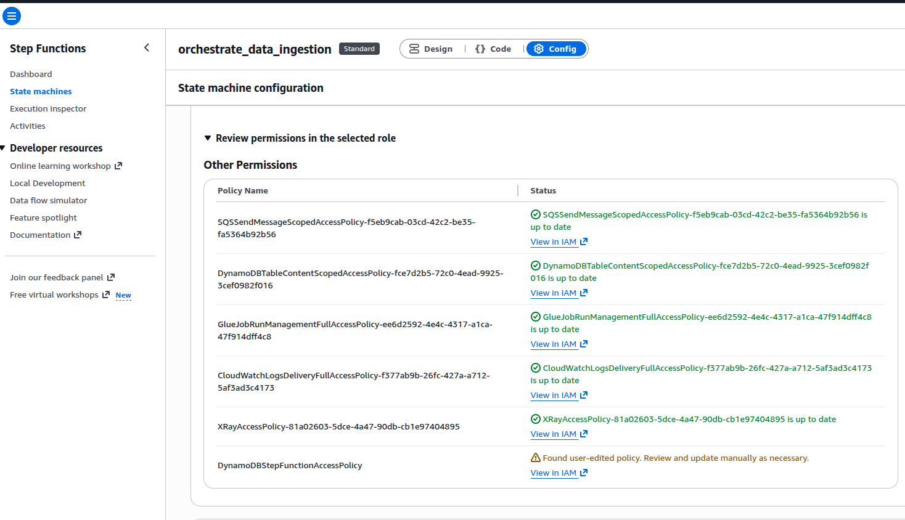
    - Let AWS create IAM role for this step function and add more permissions to this role as per your needs 
    - Add permissions for dynamoDb named ```DynamoDBStepFunctionAccessPolicy```
        - ```json
            {
                "Version": "2012-10-17",
                "Statement": [
                    {
                        "Sid": "DynamoDBStepFunctionAccessPolicy",
                        "Effect": "Allow",
                        "Action": [
                            "dynamodb:UpdateItem",
                            "dynamodb:GetItem"
                        ],
                        "Resource": "arn:aws:dynamodb:ap-south-1:406868976171:table/file_processing_registry"
                    }
                ]
            }
          ```
```json
{
  "Comment": "Glue ETL Orchestration with DynamoDB Tracking",
  "StartAt": "ProcessFiles",
  "States": {
    "ProcessFiles": {
      "Type": "Map",
      "ItemsPath": "$.files",
      "MaxConcurrency": 2,
      "Iterator": {
        "StartAt": "RunGlueJob",
        "States": {
          "RunGlueJob": {
            "Type": "Task",
            "Resource": "arn:aws:states:::glue:startJobRun.sync",
            "Parameters": {
              "JobName": "ingest_sales_data",
              "Arguments": {
                "--source_bucket.$": "$.bucket",
                "--source_key.$": "$.key"
              }
            },
            "ResultPath": "$.glueResult",
            "Retry": [
              {
                "ErrorEquals": [
                  "Glue.ConcurrentRunsExceededException"
                ],
                "IntervalSeconds": 60,
                "MaxAttempts": 10,
                "BackoffRate": 1.5
              },
              {
                "ErrorEquals": [
                  "States.ALL"
                ],
                "IntervalSeconds": 30,
                "MaxAttempts": 2,
                "BackoffRate": 2
              }
            ],
            "Catch": [
              {
                "ErrorEquals": [
                  "States.ALL"
                ],
                "ResultPath": "$.error",
                "Next": "UpdateFailure"
              }
            ],
            "Next": "UpdateSuccess"
          },
          "UpdateSuccess": {
            "Type": "Task",
            "Resource": "arn:aws:states:::dynamodb:updateItem",
            "Parameters": {
              "TableName": "file_processing_registry",
              "Key": {
                "file_key": {
                  "S.$": "$.file_key"
                }
              },
              "UpdateExpression": "SET #s = :s, updated_at = :t",
              "ExpressionAttributeNames": {
                "#s": "status"
              },
              "ExpressionAttributeValues": {
                ":s": {
                  "S": "SUCCESS"
                },
                ":t": {
                  "S.$": "$$.State.EnteredTime"
                }
              }
            },
            "End": true
          },
          "UpdateFailure": {
            "Type": "Task",
            "Resource": "arn:aws:states:::dynamodb:updateItem",
            "Parameters": {
              "TableName": "file_processing_registry",
              "Key": {
                "file_key": {
                  "S.$": "$.file_key"
                }
              },
              "UpdateExpression": "SET #s = :s, error_message = :e, updated_at = :t",
              "ExpressionAttributeNames": {
                "#s": "status"
              },
              "ExpressionAttributeValues": {
                ":s": {
                  "S": "FAILED"
                },
                ":e": {
                  "S.$": "$.error.Cause"
                },
                ":t": {
                  "S.$": "$$.State.EnteredTime"
                }
              }
            },
            "Next": "SendToDLQ"
          },
          "SendToDLQ": {
            "Type": "Task",
            "Resource": "arn:aws:states:::sqs:sendMessage",
            "Parameters": {
              "QueueUrl": "https://sqs.ap-south-1.amazonaws.com/406868976171/sales-ingestion-dlq",
              "MessageBody": {
                "bucket.$": "$.bucket",
                "key.$": "$.key",
                "file_key.$": "$.file_key"
              }
            },
            "End": true
          }
        }
      },
      "End": true
    }
  }
}
```
- 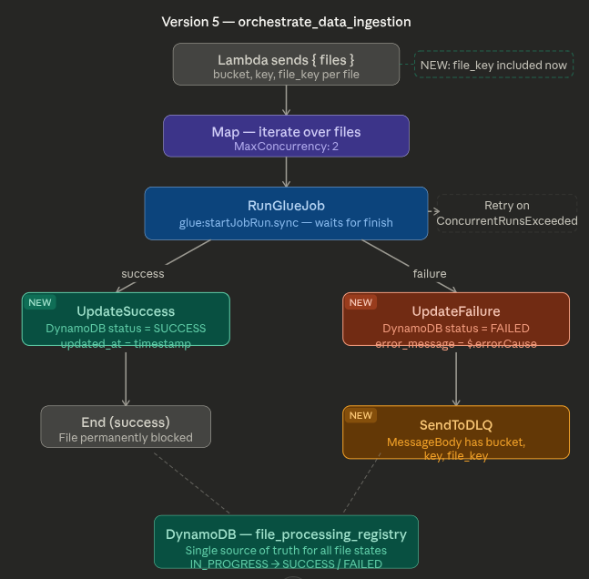
- Three new states were inserted into this step function, and ```file_key``` was added to the Lambda payload 
- The first addition is UpdateSuccess. After Glue finishes successfully, instead of jumping straight to End, the Step Function now calls dynamodb:updateItem and sets status = SUCCESS with a timestamp. This is what closes the idempotency loop — Lambda wrote IN_PROGRESS, and now the Step Function writes SUCCESS. The next time the same file arrives, Lambda's put_item with attribute_not_exists(file_key) will see the existing record and throw ConditionalCheckFailedException, which is exactly what you want.
- The second addition is UpdateFailure. When Glue fails, before sending anything to the DLQ, the Step Function now writes status = FAILED and captures $.error.Cause as error_message in DynamoDB. This gives you a structured audit record you can query — you can run aws dynamodb scan --table-name file_processing_registry and immediately see which files failed and why, without digging through CloudWatch logs.
- The third addition is that SendToDLQ's MessageBody now explicitly includes file_key alongside bucket and key. This is what makes the replay_failed_ingestion Step Function work correctly — when it reads a message from the DLQ and needs to call dynamodb:updateItem, it now has the file_key to use as the partition key lookup.
- This version update brings 
    - ```Step Function = orchestrator + state updater```

#### AWS Glue ETL (ingest_sales_data)
- Create an IAM role called ```AWSGlueRole``` and give appropriate permissions so that AWS glue ETL can function properly
    - Add permissions 
        - Add an AWS managed permisson called ```AWSGlueServiceRole```
        - Add a custom permission named ```LimitedS3PermissionPolicy```
            - ```json
                {
                    "Version": "2012-10-17",
                    "Statement": [
                        {
                            "Effect": "Allow",
                            "Action": [
                                "s3:GetObject",
                                "s3:PutObject",
                                "s3:ListBucket"
                            ],
                            "Resource": [
                                "arn:aws:s3:::aws-glue-s3-bucket-one",
                                "arn:aws:s3:::aws-glue-s3-bucket-one/*",
                                "arn:aws:s3:::data-sink-one",
                                "arn:aws:s3:::data-sink-one/*"
                            ]
                        }
                    ]
                }
              ```
```python
import sys
from awsglue.transforms import *
from awsglue.utils import getResolvedOptions
from pyspark.context import SparkContext
from awsglue.context import GlueContext
from awsglue.job import Job
from awsglue.gluetypes import *
from awsgluedq.transforms import EvaluateDataQuality
from awsglue import DynamicFrame

from functools import reduce
from pyspark.sql import functions as F

def sparkSqlQuery(glueContext, query, mapping, transformation_ctx) -> DynamicFrame:
    for alias, frame in mapping.items():
        frame.toDF().createOrReplaceTempView(alias)
    result = spark.sql(query)
    return DynamicFrame.fromDF(result, glueContext, transformation_ctx)
def _find_null_fields(ctx, schema, path, output, nullStringSet, nullIntegerSet, frame):
    if isinstance(schema, StructType):
        for field in schema:
            new_path = path + "." if path != "" else path
            output = _find_null_fields(ctx, field.dataType, new_path + field.name, output, nullStringSet, nullIntegerSet, frame)
    elif isinstance(schema, ArrayType):
        if isinstance(schema.elementType, StructType):
            output = _find_null_fields(ctx, schema.elementType, path, output, nullStringSet, nullIntegerSet, frame)
    elif isinstance(schema, NullType):
        output.append(path)
    else:
        x, distinct_set = frame.toDF(), set()
        for i in x.select(path).distinct().collect():
            distinct_ = i[path.split('.')[-1]]
            if isinstance(distinct_, list):
                distinct_set |= set([item.strip() if isinstance(item, str) else item for item in distinct_])
            elif isinstance(distinct_, str) :
                distinct_set.add(distinct_.strip())
            else:
                distinct_set.add(distinct_)
        if isinstance(schema, StringType):
            if distinct_set.issubset(nullStringSet):
                output.append(path)
        elif isinstance(schema, IntegerType) or isinstance(schema, LongType) or isinstance(schema, DoubleType):
            if distinct_set.issubset(nullIntegerSet):
                output.append(path)
    return output

def drop_nulls(glueContext, frame, nullStringSet, nullIntegerSet, transformation_ctx) -> DynamicFrame:
    nullColumns = _find_null_fields(frame.glue_ctx, frame.schema(), "", [], nullStringSet, nullIntegerSet, frame)
    return DropFields.apply(frame=frame, paths=nullColumns, transformation_ctx=transformation_ctx)

args = getResolvedOptions(sys.argv, [
    'JOB_NAME',
    'source_bucket',
    'source_key'
])

source_bucket = args['source_bucket']
source_key = args['source_key']

sc = SparkContext()
glueContext = GlueContext(sc)
spark = glueContext.spark_session
job = Job(glueContext)
job.init(args['JOB_NAME'], args)

# Default ruleset used by all target nodes with data quality enabled
DEFAULT_DATA_QUALITY_RULESET = """Rules = [
    ColumnCount = 16,

    IsComplete "rating",
    IsComplete "rating_count",
    IsComplete "discounted_price",
    IsComplete "actual_price",

    ColumnValues "rating" >= 0,
    ColumnValues "rating_count" >= 0,
    ColumnValues "discounted_price" >= 0,
    ColumnValues "actual_price" >= 0,
    ColumnValues "discount_percentage" >= 0,
    
    IsUnique "product_id"
]"""

# -------- DELIMITER CORRUPTION CHECK -------- #
# It checks for delimiter / structural corruption STARTS
import csv
import io

raw_lines = spark.read.text(f"s3://{source_bucket}/{source_key}").collect()

if len(raw_lines) < 2:
    raise Exception("Glue Visual ETL | Corrupted CSV detected (file has no data rows)")

def count_csv_columns(line: str) -> int:
    """Count columns correctly, respecting quoted fields containing commas."""
    try:
        return len(next(csv.reader(io.StringIO(line))))
    except StopIteration:
        return 0

header_line = raw_lines[0][0]
expected_col_count = count_csv_columns(header_line)

bad_row_indices = []
for i, row in enumerate(raw_lines[1:], start=2):
    line = row[0]
    actual_col_count = count_csv_columns(line)
    if actual_col_count != expected_col_count:
        bad_row_indices.append((i, actual_col_count, line[:80]))

if bad_row_indices:
    details = "\n".join(
        [f"  Line {idx}: expected {expected_col_count} cols, got {actual} → {preview}..."
         for idx, actual, preview in bad_row_indices]
    )
    raise Exception(
        f"Glue Visual ETL | Corrupted CSV detected — {len(bad_row_indices)} row(s) have wrong column count "
        f"(likely semicolons used as delimiters instead of commas):\n{details}"
    )

print(f"Glue Visual ETL | Column count validation passed: all rows have {expected_col_count} columns")
# It checks for delimiter / structural corruption ENDS
# -------- DELIMITER CORRUPTION CHECK -------- #

# Script generated for node Raw data source S3
RawdatasourceS3_node1772431168408 = glueContext.create_dynamic_frame.from_options(format_options={"quoteChar": "\"", "withHeader": True, "separator": ",", "mode": "PERMISSIVE", "optimizePerformance": False}, connection_type="s3", format="csv", 
    # connection_options={"paths": ["s3://aws-glue-s3-bucket-one/raw_data/sales_data/"], "recurse": True}, 
    connection_options={"paths": [f"s3://{source_bucket}/{source_key}"],"recurse": False},
    transformation_ctx="RawdatasourceS3_node1772431168408")
# for debugging only
print(f"Glue Visual ETL | Processing file: s3://{source_bucket}/{source_key}")

df = RawdatasourceS3_node1772431168408.toDF()

print("Glue Visual ETL | DEBUG bucket:", source_bucket)
print("Glue Visual ETL | DEBUG key:", source_key)
print("Glue Visual ETL | DEBUG columns:", df.columns)
print("Glue Visual ETL | DEBUG row count:", df.count())
print("Glue Visual ETL | DEBUG schema:", df.schema)
print("Glue Visual ETL | DEBUG sample rows:", df.limit(2).toPandas())

# -------- CORRUPTION CHECK -------- #
# checks Spark-level corruption after parsing STARTS

# If Spark inferred no columns → corrupted file
if len(df.columns) == 0:
    raise Exception("Glue Visual ETL | Corrupted CSV detected (no columns inferred)")

expected_cols = len(df.columns)

# If dataframe empty → corrupted file
if df.limit(1).count() == 0:
    raise Exception("Glue Visual ETL | Corrupted CSV detected (empty dataframe)")

# Row-level corruption detection
null_exprs = [F.col(c).isNull().cast("int") for c in df.columns]

bad_rows = df.filter(
    reduce(lambda a, b: a + b, null_exprs) > expected_cols * 0.7
)

if bad_rows.limit(1).count() > 0:
    raise Exception("Glue Visual ETL | Corrupted CSV detected (null-heavy rows)")

# checks Spark-level corruption after parsing ENDS
# -------- CORRUPTION CHECK -------- #

#--------- CONVERT THE COLUMNS IN THE CSV FILE TO CORRECT DATA TYPES --------#
# Script generated for node SQL Query
SqlQuery61 = '''
SELECT
    product_id,
    product_name,
    category,
    about_product,
    user_id,
    user_name,
    review_id,
    review_title,
    review_content,
    img_link,
    product_link,

    -- discounted_price: ₹149 → 149.0
    CAST(
        REGEXP_REPLACE(discounted_price, '[^0-9.]', '')
        AS DOUBLE
    ) AS discounted_price,

    -- actual_price: ₹1,000 → 1000.0
    CAST(
        REGEXP_REPLACE(actual_price, '[^0-9.]', '')
        AS DOUBLE
    ) AS actual_price,

    -- discount_percentage: 85% → 85.0
    CAST(
        REGEXP_REPLACE(discount_percentage, '[^0-9.]', '')
        AS DOUBLE
    ) AS discount_percentage,

    -- rating: 3.9 → 3.9
    CAST(
        REGEXP_REPLACE(rating, '[^0-9.]', '')
        AS DOUBLE
    ) AS rating,

    -- rating_count: 24,871 → 24871
    CAST(
        REGEXP_REPLACE(rating_count, '[^0-9]', '')
        AS INT
    ) AS rating_count

FROM myDataSource;
'''

try:
    SQLQuery_node1772431252856 = sparkSqlQuery(glueContext, query = SqlQuery61, mapping = {"myDataSource":RawdatasourceS3_node1772431168408}, transformation_ctx = "SQLQuery_node1772431252856")
except Exception as e:
    print(f"Glue Visual ETL | SQL query execution failed | {e}")
    raise RuntimeError("Failing Glue job explicitly | Failed to execute sql query")
#--------- CONVERT THE COLUMNS IN THE CSV FILE TO CORRECT DATA TYPES --------#

# Script generated for node Drop Null Fields
DropNullFields_node1772431857999 = drop_nulls(glueContext, frame=SQLQuery_node1772431252856, nullStringSet={"", "null"}, nullIntegerSet={-1}, transformation_ctx="DropNullFields_node1772431857999")

# -------- DEDUPLICATION STEP -------- #
# This will check if there exists a row with a duplicate review_id if yes then it will drop one of the row and make sure that the row is unique
# Doing this prevents any data duplication 
df_clean = DropNullFields_node1772431857999.toDF()

deduped_df = df_clean.dropDuplicates()

print("Glue Visual ETL | Before dedup:", df_clean.count())
print("Glue Visual ETL | After dedup:", deduped_df.count())

deduped_dynamic_frame = DynamicFrame.fromDF(
    deduped_df, glueContext, "deduped_dynamic_frame"
)
# -------- DEDUPLICATION STEP -------- #

# Script generated for node Silver layer data sink S3
try:
    EvaluateDataQuality().process_rows(frame=deduped_dynamic_frame, ruleset=DEFAULT_DATA_QUALITY_RULESET, publishing_options={"dataQualityEvaluationContext": "EvaluateDataQuality_node1772428328053", "enableDataQualityResultsPublishing": True}, additional_options={"dataQualityResultsPublishing.strategy": "BEST_EFFORT", "observations.scope": "ALL"})
except Exception as e:
    print("Glue Visual ETL | DQ failed:", e)
    raise RuntimeError("Failing Glue job explicitly | Failed to run data quality rules")

SilverlayerdatasinkS3_node1772432020219 = glueContext.getSink(path="s3://data-sink-one/silver_layer/sales_data/", connection_type="s3", updateBehavior="LOG", partitionKeys=["category"], enableUpdateCatalog=True, transformation_ctx="SilverlayerdatasinkS3_node1772432020219")
SilverlayerdatasinkS3_node1772432020219.setCatalogInfo(catalogDatabase="aws-glue-tutorial-aditya",catalogTableName="silver_table_sales_data")
SilverlayerdatasinkS3_node1772432020219.setFormat("glueparquet", compression="snappy")
SilverlayerdatasinkS3_node1772432020219.writeFrame(deduped_dynamic_frame)
job.commit()
```
- AWS Glue ETL configurations
    - 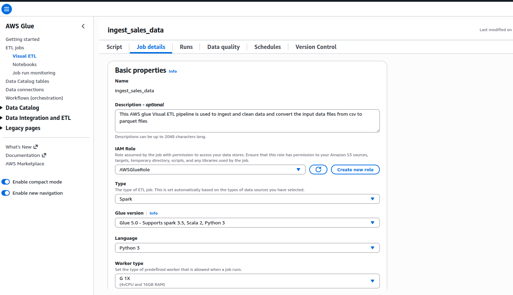
    - 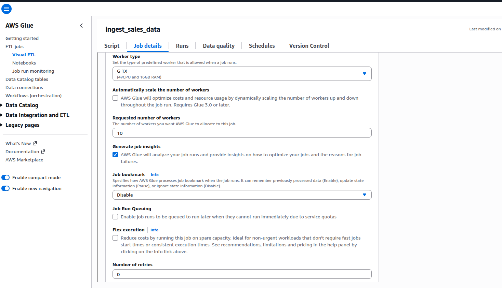
    - 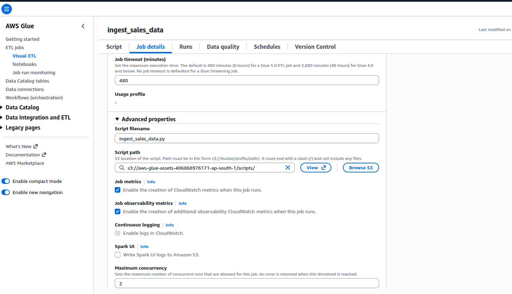
    - 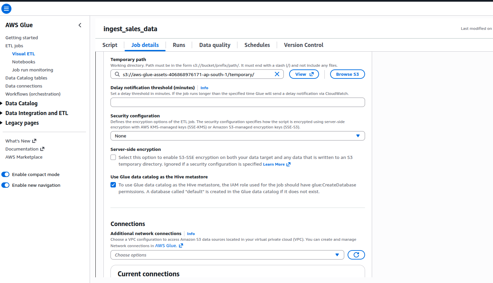
    - 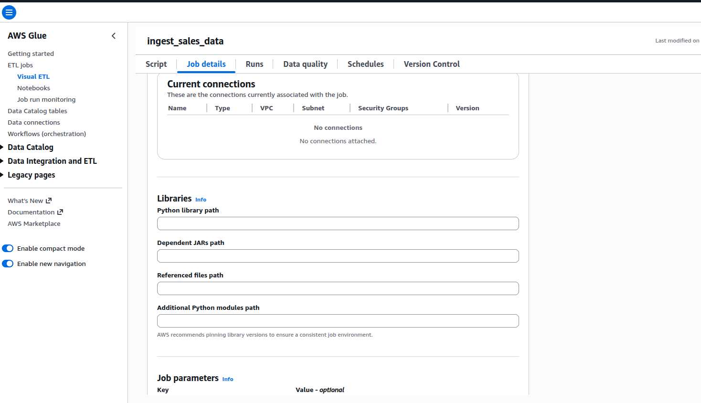
    - 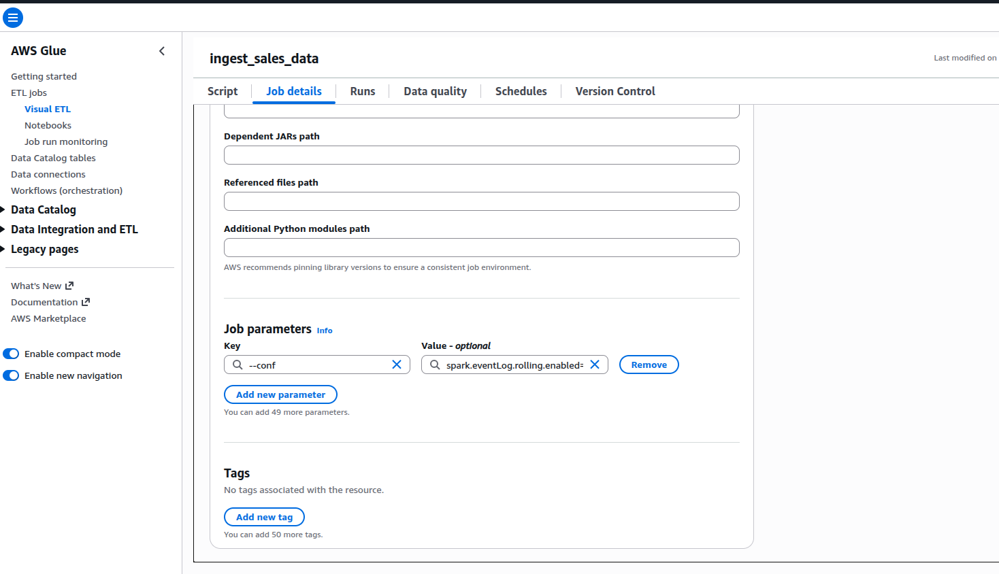
- The Glue script is the actual workhorse of the entire pipeline. Every other component — S3, EventBridge, SQS, Lambda, Step Function — exists purely to get a file path to this script safely and exactly once. Here is what it does, stage by stage.
    - 
    - How it receives its input
        - The Step Function calls ```glue:startJobRun``` and passes ```--source_bucket``` and ```--source_key``` as job arguments. Glue captures them with ```getResolvedOptions```. This is critical the script processes exactly one specific file, not a whole folder. It knows precisely which file to open because the Lambda extracted bucket and key from the S3 event and the Step Function forwarded them here.
    - Stage 1 — Delimiter corruption check
        - Before Spark even touches the file, the script reads it as raw text line by line and counts the columns in every single row using Python's ```csv.reader```. It compares each row's column count against the header's column count. If any row has a different count — which happens when a file uses semicolons instead of commas as delimiters, or has extra commas inside unquoted fields — it raises an ```Exception``` immediately with the exact line numbers that are broken. This is a fast, pre-Spark guard that catches structural corruption before wasting cluster resources.
    - Stage 2 — Read CSV into DynamicFrame
        - Now Glue reads the file into a ```DynamicFrame``` using ```create_dynamic_frame.from_options```. Notice ```"recurse": False``` it reads only the exact file specified, not the whole folder. The ```"mode": "PERMISSIVE"``` setting means Spark won't crash on individual bad rows during parsing; instead it sets those fields to null, which the subsequent checks then catch.
    - Stage 3 — Spark-level corruption check
        - After Spark parses the file, three more checks run. First it verifies that Spark actually inferred at least one column — an empty column list means the file was completely unreadable. Second it checks the DataFrame isn't empty. Third it looks for rows where more than 70% of columns are null, which indicates rows that Spark parsed but mostly failed on. Any of these throws an ```Exception```.
    - Stage 4 — SQL type casting
        - This is where the actual transformation happens. The CSV stores everything as strings — prices come in as ```"₹1,499"```, discounts as ```"85%"```, ratings as ```"3.9"```. The SQL query uses ```REGEXP_REPLACE``` to strip all non-numeric characters, then ```CAST``` converts them to ```DOUBLE``` or ```INT```. The 11 text columns (```product_id```, ```product_name```, ```category```, etc.) pass through unchanged. If this SQL fails for any reason, it re-raises as a RuntimeError so the Step Function's Catch block can detect it and route to ```UpdateFailure``` + DLQ.
    - Stage 5 — Drop null columns
        - The drop_nulls function walks the schema recursively and finds any columns where every single value is either empty string, ```"null```", or ```-1```. Those entire columns are dropped. This handles the case where a CSV has a column header but no data ever in it across the whole file.
    - Stage 6 — Deduplication
        - ```dropDuplicates()``` with no arguments compares every column in every row. If two rows are completely identical across all columns, one gets dropped. This prevents duplicate rows from landing in the Silver layer if the upstream system accidentally sent the same record twice.
    - Stage 7 — Data quality evaluation
        - ```EvaluateDataQuality``` runs a formal ruleset against the data before writing it anywhere. The rules check that the column count is exactly 16 (schema drift detection), that key numeric columns have no nulls, that no numeric column has negative values, and that ```product_id``` is unique. This is wrapped in a ```try/except``` if the rules fail, it raises ```RuntimeError``` explicitly. This is important because without the explicit raise, Glue might log the DQ failure but continue writing bad data to S3.
    - Stage 8 Write to Silver S3 and update catalog
        - If all checks pass, the data is written to ```s3://data-sink-one/silver_layer/sales_data/``` as Snappy-compressed Parquet files, partitioned by ```category```. The ```enableUpdateCatalog=True``` and ```setCatalogInfo``` call means Glue simultaneously registers or updates the table ```silver_table_sales_data``` in the Glue Data Catalog. This is what makes the data immediately queryable in Athena without needing to run a crawler separately.
        - Finally job.commit() tells Glue the job succeeded cleanly.
- How failure flows back to the rest of the pipeline?
    - Any ```raise``` in this script causes the Glue job to exit with a failed status. The Step Function is waiting with ```glue:startJobRun.sync```, so it detects the failure immediately and routes to ```UpdateFailure``` which writes ```status = FAILED``` and the error message to DynamoDB then sends the event to the DLQ. From there your ```replay_failed_ingestion``` Step Function can pick it up later once the underlying problem is fixed.

#### DynamoDB setup
- 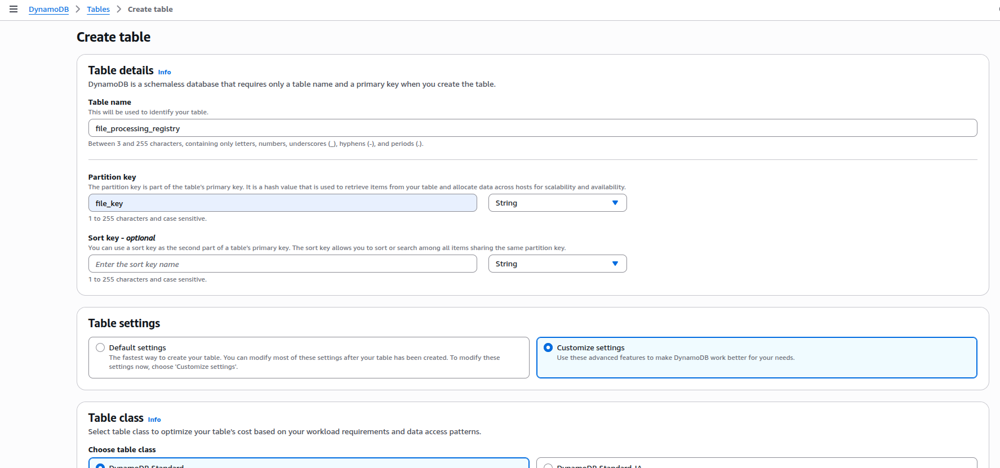
- 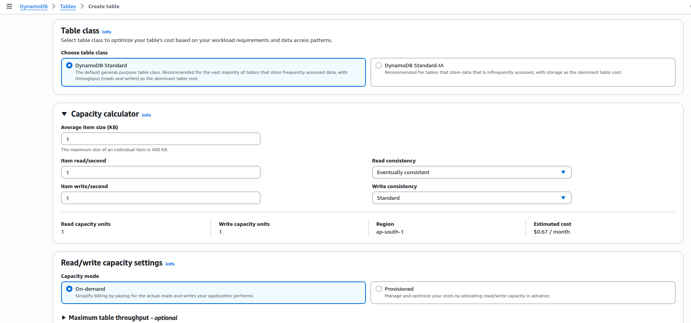
- 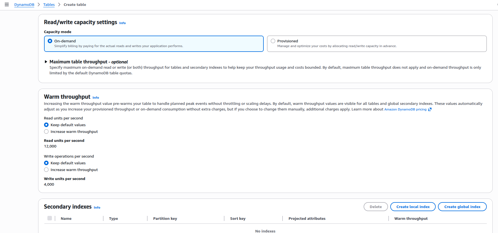
- 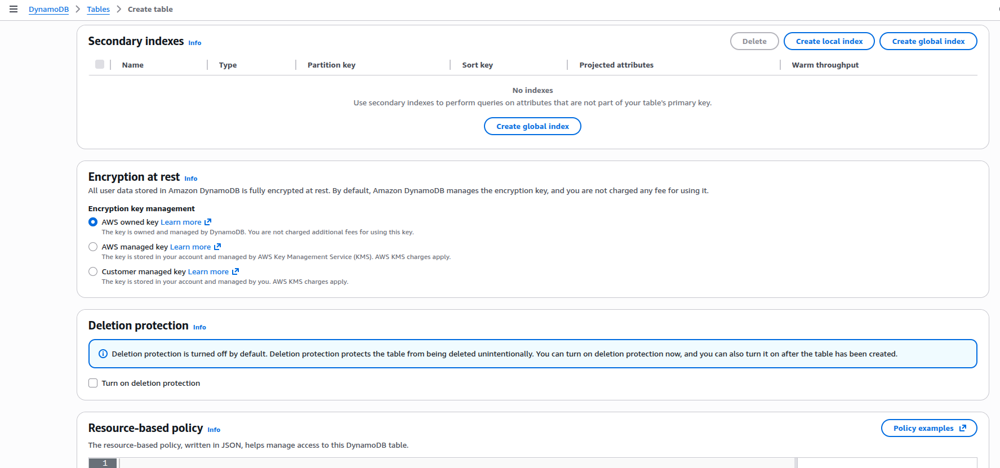
- 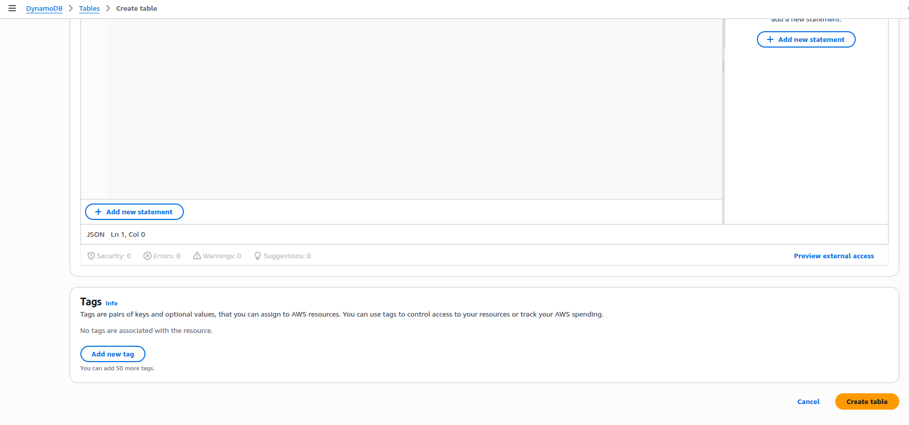
- The table name in dynamoDB is ```file_processing_registry```
- After the setup you will see that lamdba function added these in dynamoDb
    - 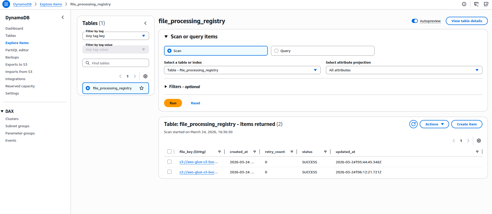
    - As you can see that the files are being tracked successfully.
- Things to remember :
    - Partition key should be set to ```file_key```
    - This is the command used to query the data present in the dynamoDB ```aws dynamodb scan --table-name file_processing_registry```
- Theory :
    - Partition key : A unique identifier that determines the item's physical storage location through hashing.
    - Sort keys (OPTIONAL) : It is a secondary attribute which enables ordering and range queries within a partition.
    - Primary key : ```{partition_key}:{sort_key}```
- For more information on DynamoDB refer to this video : https://youtu.be/2X2SO3Y-af8?si=8HLw7LvQEV_TEG-B   

### Issues I faced during Implementation phase for version 5
#### The issue I was facing is that ```UpdateFailure``` is working correctly ```status = FAILED``` and ```error_message``` is polulated in dynamoDB but the DLQ is empty. This happens when there is failure in the execution AWS glue ETL pipeline. (orchestrate_data_ingestion step function related bug)
Explainaing what is happening : 
- My dynamoDB record shows 
    - ```status = FAILED``` UpdateFailure ran successfully
    - ```error_message``` is populated with the full Glue error.
    - ```updated_at = 2026-03-24T11:49:40.057Z```
- So ```UpdateFailure``` is completing. But the DLQ is empty which means ```SendToDLQ``` is failing silently after ```UpdateFailure```.
- The reason is in ```SendToDLQ```. Look at what it tries to read:
    - ```json
        "MessageBody": {
        "bucket.$":   "$.bucket",
        "key.$":      "$.key",
        "file_key.$": "$.file_key"
        }
      ```
- These paths ```$.bucket```, ```$.key```, ```$.file_key``` came from the Map iterator input. But after ```RunGlueJob``` fails with ```"ResultPath": "$.error"```, the error gets written to ```$.error```. At this point the Step Function state still has ```$.bucket```, ```$.key```, ```$.file_key``` available from the original Map item input.
- However, look at your Glue runs in Image 1 they are all failing in about 1 minute, and the ```States.ALL``` retry fires 2 times with 30 second intervals before the Catch block runs. During those retries, the ```ResultPath``` behaviour can shift the state. More critically look at the failure time: ```17:17:37``` to ```17:18:47``` is only 1m 2s, which means the retries may not be completing cleanly, causing the input state to be in an unexpected shape when ```UpdateFailure``` runs.
- The most likely cause is this: SendToDLQ is throwing because ```$.bucket```, ```$.key```, or ```$.file_key``` is resolving to null in the state context after the retry/catch cycle. You can confirm this by going to the Step Function execution for the ```17:17:37``` run and checking whether ```SendToDLQ``` appears in the execution history at all, and what error it shows.

Solution : 
- pass file context explicitly through the error catch
    - Change ```RunGlueJob```'s ```Catch``` block to preserve the original input alongside the error:
        - ```json
            "Catch": [
            {
                "ErrorEquals": ["States.ALL"],
                "ResultPath": "$.error",
                "Next": "UpdateFailure"
            }
            ]
          ```
    - This is already correct. The problem is subtler ```SendToDLQ``` needs to reference fields that are guaranteed to exist. Add a dedicated ```Pass``` state between ```UpdateFailure``` and ```SendToDLQ``` that explicitly builds the message body from known-safe paths:
        - ```json
          "UpdateFailure": {
            "Type": "Task",
            "Resource": "arn:aws:states:::dynamodb:updateItem",
            "Parameters": {
                "TableName": "file_processing_registry",
                "Key": { "file_key": { "S.$": "$.file_key" } },
                "UpdateExpression": "SET #s = :s, error_message = :e, updated_at = :t",
                "ExpressionAttributeNames": { "#s": "status" },
                "ExpressionAttributeValues": {
                ":s": { "S": "FAILED" },
                ":e": { "S.$": "States.JsonToString($.error)" },
                ":t": { "S.$": "$$.State.EnteredTime" }
                }
            },
            "ResultPath": "$.dynamoResult",
            "Next": "SendToDLQ"
            },
            "SendToDLQ": {
            "Type": "Task",
            "Resource": "arn:aws:states:::sqs:sendMessage",
            "Parameters": {
                "QueueUrl": "https://sqs.ap-south-1.amazonaws.com/406868976171/sales-ingestion-dlq",
                "MessageBody": {
                "bucket.$":   "$.bucket",
                "key.$":      "$.key",
                "file_key.$": "$.file_key"
                }
            },
            "End": true
            }
          ```
    - The key change is adding ```"ResultPath": "$.dynamoResult"``` to ```UpdateFailure```. Without this, ```UpdateFailure```'s output replaces the entire state with the DynamoDB response, wiping out ```$.bucket```, ```$.key```, and ```$.file_key```. When ```SendToDLQ``` then tries to read ```$.bucket``` it gets null and throws.
    - With ```"ResultPath": "$.dynamoResult"```, the DynamoDB response is written to ```$.dynamoResult``` and the rest of the original state including ```$.bucket```, ```$.key```, ```$.file_key``` is preserved for ```SendToDLQ``` to read correctly.

#### Fixed step function code (orchestrate_data_ingestion step function)
```json
{
  "Comment": "Glue ETL Orchestration with DynamoDB Tracking",
  "StartAt": "ProcessFiles",
  "States": {
    "ProcessFiles": {
      "Type": "Map",
      "ItemsPath": "$.files",
      "MaxConcurrency": 2,
      "Iterator": {
        "StartAt": "RunGlueJob",
        "States": {
          "RunGlueJob": {
            "Type": "Task",
            "Resource": "arn:aws:states:::glue:startJobRun.sync",
            "Parameters": {
              "JobName": "ingest_sales_data",
              "Arguments": {
                "--source_bucket.$": "$.bucket",
                "--source_key.$": "$.key"
              }
            },
            "ResultPath": "$.glueResult",
            "Retry": [
              {
                "ErrorEquals": [
                  "Glue.ConcurrentRunsExceededException"
                ],
                "IntervalSeconds": 60,
                "MaxAttempts": 10,
                "BackoffRate": 1.5
              },
              {
                "ErrorEquals": [
                  "States.ALL"
                ],
                "IntervalSeconds": 30,
                "MaxAttempts": 2,
                "BackoffRate": 2
              }
            ],
            "Catch": [
              {
                "ErrorEquals": [
                  "States.ALL"
                ],
                "ResultPath": "$.error",
                "Next": "UpdateFailure"
              }
            ],
            "Next": "UpdateSuccess"
          },
          "UpdateSuccess": {
            "Type": "Task",
            "Resource": "arn:aws:states:::dynamodb:updateItem",
            "Parameters": {
              "TableName": "file_processing_registry",
              "Key": {
                "file_key": {
                  "S.$": "$.file_key"
                }
              },
              "UpdateExpression": "SET #s = :s, updated_at = :t",
              "ExpressionAttributeNames": {
                "#s": "status"
              },
              "ExpressionAttributeValues": {
                ":s": {
                  "S": "SUCCESS"
                },
                ":t": {
                  "S.$": "$$.State.EnteredTime"
                }
              }
            },
            "End": true
          },
          "UpdateFailure": {
            "Type": "Task",
            "Resource": "arn:aws:states:::dynamodb:updateItem",
            "Parameters": {
              "TableName": "file_processing_registry",
              "Key": {
                "file_key": {
                  "S.$": "$.file_key"
                }
              },
              "UpdateExpression": "SET #s = :s, error_message = :e, updated_at = :t",
              "ExpressionAttributeNames": {
                "#s": "status"
              },
              "ExpressionAttributeValues": {
                ":s": {
                  "S": "FAILED"
                },
                ":e": {
                  "S.$": "States.JsonToString($.error)"
                },
                ":t": {
                  "S.$": "$$.State.EnteredTime"
                }
              }
            },
            "ResultPath": "$.dynamoResult",
            "Next": "SendToDLQ"
          },
          "SendToDLQ": {
            "Type": "Task",
            "Resource": "arn:aws:states:::sqs:sendMessage",
            "Parameters": {
              "QueueUrl": "https://sqs.ap-south-1.amazonaws.com/406868976171/sales-ingestion-dlq",
              "MessageBody": {
                "bucket.$": "$.bucket",
                "key.$": "$.key",
                "file_key.$": "$.file_key"
              }
            },
            "End": true
          }
        }
      },
      "End": true
    }
  }
}
```

#### retry_count type mismatch (replay_failed_ingestion step function)
Explainaing what is happening : 
- The problem DynamoDB Number type vs Step Functions string comparison
- When DynamoDB returns a Number attribute, it comes back in the Step Functions state as a JSON object like this:
    - ```json
      "retry_count": { "N": "0" }
      ```
- The "N" value is a string "0", not a numeric 0. Step Functions stores DynamoDB Number values as strings internally.
- ```EvaluateRetry``` condition is:
    - ```json
        {
        "Variable": "$.ddb.Item.retry_count.N",
        "NumericLessThan": 3,
        "Next": "IncrementRetry"
        }
      ```
- ```NumericLessThan: 3``` expects the variable to be a numeric type. But ```$.ddb.Item.retry_count.N``` is the string ```"0"```
- The numeric comparison against a string fails silently it evaluates to false and the Default branch runs, sending you to SkipReplay every time.

Solution : 
- use StringLessThan instead
    - ```json
      "EvaluateRetry": {
        "Type": "Choice",
        "Choices": [
            {
            "Variable": "$.ddb.Item.retry_count.N",
            "StringLessThan": "3",
            "Next": "IncrementRetry"
            }
        ],
        "Default": "SkipReplay"
        }
      ```
    - ```StringLessThan: "3"``` correctly compares the string ```"0"``` against the string ```"3"```, and since ```"0" < "3"``` lexicographically, it routes to ```IncrementRetry``` and the Glue job runs.
    - This works correctly for single-digit retry counts (0, 1, 2). Since my limit is 3, I will never reach double digits, so string comparison is safe here.

#### Error in (replay_failed_ingestion)
This is the error message that I recieved when trying to execute the replay step function:
```json
An error occurred while executing the state 'RunGlueJob' (entered at the event id #26). The JSONPath '$.parsed.body.bucket' specified for the field '--source_bucket.$' could not be found in the input '{"SdkHttpMetadata":{"AllHttpHeaders":{"Server":["Server"],"Connection":["keep-alive"],"x-amzn-RequestId":["VRHKQ440NT8P25MIPT1MU4NPMBVV4KQNSO5AEMVJF66Q9ASUAAJG"],"x-amz-crc32":["2745614147"],"Content-Length":["2"],"Date":["Wed, 25 Mar 2026 07:01:55 GMT"],"Content-Type":["application/x-amz-json-1.0"]},"HttpHeaders":{"Connection":"keep-alive","Content-Length":"2","Content-Type":"application/x-amz-json-1.0","Date":"Wed, 25 Mar 2026 07:01:55 GMT","Server":"Server","x-amz-crc32":"2745614147","x-amzn-RequestId":"VRHKQ440NT8P25MIPT1MU4NPMBVV4KQNSO5AEMVJF66Q9ASUAAJG"},"HttpStatusCode":200},"SdkResponseMetadata":{"RequestId":"VRHKQ440NT8P25MIPT1MU4NPMBVV4KQNSO5AEMVJF66Q9ASUAAJG"}}'
```
- The error says ```$.parsed.body.bucket``` could not be found, and the input it shows is the DynamoDB ```updateItem``` response ```SdkHttpMetadata```, ```HttpStatusCode: 200```, etc. This means ```IncrementRetry```'s output is replacing the entire state, wiping out ```$.parsed``` before ```RunGlueJob``` can read it.
- The root cause missing ```ResultPath``` on ```IncrementRetry```
    - Look at ```IncrementRetry``` state:
        - ```json
            "IncrementRetry": {
            "Type": "Task",
            "Resource": "arn:aws:states:::dynamodb:updateItem",
            "Parameters": { ... },
            "Next": "RunGlueJob"
            }
          ```
    - There is no ```ResultPath```. When a Task state has no ```ResultPath```, the AWS SDK response from DynamoDB completely replaces the entire state input. So when ```RunGlueJob``` runs, the state no longer contains ```$.parsed.body.bucket``` it only contains the DynamoDB HTTP response object you can see in the error.

Solution : 
- Add ```"ResultPath": "$.incrementResult"``` to ```IncrementRetry``` so the DynamoDB response is written to a separate field and the original state including ```$.parsed.body.bucket```, ```$.parsed.body.key```, ```$.parsed.body.file_key``` is preserved:
    - ```json
        "IncrementRetry": {
        "Type": "Task",
        "Resource": "arn:aws:states:::dynamodb:updateItem",
        "Parameters": {
            "TableName": "file_processing_registry",
            "Key": {
            "file_key": {
                "S.$": "$.parsed.body.file_key"
            }
            },
            "UpdateExpression": "ADD retry_count :inc",
            "ExpressionAttributeValues": {
            ":inc": { "N": "1" }
            }
        },
        "ResultPath": "$.incrementResult",
        "Next": "RunGlueJob"
        }
      ```
- add ResultPath to every Task state that writes to DynamoDB so the response never overwrites the original input:
    - ```json
      "UpdateFailure": {
        "Type": "Task",
        "Resource": "arn:aws:states:::dynamodb:updateItem",
        "Parameters": {
            "TableName": "file_processing_registry",
            "Key": {
            "file_key": { "S.$": "$.parsed.body.file_key" }
            },
            "UpdateExpression": "SET #s = :s, error_message = :e, updated_at = :t",
            "ExpressionAttributeNames": { "#s": "status" },
            "ExpressionAttributeValues": {
            ":s": { "S": "FAILED" },
            ":e": { "S.$": "States.JsonToString($.error)" },
            ":t": { "S.$": "$$.State.EnteredTime" }
            }
        },
        "ResultPath": "$.updateFailureResult",
        "Next": "DeleteMessage"
        },
        "UpdateSuccess": {
        "Type": "Task",
        "Resource": "arn:aws:states:::dynamodb:updateItem",
        "Parameters": {
            "TableName": "file_processing_registry",
            "Key": {
            "file_key": { "S.$": "$.parsed.body.file_key" }
            },
            "UpdateExpression": "SET #s = :s, updated_at = :t",
            "ExpressionAttributeNames": { "#s": "status" },
            "ExpressionAttributeValues": {
            ":s": { "S": "SUCCESS" },
            ":t": { "S.$": "$$.State.EnteredTime" }
            }
        },
        "ResultPath": "$.updateSuccessResult",
        "Next": "DeleteMessage"
        }
      ```
- Every Task state that writes to DynamoDB ```IncrementRetry```, ````UpdateSuccess````, ```UpdateFailure``` needs a ```ResultPath``` that dumps the AWS SDK response somewhere harmless. Without it, the DynamoDB HTTP response body replaces the entire state and ```$.parsed.receiptHandle``` disappears before ```DeleteMessage``` can use it.

#### Design error in (replay_failed_ingestion) where right now the delete event message from sqs queue is running regardless of ETL success or failure I need to fix it 
- Before : 
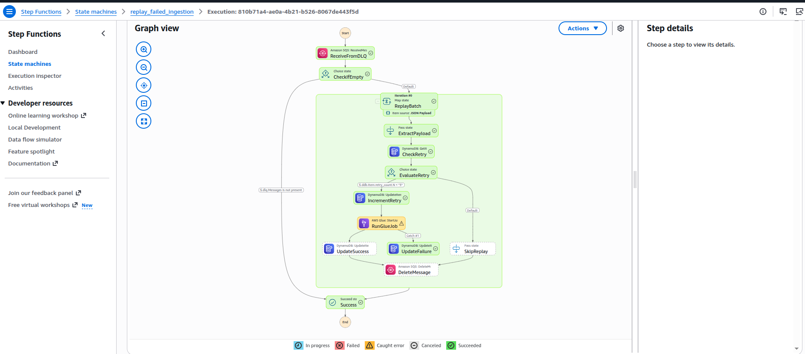
- After : 
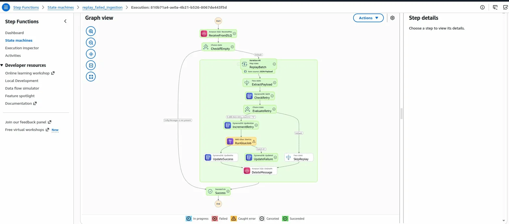
- In order to implement the changes all you need to do is 
    - Before : 
        - ```json
            "UpdateFailure": {
            ...
            "Next": "DeleteMessage"   ← always deletes, success or failure
            }
          ```
    - change the above code to this : only delete on success, keep message on failure in DLQ
        - ```json
            "UpdateFailure": {
            "Type": "Task",
            "Resource": "arn:aws:states:::dynamodb:updateItem",
            "Parameters": {
                "TableName": "file_processing_registry",
                "Key": {
                "file_key": { "S.$": "$.parsed.body.file_key" }
                },
                "UpdateExpression": "SET #s = :s, error_message = :e, updated_at = :t",
                "ExpressionAttributeNames": { "#s": "status" },
                "ExpressionAttributeValues": {
                ":s": { "S": "FAILED" },
                ":e": { "S.$": "States.JsonToString($.error)" },
                ":t": { "S.$": "$$.State.EnteredTime" }
                }
            },
            "ResultPath": "$.updateFailureResult",
            "End": true
            }
          ```
#### Fixed step function code (replay_failed_ingestion step function) 
```json
{
  "Comment": "Replay ETL from DLQ (Fixed - State Preservation + Safe Errors)",
  "StartAt": "ReceiveFromDLQ",
  "States": {
    "ReceiveFromDLQ": {
      "Type": "Task",
      "Resource": "arn:aws:states:::aws-sdk:sqs:receiveMessage",
      "Parameters": {
        "QueueUrl": "https://sqs.ap-south-1.amazonaws.com/406868976171/sales-ingestion-dlq",
        "MaxNumberOfMessages": 10
      },
      "ResultPath": "$.dlq",
      "Next": "CheckIfEmpty"
    },
    "CheckIfEmpty": {
      "Type": "Choice",
      "Choices": [
        {
          "Variable": "$.dlq.Messages",
          "IsPresent": false,
          "Next": "Success"
        }
      ],
      "Default": "ReplayBatch"
    },
    "ReplayBatch": {
      "Type": "Map",
      "ItemsPath": "$.dlq.Messages",
      "MaxConcurrency": 2,
      "Iterator": {
        "StartAt": "ExtractPayload",
        "States": {
          "ExtractPayload": {
            "Type": "Pass",
            "Parameters": {
              "receiptHandle.$": "$.ReceiptHandle",
              "body.$": "States.StringToJson($.Body)"
            },
            "ResultPath": "$.parsed",
            "Next": "CheckRetry"
          },
          "CheckRetry": {
            "Type": "Task",
            "Resource": "arn:aws:states:::dynamodb:getItem",
            "Parameters": {
              "TableName": "file_processing_registry",
              "Key": {
                "file_key": {
                  "S.$": "$.parsed.body.file_key"
                }
              }
            },
            "ResultPath": "$.ddb",
            "Next": "EvaluateRetry"
          },
          "EvaluateRetry": {
            "Type": "Choice",
            "Choices": [
              {
                "Variable": "$.ddb.Item.retry_count.N",
                "StringLessThan": "3",
                "Next": "IncrementRetry"
              }
            ],
            "Default": "SkipReplay"
          },
          "IncrementRetry": {
            "Type": "Task",
            "Resource": "arn:aws:states:::dynamodb:updateItem",
            "Parameters": {
              "TableName": "file_processing_registry",
              "Key": {
                "file_key": {
                  "S.$": "$.parsed.body.file_key"
                }
              },
              "UpdateExpression": "ADD retry_count :inc",
              "ExpressionAttributeValues": {
                ":inc": {
                  "N": "1"
                }
              }
            },
            "ResultPath": "$.incrementResult",
            "Next": "RunGlueJob"
          },
          "RunGlueJob": {
            "Type": "Task",
            "Resource": "arn:aws:states:::glue:startJobRun.sync",
            "ResultPath": "$.glueResult",
            "Parameters": {
              "JobName": "ingest_sales_data",
              "Arguments": {
                "--source_bucket.$": "$.parsed.body.bucket",
                "--source_key.$": "$.parsed.body.key"
              }
            },
            "Catch": [
              {
                "ErrorEquals": [
                  "States.ALL"
                ],
                "ResultPath": "$.error",
                "Next": "UpdateFailure"
              }
            ],
            "Next": "UpdateSuccess"
          },
          "UpdateSuccess": {
            "Type": "Task",
            "Resource": "arn:aws:states:::dynamodb:updateItem",
            "Parameters": {
              "TableName": "file_processing_registry",
              "Key": {
                "file_key": {
                  "S.$": "$.parsed.body.file_key"
                }
              },
              "UpdateExpression": "SET #s = :s, updated_at = :t",
              "ExpressionAttributeNames": {
                "#s": "status"
              },
              "ExpressionAttributeValues": {
                ":s": {
                  "S": "SUCCESS"
                },
                ":t": {
                  "S.$": "$$.State.EnteredTime"
                }
              }
            },
            "ResultPath": "$.updateSuccessResult",
            "Next": "DeleteMessage"
          },
          "UpdateFailure": {
            "Type": "Task",
            "Resource": "arn:aws:states:::dynamodb:updateItem",
            "Parameters": {
              "TableName": "file_processing_registry",
              "Key": {
                "file_key": {
                  "S.$": "$.parsed.body.file_key"
                }
              },
              "UpdateExpression": "SET #s = :s, error_message = :e, updated_at = :t",
              "ExpressionAttributeNames": {
                "#s": "status"
              },
              "ExpressionAttributeValues": {
                ":s": {
                  "S": "FAILED"
                },
                ":e": {
                  "S.$": "States.JsonToString($.error)"
                },
                ":t": {
                  "S.$": "$$.State.EnteredTime"
                }
              }
            },
            "ResultPath": "$.updateFailureResult",
            "End": true
          },
          "SkipReplay": {
            "Type": "Pass",
            "Next": "DeleteMessage"
          },
          "DeleteMessage": {
            "Type": "Task",
            "Resource": "arn:aws:states:::aws-sdk:sqs:deleteMessage",
            "Parameters": {
              "QueueUrl": "https://sqs.ap-south-1.amazonaws.com/406868976171/sales-ingestion-dlq",
              "ReceiptHandle.$": "$.parsed.receiptHandle"
            },
            "End": true
          }
        }
      },
      "Next": "Success"
    },
    "Success": {
      "Type": "Succeed"
    }
  }
}
```

## Implementation : (Version 6)
### GAPs that I need to fix that were present in Implementation of version 5 
#### High priority these affect correctness and reliability

**1. Lambda idempotency permanently blocks `FAILED` files on re-upload**

The `put_item` with `attribute_not_exists(file_key)` blocks any file whose `file_key` already exists in DynamoDB regardless of whether status is `SUCCESS`, `FAILED`, or `IN_PROGRESS`. This means if a corrupted file fails and a corrected version is uploaded with the same filename, Lambda will silently skip it forever. The fix is to check status first — only permanently block `SUCCESS`, allow `FAILED` records to be overwritten:

```python
existing = dynamodb.get_item(
    TableName=TABLE_NAME,
    Key={"file_key": {"S": file_key}}
)
item = existing.get("Item")

if item and item.get("status", {}).get("S") == "SUCCESS":
    print(f"Already succeeded, skipping: {file_key}")
    continue

# New file or previously failed allow through
try:
    dynamodb.put_item(
        TableName=TABLE_NAME,
        Item={
            "file_key": {"S": file_key},
            "status": {"S": "IN_PROGRESS"},
            "retry_count": {"N": "0"},
            "created_at": {"S": timestamp}
        },
        ConditionExpression="attribute_not_exists(file_key) OR #s = :failed",
        ExpressionAttributeNames={"#s": "status"},
        ExpressionAttributeValues={":failed": {"S": "FAILED"}}
    )
    files.append({"bucket": bucket, "key": key, "file_key": file_key})
except dynamodb.exceptions.ConditionalCheckFailedException:
    print(f"Currently IN_PROGRESS, skipping: {file_key}")
```

**2. `DQFailureSilent` data quality runs but the job can still write bad data**

Your `EvaluateDataQuality` is wrapped in a `try/except` that raises `RuntimeError` on failure which is correct. However `EvaluateDataQuality().process_rows()` with `"strategy": "BEST_EFFORT"` logs DQ results but does not fail the Glue job on rule violations by itself it depends entirely on your `try/except` catching the exception. The problem is that `process_rows` with `BEST_EFFORT` does not always throw even when rules fail it publishes metrics and continues. This means data that fails the `IsUnique "product_id"` or `ColumnCount = 16` check can silently pass through to the Silver layer. Change the strategy:

```python
EvaluateDataQuality().process_rows(
    frame=deduped_dynamic_frame,
    ruleset=DEFAULT_DATA_QUALITY_RULESET,
    publishing_options={
        "dataQualityEvaluationContext": "...",
        "enableDataQualityResultsPublishing": True,
        "failureAction": "FAIL"      # ← add this
    },
    additional_options={
        "dataQualityResultsPublishing.strategy": "FAIL_JOB",   # ← change this
        "observations.scope": "ALL"
    }
)
```

**3. `dropDuplicates()` with no arguments is too aggressive**

Your deduplication uses `df_clean.dropDuplicates()` which compares every single column. This means two rows that have identical product data but different `review_id` values will both be kept which is correct. But two rows that are truly identical across all 16 columns will lose one copy which is also correct. The real problem is that `dropDuplicates()` on a large DataFrame triggers a full shuffle across the entire Spark cluster, which is very expensive. For this dataset the correct key for deduplication is `review_id` since that is the natural unique identifier per review:

```python
deduped_df = df_clean.dropDuplicates(["review_id"])
```

This is both semantically correct you are deduplicating on the business key and significantly faster because Spark can partition by `review_id` rather than hashing all 16 columns.

**4. `sales-ingestion-dlq` visibility timeout is 12 hours**

After `replay_failed_ingestion` reads a message via `ReceiveFromDLQ`, that message becomes invisible for 12 hours even if `UpdateFailure` ends with `"End": true` and does not delete it. From a data engineering perspective this means the message is effectively locked for half a day between replay attempts. Reduce the visibility timeout to 5 minutes so the message becomes available again quickly after each replay attempt.

---

#### Medium priority these affect observability and operational quality

**5. No `row_count` written to DynamoDB after successful ingestion**

Your DynamoDB schema in the proposed architecture diagram shows `row_count` as an attribute, but the `UpdateSuccess` state only writes `status` and `updated_at`. You never capture how many rows were actually ingested. This is a significant gap for a data platform without row counts you cannot detect silent data loss (a file that processed successfully but produced 0 rows, or a file that should have 500 rows but only produced 50). Add a row count capture in the Glue script:

```python
row_count = deduped_df.count()
print(f"Glue Visual ETL | Final row count: {row_count}")
```

Then pass it as a Glue job metric or as a separate DynamoDB update. One way is to write it as a Glue job property that the Step Function can read from the `glueResult` after success, then include it in `UpdateSuccess`.

**6. No CloudWatch alerting on DLQ depth**

There is no monitoring documented. In production the most critical metric to alert on is `ApproximateNumberOfMessagesVisible` on `sales-ingestion-dlq` if this grows it means files are failing faster than they are being replayed. A simple CloudWatch alarm that fires when DLQ message count exceeds 0 would give you immediate visibility. Similarly, a CloudWatch alarm on Glue job failures and Step Function execution failures would complete the observability picture.

**7. Debug print statements left in the Glue script**

The Glue script has several production debug lines that should either be removed or controlled by a log level flag:

```python
print("Glue Visual ETL | DEBUG bucket:", source_bucket)
print("Glue Visual ETL | DEBUG columns:", df.columns)
print("Glue Visual ETL | DEBUG schema:", df.schema)
print("Glue Visual ETL | DEBUG sample rows:", df.limit(2).toPandas())
```

The `df.limit(2).toPandas()` line is particularly costly it materialises a Pandas DataFrame on the driver node and prints raw data values to CloudWatch logs. This is a privacy concern if the data contains PII and a cost concern since it triggers a Spark action. Remove or gate these behind a debug flag.

**8. `raw_lines = spark.read.text(...).collect()` loads entire file to driver**

The delimiter corruption check reads the entire file as text and calls `.collect()` which brings every single line into the Lambda driver's memory. For small files like your sales CSVs this is fine, but if a file is 500MB this will OOM the driver. A safer approach is to sample or limit:

```python
raw_lines = spark.read.text(f"s3://{source_bucket}/{source_key}").limit(1000).collect()
```

For corruption detection you typically only need to scan a representative sample rather than every row.

#### Lower priority these are good engineering hygiene

**9. `AmazonSQSFullAccess` on the replay Step Function role is too broad**

The IAM role for `replay_failed_ingestion` uses `AmazonSQSFullAccess`. This grants full permissions to all SQS queues in the account. The minimum required is `sqs:ReceiveMessage`, `sqs:DeleteMessage`, and `sqs:GetQueueAttributes` scoped to only `sales-ingestion-dlq`. You noted this is for learning purposes which is fine, but worth flagging for when this moves to a real environment.

**10. No TTL on DynamoDB records**

The `file_processing_registry` table will grow forever every file ever processed keeps a permanent record. For a data engineering use case you typically only need records for the last 30–90 days for audit purposes. Add a `ttl` attribute when writing records in Lambda and enable DynamoDB TTL on that attribute. This keeps the table lean and reduces read costs over time:

```python
import time
ttl_value = int(time.time()) + (90 * 24 * 60 * 60)  # 90 days from now

dynamodb.put_item(
    TableName=TABLE_NAME,
    Item={
        "file_key": {"S": file_key},
        "status": {"S": "IN_PROGRESS"},
        "retry_count": {"N": "0"},
        "created_at": {"S": timestamp},
        "ttl": {"N": str(ttl_value)}   # ← add this
    },
    ...
)
```

### Implementation for version 6:
- With this implementation I am aiming to close all the gaps that are currently present in the version 5 implementation.

#### Architectural diagram


#### S3 bucket
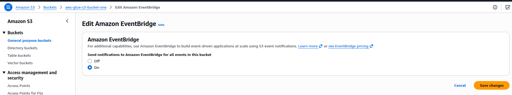
- This setup allows source S3 bucket to send events to event bridge.

#### SQS 

**(FileProcessingQueue.fifo)**
- 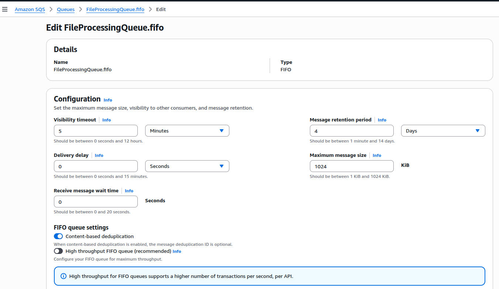
- 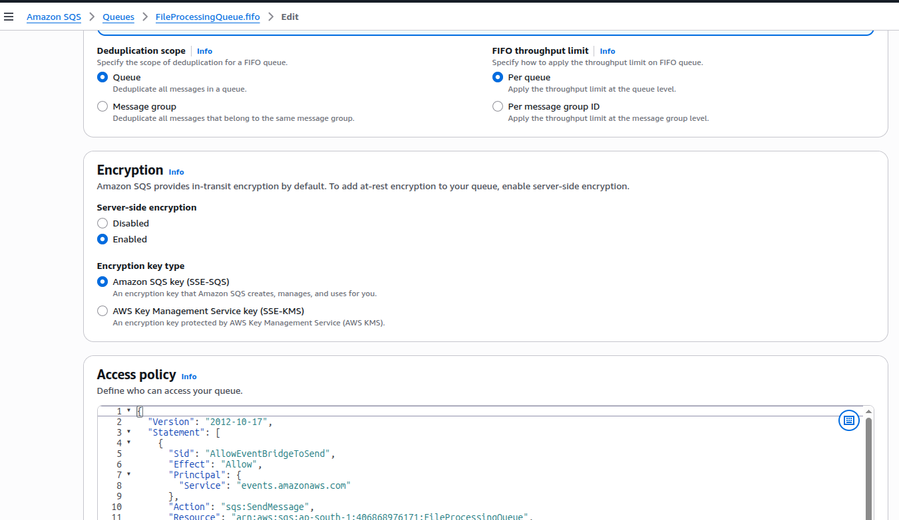
- 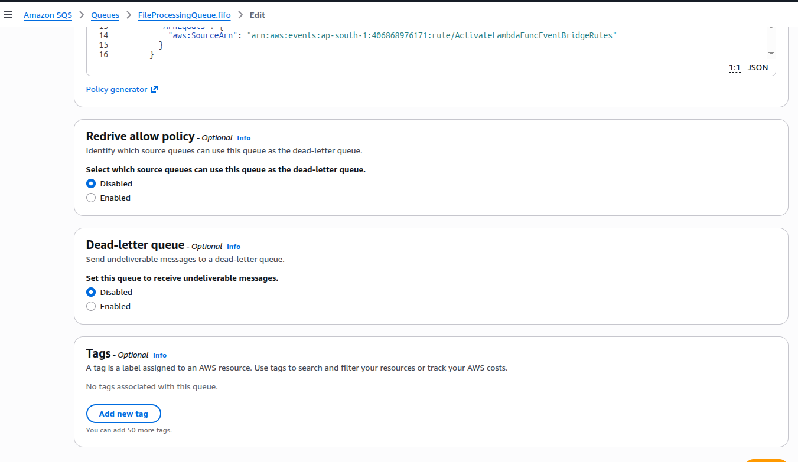
- Access Policy used : 
    - ```json
        {
        "Version": "2012-10-17",
        "Statement": [
            {
            "Sid": "AllowEventBridgeToSend",
            "Effect": "Allow",
            "Principal": {
                "Service": "events.amazonaws.com"
            },
            "Action": "sqs:SendMessage",
            "Resource": "arn:aws:sqs:ap-south-1:406868976171:FileProcessingQueue",
            "Condition": {
                "ArnEquals": {
                "aws:SourceArn": "arn:aws:events:ap-south-1:406868976171:rule/ActivateLambdaFuncEventBridgeRules"
                }
            }
            }
        ]
        }
      ```

**(sales-ingestion-dlq)**
- 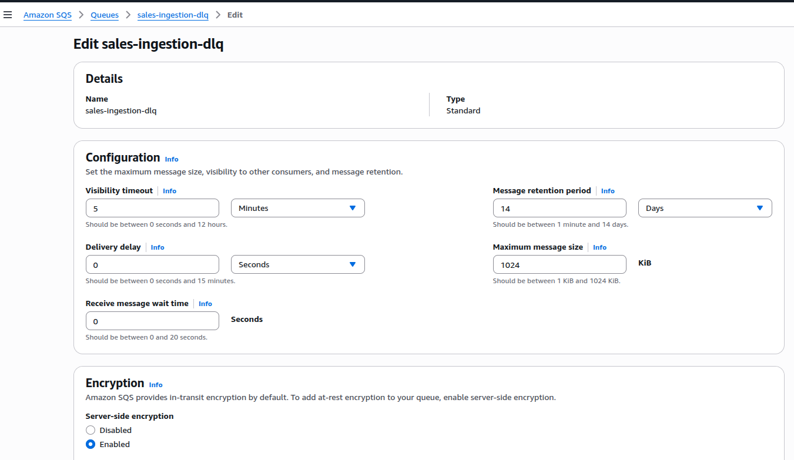
- 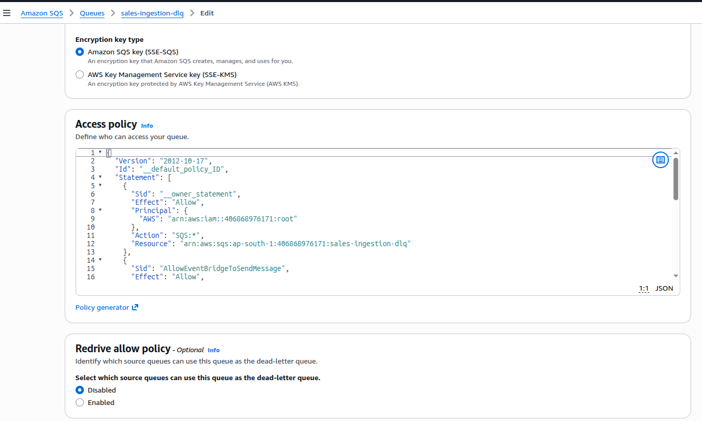
- 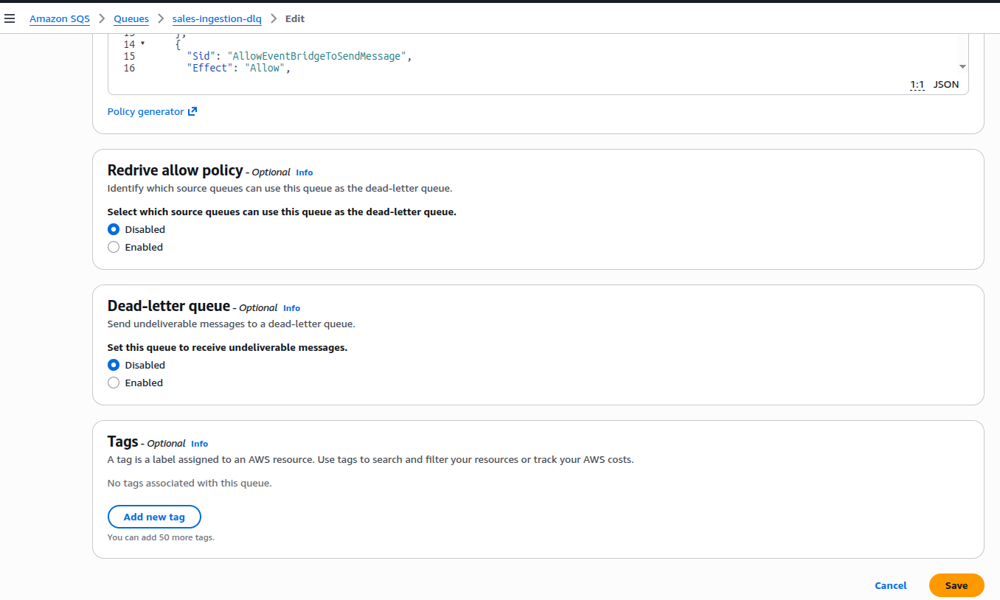
- Access Policy used : 
    - ```json
        {
        "Version": "2012-10-17",
        "Id": "__default_policy_ID",
        "Statement": [
            {
            "Sid": "__owner_statement",
            "Effect": "Allow",
            "Principal": {
                "AWS": "arn:aws:iam::406868976171:root"
            },
            "Action": "SQS:*",
            "Resource": "arn:aws:sqs:ap-south-1:406868976171:sales-ingestion-dlq"
            },
            {
            "Sid": "AllowEventBridgeToSendMessage",
            "Effect": "Allow",
            "Principal": {
                "Service": "events.amazonaws.com"
            },
            "Action": "sqs:SendMessage",
            "Resource": "arn:aws:sqs:ap-south-1:406868976171:sales-ingestion-dlq",
            "Condition": {
                "ArnEquals": {
                "aws:SourceArn": "arn:aws:events:ap-south-1:406868976171:rule/ActivateLambdaFuncEventBridgeRules"
                }
            }
            },
            {
            "Sid": "AWSEvents_ActivateLambdaFuncEventBridgeRules_dlq_41c9320f-edd2-4fde-ad71-2985e68b1d7c",
            "Effect": "Allow",
            "Principal": {
                "Service": "events.amazonaws.com"
            },
            "Action": "sqs:SendMessage",
            "Resource": "arn:aws:sqs:ap-south-1:406868976171:sales-ingestion-dlq",
            "Condition": {
                "ArnEquals": {
                "aws:SourceArn": "arn:aws:events:ap-south-1:406868976171:rule/ActivateLambdaFuncEventBridgeRules"
                }
            }
            }
        ]
        }
      ```
- Visibility timeout is an SQS setting that controls how long a message stays hidden from other consumers after it has been received by one consumer. When Lambda or a Step Function reads a message from SQS, the queue does not delete it immediately instead it hides it for the duration of the visibility timeout. The expectation is that the consumer will finish processing and explicitly delete the message before the timeout expires. If the consumer crashes, hangs, or fails before deleting it, the timeout expires and SQS makes the message visible again so another consumer can retry it.
- Setting this value correctly matters because the consequences of getting it wrong go in both directions.
    - If the timeout is too short, the message becomes visible again before the consumer has finished processing it. A second consumer picks it up while the first is still running, and now two instances are processing the same message simultaneously. In this pipeline that means two Lambda invocations racing to write the same file_key to DynamoDB, or two replay executions both trying to run Glue against the same file at the same time. The DynamoDB idempotency guard in Lambda catches most of these cases, but it introduces an unnecessary race condition that the correct timeout setting eliminates entirely.
    - If the timeout is too long, a different problem emerges. When replay_failed_ingestion reads a message from sales-ingestion-dlq to retry a failed file, SQS hides that message for the full duration of the timeout regardless of whether the replay succeeded or failed. If the replay fails again and UpdateFailure ends with "End": true without deleting the message, the message is still invisible until the timeout expires. A data engineer trying to trigger another replay immediately after a failure will see an empty queue and have to wait for the full timeout window before the message reappears.

#### Lambda function
- IAM role used for this Lamdba function ```TriggerStepFunctionRoleForLambdaFunc```
    - Custom policies attached to this role 
        - AllowLambdaToAccessSQSAndStepFunction
            - ```json
              {
                    "Version": "2012-10-17",
                    "Statement": [
                        {
                            "Effect": "Allow",
                            "Action": [
                                "states:StartExecution"
                            ],
                            "Resource": "arn:aws:states:ap-south-1:406868976171:stateMachine:orchestrate_data_ingestion"
                        },
                        {
                            "Effect": "Allow",
                            "Action": [
                                "sqs:ReceiveMessage",
                                "sqs:DeleteMessage",
                                "sqs:GetQueueAttributes"
                            ],
                            "Resource": "arn:aws:sqs:ap-south-1:406868976171:FileProcessingQueue.fifo"
                        },
                        {
                            "Effect": "Allow",
                            "Action": [
                                "logs:CreateLogGroup",
                                "logs:CreateLogStream",
                                "logs:PutLogEvents"
                            ],
                            "Resource": "*"
                        }
                    ]
                }
              ```
        - DynamoDbAccessPolicyForLambdaFunction
            - ```json
                {
                    "Version": "2012-10-17",
                    "Statement": [
                        {
                            "Sid": "DynamoDbAccessPolicyForLambdaFunction",
                            "Effect": "Allow",
                            "Action": [
                                "dynamodb:PutItem",
                                "dynamodb:GetItem",
                                "dynamodb:UpdateItem"
                            ],
                            "Resource": "arn:aws:dynamodb:ap-south-1:406868976171:table/file_processing_registry"
                        }
                    ]
                }
              ```
- Improved lambda function code : 
    - ```python
        import json
        import boto3
        import uuid
        import time
        from datetime import datetime, timezone, timedelta

        sf = boto3.client("stepfunctions")
        dynamodb = boto3.client("dynamodb")

        STATE_MACHINE_ARN = "arn:aws:states:ap-south-1:406868976171:stateMachine:orchestrate_data_ingestion"
        TABLE_NAME = "file_processing_registry"

        def lambda_handler(event, context):

            execution_id = str(uuid.uuid4())[:8]

            IST = timezone(timedelta(hours=5, minutes=30))
            timestamp = datetime.now(IST).strftime("%Y-%m-%d %H:%M:%S %Z")

            # TTL: 30 days from now (Unix timestamp)
            ttl_value = int(time.time()) + (30 * 24 * 60 * 60)

            print(f"\n===== Lambda Invocation START =====")
            print(f"ExecutionID: {execution_id}")
            print(f"Timestamp: {timestamp}")
            print("Full Event From SQS:", json.dumps(event))
            expiry_date = datetime.fromtimestamp(ttl_value, tz=timezone(timedelta(hours=5, minutes=30))).strftime("%Y-%m-%d %H:%M:%S IST")
            print(f"The record will be kept in DynamoDB for {expiry_date}")
            print("===================================\n")

            files = []

            for record in event["Records"]:
                body = json.loads(record["body"])

                bucket = body["detail"]["bucket"]["name"]
                key = body["detail"]["object"]["key"]

                file_key = f"s3://{bucket}/{key}"

                # Check for status of file before enforcing idepotency
                # Check if a record already exists and what its status is
                existing = dynamodb.get_item(
                    TableName=TABLE_NAME,
                    Key={"file_key": {"S": file_key}}
                )
                item = existing.get("Item")

                if item:
                    current_status = item.get("status", {}).get("S", "")

                    if current_status == "SUCCESS":
                        # File already successfully ingested — block permanently
                        print(f"Already succeeded, skipping: {file_key}")
                        continue

                    if current_status == "IN_PROGRESS":
                        # Another Lambda instance is currently processing this file
                        print(f"Already in progress, skipping: {file_key}")
                        continue
                    # status == FAILED — allow through, reset the record for retry
                    print(f"Previously failed, allowing re-upload retry: {file_key}")

                try:
                    # Idempotency check (CRITICAL)
                    dynamodb.put_item(
                        TableName=TABLE_NAME,
                        Item={
                            "file_key":    {"S": file_key},
                            "status":      {"S": "IN_PROGRESS"},
                            "retry_count": {"N": "0"},
                            "created_at":  {"S": timestamp},
                            "ttl":         {"N": str(ttl_value)}
                        },
                        ConditionExpression="attribute_not_exists(file_key) OR #s = :failed",
                        ExpressionAttributeNames={"#s": "status"},
                        ExpressionAttributeValues={":failed": {"S": "FAILED"}}
                    )

                    # Only add if it's NOT duplicate
                    files.append({
                        "bucket": bucket,
                        "key": key,
                        "file_key": file_key
                    })

                    print(f"Accepted file: {file_key}")

                except dynamodb.exceptions.ConditionalCheckFailedException:
                    # This only fires if another Lambda instance wrote IN_PROGRESS
                    # between our get_item check above and this put_item — a rare
                    # race condition that is now safely handled
                    print(f"Concurrent write detected, skipping: {file_key}")

            print("Files to process:", files)

            # Only trigger StepFn if there are valid files
            if files:
                sf.start_execution(
                    stateMachineArn=STATE_MACHINE_ARN,
                    input=json.dumps({"files": files})
                )
                print("Step Function triggered")
            else:
                print("No new files to process")

            return {"status": "ok"}
      ```
    - This improved code Fixes 
        - Gap 1: Idempotency permanently blocks FAILED files
            - Older lambda function code in version 5 uses this ```ConditionExpression="attribute_not_exists(file_key)"```
            - This blocks any file that already has a DynamoDB record regardless of whether its status is SUCCESS, FAILED, or IN_PROGRESS. So if sales_data_4.csv failed and you upload a corrected version, Lambda sees the existing record and skips it forever with "Duplicate skipped". The only way to recover is to manually add a DLQ message via the SQS console.
            - The fix changes the logic so that only SUCCESS files are permanently blocked. FAILED files are allowed back in because the corrected re-upload is a legitimate recovery path. IN_PROGRESS files are blocked because another Lambda instance is already processing them.
            - The condition changes from a simple attribute_not_exists to a two-step check first read the record, then decide what to do based on its status.
            - **Why are we doing this?**
                - The core reason comes down to one question: who should be responsible for recovering a failed file a human manually intervening in the system, or the system recovering itself automatically?
                - In production data engineering, the answer is always the system. Here is why.
                - What happens without this fix?
                    - A data engineer at a company receives an alert that sales_data_4.csv failed ingestion because it was corrupted. They fix the file and upload the corrected version to S3. From their perspective, the problem is solved the correct file is now in S3.
                    - But nothing happens. The pipeline is completely silent. The file sits in S3 forever, never ingested, never alerting again. The engineer has no feedback that their fix did not work. The downstream dashboard is missing that day's sales data and nobody knows why
                    - Eventually someone notices the data gap, raises a ticket, and a senior engineer has to dig through CloudWatch logs, find the DynamoDB record, understand the visibility timeout, manually construct a JSON message, paste it into the SQS console, and trigger the replay. This takes hours and requires deep knowledge of the pipeline internals.
                - What happens with the fix?
                    - The same engineer fixes the file and uploads the corrected version to S3. The pipeline detects the new upload, sees the existing FAILED record in DynamoDB, resets it to IN_PROGRESS, and triggers the Step Function automatically. Within 2 minutes the file is ingested and the dashboard is updated. The engineer never had to touch SQS, DynamoDB, or CloudWatch.
                - The deeper principle systems should be self-healing.
                    - In data engineering there is a concept called operational burden the amount of human intervention required to keep a pipeline running. Every manual step you require from an operator is a point of failure. Operators make mistakes, forget steps, are on vacation, or simply do not know what to do. A well-designed pipeline minimises operational burden by making the happy path automatic and the recovery path equally automatic.
                    - The re-upload recovery path costs nothing to implement it is a change to one conditional expression in Lambda. But it eliminates an entire category of manual intervention that would otherwise be required every time a file fails and needs to be corrected.
        - Gap 10: No TTL on DynamoDB records
            - Your current put_item never sets a ttl attribute. Without TTL, every record stays in DynamoDB forever. After a year of daily ingestion your table has hundreds of records consuming read capacity on every scan, and you are paying for storage you do not need. DynamoDB's TTL feature automatically deletes expired items at no extra cost. Setting it to 90 days means you keep a full quarter of audit history while the table stays lean.
- Lambda function SQS trigger related configurations
    - 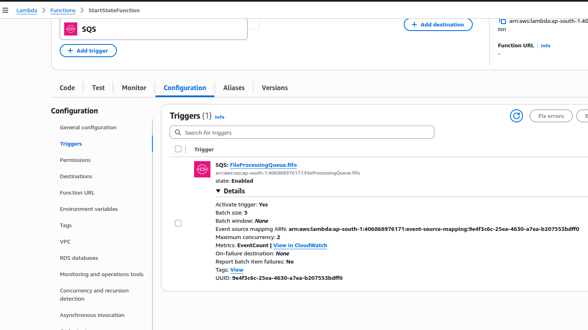

#### State functions

**orchestrate_data_ingestion state function :**
- IAM role and policies configurations :
    - 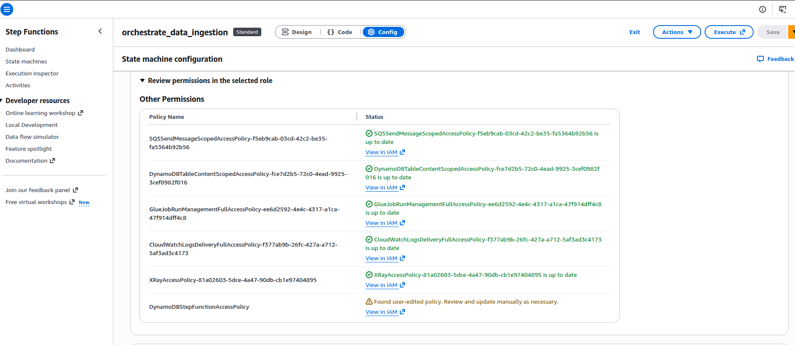
    - Add a custom policy called ```DynamoDBStepFunctionAccessPolicy``` the rest of them are auto-generated.
    ```json
        {
            "Version": "2012-10-17",
            "Statement": [
                {
                    "Sid": "DynamoDBStepFunctionAccessPolicy",
                    "Effect": "Allow",
                    "Action": [
                        "dynamodb:UpdateItem",
                        "dynamodb:GetItem"
                    ],
                    "Resource": "arn:aws:dynamodb:ap-south-1:406868976171:table/file_processing_registry"
                }
            ]
        }
    ```
- Improved orchestration state function
    - ```json
        {
        "Comment": "Glue ETL Orchestration with DynamoDB Tracking",
        "StartAt": "ProcessFiles",
        "States": {
            "ProcessFiles": {
            "Type": "Map",
            "ItemsPath": "$.files",
            "MaxConcurrency": 2,
            "Iterator": {
                "StartAt": "RunGlueJob",
                "States": {
                "RunGlueJob": {
                    "Type": "Task",
                    "Resource": "arn:aws:states:::glue:startJobRun.sync",
                    "Parameters": {
                    "JobName": "ingest_sales_data",
                    "Arguments": {
                        "--source_bucket.$": "$.bucket",
                        "--source_key.$": "$.key"
                    }
                    },
                    "ResultPath": "$.glueResult",
                    "Retry": [
                    {
                        "ErrorEquals": [
                        "Glue.ConcurrentRunsExceededException"
                        ],
                        "IntervalSeconds": 60,
                        "MaxAttempts": 10,
                        "BackoffRate": 1.5
                    },
                    {
                        "ErrorEquals": [
                        "States.ALL"
                        ],
                        "IntervalSeconds": 30,
                        "MaxAttempts": 2,
                        "BackoffRate": 2
                    }
                    ],
                    "Catch": [
                    {
                        "ErrorEquals": [
                        "States.ALL"
                        ],
                        "ResultPath": "$.error",
                        "Next": "UpdateFailure"
                    }
                    ],
                    "Next": "UpdateSuccess"
                },
                "UpdateSuccess": {
                    "Type": "Task",
                    "Resource": "arn:aws:states:::dynamodb:updateItem",
                    "Parameters": {
                    "TableName": "file_processing_registry",
                    "Key": {
                        "file_key": {
                        "S.$": "$.file_key"
                        }
                    },
                    "UpdateExpression": "SET #s = :s, updated_at = :t",
                    "ExpressionAttributeNames": {
                        "#s": "status"
                    },
                    "ExpressionAttributeValues": {
                        ":s": {
                        "S": "SUCCESS"
                        },
                        ":t": {
                        "S.$": "$$.State.EnteredTime"
                        }
                    }
                    },
                    "End": true
                },
                "UpdateFailure": {
                    "Type": "Task",
                    "Resource": "arn:aws:states:::dynamodb:updateItem",
                    "Parameters": {
                    "TableName": "file_processing_registry",
                    "Key": {
                        "file_key": {
                        "S.$": "$.file_key"
                        }
                    },
                    "UpdateExpression": "SET #s = :s, error_message = :e, updated_at = :t, dlq_event_message = :p",
                    "ExpressionAttributeNames": {
                        "#s": "status"
                    },
                    "ExpressionAttributeValues": {
                        ":s": {
                        "S": "FAILED"
                        },
                        ":e": {
                        "S.$": "States.JsonToString($.error)"
                        },
                        ":t": {
                        "S.$": "$$.State.EnteredTime"
                        },
                        ":p": {
                        "M": {
                            "bucket": {
                            "S.$": "$.bucket"
                            },
                            "key": {
                            "S.$": "$.key"
                            },
                            "file_key": {
                            "S.$": "$.file_key"
                            }
                        }
                        }
                    }
                    },
                    "ResultPath": "$.dynamoResult",
                    "Next": "SendToDLQ"
                },
                "SendToDLQ": {
                    "Type": "Task",
                    "Resource": "arn:aws:states:::sqs:sendMessage",
                    "Parameters": {
                    "QueueUrl": "https://sqs.ap-south-1.amazonaws.com/406868976171/sales-ingestion-dlq",
                    "MessageBody": {
                        "bucket.$": "$.bucket",
                        "key.$": "$.key",
                        "file_key.$": "$.file_key"
                    }
                    },
                    "End": true
                }
                }
            },
            "End": true
            }
        }
        }
      ```
    - This improved code Fixes :
        - The DynamoDB record tells you what failed and why. The DLQ message is the recovery token that tells replay_failed_ingestion exactly which file to re-process.
        - The problem is that the DLQ message is not permanent. It can be lost.
        - During the development of this pipeline, DLQ messages were lost in three different ways. The SendToDLQ state never fired because UpdateFailure was crashing before it could reach that state. The replay Step Function was deleting messages before the fix that added "End": true to UpdateFailure. And once retry_count reaches 3, SkipReplay permanently deletes the message because the file is considered a poison message.
        - In all three cases the outcome was the same — status = FAILED in DynamoDB, empty DLQ, and no automated way back into the pipeline. The only recovery option was manually constructing the JSON payload from memory and pasting it into the SQS console, which is error prone and requires deep knowledge of the message format.
        - Storing dlq_event_message in DynamoDB solves this by making DynamoDB the source of truth for recovery, not SQS. The DLQ message is now treated as a convenience mechanism for triggering automated replay — not as the only place the recovery payload exists. If the DLQ message is lost for any reason, the data engineer can look up the FAILED record in DynamoDB, read the dlq_event_message field, and either paste it directly into SQS to re-add the message or use it to trigger a manual re-ingestion. The exact payload — bucket, key, and file_key — is preserved in the DynamoDB record for as long as the TTL keeps the record alive.
        - This also makes DynamoDB a complete audit log. For every failed file, a single DynamoDB item contains the full lifecycle — when the file arrived, what error caused the failure, what the recovery payload was, how many times it was retried, and when it finally succeeded or was abandoned. Nothing else needs to be checked.

**replay_failed_ingestion state function :**
- IAM role and policies configurations :
    - 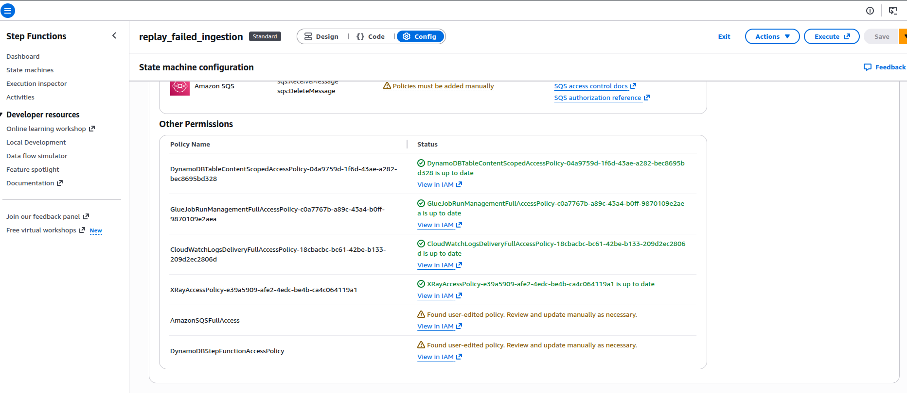
    - Add two policies to make it work the rest are auto-generated
        - AWS managed policy called ```AmazonSQSFullAccess```\
        - Custom policy called ```DynamoDBStepFunctionAccessPolicy```
        ```json
        {
            "Version": "2012-10-17",
            "Statement": [
                {
                    "Sid": "DynamoDBStepFunctionAccessPolicy",
                    "Effect": "Allow",
                    "Action": [
                        "dynamodb:UpdateItem",
                        "dynamodb:GetItem"
                    ],
                    "Resource": "arn:aws:dynamodb:ap-south-1:406868976171:table/file_processing_registry"
                }
            ]
        }
        ```
- Improved replay state function
    - ```json
        {
        "Comment": "Replay ETL from DLQ (Fixed - State Preservation + Safe Errors)",
        "StartAt": "ReceiveFromDLQ",
        "States": {
            "ReceiveFromDLQ": {
            "Type": "Task",
            "Resource": "arn:aws:states:::aws-sdk:sqs:receiveMessage",
            "Parameters": {
                "QueueUrl": "https://sqs.ap-south-1.amazonaws.com/406868976171/sales-ingestion-dlq",
                "MaxNumberOfMessages": 10
            },
            "ResultPath": "$.dlq",
            "Next": "CheckIfEmpty"
            },
            "CheckIfEmpty": {
            "Type": "Choice",
            "Choices": [
                {
                "Variable": "$.dlq.Messages",
                "IsPresent": false,
                "Next": "Success"
                }
            ],
            "Default": "ReplayBatch"
            },
            "ReplayBatch": {
            "Type": "Map",
            "ItemsPath": "$.dlq.Messages",
            "MaxConcurrency": 2,
            "Iterator": {
                "StartAt": "ExtractPayload",
                "States": {
                "ExtractPayload": {
                    "Type": "Pass",
                    "Parameters": {
                    "receiptHandle.$": "$.ReceiptHandle",
                    "body.$": "States.StringToJson($.Body)"
                    },
                    "ResultPath": "$.parsed",
                    "Next": "CheckRetry"
                },
                "CheckRetry": {
                    "Type": "Task",
                    "Resource": "arn:aws:states:::dynamodb:getItem",
                    "Parameters": {
                    "TableName": "file_processing_registry",
                    "Key": { "file_key": { "S.$": "$.parsed.body.file_key" } }
                    },
                    "ResultPath": "$.ddb",
                    "Next": "CheckAlreadySucceeded"
                },
                "CheckAlreadySucceeded": {
                    "Type": "Choice",
                    "Choices": [
                    {
                        "Variable": "$.ddb.Item.status.S",
                        "StringEquals": "SUCCESS",
                        "Next": "SkipReplay"
                    }
                    ],
                    "Default": "EvaluateRetry"
                },
                "EvaluateRetry": {
                    "Type": "Choice",
                    "Choices": [
                    {
                        "Variable": "$.ddb.Item.retry_count.N",
                        "StringLessThan": "3",
                        "Next": "IncrementRetry"
                    }
                    ],
                    "Default": "SkipReplay"
                },
                "IncrementRetry": {
                    "Type": "Task",
                    "Resource": "arn:aws:states:::dynamodb:updateItem",
                    "Parameters": {
                    "TableName": "file_processing_registry",
                    "Key": {
                        "file_key": {
                        "S.$": "$.parsed.body.file_key"
                        }
                    },
                    "UpdateExpression": "ADD retry_count :inc",
                    "ExpressionAttributeValues": {
                        ":inc": {
                        "N": "1"
                        }
                    }
                    },
                    "ResultPath": "$.incrementResult",
                    "Next": "RunGlueJob"
                },
                "RunGlueJob": {
                    "Type": "Task",
                    "Resource": "arn:aws:states:::glue:startJobRun.sync",
                    "ResultPath": "$.glueResult",
                    "Parameters": {
                    "JobName": "ingest_sales_data",
                    "Arguments": {
                        "--source_bucket.$": "$.parsed.body.bucket",
                        "--source_key.$": "$.parsed.body.key"
                    }
                    },
                    "Catch": [
                    {
                        "ErrorEquals": [
                        "States.ALL"
                        ],
                        "ResultPath": "$.error",
                        "Next": "UpdateFailure"
                    }
                    ],
                    "Next": "UpdateSuccess"
                },
                "UpdateSuccess": {
                    "Type": "Task",
                    "Resource": "arn:aws:states:::dynamodb:updateItem",
                    "Parameters": {
                    "TableName": "file_processing_registry",
                    "Key": {
                        "file_key": {
                        "S.$": "$.parsed.body.file_key"
                        }
                    },
                    "UpdateExpression": "SET #s = :s, updated_at = :t",
                    "ExpressionAttributeNames": {
                        "#s": "status"
                    },
                    "ExpressionAttributeValues": {
                        ":s": {
                        "S": "SUCCESS"
                        },
                        ":t": {
                        "S.$": "$$.State.EnteredTime"
                        }
                    }
                    },
                    "ResultPath": "$.updateSuccessResult",
                    "Next": "DeleteMessage"
                },
                "UpdateFailure": {
                    "Type": "Task",
                    "Resource": "arn:aws:states:::dynamodb:updateItem",
                    "Parameters": {
                    "TableName": "file_processing_registry",
                    "Key": {
                        "file_key": {
                        "S.$": "$.parsed.body.file_key"
                        }
                    },
                    "UpdateExpression": "SET #s = :s, error_message = :e, updated_at = :t",
                    "ExpressionAttributeNames": {
                        "#s": "status"
                    },
                    "ExpressionAttributeValues": {
                        ":s": {
                        "S": "FAILED"
                        },
                        ":e": {
                        "S.$": "States.JsonToString($.error)"
                        },
                        ":t": {
                        "S.$": "$$.State.EnteredTime"
                        }
                    }
                    },
                    "ResultPath": "$.updateFailureResult",
                    "End": true
                },
                "SkipReplay": {
                    "Type": "Pass",
                    "Next": "DeleteMessage"
                },
                "DeleteMessage": {
                    "Type": "Task",
                    "Resource": "arn:aws:states:::aws-sdk:sqs:deleteMessage",
                    "Parameters": {
                    "QueueUrl": "https://sqs.ap-south-1.amazonaws.com/406868976171/sales-ingestion-dlq",
                    "ReceiptHandle.$": "$.parsed.receiptHandle"
                    },
                    "End": true
                }
                }
            },
            "Next": "Success"
            },
            "Success": {
            "Type": "Succeed"
            }
        }
        }
      ```
    - It solves problems like
        - Stale message in DLQ causes duplicate data processing : If someone manually adds a DLQ message for a file that already has status = SUCCESS in DynamoDB — perhaps by mistake, or because the DLQ message was never cleaned up — replay_failed_ingestion will read the message, see retry_count = 0 which is less than 3, increment it to 1, and run Glue again against a file that was already successfully ingested. The file gets processed a second time, and duplicate data lands in the Silver layer.
        - Solution : add a ```CheckAlreadySucceeded``` state
            - Add a Choice state immediately after ```CheckRetry``` that checks status before checking ```retry_count```
            ```json
            "CheckRetry": {
            "Type": "Task",
            "Resource": "arn:aws:states:::dynamodb:getItem",
            "Parameters": {
                "TableName": "file_processing_registry",
                "Key": { "file_key": { "S.$": "$.parsed.body.file_key" } }
            },
            "ResultPath": "$.ddb",
            "Next": "CheckAlreadySucceeded"
            },
            "CheckAlreadySucceeded": {
            "Type": "Choice",
            "Choices": [
                {
                "Variable": "$.ddb.Item.status.S",
                "StringEquals": "SUCCESS",
                "Next": "SkipReplay"
                }
            ],
            "Default": "EvaluateRetry"
            },
            "EvaluateRetry": {
            "Type": "Choice",
            "Choices": [
                {
                "Variable": "$.ddb.Item.retry_count.N",
                "StringLessThan": "3",
                "Next": "IncrementRetry"
                }
            ],
            "Default": "SkipReplay"
            }
            ```
            - The flow becomes:
                - ```bash
                    CheckRetry → reads DynamoDB
                        ↓
                    CheckAlreadySucceeded
                        ↓ status = SUCCESS  →  SkipReplay → DeleteMessage (remove stale DLQ message)
                        ↓ status = FAILED   →  EvaluateRetry → check retry_count → IncrementRetry → RunGlueJob
                  ```
            - This means a stale DLQ message for an already-successful file gets silently cleaned up the message is deleted from the DLQ and nothing else happens. No duplicate Glue run, no duplicate data in Silver S3.
        - You might be wondering how is ```row_count``` being updated in dynamoDB table after the cause of failure in the pipeline is fixed and the pipeline successfully processed the file that previously failed to be processed. 
            - ```row_count``` in dynamoDB is being updated by AWS glue ETL job itself instead of the replay step function. hence this step function only updates the status from FAIL to SUCCESS.

#### AWS ETL pipeline 
- Add IAM role with appropriate permissions for AWS glue ETL to work properly
    - Create a role named ```AWSGlueRole``` and attach this role to AWS glue that you are creating.
    - Attached policies: 
        - Add AWS managed policy called ```AWSGlueServiceRole``` to this role
        - Add custom policy that was earlier made for Lambda function called ```DynamoDbAccessPolicyForLambdaFunction```
        ```json
        {
            "Version": "2012-10-17",
            "Statement": [
                {
                    "Sid": "DynamoDbAccessPolicyForLambdaFunction",
                    "Effect": "Allow",
                    "Action": [
                        "dynamodb:PutItem",
                        "dynamodb:GetItem",
                        "dynamodb:UpdateItem"
                    ],
                    "Resource": "arn:aws:dynamodb:ap-south-1:406868976171:table/file_processing_registry"
                }
            ]
        }
        ```
        - Add this custom policy called ```LimitedS3PermissionPolicy```
        ```json
        {
            "Version": "2012-10-17",
            "Statement": [
                {
                    "Effect": "Allow",
                    "Action": [
                        "s3:GetObject",
                        "s3:PutObject",
                        "s3:ListBucket"
                    ],
                    "Resource": [
                        "arn:aws:s3:::aws-glue-s3-bucket-one",
                        "arn:aws:s3:::aws-glue-s3-bucket-one/*",
                        "arn:aws:s3:::data-sink-one",
                        "arn:aws:s3:::data-sink-one/*"
                    ]
                }
            ]
        }
        ```
- improved code : 
    - ```python
        import sys
        from awsglue.transforms import *
        from awsglue.utils import getResolvedOptions
        from pyspark.context import SparkContext
        from awsglue.context import GlueContext
        from awsglue.job import Job
        from awsglue.gluetypes import *
        from awsgluedq.transforms import EvaluateDataQuality
        from awsglue import DynamicFrame
        import boto3

        from functools import reduce
        from pyspark.sql import functions as F

        def sparkSqlQuery(glueContext, query, mapping, transformation_ctx) -> DynamicFrame:
            for alias, frame in mapping.items():
                frame.toDF().createOrReplaceTempView(alias)
            result = spark.sql(query)
            return DynamicFrame.fromDF(result, glueContext, transformation_ctx)
        def _find_null_fields(ctx, schema, path, output, nullStringSet, nullIntegerSet, frame):
            if isinstance(schema, StructType):
                for field in schema:
                    new_path = path + "." if path != "" else path
                    output = _find_null_fields(ctx, field.dataType, new_path + field.name, output, nullStringSet, nullIntegerSet, frame)
            elif isinstance(schema, ArrayType):
                if isinstance(schema.elementType, StructType):
                    output = _find_null_fields(ctx, schema.elementType, path, output, nullStringSet, nullIntegerSet, frame)
            elif isinstance(schema, NullType):
                output.append(path)
            else:
                x, distinct_set = frame.toDF(), set()
                for i in x.select(path).distinct().collect():
                    distinct_ = i[path.split('.')[-1]]
                    if isinstance(distinct_, list):
                        distinct_set |= set([item.strip() if isinstance(item, str) else item for item in distinct_])
                    elif isinstance(distinct_, str) :
                        distinct_set.add(distinct_.strip())
                    else:
                        distinct_set.add(distinct_)
                if isinstance(schema, StringType):
                    if distinct_set.issubset(nullStringSet):
                        output.append(path)
                elif isinstance(schema, IntegerType) or isinstance(schema, LongType) or isinstance(schema, DoubleType):
                    if distinct_set.issubset(nullIntegerSet):
                        output.append(path)
            return output

        def drop_nulls(glueContext, frame, nullStringSet, nullIntegerSet, transformation_ctx) -> DynamicFrame:
            nullColumns = _find_null_fields(frame.glue_ctx, frame.schema(), "", [], nullStringSet, nullIntegerSet, frame)
            return DropFields.apply(frame=frame, paths=nullColumns, transformation_ctx=transformation_ctx)

        args = getResolvedOptions(sys.argv, [
            'JOB_NAME',
            'source_bucket',
            'source_key'
        ])

        source_bucket = args['source_bucket']
        source_key = args['source_key']

        sc = SparkContext()
        glueContext = GlueContext(sc)
        spark = glueContext.spark_session
        job = Job(glueContext)
        job.init(args['JOB_NAME'], args)

        # Default ruleset used by all target nodes with data quality enabled
        DEFAULT_DATA_QUALITY_RULESET = """Rules = [
            ColumnCount = 16,

            IsComplete "rating",
            IsComplete "rating_count",
            IsComplete "discounted_price",
            IsComplete "actual_price",

            ColumnValues "rating" >= 0,
            ColumnValues "rating_count" >= 0,
            ColumnValues "discounted_price" >= 0,
            ColumnValues "actual_price" >= 0,
            ColumnValues "discount_percentage" >= 0,
            
            IsUnique "product_id"
        ]"""

        # -------- DELIMITER CORRUPTION CHECK -------- #
        # It checks for delimiter / structural corruption STARTS
        import csv
        import io

        raw_lines = spark.read.text(f"s3://{source_bucket}/{source_key}").limit(1000).collect()

        if len(raw_lines) < 2:
            raise Exception("Glue Visual ETL | Corrupted CSV detected (file has no data rows)")

        def count_csv_columns(line: str) -> int:
            """Count columns correctly, respecting quoted fields containing commas."""
            try:
                return len(next(csv.reader(io.StringIO(line))))
            except StopIteration:
                return 0

        header_line = raw_lines[0][0]
        expected_col_count = count_csv_columns(header_line)

        bad_row_indices = []
        for i, row in enumerate(raw_lines[1:], start=2):
            line = row[0]
            actual_col_count = count_csv_columns(line)
            if actual_col_count != expected_col_count:
                bad_row_indices.append((i, actual_col_count, line[:80]))

        if bad_row_indices:
            details = "\n".join(
                [f"  Line {idx}: expected {expected_col_count} cols, got {actual} → {preview}..."
                for idx, actual, preview in bad_row_indices]
            )
            raise Exception(
                f"Glue Visual ETL | Corrupted CSV detected — {len(bad_row_indices)} row(s) have wrong column count "
                f"(likely semicolons used as delimiters instead of commas):\n{details}"
            )

        print(f"Glue Visual ETL | Column count validation passed: all rows have {expected_col_count} columns")
        # It checks for delimiter / structural corruption ENDS
        # -------- DELIMITER CORRUPTION CHECK -------- #

        # Script generated for node Raw data source S3
        RawdatasourceS3_node1772431168408 = glueContext.create_dynamic_frame.from_options(format_options={"quoteChar": "\"", "withHeader": True, "separator": ",", "mode": "PERMISSIVE", "optimizePerformance": False}, connection_type="s3", format="csv", 
            # connection_options={"paths": ["s3://aws-glue-s3-bucket-one/raw_data/sales_data/"], "recurse": True}, 
            connection_options={"paths": [f"s3://{source_bucket}/{source_key}"],"recurse": False},
            transformation_ctx="RawdatasourceS3_node1772431168408")
        # for debugging only
        print(f"Glue Visual ETL | Processing file: s3://{source_bucket}/{source_key}")

        df = RawdatasourceS3_node1772431168408.toDF()

        print("Glue Visual ETL | DEBUG columns:", df.columns)

        # -------- CORRUPTION CHECK -------- #
        # checks Spark-level corruption after parsing STARTS

        # If Spark inferred no columns → corrupted file
        if len(df.columns) == 0:
            raise Exception("Glue Visual ETL | Corrupted CSV detected (no columns inferred)")

        expected_cols = len(df.columns)

        # If dataframe empty → corrupted file
        if df.limit(1).count() == 0:
            raise Exception("Glue Visual ETL | Corrupted CSV detected (empty dataframe)")

        # Row-level corruption detection
        null_exprs = [F.col(c).isNull().cast("int") for c in df.columns]

        bad_rows = df.filter(
            reduce(lambda a, b: a + b, null_exprs) > expected_cols * 0.7
        )

        if bad_rows.limit(1).count() > 0:
            raise Exception("Glue Visual ETL | Corrupted CSV detected (null-heavy rows)")

        # checks Spark-level corruption after parsing ENDS
        # -------- CORRUPTION CHECK -------- #

        #--------- CONVERT THE COLUMNS IN THE CSV FILE TO CORRECT DATA TYPES --------#
        # Script generated for node SQL Query
        SqlQuery61 = '''
        SELECT
            product_id,
            product_name,
            category,
            about_product,
            user_id,
            user_name,
            review_id,
            review_title,
            review_content,
            img_link,
            product_link,

            -- discounted_price: ₹149 → 149.0
            CAST(
                REGEXP_REPLACE(discounted_price, '[^0-9.]', '')
                AS DOUBLE
            ) AS discounted_price,

            -- actual_price: ₹1,000 → 1000.0
            CAST(
                REGEXP_REPLACE(actual_price, '[^0-9.]', '')
                AS DOUBLE
            ) AS actual_price,

            -- discount_percentage: 85% → 85.0
            CAST(
                REGEXP_REPLACE(discount_percentage, '[^0-9.]', '')
                AS DOUBLE
            ) AS discount_percentage,

            -- rating: 3.9 → 3.9
            CAST(
                REGEXP_REPLACE(rating, '[^0-9.]', '')
                AS DOUBLE
            ) AS rating,

            -- rating_count: 24,871 → 24871
            CAST(
                REGEXP_REPLACE(rating_count, '[^0-9]', '')
                AS INT
            ) AS rating_count

        FROM myDataSource;
        '''

        try:
            SQLQuery_node1772431252856 = sparkSqlQuery(glueContext, query = SqlQuery61, mapping = {"myDataSource":RawdatasourceS3_node1772431168408}, transformation_ctx = "SQLQuery_node1772431252856")
        except Exception as e:
            print(f"Glue Visual ETL | SQL query execution failed | {e}")
            raise RuntimeError("Failing Glue job explicitly | Failed to execute sql query")
        #--------- CONVERT THE COLUMNS IN THE CSV FILE TO CORRECT DATA TYPES --------#

        # Script generated for node Drop Null Fields
        DropNullFields_node1772431857999 = drop_nulls(glueContext, frame=SQLQuery_node1772431252856, nullStringSet={"", "null"}, nullIntegerSet={-1}, transformation_ctx="DropNullFields_node1772431857999")

        # -------- DEDUPLICATION STEP -------- #
        # This will check if there exists a row with a duplicate review_id if yes then it will drop one of the row and make sure that the row is unique
        # Doing this prevents any data duplication 
        df_clean = DropNullFields_node1772431857999.toDF()

        deduped_df = df_clean.dropDuplicates(["review_id"])

        print("Glue Visual ETL | Before dedup:", df_clean.count())
        row_count_duped_df = deduped_df.count()
        print("Glue Visual ETL | After dedup:", row_count_duped_df)

        deduped_dynamic_frame = DynamicFrame.fromDF(
            deduped_df, glueContext, "deduped_dynamic_frame"
        )
        # -------- DEDUPLICATION STEP -------- #

        # Script generated for node Silver layer data sink S3
        try:
            # BEST_EFFORT is that it publishes DQ metrics to CloudWatch but does not guarantee throwing an exception when rules fail
            # EvaluateDataQuality().process_rows(frame=deduped_dynamic_frame, ruleset=DEFAULT_DATA_QUALITY_RULESET, publishing_options={"dataQualityEvaluationContext": "EvaluateDataQuality_node1772428328053", "enableDataQualityResultsPublishing": True}, additional_options={"dataQualityResultsPublishing.strategy": "BEST_EFFORT", "observations.scope": "ALL"})
            
            # FAIL_JOB tells Glue to fail the job immediately when any rule is violated. failureAction: FAIL makes the violation propagate as an exception
            EvaluateDataQuality().process_rows(
                frame=deduped_dynamic_frame,
                ruleset=DEFAULT_DATA_QUALITY_RULESET,
                publishing_options={
                    "dataQualityEvaluationContext": "EvaluateDataQuality_node1772428328053",
                    "enableDataQualityResultsPublishing": True,
                    "failureAction": "FAIL"
                },
                additional_options={
                    "dataQualityResultsPublishing.strategy": "STRICT",
                    "observations.scope": "ALL"
                }
            )
        except Exception as e:
            print("Glue Visual ETL | DQ failed:", e)
            raise RuntimeError("Failing Glue job explicitly | Failed to run data quality rules")

        SilverlayerdatasinkS3_node1772432020219 = glueContext.getSink(path="s3://data-sink-one/silver_layer/sales_data/", connection_type="s3", updateBehavior="LOG", partitionKeys=["category"], enableUpdateCatalog=True, transformation_ctx="SilverlayerdatasinkS3_node1772432020219")
        SilverlayerdatasinkS3_node1772432020219.setCatalogInfo(catalogDatabase="aws-glue-tutorial-aditya",catalogTableName="silver_table_sales_data")
        SilverlayerdatasinkS3_node1772432020219.setFormat("glueparquet", compression="snappy")
        SilverlayerdatasinkS3_node1772432020219.writeFrame(deduped_dynamic_frame)

        # -------- WRITE ROW COUNT TO DYNAMODB -------- #
        # Written after writeFrame so row_count only lands in DynamoDB
        # if the data was actually written to Silver S3 successfully
        file_key = f"s3://{source_bucket}/{source_key}"
        dynamodb_client = boto3.client("dynamodb", region_name="ap-south-1")
        dynamodb_client.update_item(
            TableName="file_processing_registry",
            Key={"file_key": {"S": file_key}},
            UpdateExpression="SET row_count = :r",
            ExpressionAttributeValues={":r": {"N": str(row_count_duped_df)}}
        )
        print(f"Glue Visual ETL | Row count {row_count_duped_df} written to DynamoDB for {file_key}")
        # -------- WRITE ROW COUNT TO DYNAMODB -------- #

        job.commit()
      ```
    - GAPs that are fixed in this version of glue code 
        - **Data quality strategy changed from ```BEST_EFFORT``` to ```STRICT```**
            - The original code used ```BEST_EFFORT``` as the publishing strategy for ```EvaluateDataQuality```. The problem with ```BEST_EFFORT``` is that it only publishes data quality metrics to CloudWatch it logs that rules failed but does not stop the job.
            - This means a file that violates ```ColumnCount = 16``` or ```IsUnique "product_id"``` would have its metrics published as a warning, and the job would continue writing the bad data to the Silver S3 layer without any indication that something was wrong downstream.
            - ```STRICT``` changes this behaviour entirely. When any rule in the ruleset fails, ```STRICT``` immediately raises an exception inside ```EvaluateDataQuality```. This exception is caught by the ```try/except``` block which then raises RuntimeError explicitly. The Glue job exits with a failed status, the Step Function's Catch block detects the failure, ```UpdateFailure``` writes ```status = FAILED``` and the error to DynamoDB, and ```SendToDLQ``` puts the event payload into sales-ingestion-dlq. The data engineer is alerted and the bad data never reaches the Silver layer.
            - The intention is that data quality violations are treated as hard failures, not warnings. A pipeline that silently ingests bad data is worse than a pipeline that fails loudly silent bad data corrupts downstream dashboards and analytics without anyone knowing.
        - **```dropDuplicates()``` changed to ```dropDuplicates(["review_id"])```**
            - The original code used ```dropDuplicates()``` with no arguments. This tells Spark to compare every single column across every single row to find duplicates — all 16 columns, for every row in the DataFrame. To do this Spark has to hash all 16 column values for each row, shuffle the entire dataset across the cluster so rows with the same hash land on the same partition, and then compare them. For a small file this overhead is negligible but the approach is also semantically wrong.
            - ```review_id``` is the natural business key for this dataset. It is the unique identifier assigned to each review. If two rows have the same ```review_id``` they are the same review regardless of what the other 15 columns say. The DQ ruleset already enforces ```IsUnique "product_id"``` but ```review_id``` is the correct key for row-level deduplication since each row represents one review.
            - ```dropDuplicates(["review_id"])``` tells Spark to deduplicate on this one column only. Spark hashes only ```review_id```, partitions by that hash, and compares within partitions. This is faster because it hashes one value instead of 16, and it is semantically correct because you are deduplicating on the business identity of the record rather than an arbitrary combination of all its attributes.
        - **```collect()``` limit changed from no limit to ```limit(1000)```**
            - The delimiter corruption check works by reading the CSV file as raw text line by line, counting the number of comma-separated values in each row using Python's csv.reader, and comparing each row's column count against the header's column count. If any row has a different count it is flagged as corrupted.
            - The original code called ```.collect()``` with no limit, which loads the entire file into the Glue driver's memory as a Python list. For my current sales CSV files with 489 rows this is harmless. But if this same ETL pipeline were ever pointed at a larger file say a 500MB file with hundreds of thousands of rows.```collect()``` would attempt to load the entire file into the driver's 10GB memory allocation. This is not guaranteed to fail but it is an unnecessary risk.
            - ```limit(1000)``` tells Spark to read only the first 1000 rows before collecting to the driver. For corruption detection this is entirely sufficient structural corruption like wrong delimiters or extra columns almost always appears consistently throughout a file, not just in rows beyond row 1000. The trade-off is that a file with corruption starting at row 1001 would pass this check, but that scenario is extremely unlikely in practice and the Spark-level corruption checks that follow would still catch it.
            - The choice of 1000 rather than 10 is deliberate. An earlier version of the code used ```limit(10)``` which was inadequate your own ```sales_data_4.csv``` had corruption starting at line 116, which ```limit(10)``` would have missed entirely. 1000 provides meaningful coverage of the file while keeping driver memory usage bounded regardless of file size.
        - **Glue ETL job will now write the number of rows processed in each file directly to DynamoDB**
            - The boto3 ```update_item``` call inside your Glue script connects to DynamoDB just like any other AWS service call. Glue runs on an EC2-backed cluster that carries the IAM role you attached ```AWSGlueRole```. As long as that role has d```ynamodb:UpdateItem``` permission on ```file_processing_registry```, the call goes through without any intermediary.
            - The Step Function is completely uninvolved in this. It is sitting and waiting for the Glue job to finish — it has no idea what is happening inside the script. The DynamoDB write happens silently inside the Glue process while the Step Function just sees "Glue job is running".
            - This is a common pattern in data engineering using boto3 inside a Glue script to write metadata, audit logs, or metrics to DynamoDB, S3, or other AWS services as a side effect of the main processing job. Glue is just a Python process running on AWS infrastructure with an IAM role, so it can call any AWS service that the role has permission for.
            - Why I decided to do this ?
                - Row count is the simplest and most important data quality signal after successful ingestion. Without it, status = SUCCESS tells you the pipeline ran without errors — but it tells you nothing about whether the right amount of data actually landed.
                - Consider three scenarios that ```status = SUCCESS``` cannot distinguish between. A file arrives with 489 rows and 489 rows land in Silver this is correct. A file arrives with 489 rows but a bug in the deduplication logic removes 400 of them as false duplicates this is a silent data loss that ```SUCCESS``` does not catch. A file arrives completely empty due to an upstream system error but passes all validation checks because an empty file with correct headers is technically valid this is also ```SUCCESS```.
                - ```row_count``` in DynamoDB gives you one line of defence against all three scenarios. A data engineer scanning the table can immediately see that ```sales_data_2.csv``` landed 489 rows while ```sales_data_4.csv``` only landed 15 rows — which is correct because ```sales_data_4.csv``` only had 15 data rows. If ```sales_data_1.csv``` suddenly showed ```row_count = 0``` on a day when it normally shows 489, that is an immediate signal that something is wrong upstream before anyone has to query Athena or check S3.
    - Explaination :  ```BEST_EFFORT``` and ```STRICT``` are values for ```dataQualityResultsPublishing.strategy```. They control how and when results are published to CloudWatch.
        - ```BEST_EFFORT``` : publish results whenever possible, even if publishing itself fails. If the DQ evaluation encounters an internal error while trying to write metrics to CloudWatch, it swallows that error and lets the job continue. It is tolerant of publishing failures. If DQ rules are violated it still publishes the failure metrics but the job continues unless failureAction: "FAIL" is also set.
        - ```STRICT``` : publish results and if publishing itself fails, treat that as a hard error. If Glue cannot write DQ metrics to CloudWatch for any reason, it raises an exception immediately. It is intolerant of publishing failures. Like BEST_EFFORT, if DQ rules are violated it publishes the failure metrics but the job continues unless failureAction: "FAIL" is also set.
        - ```FAIL_JOB``` : does not exist as a valid strategy value on Glue 5.0. The valid values for dataQualityResultsPublishing.strategy on your runtime are STRICT and BEST_EFFORT only. This was an incorrect suggestion based on documentation that did not match your actual Glue version.
    - ```python
        "failureAction": "FAIL",                           # rule violation → exception raised
        "dataQualityResultsPublishing.strategy": "STRICT"  # publishing failure → exception raised
      ```
        - This means two things will cause your job to fail a DQ rule violation, and a failure to publish DQ results to CloudWatch. Both are treated as hard errors. This is the most defensive combination for a production pipeline where you want to know immediately if anything goes wrong, whether it is bad data or a monitoring infrastructure problem.

#### DynamoDB setup
- The table inside this dynamoDB is named ```file_processing_registry``` where I will maintain records that will allow us to track which files are processed successfully , in_progress or has failed to process by AWS glue ETL pipeline.
- 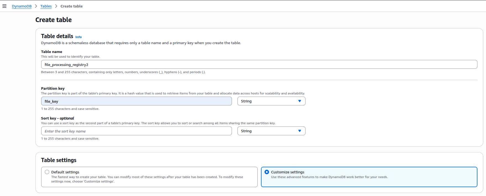
- 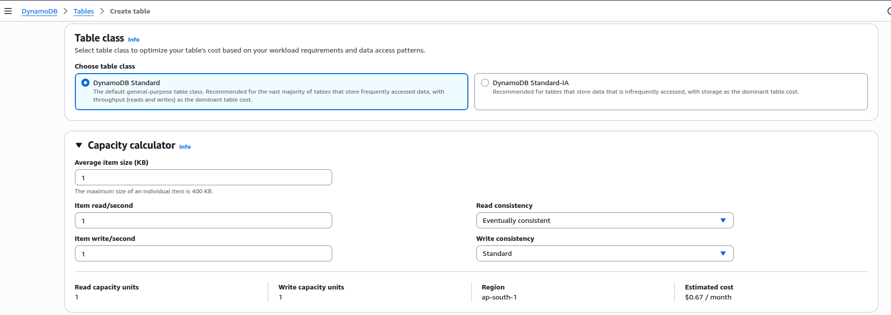
- 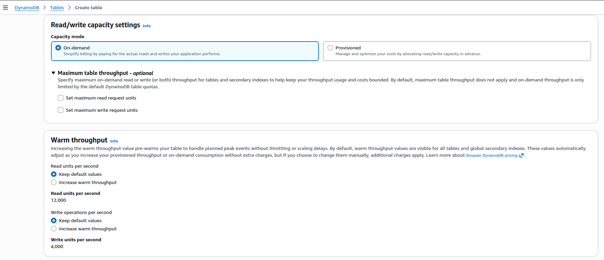
- 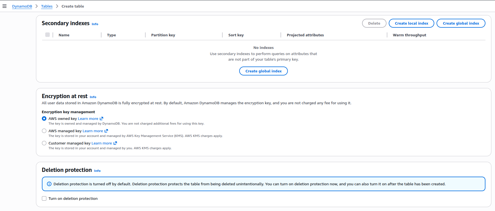
- 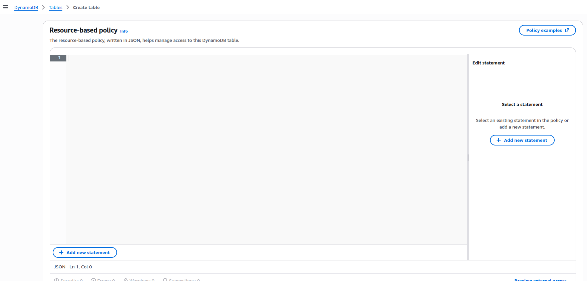
- 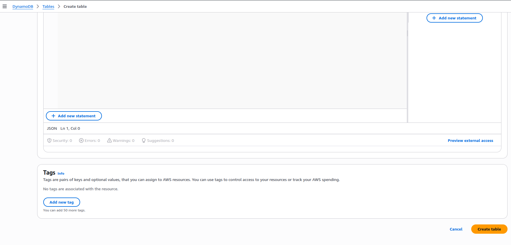
- After you create your table you will see something like this 
    - 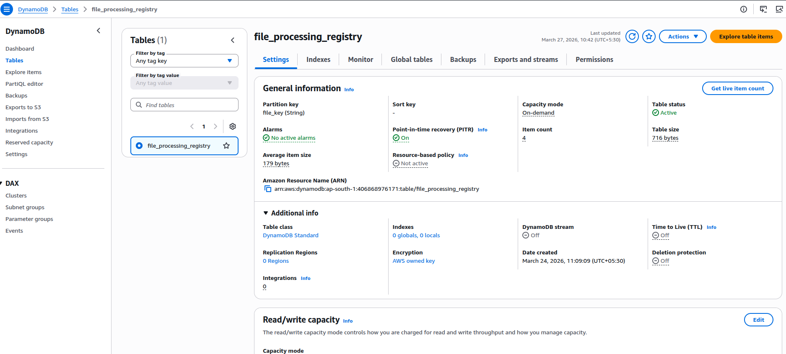
    - Now you need to turn ttl settings on so that the ttl attribute that is being added by the lambda function in this table can actually take effect otherwise the records will remain in the table forever and the purpose of adding the ttl column in the table by lambda function will be defeated
    - 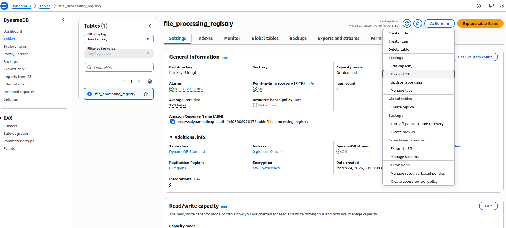
    - Here in this screen shot you can see the option to turn off the ttl setting this is because in my case the ttl is already on for this table but when you come to this option then here you will see the option to turn the ttl on instead of turn it off
    - 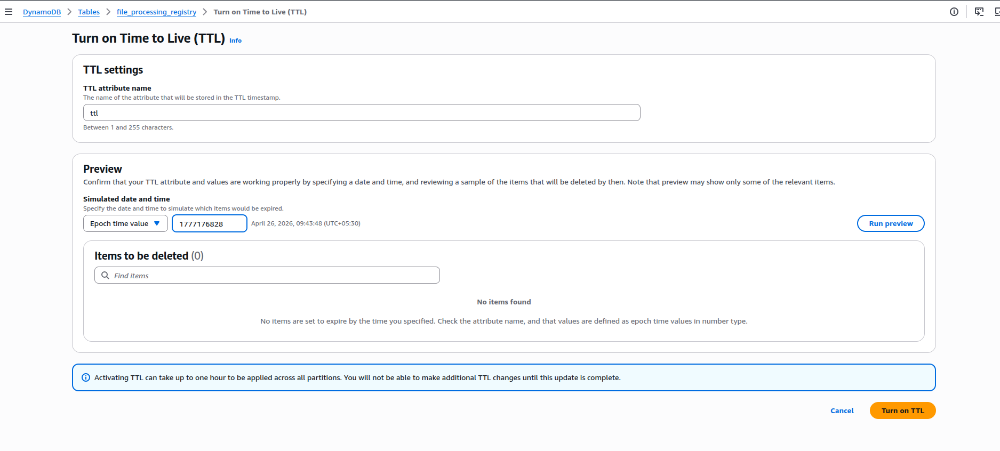
    - Once everything is said and done you must see this 
    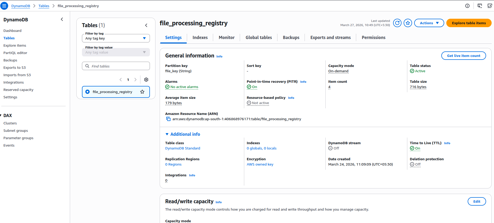
    - Now the ttl column will be used to delete the records that expires based on the value in unix timestamp that this column has and it will be deleted permanently.
- When a new file is processed by the ETL pipeline the data is inserted in dynamoDB looks something like this 
    - 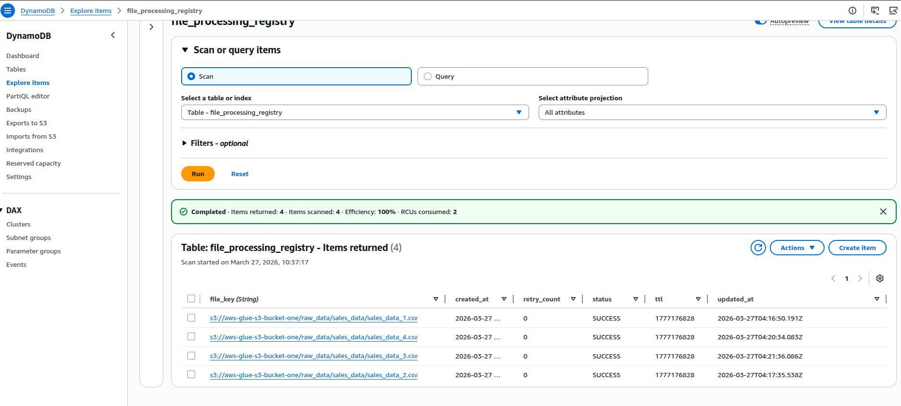
    
### Issues faced during the Implementation for version 6:
#### ETL was not being invoked on file arrival in S3 bucket 
- Before I explain why this was happening I want to show you something
    - 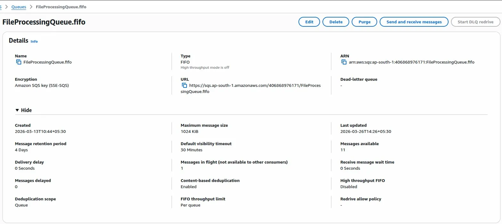  
- Broken pipeline diagnosis
    - 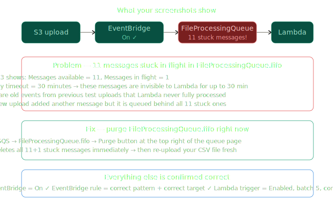
    - This is the problem. ```FileProcessingQueue.fifo``` shows Messages available: 11 and Messages in flight: 1. These are stale messages from all your previous test uploads during cleanup. With a 30 minute visibility timeout, each time Lambda picks up a message and partially processes it, the message becomes invisible for 30 minutes before reappearing. Your new upload is just adding to an already-backed-up queue.
- Solution : (Do not apply this in production)
    - The fix is one click — go to ```SQS → FileProcessingQueue.fifo → click the Purge button``` at the top of the page. This instantly deletes all 12 stuck messages. Then re-upload your CSV file and the pipeline will run immediately.
#### Permission related error AWS glue ETL pipeline was not allowed to write in DynamoDB
Error message : 
```bash
Error Category: PERMISSION_ERROR; Failed Line Number: 272; ClientError: An error occurred (AccessDeniedException) when calling the UpdateItem operation: User: arn:aws:sts::406868976171:assumed-role/AWSGlueRole/GlueJobRunnerSession is not authorized to perform: dynamodb:UpdateItem on resource: arn:aws:dynamodb:ap-south-1:406868976171:table/file_processing_registry because no identity-based policy allows the dynamodb:UpdateItem action
```
- Add this custom policy named ```DynamoDbAccessPolicyForLambdaFunction``` to the role that was created earlier for AWS glue ETL pipeline ```AWSGlueRole```
    - ```json
        {
            "Version": "2012-10-17",
            "Statement": [
                {
                    "Sid": "DynamoDbAccessPolicyForLambdaFunction",
                    "Effect": "Allow",
                    "Action": [
                        "dynamodb:PutItem",
                        "dynamodb:GetItem",
                        "dynamodb:UpdateItem"
                    ],
                    "Resource": "arn:aws:dynamodb:ap-south-1:406868976171:table/file_processing_registry"
                }
            ]
        }
      ```

### DataBricks vs AWS (implementation version 6) comparision:
Comparision diagram : 
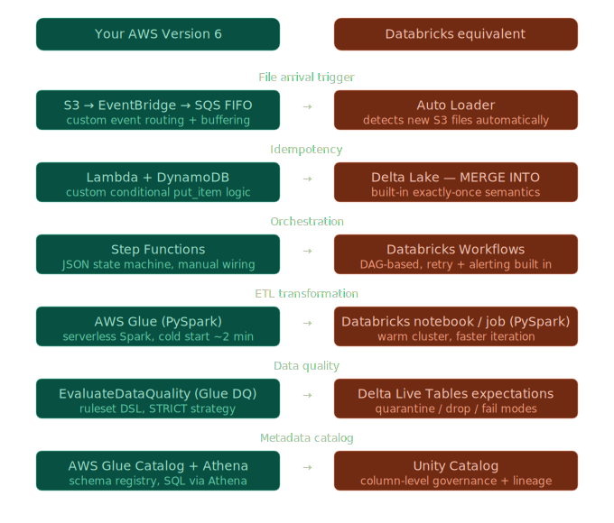

#### How my Version 6 pipeline would look on Databricks?
Every component in my AWS architecture has a Databricks equivalent, but the amount of custom code I wrote shrinks dramatically because Databricks packages much of what I built manually into platform features.

**File arrival trigger** : In AWS you built a four-component chain: ```S3 → EventBridge → SQS FIFO → Lambda``` just to detect a new file and pass its location downstream. On Databricks this is replaced by a single feature called Auto Loader. Auto Loader uses S3 event notifications or file listing internally and automatically detects new files in an S3 path. You point it at the folder and it handles everything deduplication of events, backpressure, checkpointing with two lines of code:
```python
df = spark.readStream.format("cloudFiles") \
    .option("cloudFiles.format", "csv") \
    .load("s3://aws-glue-s3-bucket-one/raw_data/sales_data/")
```

**Idempotency** : My Lambda spent significant effort building a two-step idempotency check with DynamoDB conditional writes to prevent duplicate processing. On Databricks this is solved by Delta Lake's ```MERGE INTO``` statement. Delta Lake maintains a transaction log for every table. When I write using merge on the business key, it is mathematically impossible to create a duplicate row the table format itself enforces exactly-once semantics without any external state store:
```python
delta_table.alias("target").merge(
    new_data.alias("source"),
    "target.review_id = source.review_id"
).whenNotMatchedInsertAll().execute()
```
The entire DynamoDB ```file_processing_registry``` table, the Lambda idempotency logic, and the conditional put_item complexity disappear. Delta handles it.

**Orchestration** : My Step Functions JSON state machines ```orchestrate_data_ingestion``` and ```replay_failed_ingestion``` would be replaced by Databricks Workflows. I define a DAG of tasks, each task being a notebook or Python script. Retry logic, alerting on failure, email notifications, and dependency management are all configured in the UI or as YAML. The ```replay_failed_ingestion``` step function with its ```CheckAlreadySucceeded```, ```EvaluateRetry```, ```IncrementRetry``` states would collapse into a simple retry configuration on the workflow task.

**ETL transformation** : My Glue PySpark script runs identically on Databricks. The transformation logic ```REGEXP_REPLACE```, ```dropDuplicates(["review_id"])```, the corruption checks is identical PySpark and moves without changes. The main operational difference is that Databricks clusters are warm and reusable. My Glue job has a cold start of approximately 2 minutes every run because it spins up a fresh cluster each time. On Databricks we use a job cluster that starts for each run, or an interactive cluster that is always running and executes jobs in seconds.

**Data quality** : My ```EvaluateDataQuality``` ruleset with ```STRICT``` strategy would be replaced by Delta Live Tables expectations. These are Python decorators on your transformation functions:
```python
@dlt.expect_or_fail("valid column count", "length(product_id) > 0")
@dlt.expect_or_fail("no duplicate reviews", "review_id IS NOT NULL")
def silver_sales():
    return spark.read...
```
The three modes expect logs violations, ```expect_or_drop``` removes bad rows, ```expect_or_fail``` fails the pipeline map directly to what my ```STRICT``` strategy does.

**Catalog and querying** : My Glue Catalog plus Athena would be replaced by Unity Catalog with Databricks SQL. Unity Catalog adds column-level access control, data lineage tracking showing where each column came from and where it flows to, and a centrally governed namespace. Databricks SQL replaces Athena for querying.

**Cost comparison** : 


Cost breakdown — 1000 files/day : 

AWS Cost Breakdown — Version 6 ($6,646/month)

| Service           | What it does                                           | Monthly cost |
|------------------|--------------------------------------------------------|--------------|
| AWS Glue ETL     | 10 workers × 3 min × 1000 files × $0.44/DPU-hr        | $6,600       |
| S3               | Source + Silver storage, ~51GB + requests             | $38          |
| Step Functions   | 200 executions × 32 transitions                       | $5           |
| Lambda           | 1000 invocations × 512MB × 10s                        | $3           |
| CloudWatch       | 184MB log ingest                                      | $0.14        |
| DynamoDB         | 2000 writes + 1000 reads                              | $0.09        |
| SQS FIFO         | 3000 requests                                         | $0.04        |
| EventBridge      | 1000 events                                           | $0.03        |
| **Total**        |                                                        | **$6,646**   |

Glue is 99% of your entire AWS bill. Every other service combined costs $46/month. This is the defining characteristic of a Glue-heavy architecture the compute dominates everything else completely.

Compute Only: $5,847/month VS With Licence: $8,847/month  

| Component                | What it does                                      | Monthly cost |
|--------------------------|---------------------------------------------------|--------------|
| Jobs compute (EC2 + DBU) | 11 nodes × 2 min × 1000 files                    | $5,764       |
| Platform licence (Premium) | Unity Catalog, DLT, Workflows, support         | $3,000       |
| S3                       | Same storage as AWS side                         | $38          |
| Databricks SQL           | 100 analyst queries/day                          | $44          |
| Workflows, Unity Catalog | Included in licence                              | $0           |
| **Total (Compute Only)** |                                                   | **$5,847**   |
| **Total (With Licence)** |                                                   | **$8,847**   |

The compute saving against Glue is $836/month because Databricks runs the same Spark workload slightly more efficiently and without the 2-minute cold start overhead that Glue charges for. But the platform licence of $3,000/month turns that saving into a net loss of $2,200/month versus AWS at this scale.

**The honest crossover point**
At 1,000 files per day Databricks costs $2,200 more per month than AWS. The licence cost is the entire reason. The pure compute cost of Databricks is actually cheaper.

The crossover happens in two scenarios. The first is when your Glue bill grows past $9,000/month — roughly 1,400 files/day with your current configuration — because at that point Databricks compute efficiency and Photon start closing the gap faster than the licence cost widens it. The second and more common scenario is when you add data scientists, ML workflows, and interactive analysis to the platform. If five data scientists are running notebooks daily, that usage is essentially free on Databricks once you have the licence, but on AWS it would mean additional SageMaker or EMR costs that could easily exceed the licence gap.

**How to achieve Unity Catalog features on AWS**
Unity Catalog gives you three things — column-level access control, data lineage, and a centrally governed namespace. Here is how to get each one on AWS.

**Column-level access control** is provided by AWS Lake Formation. Lake Formation sits on top of the Glue Catalog and S3 and lets you define permissions at the database, table, column, and row level. You grant a user access to a table but exclude specific columns — for example allowing analysts to query the sales table but never see user_id or personal information. These permissions are enforced consistently across Athena, Glue, EMR, and Redshift Spectrum. Setting it up requires registering your S3 data lake with Lake Formation, migrating permissions from raw S3 bucket policies to Lake Formation grants, and enabling fine-grained access control in Athena.

**Data lineage** is provided by Amazon DataZone combined with AWS Glue Data Catalog lineage features. Glue can automatically track which jobs read from which tables and write to which tables, building a lineage graph you can visualise in the console. DataZone extends this into a full data catalogue with business metadata, data discovery, and lineage across the entire organisation. For your specific pipeline, the lineage is already partially captured — your DynamoDB file_processing_registry tracks which files were processed and when, and the Glue Catalog knows which jobs created which tables. The gap is that you cannot currently trace a specific column value back to its origin file automatically.

**Centrally governed namespace** is provided by the Glue Data Catalog itself acting as the central metastore, with Lake Formation providing the governance layer on top. Every table registered in the Glue Catalog is discoverable by any service — Athena, Glue, EMR, Redshift Spectrum — through the same namespace. The difference from Unity Catalog is that AWS requires you to configure Lake Formation explicitly for governance while Databricks makes it the default from day one.

TODO FIX this 
Gap 1 — CloudWatch alerting is documented but never implemented
This was Gap 6 from the original list and it appears in the README as a TODO but there is no implementation section for it anywhere in Version 6. You have no automated alerting if the DLQ grows, if Glue jobs fail repeatedly, or if the Step Function starts failing. In production this means a silent failure — files stop landing in Silver S3 and nobody knows until someone manually checks the dashboard.


## Creating an end-to-end ETL pipeline from source to dashboard (TODO)
```bash
Sources (OLTP DB, CSV, APIs, logs)
        ↓
Ingestion Layer (Glue / Kinesis / DMS)
        ↓
Raw S3 (Bronze)
        ↓
Transformation (Glue / Spark / dbt)
        ↓
Curated S3 (Silver/Gold)
        ↓
Athena / Redshift
        ↓
QuickSight Dashboard
```

Implement this tomorrow 
use this code for analysis make sure that you are able to provide data according to this so that analysis can be completed and the final curated data can be used in AWS dashboard use this notebook as a reference which transformation to use when.
https://www.kaggle.com/code/mhassansaboor/amazon-sales-insights-strategy

## Partition data in S3 bucket
### What is Data pruning?
Data pruning means : Skipping irrelevant data so the system doesn't scan unnecessary files or blocks.

In simple terms . 
- Instead of reading everything the engine reads only what's needed.

**Why it matters?** <br>
- In systems like Athena , Spark, Redshift spectrum etc.
- You pay based on: 
    - How much data is scanned.
- So pruning directly reduces:
    - Query time 
    - Cost
    - Resource usage

**What Is Partitioning?** <br>
- Partitioning means:
     - Physically dividing data into folders (or logical segments) based on a column.
- ```bash
s3://sales-data/
    year=2024/
        month=01/
        month=02/
    year=2025/
        month=01/
```
- Each partition holds only data for that value.

**How Partitioning Enables Pruning?** <br>
```sql
SELECT *
FROM sales
WHERE year = 2025;
```
- If data is partitioned by year, Athena:
    - Looks only inside year=2025/
    - Ignores year=2024/
- This is called:
    - Partition Pruning
- The engine prunes away irrelevant partitions.

**Without Partitioning** <br>
If everything is stored in one folder:
- Athena must:
    - Scan entire dataset
    - Even if you only need 2025
- That means:
    - More cost
    - Slower queries

